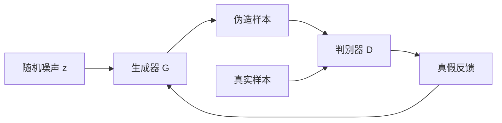

# GAN 基础【选修】

:::tip 本节定位
GAN 最吸引人的地方是：

- 它不是学“标签”
- 而是学“像不像真的”

这让它在生成任务里很有魅力。  
但它也非常容易让初学者发虚，因为训练方式看起来不像普通监督学习。

这一节的目标不是把 GAN 神秘化，而是把它还原成一场很具体的博弈：

> **生成器想骗过判别器，判别器想识破生成器。**
:::

## 学习目标

- 理解生成器和判别器各自负责什么
- 理解“对抗训练”为什么能推动生成质量提升
- 通过可运行示例建立最小 GAN 训练直觉
- 理解 mode collapse 和训练不稳为何高频出现

---

## 先建立一张地图

如果你刚从前面的分类或回归任务过来，可以先这样理解：

- 以前模型主要是在学“这个输入该判成什么”
- GAN 开始学“怎样造出一个看起来像真实分布里的样本”

所以 GAN 最重要的变化不是“也有网络”，而是：

- 目标函数和训练关系都变得更动态
- 模型不再只追求分类正确率，而是在追求真假博弈中的生成质量

GAN 最适合新人的理解方式不是从公式开始，而是先把它看成一场动态博弈：



所以这节最重要的不是先记损失函数，而是先看清：

- 生成器想做什么
- 判别器想做什么
- 为什么双方一起训练会让系统变难

## 一、GAN 到底在做什么？

### 1.1 生成器

输入：

- 随机噪声

输出：

- 一个伪造样本

它的目标是：

- 让样本看起来像真实数据分布里来的

### 1.2 判别器

输入：

- 一个样本

输出：

- 这个样本像不像真的

它的目标是：

- 把真实样本和伪造样本区分开

### 1.3 一个类比

GAN 像假钞工厂和验钞机的对抗：

- 假钞工厂越做越像
- 验钞机也越识别越准

在不断博弈中，伪造样本质量提升。

### 1.4 第一次学 GAN，最该先抓住什么？

最该先抓住的不是一堆对抗损失公式，而是这句：

> **GAN 不是直接被教“正确答案”，而是在真假对抗中一点点学会更像真实分布。**

这句话一旦稳住，后面很多现象就都容易理解：

- 为什么训练会不稳
- 为什么判别器不能强得太离谱
- 为什么生成样本“像了”但可能开始塌缩

---

## 二、为什么 GAN 会比“直接拟合像素”更有意思？

因为它不是让模型逐像素去复制一张图，  
而是让模型学会：

- 什么样的样本整体上更像真实分布

所以 GAN 更像在学：

- 数据分布的“真假边界”

这也是它后来在图像生成里很有影响力的原因之一。

---

## 三、先跑一个最小 GAN 博弈示例

下面这个例子不会生成图片，  
而是用一维数字来模拟真实分布和生成分布。

真实数据假设集中在：

- `2.0` 左右

生成器一开始输出很差，  
然后不断往真实分布靠近。

```python
real_samples = [1.8, 2.0, 2.2, 1.9, 2.1]


def discriminator_score(x):
    # 越接近真实中心 2.0，越像真样本
    return max(0.0, 1.0 - abs(x - 2.0))


generator_output = -1.0

for step in range(8):
    score = discriminator_score(generator_output)
    print(
        f"step={step} generated={generator_output:.2f} "
        f"disc_score={score:.2f}"
    )

    # 极简“更新”：往判别器认为更真实的方向移动
    if generator_output < 2.0:
        generator_output += 0.5
    else:
        generator_output -= 0.2
```

### 3.1 这个例子最该抓住什么？

它说明 GAN 的关键不是固定答案，  
而是：

- 生成器根据“真假反馈”不断调整

### 3.2 为什么这和普通分类训练感觉不一样？

因为目标本身会动。  
判别器在变，生成器也在变。  
这就是对抗训练不稳定的根源之一。

---

## 四、GAN 为什么经常训练不稳？

### 4.1 两边强弱不平衡

如果判别器太强：

- 生成器学不到有效梯度

如果生成器太强：

- 判别器分不出真假

### 4.2 目标本身在变化

普通监督学习里，标签不动。  
GAN 里，生成器和判别器彼此改变对方的学习环境。

### 4.3 mode collapse 是什么？

最常见的一种坏情况是：

- 生成器发现某一类样本特别容易骗过判别器
- 就反复只生成那一小类

这就叫：

- mode collapse

也就是：

- 看起来“像”了
- 但多样性丢了

### 4.4 新人最该先看哪些训练信号？

如果你真的开始跑 GAN，最值得优先观察的是：

- 生成样本有没有越来越像
- 判别器是不是很快强到压制生成器
- 样本是不是越来越像同一种东西

也就是说，GAN 不要只看一个 loss 数字，更要看：

- 可视化样本
- 多样性
- 双方训练是否失衡

### 4.5 GAN 训练和普通监督学习最不一样的地方是什么？

最不一样的一点是：

- 你的学习环境本身也在动

在普通监督学习里：

- 标签不动
- loss 的参照系相对稳定

在 GAN 里：

- 判别器在变
- 生成器也在变
- 双方都在改变对方的训练难度

所以 GAN 的不稳定，并不是偶然 bug，而是这类训练目标天然带来的挑战。

---

## 五、GAN 适合什么时候学？

### 5.1 适合建立“生成模型不只有重建和似然”这条认知

它能帮你理解：

- 还有一种从对抗信号出发学分布的路线

### 5.2 也适合看清生成模型训练为什么会难

GAN 是很好的反例教材：

- 你会非常直观地看到训练不稳、模式崩塌这些问题

### 5.3 但不建议把它当成所有生成项目的默认起点

在今天很多任务里，  
扩散模型往往更稳定、更主流。

### 5.4 那为什么这一章还要学 GAN？

因为 GAN 是理解“生成模型为什么难训练”的最好入口之一。

你学 GAN 的价值不只是会一个模型，而是会真正建立这三个判断：

- 生成不只是在拟合标签
- 生成训练目标可能会动态变化
- 样本质量和多样性往往需要一起看

---

## 六、最常见误区

### 6.1 误区一：GAN 就是“会生成图像的模型”

它更本质上是一种：

- 对抗式生成学习方法

### 6.2 误区二：判别器越强越好

不对。  
过强会让生成器学不到东西。

### 6.3 误区三：只看生成样本够不够像

还要看：

- 多样性
- 训练稳定性

## 如果继续往下学，最推荐的顺序

1. 先把 GAN 和 VAE 的直觉差异看清
2. 再回到项目里想“我到底更重视潜空间、逼真度还是稳定性”
3. 最后再去看更新的生成模型路线

这节最重要的是建立一个判断：

> **GAN 的核心是通过生成器与判别器的对抗博弈逼近真实数据分布，它很强，但也天然带来训练不稳和多样性退化的风险。**

只要这一点看清楚，后面你再学 VAE、扩散模型和更现代生成路线时，就会更容易比较它们的优缺点。

---

## 小结

这节最重要的，不是你今天就会训练高质量图像模型，而是建立一个判断：

> **GAN 的核心是对抗博弈，它能帮助你理解生成式学习为什么迷人，也为什么训练不稳。**

## 这节最该带走什么

如果只带走一句话，我希望你记住：

> **GAN 最重要的教学价值，不只是“会生成”，而是让你第一次真正看见：生成模型训练为什么会天然更动态、更脆弱。**

所以这一节真正要稳住的是：

- 生成器和判别器的角色分工
- 对抗训练为什么能推动生成质量
- 训练不稳和 mode collapse 为什么高频出现

---

## 练习

1. 把示例里的真实中心从 `2.0` 改成 `5.0`，观察生成器轨迹怎么变。
2. 用自己的话解释：为什么 GAN 的训练目标比普通监督学习更容易不稳定？
3. mode collapse 为什么会让“看起来生成得不错”的模型依然不好用？
4. 如果你要做一个需要稳定训练的生成项目，你会优先考虑 GAN 还是更现代的方法？为什么？
