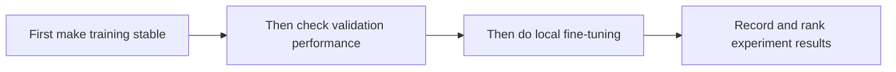

# 6.7.2 Hyperparameter Tuning Strategy

:::tip Section overview
Many training problems eventually come back to one sentence:

- The parameters were not tuned well

But “tuning” is often done very casually, as if it could only rely on luck.
In fact, a more reliable approach is:

> **Treat tuning as an experiment design problem, not as blind trial and error.**

This lesson will explain that clearly.
:::


:::tip How to use this picture
Use this route as a debugging guardrail: read the curves first, tune in a stable order, change only one thing per experiment, and keep logs so the next action is based on evidence instead of guessing.
:::

## Learning objectives

- Understand which hyperparameters are worth tuning first
- Understand what learning rate, batch size, and regularization each affect
- Build an intuition for tuning through runnable examples of “experiment logging and ranking”
- Learn how to design a more stable tuning order

---

## First, build a map

If you have already learned about optimizers, regularization, and training loops, then the most natural continuation is:

- You already know how to train a model
- Now you ask, “How do we tune these training settings more stably and effectively?”

So tuning is not an extra task outside training; it is:

- An experiment design problem you will inevitably face once the training loop is running

It is better not to think of tuning as “trying many combinations,” but instead as:



What this section really wants to help you build is:

- What to tune first
- What to tune later
- How to avoid losing control of experiments

## Why can’t tuning rely on random trial and error?

### Because parameters often interact with each other

For example:

- Learning rate and batch size together affect stability
- Dropout and weight decay together affect generalization

### Without an order, experiments quickly get out of control

You may run into situations where:

- Too many parameters are changed at once
- You do not know which change actually helped
- The results cannot be reproduced

### An analogy

Tuning is like baking.
If you change all of these at once:

- temperature
- time
- sugar amount
- flour amount

it becomes very hard to know what caused the final success or failure.

### What is the most important thing to remember about tuning, besides parameter names?

The most important thing to remember is:

> **Each round of experiments should try to answer one clearer question.**

For example:

- Is the learning rate too large or too small?
- Does batch size affect stability?
- Is overfitting better handled by regularization or by early stopping?

Once you ask the right experimental question, tuning no longer feels like luck.

---

## Which hyperparameters are worth looking at first?

### Learning rate

Usually the top priority.
If it is too large, training may oscillate; if it is too small, learning may stall.

### Batch size

It affects:

- Gradient stability
- GPU memory usage
- Training speed

### Regularization

For example:

- dropout
- weight decay

These mainly help control generalization.

### Number of training epochs / early stopping

These are closely related to whether overfitting happens.

---

## Start with a minimal tuning log example

```python
experiments = [
    {"lr": 1e-3, "batch_size": 32, "val_acc": 0.84, "train_time_min": 18},
    {"lr": 3e-4, "batch_size": 32, "val_acc": 0.88, "train_time_min": 20},
    {"lr": 1e-4, "batch_size": 64, "val_acc": 0.86, "train_time_min": 16},
]


def score(exp):
    return round(exp["val_acc"] - exp["train_time_min"] * 0.001, 4)


ranked = sorted(
    [{**exp, "score": score(exp)} for exp in experiments],
    key=lambda x: x["score"],
    reverse=True,
)

for item in ranked:
    print(item)
```

### What is this example trying to show?

Tuning is not just about one final accuracy number.
You usually also need to look at:

- Training time
- Resource cost
- Whether it is stable

### Why is experiment logging so important?

Because without logs, it becomes hard to answer:

- Which parameter is really better?
- Was this change just a coincidence?

---

## A more stable tuning order

### First fix most settings, and tune only one or two key parameters

A good starting point is usually:

- Learning rate
- Batch size

### After confirming stable training, look at generalization control

For example:

- dropout
- weight decay

### Finally, do more detailed local search

This makes the experiments easier to interpret.

### A sequence beginners can directly follow

When tuning a deep learning model for the first time, the safest order is usually:

1. Tune the learning rate first
2. Then tune the batch size
3. Then look at the number of epochs and early stopping
4. Then look at dropout / weight decay
5. Only then move on to more detailed architecture and optimizer settings

The benefit of this order is that you first solve “Can it learn stably?” and then solve “Is the generalization good enough?”

### Why is this order especially important for beginners?

Because in the early learning stage, the most common problems are not “the upper limit is too low,” but:

- Training is not stable at all
- Experiments are hard to interpret
- Too many things are changed at once, so you no longer know what really worked

So this order is essentially helping you protect two things first:

- Training runs stably
- Each experiment can be explained

---

## The most common mistakes

### Mistake 1: Changing too many parameters at once

This makes the results hard to explain.

### Mistake 2: Looking only at training set performance

Tuning should pay more attention to:

- Validation set
- Generalization

### Mistake 3: Thinking tuning is black magic

As long as the experiment design is clear,
it is actually a very engineering-oriented task.

## What should you record in each experiment?

At minimum, it is recommended to record these items:

- Model version
- Data version
- Key hyperparameters
- Training duration
- Best validation metric
- Your subjective interpretation of what this experiment means

Without records, tuning easily turns into repeated work.

### A minimal experiment log template

You can record it like this:

```text
experiment_id:
model:
dataset:
lr:
batch_size:
weight_decay:
dropout:
best_val_metric:
train_time:
conclusion:
```

If you really keep using this template for a few rounds, the confusion around tuning will drop noticeably.

---

## If you want to expand this section further, what is most worth adding?

The most useful additions are usually:

1. A one-page example of experiment logs
2. A set of comparison curves for “learning rate too large / too small / just right”
3. A complete tuning log from baseline to a stable model

That would make this section feel more like a real training engineering lesson, not just tuning advice.

---

## Summary

The most important idea in this section is to build a tuning mindset:

> **Hyperparameter tuning is not blind guessing, but a structured experiment design process centered on learning rate, batch size, and generalization control.**

Once this habit is established, many training problems become easier to debug.

## Exercises

1. Add two more experiments to the example and see whether the ranking changes.
2. Why is learning rate usually the most important parameter to tune first?
3. Think about this: if model training is very slow, how would you make tuning cheaper?
4. Explain in your own words: why is “changing only a small number of parameters at a time” more stable?
