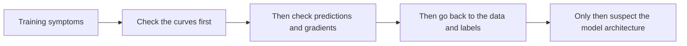

# Training Monitoring and Diagnosis


:::tip Section overview
Many training failures are not caused by “the model not being powerful enough,” but by:

- Problems with the data
- An incorrect learning rate
- The training process quietly breaking down

So one of the most important skills in training is not “knowing how to start training,” but:

> **Being able to tell what exactly went wrong during training.**
:::

## Learning objectives

- Understand which key signals to watch during training
- Learn to distinguish common issues such as overfitting, underfitting, and abnormal learning rates
- Build intuition for diagnosing training curves through runnable examples
- Learn how to locate problems at the data, optimizer, or model-structure level

---

## First, build a map

If you have already learned about training loops and hyperparameter tuning, the most natural continuation in this section is:

- The training loop tells you “how to train”
- Hyperparameter tuning tells you “what to tune first”
- This section starts answering “what should you check first when training goes wrong”

So training diagnosis is not optional reading — it is one of the most essential debugging skills in training engineering.

The best way for beginners to approach training diagnosis is not to “guess from experience,” but to break the problem into layers first:



This order will save you a lot of detours.

### A better overall analogy for beginners

You can think of training diagnosis like this:

- A doctor checks vital signs first, then determines the cause

If you see an abnormal loss and immediately switch models,
it is like:

- Changing the whole treatment plan before even measuring the temperature

A more stable approach is usually:

- Observe the symptoms first
- Make a preliminary classification
- Then locate the real root cause

## 1. Why is training diagnosis so important?

### 1.1 Because training failures rarely report the “real reason” directly

What you more often see is:

- Loss does not decrease
- Validation suddenly gets worse
- Accuracy gets stuck

But these are only symptoms, not root causes.

### 1.2 Real diagnosis needs to answer

- Is it a learning rate problem?
- Is it a data problem?
- Is it overfitting?
- Or is the model capacity not enough?

### 1.3 The most important thing to remember first is not the failure name, but what?

The most important thing to remember is:

> **Training symptoms and root causes are not the same thing.**

For example:

- `loss does not decrease` is only a symptom
- The real root cause may be the learning rate, labels, gradients, data distribution, or model capacity

Once you separate “symptoms” from “root causes,” debugging becomes much more rational.

---

## 2. Start with the most common diagnostic entry point: the training curve

```python
history = [
    {"epoch": 1, "train_loss": 0.95, "val_loss": 0.98},
    {"epoch": 2, "train_loss": 0.72, "val_loss": 0.81},
    {"epoch": 3, "train_loss": 0.51, "val_loss": 0.79},
    {"epoch": 4, "train_loss": 0.35, "val_loss": 0.92},
]

for row in history:
    print(row)
```

### 2.1 What is the most obvious signal in this example?

- `train_loss` keeps going down
- `val_loss` first decreases, then increases

This usually looks a lot like:

- Overfitting

### 2.2 Why is the training curve the first entry point?

Because it is the first place where problems show up,
and many issues can be inferred from the curve shape early on.

### 2.3 When looking at the curve for the first time, what three things should you focus on?

1. Whether the training set is actually being learned
2. Whether the validation set is improving at the same time
3. Whether the two curves are clearly starting to diverge

If you focus on these three things first, many problems can be classified in the first round.

### 2.4 A fault-location table that beginners can use directly

| Symptom | What to check first |
|------|------|
| Both train / val are bad | Underfitting, model capacity, insufficient features |
| Train is good, val gets worse | Overfitting, too little data, insufficient regularization |
| Loss fluctuates a lot | Learning rate too high, batch too small, unstable gradients |
| The model always predicts the same class | Label issues, class imbalance, implementation bug |

This table is great for beginners because it turns “I have no idea what to do after seeing the curve” into a set of actionable starting points.


:::tip Reading guide
It is recommended to troubleshoot this diagram from top to bottom: first check the train/val curves, then the learning rate and batch size, then the prediction distribution and gradients, and finally go back to the data and labels. Do not switch to a larger model the moment the loss looks wrong — in many cases, the root cause is in the training pipeline or the data.
:::

---

## 3. What do common problems look like?

### 3.1 Underfitting

Typical signs:

- High train_loss
- High val_loss as well
- Both fail to go down

### 3.2 Overfitting

Typical signs:

- train_loss keeps decreasing
- val_loss starts getting worse

### 3.3 Learning rate too large

Typical signs:

- Loss oscillates
- Or even suddenly blows up

### 3.4 Learning rate too small

Typical signs:

- Loss is decreasing, but very slowly
- No obvious progress for a long time

---

## 4. What should you look at besides loss?

### 4.1 Whether the gradients are abnormal

For example:

- Gradient explosion
- Vanishing gradients

### 4.2 Whether the prediction distribution is abnormal

For example:

- The model always predicts the same class
- Confidence is extremely skewed

### 4.3 Whether the data itself has problems

For example:

- Incorrect labels
- Class imbalance
- Large differences between training and validation distributions

### 4.4 A troubleshooting order that beginners can follow directly

When training goes wrong, you can prioritize this order:

1. Training and validation curves
2. Learning rate settings
3. Whether inputs and labels are aligned
4. Whether predictions collapse to the same class
5. Whether gradients and parameter updates are abnormal

This is usually more effective than changing the model right away.

### 4.5 Why is this order more stable than “just switch models first”?

Because the root cause of many training problems is not in the model architecture, but earlier in the pipeline:

- Data
- Labels
- Learning rate
- Training process

If these are not checked first, the problem often remains even after switching to a more complex model.

---

## 5. A minimal diagnosis rule example

```python
def diagnose(train_losses, val_losses):
    if train_losses[-1] > 0.8 and val_losses[-1] > 0.8:
        return "Possible underfitting"
    if train_losses[-1] < train_losses[0] and val_losses[-1] > min(val_losses):
        return "Possible overfitting"
    if max(train_losses) - min(train_losses) > 1.5:
        return "Possible learning rate too large or unstable training"
    return "Need more signals to make a judgment"


train_losses = [0.95, 0.72, 0.51, 0.35]
val_losses = [0.98, 0.81, 0.79, 0.92]

print(diagnose(train_losses, val_losses))
```

### 5.1 This example is not meant to replace human judgment

It is mainly helping you build an important diagnostic habit:

- First classify by symptoms
- Then look for possible causes

### 5.2 Let’s look at another minimal “training log checklist” example

```python
training_log = {
    "train_loss": [1.2, 0.8, 0.5, 0.3],
    "val_loss": [1.1, 0.9, 0.95, 1.1],
    "prediction_pattern": "mostly_one_class",
}


def first_check(log):
    if log["prediction_pattern"] == "mostly_one_class":
        return "First check the label distribution, class imbalance, and output-layer implementation."
    if log["val_loss"][-1] > min(log["val_loss"]):
        return "First troubleshoot in the direction of overfitting."
    return "First keep looking at the learning rate and gradients."


print(first_check(training_log))
```

This example is very suitable for beginners because it helps you turn training diagnosis from:

- a vague feeling

into:

- an orderly troubleshooting process

---

## 6. The most common pitfalls

### 6.1 Mistake 1: Only looking at final accuracy

This makes it hard to understand what happened during training.

### 6.2 Mistake 2: Immediately switching models when the loss does not go down

Very often, the problem is not in the model architecture at all.

### 6.3 Mistake 3: Thinking training problems can only be guessed from experience

In fact, many problems can be systematically located through:

- Curves
- Statistics
- Sample inspection

## 7. What is worth saving during training

- Train / val loss for each epoch
- Key metrics
- Predictions for the best and worst samples
- A copy of the current hyperparameter configuration

## If you turn this into a project or experiment record, what is most worth showing?

What is usually most worth showing is not:

- The final accuracy value

but:

1. The train / val curves
2. Your first-round diagnosis of the problem
3. What you changed first
4. How the curves and metrics changed after the fix

This makes it much easier for others to see:

- You understand training debugging
- You are not just able to press the “start training” button

These records will also make later retrospectives much easier.

### 7.1 Why are the “worst samples” often more valuable than the average score?

Because the average score can only tell you “what the overall situation is like,”
but the worst samples are better at exposing:

- Which kinds of inputs the model fears most
- Whether the labels may be wrong
- Whether there are edge cases in the data distribution

So many truly effective improvements are not discovered from the overall metric, but from the worst samples.

---

## Summary

The most important thing in this section is to build training diagnosis intuition:

> **First identify the problem type from the loss curve and validation performance, then gradually locate the root cause in the learning rate, data, generalization, or model capacity.**

Once this habit is built, training will no longer feel like “opening a blind box.”

## What you should take away from this section

- Curves are the entry point, not the conclusion
- Symptoms and root causes must be viewed separately
- Check the data and training pipeline first, then make big model changes
- Training diagnosis skill itself is a core deep learning engineering skill

---

## Exercises

1. Create your own “underfitting” curve and see whether `diagnose` changes.
2. Why is the gap between the training set and validation set such a critical signal in diagnosis?
3. If the model always predicts the same class, which problems would you suspect first?
4. Think about this: why is training diagnosis skill itself an engineering skill?
