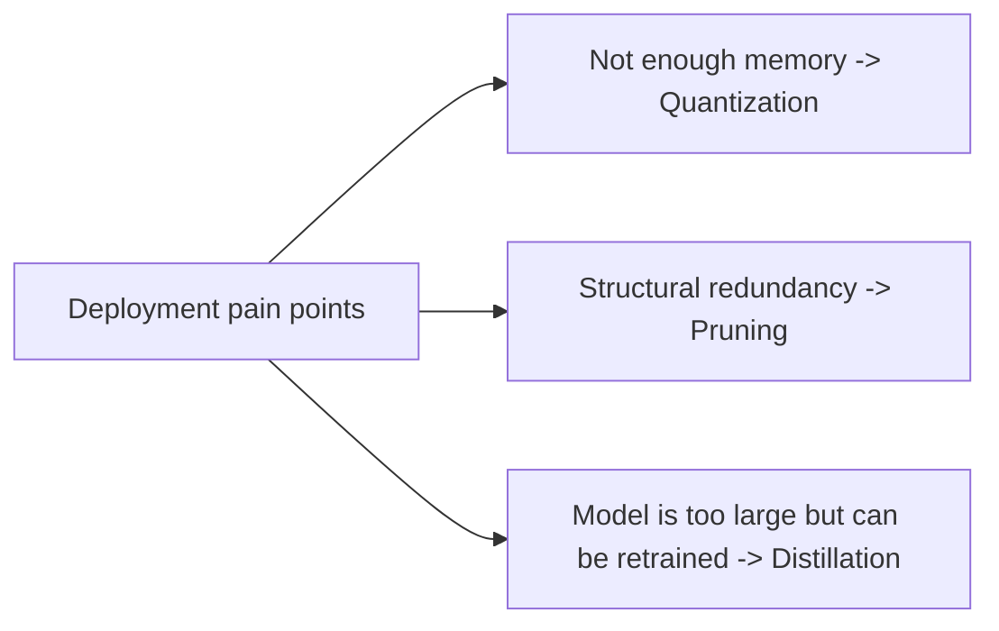
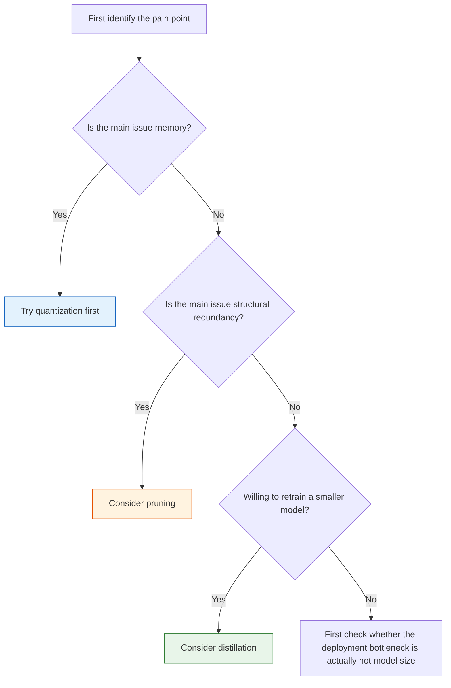

# Model Compression [Elective]

:::tip Section Overview
Model compression is not about pursuing the single goal of “making the model smaller.”
It is about solving more concrete problems in real deployment:

- Not enough memory
- Inference is too slow
- The device cannot run the model

So the key idea in this lesson is not memorizing terms, but building a very practical judgment:

> **Compression always trades some accuracy or flexibility for deployment benefits.**
:::

## Learning Objectives

- Understand the core ideas behind quantization, pruning, and distillation
- Understand why compression is not free
- Build intuition for quantization error through runnable examples
- Learn how to choose a compression strategy based on deployment constraints

---

## First, build a map

Model compression is better understood by starting from deployment problems, not from method names:



The most important thing in this section is to build the habit of “identify the pain point first, then choose the path.”

## 1. What exactly are we trading with model compression?

### 1.1 Common benefits

- Smaller memory footprint
- Lower latency
- Higher throughput
- Better fit for edge devices

### 1.2 Common costs

- Lower accuracy
- Increased engineering complexity
- Harder debugging

### 1.3 An analogy

Model compression is like packing for a business trip.
Of course you want the suitcase to be as light as possible,
but you cannot throw away everything important.

---

## 2. Three of the most common compression paths

### 2.1 Quantization

Convert high-precision values into lower-precision representations.

### 2.2 Pruning

Remove weights, channels, or structures that are not very important.

### 2.3 Distillation

Train a smaller model to imitate the behavior of a larger model.

### 2.4 A more beginner-friendly way to think about them

If these three approaches feel easy to mix up, you can remember them like this first:

- **Quantization**: Put the same thing into a more space-efficient material
- **Pruning**: Cut off obviously unnecessary branches and leaves first
- **Distillation**: Train a smaller student again so it can imitate the teacher

They are all called “compression,” but the place where you actually work is different:

- Quantization mainly changes numeric representation
- Pruning mainly changes structural redundancy
- Distillation mainly changes the training process

---

## 3. First, look at a minimal quantization error example

```python
weights = [0.12, -1.87, 3.44, -0.03]


def fake_quantize(values, scale):
    return [round(v * scale) / scale for v in values]


def mae(a, b):
    return sum(abs(x - y) for x, y in zip(a, b)) / len(a)


q8_like = fake_quantize(weights, scale=16)
q4_like = fake_quantize(weights, scale=4)

print("original:", weights)
print("q8_like :", q8_like)
print("q4_like :", q4_like)
print("q8 mae  :", round(mae(weights, q8_like), 4))
print("q4 mae  :", round(mae(weights, q4_like), 4))
```

### 3.1 What is the most important insight from this example?

The more aggressively you compress, the larger the error usually becomes.
So the core question in quantization is not:

- Can it be compressed?

But rather:

- After compression, can the business still accept the result?

### 3.2 Why is this highly related to real deployment?

Because one of the most common deployment questions is:

- Can the model fit on the device?

Quantization is often the first solution people think of.

### 3.3 Another minimal example: estimating “model size”

When many beginners first do compression experiments, the biggest problem is not that they cannot quantize,
but that they have no idea at all:

- How large the model is before compression
- Roughly how much space they can save after compression

This example only does one very practical thing:

- It calculates “how many parameters the model has” and “roughly how much space different precisions take”

```python
param_count = 12_000_000  # Assume a small model with 12 million parameters


def size_mb(param_count, bits):
    return param_count * bits / 8 / 1024 / 1024


variants = [
    ("fp32", 32),
    ("fp16", 16),
    ("int8", 8),
    ("int4", 4),
]

for name, bits in variants:
    print(f"{name:>4} -> {size_mb(param_count, bits):.2f} MB")
```

What is worth remembering first here is not the exact numbers,
but this:

- Without changing the number of parameters
- **Simply changing numeric precision may already reduce the model size by a large amount**

That is also why quantization is often the first choice.

---

## 4. When should you think about quantization, pruning, or distillation?

### 4.1 Quantization

Better when you want to quickly reduce memory usage and speed up inference.

### 4.2 Pruning

Better when you clearly know there is a lot of redundant structure.

### 4.3 Distillation

Better when you are willing to retrain a smaller model.

### 4.4 A decision table beginners can use directly

| Scenario | Higher priority |
|---|---|
| The model is too large and you want quick compression first | Quantization |
| You suspect the network has obvious redundancy | Pruning |
| You are willing to retrain a small model for stable gains | Distillation |

This table is not always perfect, but it is enough for the first round of decisions.

### 4.5 A flowchart that feels closer to real engineering



What this diagram most wants to help you build is a habit:

- Don’t first ask “Which compression method is most popular?”
- First ask “What deployment problem am I actually trying to solve?”

---

## 5. The most common pitfalls

### 5.1 Misconception 1: Compression always makes things faster

Not necessarily.
You also need to consider:

- Hardware support
- Inference engine support

### 5.2 Misconception 2: Only look at model size, not task metrics

Deployment benefits only matter if the model is still usable for the task.

### 5.3 Misconception 3: Compress first and think later

A more reliable order is usually:

- First identify the deployment pain point
- Then choose a compression strategy

---

## What you should take away from this section

- Compression is never free
- Quantization, pruning, and distillation each have their own suitable range of use
- The real starting point should always be deployment constraints, not method popularity

## A safer order when doing your first compression experiment

It is recommended to do it like this:

1. First identify the real bottleneck: memory, latency, or throughput
2. If the main issue is memory, try quantization first
3. If the main issue is model redundancy, then consider pruning
4. If you are willing to retrain and maintain the model long-term, then consider distillation

This is more like engineering work than “trying compression methods one by one because you saw them.”

## If you put this section into a project, what is most worth showing?

If you want to turn a compression experiment into a page that truly feels like an engineering project,
what is most worth showing is usually not:

- “I know int8 quantization”

But rather these four things:

1. Comparison of model size before and after compression
2. Comparison of latency / throughput before and after compression
3. Comparison of core task metrics before and after compression
4. Why you ultimately chose this compression path

Then what others see is not “I used a trick,”
but:

- You can make trade-offs based on deployment constraints

---

## Summary

The most important thing in this section is to build a deployment-oriented judgment:

> **Model compression is not about “the smaller the better,” but about making trade-offs among accuracy, engineering complexity, and deployment benefits.**

Once you build this judgment, you will no longer see only method names when you later look at quantization and distillation.

## What you should take away most from this section

- Model compression is first a deployment problem, not a flashy-technique problem
- Quantization, pruning, and distillation act on completely different parts of the system
- In your first compression experiment, measuring “model size / latency / metrics” first is more valuable than jumping straight into methods

## Exercises

1. Change the `scale` in the example to larger and smaller values, and observe how the error changes.
2. Explain in your own words: why is compression never free?
3. Think about it: if the target device has very limited memory, which path would you consider first?
4. If the model is already small enough but the latency is still high, would you still prioritize compression? Why?
