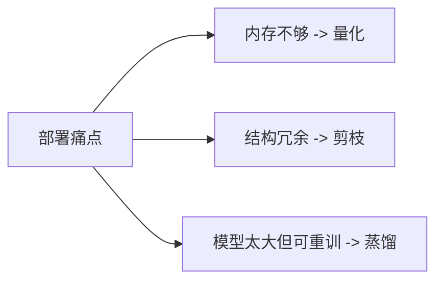
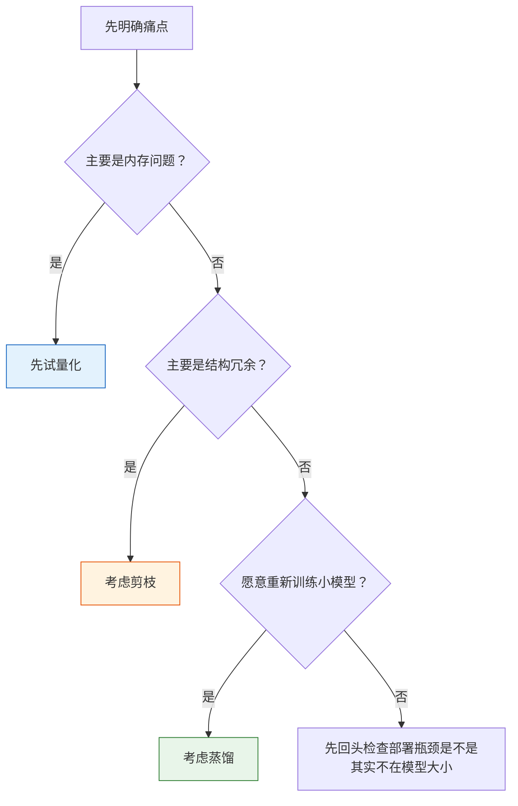

# 模型压缩【选修】

:::tip 本节定位
模型压缩不是为了追求“更小”这一个目标，  
而是为了在真实部署里解决更具体的问题：

- 内存不够
- 推理太慢
- 设备跑不动

所以这节课的关键不是记术语，而是建立一个很实用的判断：

> **压缩永远是在拿某些精度或灵活性，换部署收益。**
:::

## 学习目标

- 理解量化、剪枝、蒸馏三类压缩方法的核心思路
- 理解为什么压缩不是白赚
- 通过可运行示例建立量化误差直觉
- 学会从部署约束出发选择压缩路线

---

## 先建立一张地图

模型压缩更适合从部署问题反推，而不是从方法名出发：



这节最重要的是建立“先看痛点，再选路线”的判断。

## 一、模型压缩到底在换什么？

### 1.1 常见收益

- 更小内存
- 更低延迟
- 更高吞吐
- 更适合边缘设备

### 1.2 常见代价

- 精度下降
- 工程复杂度增加
- 调试更难

### 1.3 一个类比

模型压缩像出差打包。  
你当然希望箱子越轻越好，  
但不能把关键东西全扔了。

---

## 二、三条最常见的压缩路线

### 2.1 量化

把高精度数值压到低精度表示。

### 2.2 剪枝

去掉不太重要的权重、通道或结构。

### 2.3 蒸馏

让更小模型去模仿更大模型的行为。

### 2.4 一个更适合新人的总类比

如果你觉得这三条路容易混，可以先这样记：

- **量化**：同样的东西，换更省空间的材质去装
- **剪枝**：把明显多余的枝叶先剪掉
- **蒸馏**：重新训练一个更小的学生，让它模仿老师

它们都叫“压缩”，但真正动手的位置并不一样：

- 量化主要动数值表示
- 剪枝主要动结构冗余
- 蒸馏主要动训练方式

---

## 三、先看一个最小量化误差示例

```python
weights = [0.12, -1.87, 3.44, -0.03]


def fake_quantize(values, scale):
    return [round(v * scale) / scale for v in values]


def mae(a, b):
    return sum(abs(x - y) for x, y in zip(a, b)) / len(a)


q8_like = fake_quantize(weights, scale=16)
q4_like = fake_quantize(weights, scale=4)

print("original:", weights)
print("q8_like :", q8_like)
print("q4_like :", q4_like)
print("q8 mae  :", round(mae(weights, q8_like), 4))
print("q4 mae  :", round(mae(weights, q4_like), 4))
```

### 3.1 这个例子最关键的启发是什么？

压得越狠，通常误差越大。  
所以量化的核心不是：

- 能不能压

而是：

- 压完后业务还能不能接受

### 3.2 为什么这和真实部署高度相关？

因为部署里最常见的问题之一就是：

- 模型能不能塞进设备

量化往往是第一步会想到的办法。

### 3.3 再看一个最小“模型体积”估算示例

很多新人第一次做压缩实验时，最大的问题不是不会量化，  
而是根本不知道：

- 压前有多大
- 压后大概能省多少

下面这个例子就只做一件很实用的事：

- 先把“模型有多少参数”和“不同精度下大概占多少空间”算出来

```python
param_count = 12_000_000  # 假设一个 1200 万参数的小模型


def size_mb(param_count, bits):
    return param_count * bits / 8 / 1024 / 1024


variants = [
    ("fp32", 32),
    ("fp16", 16),
    ("int8", 8),
    ("int4", 4),
]

for name, bits in variants:
    print(f"{name:>4} -> {size_mb(param_count, bits):.2f} MB")
```

这个例子最值得先记住的不是绝对数字，  
而是：

- 在不改参数数量的前提下
- **光靠数值精度变化，就可能先把模型体积降掉一大截**

这也是为什么量化经常会成为第一选择。

---

## 四、什么时候更该想量化、剪枝还是蒸馏？

### 4.1 量化

更适合：

- 先快速降内存和加速

### 4.2 剪枝

更适合：

- 明确知道有大量冗余结构

### 4.3 蒸馏

更适合：

- 你愿意重新训练一个更小模型

### 4.4 一个新人可直接用的选择表

| 场景 | 更优先考虑 |
|---|---|
| 模型太大，想先快速压缩 | 量化 |
| 你怀疑网络有明显冗余 | 剪枝 |
| 你愿意重训一个小模型换稳定收益 | 蒸馏 |

这张表不一定总对，但足够做第一轮决策。

### 4.5 一张更像真实工程的选择流程图



这张图最想帮你建立一个习惯：

- 不要先问“哪种压缩最流行”
- 先问“我到底是在解决哪种部署问题”

---

## 五、最容易踩的坑

### 5.1 误区一：压缩一定更快

不一定。  
还要看：

- 硬件支持
- 推理引擎支持

### 5.2 误区二：只看模型大小，不看任务指标

部署收益只有在任务还能用时才有意义。

### 5.3 误区三：先压再说

更稳的顺序通常是：

- 先明确部署痛点
- 再选压缩策略

---

## 学这一节最该带走什么

- 压缩从来不是白赚
- 量化、剪枝、蒸馏各有适用边界
- 真正的出发点永远应该是部署约束，而不是方法流行度

## 第一次做压缩实验时更稳的顺序

更建议这样做：

1. 先明确真正瓶颈是内存、延迟还是吞吐
2. 如果主要是内存，先试量化
3. 如果主要是模型冗余，再考虑剪枝
4. 如果愿意重新训练并长期维护，再考虑蒸馏

这样比“看到压缩方法就轮流试一遍”更像工程工作。

## 如果把这节放进项目里，最值得展示什么

如果你想把压缩实验做成一个真正像工程项目的页面，  
最值得展示的通常不是：

- “我会 int8 量化”

而是下面这 4 样：

1. 压缩前后的模型大小对比
2. 压缩前后的延迟 / 吞吐对比
3. 压缩前后的核心任务指标对比
4. 你为什么最后选了这条压缩路线

这样别人看到的就不是“做过一个技巧”，  
而是：

- 你能围绕部署约束做权衡

---

## 小结

这节最重要的是建立一个部署判断：

> **模型压缩不是“越小越好”，而是在精度、工程复杂度和部署收益之间做权衡。**

只要这个判断建立起来，你后面看量化和蒸馏就不会只剩方法名。

## 这节最该带走什么

- 模型压缩首先是部署问题，不是炫技问题
- 量化、剪枝、蒸馏真正动手的位置完全不同
- 第一次做压缩实验时，先量清“模型大小 / 延迟 / 指标”三件事，比直接上方法更值

## 练习

1. 把示例里的 `scale` 改大和改小，观察误差变化。
2. 用自己的话解释：为什么压缩从来不是白赚？
3. 想一想：如果目标设备内存特别小，你会先考虑哪条路线？
4. 如果模型大小已经够小，但延迟仍然高，你还会优先做压缩吗？为什么？
