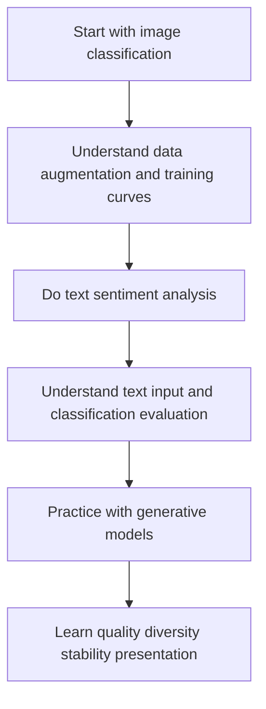

# Pre-class Guide: How Should You Actually Learn This Project Practice Chapter?

This chapter is not about piling up more concepts. Instead, it is about turning the neural networks, PyTorch, CNN, RNN, Transformer, generative models, and training techniques you learned earlier into real projects.

The biggest difference between deep learning projects and traditional machine learning projects is that you will more often face issues such as data scale, training cost, model convergence, overfitting, GPU environments, hyperparameters, and result visualization. So this chapter is not just about getting the model to run; it is also about training you to manage the training process and explain model behavior.

## Where This Chapter Fits in the Course

The deep learning project chapter is the exit of Station 6. It should prove that you can apply deep learning knowledge to real tasks, rather than only understanding individual model structures.

From the course roadmap, this chapter is also an important bridge to the large model stage. The training loop, data splitting, loss curves, validation set, error analysis, and experiment records you learn here will keep helping you later when you study pretraining, fine-tuning, and large model evaluation.

In the first half, you determine the task, data, and training plan. In the second half, you complete the project review around metrics, curves, failure samples, and reports.

## The Real Problems This Chapter Solves

This chapter answers five questions: how to prepare datasets and data loaders for deep learning tasks; how to design the training loop, validation loop, and best-model saving; how to judge model performance from loss, accuracy, F1, sample outputs, and error cases; how to handle overfitting, underfitting, class imbalance, and unstable training; and how to organize a project into a reproducible Notebook, script, or report.

The most common mistake beginners make is caring only about “whether the code finished running.” Deep learning projects should care more about: Did training converge? Did the validation set improve? What patterns appear in the error samples? When the model fails, is it a data problem, a model problem, or a training setup problem?

:::info Guided practice before the larger projects
If this project loop still feels abstract, run [Hands-on Workshop: Build a PyTorch Training Evidence Pack](./04-hands-on-dl-workshop.md) first. It gives you one complete, runnable rehearsal before the image classification, sentiment analysis, and generative model projects.
:::

## Recommended Learning Order for Beginners

It is recommended to start with image classification because it is the best way to understand data augmentation, CNNs, transfer learning, and training curves. Then do text sentiment analysis to connect text data, tokens, embeddings, sequence models, and classification evaluation. Finally, practice with generative models, focusing on output quality, diversity, stability, and presentation.

## The Main Thread to Focus on in This Chapter

The main thread of this chapter can be summarized as: a deep learning project is a loop of data, model, training, validation, and error analysis.

In the first half, you determine the task, data, and training plan. In the second half, you complete the project review around metrics, curves, failure samples, and reports.

Once you understand this thread, you will know that deep learning projects should not only show final metrics. Training curves, validation curves, confusion matrices, error examples, and visualization results are all very important evidence in a portfolio.

## What Each of the Three Projects Trains You On

| Project | Task Type | What You Really Practice |
|---|---|---|
| Image classification | CNN project | A complete image task loop from training to evaluation |
| Text sentiment analysis | Text classification project | Label design, baseline, error analysis, and upgrade path |
| Generative model practice | Generative project | Quality, diversity, stability, and presentation framework |

## Relationship Between This Chapter and Later Stages

Deep learning projects will help you better understand that large models are not black-box magic. Later, when you study pretraining, fine-tuning, RAG evaluation, and Agent evaluation, you will keep using the training records, validation sets, error analysis, and reproducible thinking from this chapter.

If you do not build a solid foundation here, common problems later include: seeing the loss go down but not knowing whether it is overfitting; not knowing the difference between validation and test sets; only knowing how to call a pretrained model without being able to judge why it fails; and having no baseline or evaluation plan during fine-tuning.

## How Beginners and Advanced Learners Should Read This Chapter

When beginners read this chapter for the first time, they should focus on the main thread and the smallest runnable example. You do not need to understand every detail at once. As long as you can clearly explain what problem this chapter solves, what the inputs and outputs are, and how the smallest project runs, you can keep moving forward.

Experienced learners can use this chapter to fill in gaps and practice engineering skills: pay attention to boundary conditions, failure cases, evaluation methods, code reproducibility, and the connections between the earlier and later stages. After reading it, you should ideally be able to distill this chapter into your own project README or experiment log.

## Suggested Study Time and Difficulty

| Study Mode | Suggested Time | Goal |
|---|---|---|
| Quick overview | 20–30 minutes | Understand what problem this chapter solves and where it will be used later |
| Minimum pass | 1–2 hours | Run a minimal example and complete the chapter’s small project exit |
| In-depth practice | Half a day to 1 day | Add error analysis, comparison experiments, or project README notes |

## Self-check Questions for This Chapter

| Self-check Question | Passing Standard |
|---|---|
| What problem does this chapter solve? | You can explain its role in the whole course in one sentence |
| What are the minimum input and output? | You can clearly describe what input the example needs and what result it produces |
| Where are the common failure points? | You can list at least one reason for an error, poor results, or misunderstanding |
| What can be accumulated after learning it? | You can write the chapter output into a project README, experiment log, or portfolio |

## Small Project Exit for This Chapter

After finishing this chapter, it is recommended that you complete at least one “reproducible deep learning training project.” The project should include data preparation, training/validation split, model architecture, training curves, evaluation metrics, error cases, model saving, and result presentation.

If you are doing image classification, you should show several correctly predicted and incorrectly predicted examples. If you are doing text sentiment analysis, you should show error texts and possible reasons. If you are doing a generative project, you should show a comparison of generated results under different parameters or versions.

## Debug Detective Case

| Case | Content |
|---|---|
| Case name | The Shape Monster Appears |
| Crime scene | The training script reports a shape mismatch, or the loss does not decrease for a long time. |
| Investigation steps | Print the tensor shape of each layer, and use an overfitting test on a small dataset to confirm whether the training loop is correct. |
| Evidence for closing the case | Error logs, shape records before and after the fix, training curves. |

Do not keep only success screenshots when practicing projects. At minimum, choose one real failure case and write it into `reports/failure_cases.md` in the format of “phenomenon, clues, suspected cause, investigation steps, fix actions, regression check.” That will make the project feel more like a real engineering work.

## Project Delivery Standards

For each comprehensive project, it is recommended to deliver it using the same portfolio standard instead of just getting the code to run. The minimum deliverables should include: a README, one reproducible run command, a set of example inputs and outputs, one key flowchart, one failure case analysis, and a next-step improvement plan.

| Deliverable | Minimum Requirement | Advanced Requirement |
|---|---|---|
| README | Clearly state the project goal, how to run it, dependencies, and examples | Add an architecture diagram, design trade-offs, and a review |
| Example input/output | Keep at least 1 complete case | Keep successful, failed, and boundary cases |
| Evaluation record | Clearly state which metrics are used to judge performance | Add baselines, comparison experiments, and error analysis |
| Engineering record | Record one environment or interface issue | Record logs, cost, time spent, and troubleshooting process |
| Presentation material | Use screenshots or a short GIF to prove it runs | Turn it into a portfolio page that can be explained |

The most important thing when doing a project is not how many features you pile on, but whether you can clearly explain: what problem you solved, how the system works, how the results are judged, how failures are located, and what you plan to improve in the next version.

## Passing Criteria

By the end of this chapter, you should be able to independently write a basic PyTorch training workflow, explain the roles of the training set, validation set, and test set, judge overfitting or underfitting from training curves, save and load models, and use error analysis to explain model limitations.

If you can organize a deep learning project into a reproducible Notebook or script, and use metrics, curves, and examples to explain model performance, then you have reached the portfolio exit standard for the deep learning stage.

## Suggested Version Path

| Version | Goal | Delivery Focus |
|---|---|---|
| Basic version | Run through the minimum loop | Can input, can process, can output, and keeps a set of examples |
| Standard version | Form a presentable project | Add configuration, logs, error handling, README, and screenshots |
| Challenge version | Close to portfolio quality | Add evaluation, comparison experiments, failure sample analysis, and a next-step roadmap |

It is recommended to finish the basic version first. Do not try to make it big and complete from the start. Every time you upgrade a version, write “what new capability was added, how it was verified, and what problems remain” into the README.
