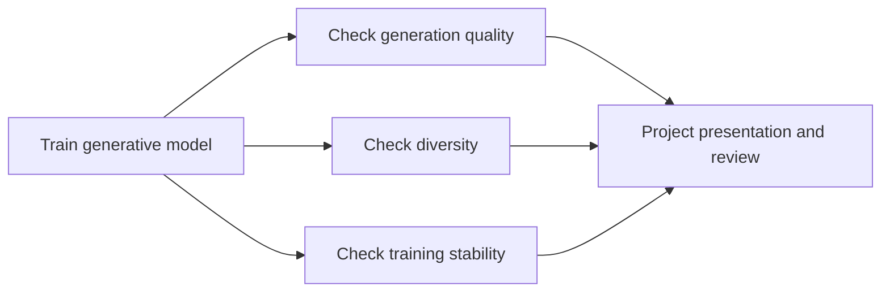
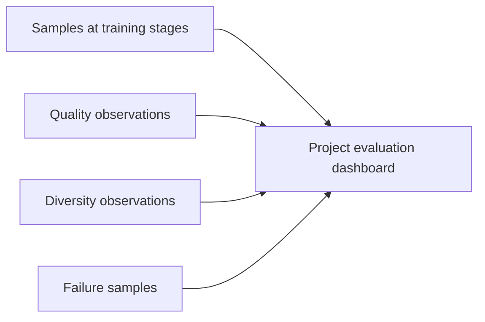

# Project: Generative Models in Practice [Optional]

:::tip Section focus
The biggest difference between a generative project and a classification project is:

- You do not have a very simple and clear “correct label” to compare against

So the hardest part of a generative project is often not getting the model to run,
but:

> **How do you actually tell whether it is generating well?**

The main goal of this section is to explain the most basic evaluation and presentation framework for generative projects.
:::

## Learning Objectives

- Understand the difference in evaluation between generative projects and classification projects
- Learn how to design a minimal presentation structure for a generative project
- Understand why both “quality” and “diversity” matter
- Build a basic review framework for generative projects

---

## First, Build a Map

The most confusing part of a generative project for beginners is this: the model is clearly running, but you do not know whether the result is actually good.



So what you really need to learn in this section is “how to judge and present,” not just “how to generate.”

## 1. What Is the First Problem a Generative Project Needs to Solve?

Not:

- Which is the most complex model to use

But:

- What exactly are you generating
- How will you judge whether the generated result is worthwhile

### Common Project Problem Types

- Generating faces or avatars
- Generating small handwritten digits
- Generating simple outline drawings

For practice, it is recommended to start with a topic that is:

- Clearly defined
- Easy to obtain data for
- Easy to inspect visually

---

## 2. The Minimal Structure of a Generative Project

### 1. Data

- Training samples

### 2. Model

- GAN / VAE / more modern generative models

### 3. Sampling and Visualization

- Generate samples periodically to observe trends

### 4. Evaluation

- Sample quality
- Diversity

### 5. Presentation

- Compare samples from different training stages
- Summarize failure modes

### 2.1 A More Beginner-Friendly Evaluation Dashboard

When many beginners do a generative project for the first time,
the biggest problem is not “I can’t train it,”
but:

- I don’t know what I should look at

You can first reduce the minimal dashboard to the following 4 columns:



As long as you can keep filling in these 4 columns consistently,
your project will no longer be just “some generated images.”

## 3. Recommended Order of Progress

1. First choose a very small dataset that is easy to inspect
2. Then decide whether you care more about quality, diversity, or stability
3. Then choose the model path
4. Finally decide how to present and compare the results

---

## 4. A Minimal Project Planning Example

```python
from dataclasses import dataclass, field


@dataclass
class GenerativeProjectPlan:
    name: str
    data_source: str
    model_family: str
    evaluation_focus: list
    risks: list = field(default_factory=list)


plan = GenerativeProjectPlan(
    name="simple_digit_generator",
    data_source="small_grayscale_digits",
    model_family="VAE",
    evaluation_focus=["visual_quality", "diversity", "training_stability"],
    risks=["mode collapse", "blurry samples", "discontinuous latent space"],
)

print(plan)
```

### 4.1 Why Is This Step More Important Than Directly Piling on Code?

Because if a generative project does not first clarify:

- data
- model path
- evaluation focus

then later it is very easy to end up with only “I generated some images,” without being able to explain the project’s value.

---

## 5. How Do You Do the Most Basic Result Check for a Generative Project?

### 5.1 First, Check Quality

Do the generated results look like the target data?

### 5.2 Then, Check Diversity

Does it keep generating almost the same thing?

### 5.3 A Minimal Diversity Check Example

```python
samples = [
    "digit_like_pattern_A",
    "digit_like_pattern_A",
    "digit_like_pattern_B",
    "digit_like_pattern_C",
]

diversity = len(set(samples)) / len(samples)
print("diversity score =", diversity)
```

Although this example is very simplified,
it is already reminding you that:

- It is not enough to only check “does it look similar?”
- You also need to check “is it just generating the same thing over and over?”

### 5.4 Add a “Training Stage Sample Dashboard” Example

In real projects, a very useful presentation method is:

- Fix several epochs
- Save a small batch of samples at each epoch
- Then display them side by side

Even if you do not actually draw charts,
building a structured dashboard first is very helpful:

```python
checkpoints = [
    {"epoch": 1, "quality": 0.20, "diversity": 0.80, "note": "Mostly noise"},
    {"epoch": 10, "quality": 0.45, "diversity": 0.72, "note": "Outlines begin to appear"},
    {"epoch": 30, "quality": 0.68, "diversity": 0.60, "note": "Sharper results, but starting to look similar"},
    {"epoch": 60, "quality": 0.75, "diversity": 0.48, "note": "Possible mode collapse"},
]

for row in checkpoints:
    print(row)
```

The most important thing to remember here is not the numbers themselves,
but that:

- Quality and diversity usually need to be considered together
- Training does not always make every metric better at the same time

---

## 6. The Most Common Pitfalls

### 6.1 Mistake 1: Only Showing the Best-Looking Images

A real project should show:

- Average sample quality
- Failure samples

### 6.2 Mistake 2: Only Looking at Quality, Not Diversity

This can hide mode collapse.

### 6.3 Mistake 3: Choosing a Dataset That Is Too Complex Too Early

Practice projects are better off starting with small tasks that are:

- Easy to observe
- Easy to compare

---

## What to Add When Delivering the Project

- A comparison of samples from different training stages
- A set of failure samples
- An explanation of the trade-off among “quality / diversity / stability”
- An explanation of why this model was chosen instead of another model

## A Project Evaluation Template Beginners Can Copy Directly

If you do not know how to write a generative project review,
the safest starting point is usually a table like this:

| Dimension | Question You Need to Answer | Minimal Evidence |
|---|---|---|
| Quality | Do the generated results look like the target data? | Sample comparison across different stages |
| Diversity | Does it keep generating almost the same thing? | A set of different sampling results |
| Stability | Did training clearly collapse or break? | Loss / sample trend explanation |
| Interpretation | Why choose this model path? | A paragraph explaining the choice |

This table is especially suitable for beginners,
because it first makes clear what exactly you should present.

## If You Want to Take This Project Further, What Is Most Worth Adding?

The most worthwhile additions are usually:

1. A one-page quality / diversity comparison display
2. A comparison page for different model paths
3. A failure case analysis for mode collapse or blurry samples

This way, the project will move from “I generated some results” to “I know how to evaluate and explain these results.”

## 10. A Presentation Order Better Suited for a Portfolio

If you turn this project into a portfolio page, a recommended order is:

1. Project goal and data scope
2. Model path selection
3. Samples from different training stages
4. Quality / diversity comparison
5. Failure cases and root-cause judgment
6. Next-step improvement directions

This way, what others see is not “a few images,” but a complete generative project story.

---

## Summary

The most important thing in this section is to establish a generative project judgment framework:

> **The hardest part of a generative model project is not just training it, but building a trustworthy evaluation and presentation framework around quality, diversity, and stability.**

Once this framework is in place, your project will no longer be just “some generated images.”


## Recommended Version Roadmap

| Version | Goal | Delivery Focus |
|---|---|---|
| Basic | Run the minimal loop | Can take input, process it, and output it, while keeping a set of examples |
| Standard | Form a presentable project | Add configuration, logging, error handling, a README, and screenshots |
| Challenge | Approach portfolio quality | Add evaluation, comparison experiments, failure sample analysis, and next-step directions |

It is recommended to complete the basic version first, and not try to make everything comprehensive from the start. Every time you improve the version, write into the README what new capability was added, how it was validated, and what issues remain.

## Exercises

1. Think of a minimal generative project you would like to do, and write down its data source and evaluation focus.
2. Why can’t a generative project just show the best-looking few results?
3. In what situation would you suspect mode collapse first?
4. If you could only prioritize one metric to observe, would you first look at quality or diversity? Why?
