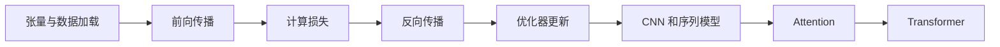
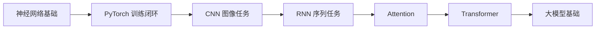

# 6 深度学习与 Transformer 基础


这一阶段解决的是“模型内部到底是怎么学出来的”。机器学习阶段更多使用现成模型接口，而深度学习阶段会让你真正看到参数、梯度、训练循环、网络结构和表示学习。

## 故事化导入：走进模型的发动机舱

如果说机器学习阶段像是在驾驶一辆车，深度学习阶段就是打开引擎盖，看清楚动力如何产生。张量是燃料，网络层是零件，损失函数像仪表盘，梯度和优化器负责不断调校。你会第一次真正看到模型如何从错误中学习。

## 学习闯关地图



## 互动练习：盯住训练循环的四个数字

训练小模型时，不要只看最终准确率。每次实验都观察训练损失、验证损失、训练准确率和验证准确率。如果训练集越来越好但验证集不变，可能是过拟合；如果两个都很差，可能是模型、数据或学习率有问题。把这些曲线看懂，比盲目换模型更重要。

## 项目彩蛋

本阶段的彩蛋作品可以是一个“小型模型实验室”：同一个数据集上，分别记录不同网络结构、学习率、batch size、训练轮数的效果，并画出对比曲线。这个实验室会成为你理解微调、大模型训练和多模态模型的基础模板。

## 阶段定位

| 信息 | 说明 |
|---|---|
| 适合对象 | 已完成机器学习，希望进入深度学习、Transformer、大模型或多模态方向的学习者 |
| 预估学时 | 140～190 小时 |
| 前置要求 | 完成前四个阶段 |
| 阶段产出 | 图像分类、文本情感分类或简单生成模型项目 |

## 新手最小通关路线

新手先跑通张量、自动求导、数据加载、模型定义、损失计算、反向传播和优化器更新这条训练闭环。只要能用 PyTorch 训练一个小型分类模型，并看懂训练损失和验证指标，就算完成最小通关。

## 进阶深入路线

有经验的学习者可以深入 CNN、RNN、Attention、Transformer、正则化、初始化和训练诊断。进一步尝试记录不同网络结构和超参数的实验结果，形成自己的小型模型实验室。

## 深度学习为什么重要

深度学习让模型可以从数据中自动学习复杂表示。图像中的边缘、纹理和物体，文本中的词义和上下文，都可以通过多层网络逐步形成表示。Transformer 又进一步成为大语言模型和多模态模型的核心架构。



## 新人先做什么，进阶再做什么

新人第一次学这一阶段时，先理解神经网络训练的最小闭环：准备数据、定义模型、计算损失、反向传播、更新参数、观察曲线。不要一开始追求复杂架构。

有经验的学习者可以把重点放在训练诊断上：过拟合如何发现，学习率如何影响曲线，数据增强和正则化什么时候有用，Transformer 为什么改变序列建模。你的目标是能解释一次训练为什么成功或失败。

## 本阶段学习路径

第一章学习神经网络基础。你会理解神经元、激活函数、前向传播、反向传播、优化器、正则化和参数初始化。

第二章学习 PyTorch。你会从张量、自动求导、`nn.Module`、数据加载和训练循环开始，真正搭出一个可训练模型。

第三章学习 CNN。视觉任务最直观，适合作为第一次理解深度网络结构的入口。

第四章学习 RNN 与序列模型。你会看到序列数据为什么和普通表格不同，也会理解 LSTM、GRU 的历史意义。

第五章学习 Attention 与 Transformer。它是后续大模型主线的关键桥梁。

第六和第七章作为扩展，帮助你理解生成模型和训练调优。

## 学完后你应该能做到

- 能解释神经网络的前向传播、损失计算和参数更新
- 能用 PyTorch 写出最小训练循环
- 能训练一个简单 CNN 或文本分类模型
- 能理解 RNN、Attention 和 Transformer 的基本区别
- 能为后续 LLM 原理、微调和多模态学习打下基础

## 常见误区

不要只会复制训练代码，却不知道每一步在做什么。你至少要能说清楚数据如何进入模型，输出如何计算损失，梯度如何反传，优化器如何更新参数。

也不要一开始追求训练大模型。深度学习第 1 站最重要的是跑通小模型和小数据集，把训练闭环理解清楚。

## 训练错误剧场：曲线比模型名更重要

如果 loss 不下降，先检查学习率、标签格式、输入归一化和损失函数是否匹配；如果训练集很好但验证集很差，优先怀疑过拟合和数据划分；如果显存不够，先减小 batch size、图片尺寸或模型规模。

## 最小可运行实验：一条完整 PyTorch 训练循环

本阶段最小实验不是训练大模型，而是跑通一个小数据、小模型、小 epoch 的训练闭环。你要能指出每一步：数据进入模型，输出计算损失，损失反向传播，优化器更新参数。

```python
for x, y in dataloader:
    optimizer.zero_grad()
    pred = model(x)
    loss = loss_fn(pred, y)
    loss.backward()
    optimizer.step()
```

如果你能画出训练 loss 和验证 loss，并解释它们为什么变化，就已经抓住了深度学习工程的主线。

## 深度学习失败案例库：先看 shape、loss 和曲线

| 现象 | 常见原因 | 定位方法 | 修复方向 |
|---|---|---|---|
| shape mismatch | 输入维度、batch 维或类别数不匹配 | 打印每层输入输出 shape | 调整 reshape、模型头或数据格式 |
| loss 不下降 | 学习率、标签格式、归一化或 loss 不匹配 | 先在小 batch 上过拟合测试 | 调学习率，检查标签和输入尺度 |
| 训练好验证差 | 过拟合、数据划分不合理 | 对比训练/验证曲线 | 数据增强、正则化、早停 |
| 显存不够 | batch、图片尺寸或模型过大 | 查看显存占用 | 减小 batch，降低分辨率，换轻量模型 |

## 阶段验收 Rubric

| 等级 | 验收标准 | 作品集证据 |
|---|---|---|
| 最低通关 | 能跑通 Dataset、DataLoader、模型、loss 和 optimizer | `train.py`、训练输出 |
| 推荐通关 | 能记录训练曲线并解释过拟合/欠拟合 | 曲线图、验证指标、配置文件 |
| 作品集通关 | 能比较模型方案并分析失败样本 | 实验报告、错误样本、改进计划 |

## 阶段项目

基础版是训练一个简单图像分类或文本情感分类模型，能完成数据加载、训练和评估。标准版需要加入验证集、指标曲线、过拟合分析和模型保存加载。挑战版可以比较 CNN、RNN、Transformer 或迁移学习方案，并写出实验报告说明模型为什么变好或变差。

如果你想看更细的学习节奏，可以阅读 [学习指南：深度学习基础怎么学最不容易学乱](./study-guide.md)。


## 本阶段趣味任务卡

| 玩法 | 本阶段任务 |
|---|---|
| 剧情任务 | 让助手理解训练过程：跑通训练循环，观察 loss 曲线，定位 shape mismatch。 |
| Boss 战 | **Shape 巨兽** |
| 可解锁徽章 | Loss 观察员、Shape 追踪者 |
| 新手轻松版 | 只完成一个最小输入到输出闭环，先留下运行截图或命令输出 |
| 作品集证据 | 训练日志、曲线和一次失败复盘 |

如果你觉得本阶段内容很多，先把这张任务卡当作最低目标。能完成新手轻松版，就可以继续往后学；以后准备作品集时，再回来升级标准版和挑战版。

## 阶段交付物

| 交付物 | 最小版 | 作品集版 |
|---|---|---|
| 训练脚本 | 跑通数据加载、前向传播、损失和优化 | 结构清晰，支持配置参数、保存模型和复现实验 |
| 指标曲线 | 记录 loss 和 accuracy | 展示训练/验证曲线、过拟合判断和调参过程 |
| 模型对比 | 比较一个基础模型和一个改进模型 | 说明 CNN、RNN、Transformer 或迁移学习的取舍 |
| 失败样本 | 保存若干分类错误样本 | 分析数据质量、类别混淆、增强策略和模型限制 |
| 实验报告 | 写清运行命令和结果 | 包含数据、模型、指标、曲线、错误分析和下一步 |

## 和 AI 学习助手贯穿项目的关系

本阶段可以对应 AI 学习助手 v0.6：做一个文本或图像分类小实验，记录训练曲线、指标和失败样本。 如果你正在按贯穿项目路线学习，建议本阶段结束时至少提交一次版本记录：本阶段新增了什么能力、如何运行、示例输入输出是什么、遇到了什么问题、下一步准备怎么改。


## 阶段通关标准

| 通关层级 | 你需要做到什么 |
|---|---|
| 最低通关 | 能用 PyTorch 跑训练循环，理解 CNN、RNN、Transformer 和训练诊断。 |
| 推荐通关 | 完成本阶段至少一个可运行小项目，并在 README 中记录运行方式、示例输入输出和遇到的问题。 |
| 作品集通关 | 把本阶段产出接入“AI 学习助手”贯穿项目，留下截图、日志、评估样例和下一步计划。 |

学完本阶段后，不需要把所有细节都背下来。更重要的是能说清楚：本阶段解决什么问题，它和上一阶段的关系是什么，以及它会怎样支撑后续学习。后面大模型、RAG 和多模态都会建立在这些表示学习概念上。
