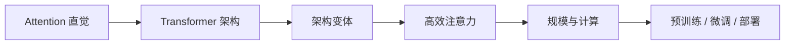
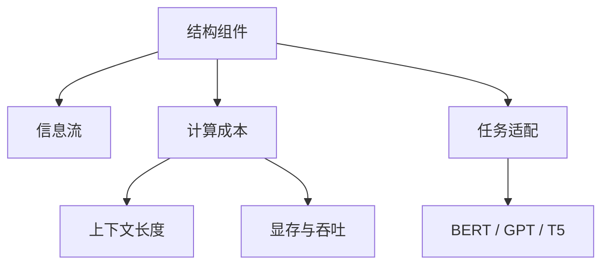

# 学前导读：Transformer 深入这一章到底在学什么

## 本章定位

这一章不是重复讲“Transformer 是什么”，而是把你从能看懂结构图推进到能理解现代大模型为什么这样设计。前面你已经见过 Attention、Encoder、Decoder 和预训练模型；这一章要进一步回答：为什么 Transformer 能扩展到大模型，主流架构为什么会有不同变体，长上下文和推理成本为什么会成为工程问题。

如果你只会背“多头注意力 + FFN + 残差 + LayerNorm”，还不足以理解后面的 LLM、微调、RAG 和部署。本章的重点是把结构、计算和工程约束连起来。

## 本章在大模型主线中的位置

Transformer 深入是大模型原理部分的中轴。你后面看到上下文窗口、KV Cache、显存占用、推理延迟、LoRA 插入位置、RAG 上下文拼接限制时，都会回到这一章的概念。

## 本章学习主线

| 小节 | 重点问题 | 学完后应该能说清楚什么 |
|---|---|---|
| 架构回顾与深入 | Transformer 每个组件为什么存在 | Attention、FFN、残差、LayerNorm 的作用 |
| 模型架构变体 | Encoder-only、Decoder-only、Encoder-Decoder 有何不同 | BERT、GPT、T5 为什么适合不同任务 |
| 高效注意力机制 | 长文本为什么贵 | 稀疏注意力、线性注意力、FlashAttention 解决什么问题 |
| 模型规模与计算 | 参数、显存、吞吐、上下文如何互相影响 | 为什么部署大模型是工程权衡 |

## 学习时要抓住的三个问题

第一，信息怎么流动：token 如何通过 Attention 看到其他 token，层与层之间如何逐步形成表示。第二，计算贵在哪里：Attention 为什么和序列长度强相关，显存为什么会成为瓶颈。第三，架构怎么服务任务：理解型任务、生成型任务和 text-to-text 任务为什么对应不同结构偏好。

## 和后续章节的连接

预训练章节会继续讨论这些结构如何在大规模数据上学习；微调章节会关心哪些参数要更新、LoRA 插在哪里；部署章节会关心 KV Cache、批处理和推理服务；RAG 会关心上下文窗口和长文档压缩。也就是说，这章不是纯理论，而是后面工程决策的基础。

## 本章小项目出口

建议做一个“Transformer 成本直觉小实验”。基础版可以写一个简单脚本，比较不同序列长度下 Attention 矩阵大小的增长。标准版可以用一个小模型观察输入长度变化对推理耗时的影响。挑战版可以对比普通 Attention、FlashAttention 或长上下文策略的概念差异，并写成一页实验记录。

## 常见误区

第一个误区是把 Transformer 只当成结构图，不关心计算代价。第二个误区是把所有大模型都看成同一种架构，而忽略 Encoder-only、Decoder-only 和 Encoder-Decoder 的任务差异。第三个误区是认为上下文越长越好；真实应用里，长上下文会带来成本、延迟和注意力稀释问题。

## 过关标准

学完这一章后，你应该能解释 Transformer 的关键组件、主流架构变体的适用任务、长序列为什么昂贵，以及这些知识如何影响预训练、微调、RAG 和部署决策。
