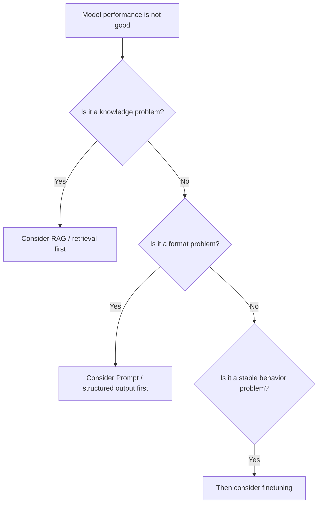
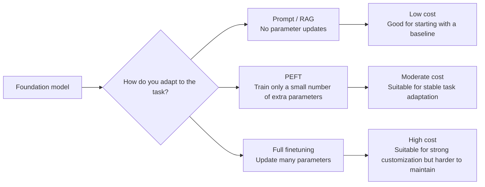

# Finetuning Overview


:::tip Section focus
When many people think about model customization, their first reaction is:

- Finetune it

But in real engineering work, the more important question is actually:

> **For this problem right now, is finetuning really worth it?**

The core of this section is not to turn “finetuning” into a magic button, but to make the decision logic clear.
:::

## Learning Objectives

- Understand which kinds of problems finetuning is truly good at solving
- Understand why not every task should start with finetuning
- Distinguish the basic ideas behind full finetuning and parameter-efficient fine-tuning (PEFT)
- Build a more practical intuition for finetuning decisions

---

## First, Build a Map

### Start with a more realistic scenario

Suppose you are building a course Q&A assistant. After launch, you find three kinds of problems:

- Some answers are wrong because it does not know the latest course rules
- Some answers are correct, but the format is always unstable
- Some responses always drift away from your customer service tone and do not fit the brand style over time

These three kinds of problems all look like “the model is not performing well,” but the solutions are not the same. The first is more like a knowledge problem, and you would usually consider RAG first; the second is more like an output constraint problem, and you would usually start with Prompt or structured output; the third is more like a long-term behavior shaping problem, where finetuning starts to become valuable.

So before learning finetuning, do not rush to train. First learn how to judge: what kind of problem is this exactly?

If you have already learned pretraining and Prompt, then the most natural continuation here is:

- Earlier, you learned where model capability comes from, and how to use the model more stably without changing parameters
- Now, this section answers: when is Prompt not enough, and when do you really need to update parameters?

So what really matters in the finetuning overview is not “whether you can train,” but:

- When should you change parameters?
- Is changing parameters really worth it?

For beginners, the best way to understand this section is not “start training first,” but to first see the decision tree clearly:



What this section really wants to solve is:

- When should you finetune?
- What kinds of problems does finetuning solve, and what does it not solve?

## 1. What Problem Does Finetuning Actually Solve?

You can roughly think of it as:

> **Making a foundation model perform more stably on a more specific task, style, or domain.**

For example:

- Better at a fixed output format
- Better adapted to a certain business response style
- Better at the task patterns of a vertical domain

This means finetuning is more like:

- Shaping capabilities

rather than just:

- Adding knowledge

### 1.1 When you first learn finetuning, what should you focus on first?

What you should focus on first is not method names like LoRA or full finetuning, but this sentence:

> **Finetuning is more like shaping model behavior, not simply “stuffing knowledge” into the model.**

Once this idea is stable, many later judgments become easier:

- Why knowledge updates are often better handled by RAG
- Why format stability problems should sometimes be handled by Prompt first
- Why finetuning is worth considering when behavior is unstable over the long term

---

## 2. Why Should Not Every Problem Start with Finetuning?

Many problems are better handled first by considering:

- Prompt
- RAG
- Tool calling

### 2.1 If the problem is “the knowledge is not up to date”

The more natural first choice is often:

- Retrieval

### 2.2 If the problem is “the output format is unstable”

The more natural first choice is often:

- Prompt optimization
- Structured output

### 2.3 When is finetuning more worth prioritizing?

When you find the problem is more like:

- Model behavior is unstable over the long term
- Style requirements are fixed
- A certain task appears repeatedly and the pattern is stable

At that point, finetuning becomes more valuable.

Remember this one sentence first:

> **First determine whether this is a knowledge problem, a format problem, or a behavior problem.**

### 2.4 Judgment table for the three types of problems

| Problem symptom | What kind of problem is it more like? | What should you prioritize? |
|---|---|---|
| The model does not know the company’s latest refund policy | Knowledge problem | RAG / retrieval / knowledge base updates |
| The answer content is correct, but the JSON format is often wrong | Format problem | Prompt / structured output / validation retries |
| The model does not consistently follow fixed phrasing and task style | Behavior problem | Finetuning / PEFT |
| The user’s question needs a tool lookup before answering | Action problem | Tool calling / Agent / workflow |

This table is very important because it helps you avoid a common mistake: thinking finetuning is the answer whenever performance is poor. In real projects, many problems are not solved by changing parameters.


:::tip Reading guide
It is recommended to read this diagram from the root cause of the problem: if knowledge is missing, look at RAG first; if the format is unstable, look at Prompt/structured output first; if the issue is a tool-based process, look at Agent/workflow first. Only when long-term behavior and style are unstable does finetuning or PEFT become a more valuable candidate. Finetuning is not the first reaction; it is an action you take after making a judgment.
:::

---

## 3. The Difference Between Full Finetuning and Parameter-Efficient Finetuning

### 3.1 Full Finetuning

Intuitively, this means:

- Most of the model’s parameters are allowed to be updated

Advantages:

- Flexible

Disadvantages:

- High memory usage
- High cost
- Harder to train

### 3.2 Parameter-Efficient Finetuning (PEFT)

Intuitively, this means:

- You do not heavily modify the whole model
- You only train a small number of additional parameters

Advantages:

- More resource-efficient
- Easier to reuse

That is why PEFT is becoming more and more common in real projects.

### 3.3 When you first look at PEFT, what is most worth remembering?

What is most worth remembering is not the details of specific algorithms, but this:

- It solves the real-world problem of “resources and maintenance cost”

In other words, PEFT is not just trendy. It is:

- A more practical adaptation path when you do not want to heavily modify the whole model

---

## 4. A Cost Map for Adaptation Approaches



This diagram can serve as a reminder when choosing a solution for the first time: the further to the right you go, the deeper the changes, the higher the cost, and the more you need stable data and clear benefits.

---

## 5. A Minimal Parameter-Scale Example

```python
params = {
    "full_finetune": 100_000_000,
    "peft": 5_000_000
}

for name, count in params.items():
    print(name, "trainable_params =", count)
```

### 5.1 What is this code reminding us of?

It is not telling you a precise number. It is reminding you of this:

> The first real-world question in finetuning methods is often: “How many parameters do we actually need to change?”

This directly determines:

- Memory usage
- Training speed
- Storage cost

---

## 6. When Is Finetuning Really Valuable?

### 6.1 When you want the model to form stable behavior

For example:

- A specific response style
- A specific task format
- Specific domain habits

### 6.2 When you have stable, sustainable data

If your task data:

- Is large enough
- Has good quality
- Follows relatively stable patterns

then finetuning is usually more meaningful.

### 6.3 When is it not worth it?

If the requirements change frequently, or the knowledge updates often,
then in many cases finetuning is not the first choice.

---

## 7. The Easiest Place to Overestimate Finetuning

### 7.1 Misconception 1: Thinking finetuning can solve everything

It cannot.
Many problems are better solved with:

- Retrieval
- Workflows
- Prompt

### 7.2 Misconception 2: Thinking finetuning will make the model “memorize the knowledge base”

Finetuning is better for shaping behavior, and is not always suitable for carrying rapidly changing knowledge.

### 7.3 Misconception 3: Thinking that training it means it will definitely get better

If the data is poor, finetuning may actually make the model worse.

---

## 8. A Very Practical Question

Before deciding whether to finetune, ask:

1. Is this a knowledge problem or a behavior problem?
2. Will this task shape remain stable for a long time?
3. Do I have clean and stable data?
4. Do I really have the resources to handle training and maintenance?

If these questions are answered clearly, the finetuning decision will usually be much more solid.

### 8.1 The safest order when doing a project for the first time

If you want to truly ship a task, it is recommended to go in this order:

1. First use Prompt to build a baseline
2. Then use retrieval or a workflow to build a second-layer baseline
3. Only when behavior is still unstable for the long term should you consider finetuning

In this way, it will be easier later to explain:

- What finetuning actually solved
- Whether it was worth it

---

## Summary

The most important thing in this section is not to treat finetuning as the default action, but to understand:

> **Finetuning is better suited for solving “model behavior and task adaptation” problems, not every problem.**

Once this judgment is established, when you later learn LoRA, QLoRA, and engineering practice, you will not rush in blindly.

## What You Should Take Away from This Section

- Finetuning is not the default action, but a more expensive adaptation method
- First distinguish knowledge problems, format problems, and behavior problems
- Only when the task is long-term stable, the data is reliable, and the benefits are clear does finetuning become a more worthy priority

---

## 9. Exercises

1. Think of a real project of yours and judge whether its problem is more like a knowledge problem or a behavior problem.
2. Explain in your own words: why should not all tasks prioritize finetuning?
3. If requirements change frequently, why is finetuning not necessarily the first choice?
4. Why do people say that “data quality” often affects finetuning results more than the “method name”?
