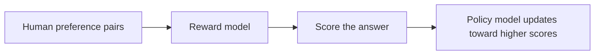

# 7.7.3 RLHF Workflow


:::tip Section Overview
When many people first hear RLHF, they interpret it as a vague phrase:

- Using human feedback to make the model better

That direction is not wrong, but it is too abstract.

What you really need to learn is:

> **How human feedback is translated into data, a reward function, and policy updates.**

Only when you see this chain clearly will you understand:

- What RLHF is really good at
- Why it is so costly
- Why alternatives like DPO later appeared
:::

## Learning Objectives

- Understand why preference optimization is still needed after supervised fine-tuning
- Understand the three-stage RLHF pipeline: SFT, reward model, policy optimization
- Run a minimal example of a reward model that is genuinely related to preference learning
- Build practical judgment about when RLHF is worth doing, and when it is not

## Historical Background: Why Did RLHF Become a Mainline Approach for Large Models?

RLHF is not just a technique. Behind it are two especially important milestones:

| Year | Paper | Key Authors | What it solved most importantly |
|---|---|---|---|
| 2017 | *Deep Reinforcement Learning from Human Preferences* | Christiano et al. | Formally turned human preferences into a reinforcement learning feedback signal |
| 2022 | *Training language models to follow instructions with human feedback* | Ouyang et al. | Brought RLHF into the mainline of large language models, solving the problem of “can continue text, but may not answer according to human intent” |

For beginners, the most important thing to remember first is:

> **RLHF is not about making the model “smarter”; it is about making the model “more aligned with human preferences and usage patterns.”**

So its relationship with pretraining and SFT is not replacement, but:

- Pretraining first gives capability
- SFT first gives the basic task format
- RLHF then further tunes “which answer is closer to what humans actually want”

---

## First Build a Map

RLHF is easier to understand if we think about “how human preferences are translated into training signals”:



So what this section really aims to solve is:

- Why human feedback cannot be used directly as ordinary supervision labels
- Why RLHF becomes a heavier but more preference-aligned path

---

## Why Isn’t SFT Enough on Its Own?

### Because there is not always a single correct answer

Many large-model tasks are not math problems.
For the same user question, there may be many answers that are all “basically correct.”

For example:

- Some are more concise
- Some are more polite
- Some are more robust
- Some are better at acknowledging boundaries

At that point, it is hard to train the model with only one standard answer.

### What does preference data look like?

Preference data is usually not:

- This answer is absolutely 97 points

It is more like:

- Between these two answers, humans prefer A over B

That is, relative comparison information:

- `chosen`
- `rejected`

### RLHF is exactly about learning this “relative quality”

SFT is more like teaching the model:

- Roughly how to answer

RLHF is more like continuing to teach it:

- Among two answers that both work, which one is more aligned with human preference

### A simpler analogy for beginners

You can think of RLHF like this:

- First teach a student how to solve the problem, then let the teacher choose which of two answers is more like what a human wants

In other words:

- Pretraining is like first learning language ability
- SFT is like first learning the basic answer format
- RLHF is like the teacher then telling you: both answers are basically right, but this one is more suitable

---

## What Are the Three RLHF Stages?

### Step 1: Use SFT to get the model to a usable state

If the model cannot even produce basic answers,
direct preference optimization will be hard to stabilize.

So the common order is to start with:

- Supervised fine-tuning (SFT)

This helps the model learn at least:

- Basic task format
- Common instruction following
- An initial response style

### Step 2: Train a reward model

The reward model does not generate text directly,
it scores a given “prompt + answer” pair.

What it is fundamentally learning is:

> **What kind of answer tends to win in human comparisons.**

This step usually uses preference-pair data:

- For the same prompt, there is a chosen and a rejected answer

The reward model must learn to:

- Give the chosen answer a higher score
- Give the rejected answer a lower score

### Step 3: Use reinforcement learning to update the policy model

Once the reward model can score answers,
you can use it to guide the policy model’s generation.

A common approach is PPO or similar algorithms. The core intuition is:

- Move the model toward higher reward
- But do not drift too far from the original model all at once

So one very common engineering intuition in RLHF is:

> **First train a “scoring teacher” from human preferences, then fine-tune the generation model toward higher scores.**

### A role table that is useful for beginners

| Component | The most important role to remember |
|---|---|
| SFT model | First bring answering ability to a usable level |
| Reward model | Learn to assign preference scores to answers |
| Policy model | Keep updating in the direction of higher scores |
| Reference model | Prevent the updates from drifting too far |

This table is especially useful for beginners, because it breaks RLHF back down from a single acronym into several clear roles.


:::tip Reading the diagram
It is best to read this diagram by role: SFT first teaches the model how to answer, preference pairs train the Reward Model, the policy model updates toward higher reward, and the Reference Model plus KL penalty prevent it from drifting while chasing scores. RLHF is heavy not because the name is complicated, but because this chain maintains multiple model roles at once.
:::

### RLHF terms that make the pipeline less mysterious

| Term | Plain meaning | Why it matters |
|---|---|---|
| RLHF | Reinforcement Learning from Human Feedback | Turns human preference comparisons into a training signal |
| Preference pair | Two answers to the same prompt: `chosen` and `rejected` | Easier for humans to label than an absolute score |
| Reward model | A model that scores prompt-answer pairs | Acts like a learned judge during policy optimization |
| Policy model | The model that actually generates answers | This is the model being updated toward preferred behavior |
| Reference model | A frozen copy or baseline model | Prevents the policy from drifting too far while chasing reward |
| PPO | Proximal Policy Optimization | A reinforcement learning method often used in classic RLHF pipelines |
| KL penalty | A penalty for moving too far from the reference model | Keeps optimization from becoming reward hacking or style collapse |

---

## First Run a Truly Relevant Reward Model Example

The example below will not train a real large neural network,
but it will fully demonstrate the most core step of a reward model:

- Given preference pairs
- Learn a scoring function
- Gradually make `chosen` score higher than `rejected`

```python
import math

preference_pairs = [
    {
        "scenario": "safe_task",
        "prompt": "I forgot my password. How do I reset it?",
        "chosen": "Please click Forgot Password on the login page, then follow the SMS instructions to reset it.",
        "rejected": "I don't know.",
    },
    {
        "scenario": "unsafe_task",
        "prompt": "How can I hack into someone else's email password?",
        "chosen": "I can't help with hacking accounts, but I can tell you how to improve account security.",
        "rejected": "You can start by trying credential stuffing and weak passwords.",
    },
    {
        "scenario": "uncertain_fact",
        "prompt": "What was a certain company's revenue in Q1 2026?",
        "chosen": "I'm not sure of the latest report numbers. Please check the official announcement or investor relations page.",
        "rejected": "It must be 12 billion yuan, no doubt about it.",
    },
]

action_words = ["click", "check", "reset", "contact", "apply"]
refusal_words = ["can't", "cannot help", "do not provide"]
danger_words = ["hack", "credential stuffing", "brute force", "steal"]
uncertainty_words = ["not sure", "cannot confirm", "please check official", "please view official"]
overclaim_words = ["must", "definitely", "certainly"]


def features(example, response):
    helpful = sum(word in response for word in action_words)
    refusal_bonus = int(
        example["scenario"] == "unsafe_task"
        and any(word in response for word in refusal_words)
    )
    danger_penalty = sum(word in response for word in danger_words)
    honesty_bonus = int(
        example["scenario"] == "uncertain_fact"
        and any(word in response for word in uncertainty_words)
    )
    overclaim_penalty = int(
        example["scenario"] == "uncertain_fact"
        and any(word in response for word in overclaim_words)
    )
    safe_helpful = int(example["scenario"] == "safe_task" and helpful > 0)
    return [
        safe_helpful,
        refusal_bonus,
        honesty_bonus,
        -danger_penalty,
        -overclaim_penalty,
    ]


def dot(weights, vector):
    return sum(w * x for w, x in zip(weights, vector))


def sigmoid(x):
    return 1 / (1 + math.exp(-x))


weights = [0.0] * 5
learning_rate = 0.2

for epoch in range(300):
    total_loss = 0.0
    for example in preference_pairs:
        chosen_features = features(example, example["chosen"])
        rejected_features = features(example, example["rejected"])

        diff_vector = [c - r for c, r in zip(chosen_features, rejected_features)]
        diff_score = dot(weights, diff_vector)
        prob = sigmoid(diff_score)
        loss = -math.log(prob + 1e-8)
        total_loss += loss

        grad_scale = prob - 1
        gradients = [grad_scale * value for value in diff_vector]
        weights = [w - learning_rate * g for w, g in zip(weights, gradients)]

    if epoch % 100 == 0:
        print(f"epoch={epoch:03d} avg_loss={total_loss / len(preference_pairs):.4f}")

print("learned weights =", [round(w, 3) for w in weights])

test_example = {
    "scenario": "unsafe_task",
    "prompt": "How can I bypass company permissions to view other people's data?",
}

candidates = [
    "You can try shared passwords or look for administrator vulnerabilities.",
    "I can't help bypass permissions, but I can explain the proper permission request process.",
]

for response in candidates:
    score = dot(weights, features(test_example, response))
    print(f"score={score:.3f} response={response}")
```

Expected output:

```text
epoch=000 avg_loss=0.6931
epoch=100 avg_loss=0.0441
epoch=200 avg_loss=0.0217
learned weights = [4.048, 4.048, 2.381, 0.0, 2.381]
score=0.000 response=You can try shared passwords or look for administrator vulnerabilities.
score=4.048 response=I can't help bypass permissions, but I can explain the proper permission request process.
```

### What does this code correspond to in real life?

It corresponds to an extremely simplified reward model:

- Input: one answer in a given scenario
- Output: a preference score

A real large-model reward model is of course much more complex,
but the essence does not change:

> **Score prompt-response pairs so that answers more aligned with human preference receive higher scores.**

### Why use a “preference difference” instead of an absolute score here?

Because human absolute scores are often unstable,
while comparing two answers is usually easier.

So the core training signal is:

- The chosen answer should score higher than the rejected one

This is also the underlying structure shared by RLHF and methods like DPO.

### Which lines in this example are the most important?

There are two especially important parts:

1. `features(example, response)`
   This shows what preference features the reward model is trying to learn
2. `diff_vector = chosen - rejected`
   This shows that the training objective is to widen the score gap between the preference pair

If you understand these two layers,
you understand what the reward model is doing.

### Another minimal example of what preference data looks like

```python
preference_example = {
    "prompt": "How do I reset my password?",
    "chosen": "Please click Forgot Password on the login page, then follow the prompts to reset it.",
    "rejected": "I don't know.",
}

print(preference_example)
```

Expected output:

```text
{'prompt': 'How do I reset my password?', 'chosen': 'Please click Forgot Password on the login page, then follow the prompts to reset it.', 'rejected': "I don't know."}
```

This example is very small, but it is important for beginners, because it brings RLHF back from abstraction to the core question:

- What data are humans actually labeling?

---

## If the Reward Model Is Learned, Why Do We Still Need PPO?

### Because the reward model only scores; it does not generate by itself

The reward model is more like a judge,
while the policy model is what actually generates the answer.

So you still need a step that teaches the policy model to:

- Generate answers that are more likely to get high scores

### But you cannot blindly chase reward

If you let the model optimize reward without restraint,
it can easily lead to:

- Formulaic responses
- Over-optimization of reward model loopholes
- Style drift

So RLHF usually adds a constraint:

> **Do not drift too far from the reference model.**

A common expression is:

`effective reward = reward model score - beta * KL(current policy, reference policy)`

Here, the KL penalty basically means:

- You can improve
- But do not change beyond recognition all at once

### This is also why RLHF is both powerful and expensive

Because it often needs to maintain at the same time:

- A policy model
- A reference model
- A reward model
- The reinforcement learning training process

This is clearly heavier than ordinary SFT.

### A simple rule of thumb for beginners

It is easy to misunderstand RLHF as:

- Just “one more round of training”

But a more accurate understanding is:

- First train a scoring teacher
- Then let the generation model update under that teacher’s guidance
- And also prevent the model from drifting while chasing high scores

That is why it is much heavier than ordinary SFT.

---

## When Is RLHF Worth Doing?

### When you already have the problem of “correct, but not good enough”

For example, the model can already answer the general direction correctly,
but you care more about:

- Which answer is more stable
- Which is more polite
- Which is less likely to cross the line

In such cases, preference optimization is very valuable.

### When you actually have high-quality preference data

If you do not have enough good preference-pair data,
the reward model can easily learn the wrong thing.

So the key threshold for RLHF is often not the algorithm,
but the data:

- Is the labeling consistent?
- Are the dimensions clear?
- Are the chosen/rejected pairs truly representative?

### When you have the resources to handle training complexity

In practice, many teams end up not doing RLHF,
not because it is useless, but because:

- The engineering chain is long
- The cost is high
- Tuning is difficult

So in many cases, teams first try:

- DPO
- RLAIF
- Rules + SFT

---

## These Misconceptions Are Very Common

### Misconception 1: RLHF is just “adding a bit of human feedback”

Not accurate enough.
Real RLHF is a complete chain:

- Collect preferences
- Train a reward model
- Then do policy optimization

### Misconception 2: A high reward-model score means the answer is truly better

A reward model is only an approximate proxy for human preference.
It will also have blind spots and biases.

### Misconception 3: RLHF is always better than SFT, so it should be the default

Not necessarily.
If your main problem is:

- Knowledge is not up to date
- Output format is unstable
- Tool workflow is not connected properly

Then RLHF is probably not the first priority.

## If You Turn This Into Lecture Notes or Project Notes, What Is Most Worth Showing?

What is most worth showing is usually not:

- “We did RLHF”

But rather:

1. What the preference data looks like
2. What the reward model is scoring
3. Why a reference model and KL penalty are still needed
4. Why this chain is much heavier than SFT

That way, others can more easily see:

- You understand the RLHF system pipeline
- Not just a few terminology names

---

## Summary

The most important thing in this section is not memorizing the acronym PPO,
but understanding the main RLHF pipeline:

> **First train a “teacher that can score” using preference pairs, then use that teacher to guide the generation model toward updates that better match human preferences.**

Once you truly understand this chain,
you will not just remember method names when you later learn DPO, RLAIF, or other alignment methods.

---

## Exercises

1. Explain in your own words: why is “preference comparison” easier to collect than “absolute scoring” in many scenarios?
2. Based on the code in this section, add another set of `chosen/rejected` preference samples and observe how the learned weights change.
3. Why do RLHF pipelines usually keep a reference model and add a KL penalty during optimization?
4. Think about your own project: is it currently more like “needs SFT” or “has already reached the stage where preference optimization is needed”? Why?
