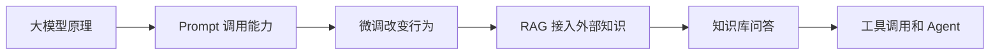
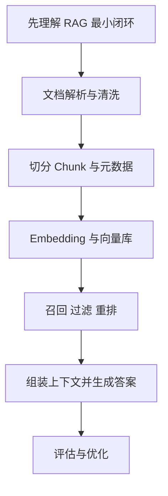
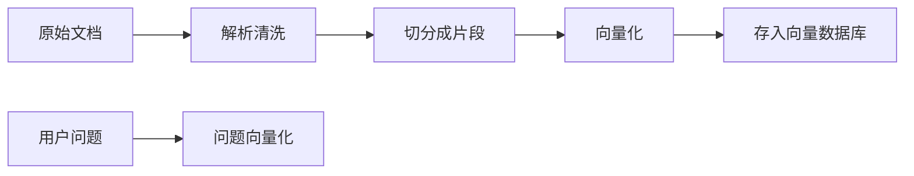
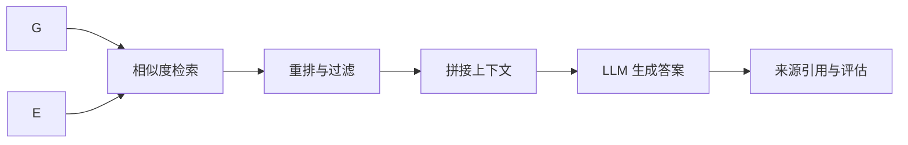

# 学前导读：RAG 这一章到底在学什么

这一章解决的是：当模型知识不够新、不够全、不够贴合你的业务资料时，怎样把外部知识稳定接进回答链路。

RAG 不只是“接一个向量数据库”。它真正训练的是一种大模型应用开发思维：哪些知识应该放进模型参数，哪些知识应该放在外部文档里，用户提问时怎样检索相关资料，又怎样让模型基于资料而不是凭空回答。

## 这一章在整个课程里的位置

你已经在第八 A 阶段学过大模型原理、Prompt、微调和对齐。到第八 B 阶段，课程开始从“理解模型能力”进入“组织应用系统”。RAG 是这条应用主线的第一块关键地基。

如果说 Prompt 是让模型更好地理解任务，微调是调整模型的行为习惯，那么 RAG 更像是给模型接上一个可更新、可追溯、可管理的知识库。



## 这一章真正要解决的问题

这一章要回答五个问题：文档为什么不能直接整篇塞给模型；切分、清洗和元数据为什么会影响检索质量；Embedding 和向量数据库到底在做什么；召回、重排、过滤和上下文拼接怎样影响最终回答；如何判断一个 RAG 系统效果好不好。

新人最容易误解 RAG 的地方，是以为“能检索出来”就等于“回答可靠”。真实情况是，RAG 的效果往往卡在文档质量、切分粒度、召回覆盖、重排准确性、提示组织和答案评估上。

## 新人推荐学习顺序

建议先理解 RAG 的最小闭环：用户提问后，系统先检索资料，再把资料和问题一起交给模型回答。然后学习文档处理和切分，知道知识进入系统前需要清洗、分块和添加元数据。接着学习 Embedding 与向量数据库，理解相似度检索为什么能找到相关片段。最后再看检索优化、重排和评估，因为这些决定了系统能不能从 Demo 走向可用产品。



## 学这一章时要抓住的主线

这一章的主线可以概括为：把“资料”变成“可检索知识”，再把“检索结果”变成“可引用答案”。



前半段重点是把原始资料变成可检索的知识索引；后半段才围绕用户问题进行召回、重排、回答和引用。



看懂这条链路后，你会知道 RAG 项目调优不是只改 prompt。检索不到时要查文档解析、切分和召回；检索到了但答案不对时要查重排、上下文组织和生成提示；答案看似正确但不可验证时要补来源引用和评估样例。

## 这一章和后面章节的关系

RAG 是后面课程问答助手、个人知识库、企业知识库和 Agent 工具调用的基础。模型部署章节会告诉你模型如何稳定被调用，应用开发章节会把 RAG 放进对话、文件上传和 API 里，工程化章节会继续补日志、错误处理、评估和部署。

如果这一章没学稳，后面常见的问题是：知识库 Demo 能跑，但问稍复杂的问题就答非所问；引用来源不稳定；用户问无答案问题时模型硬编；系统不知道是检索失败、模型失败还是文档质量失败。

## 新人和进阶学习者怎么读

新人第一次学这一章时，先抓住主线和最小可运行例子。你不需要一次理解所有细节，只要能说清楚这一章解决什么问题、输入输出是什么、最小项目怎么跑起来，就可以继续往后走。

有经验的学习者可以把这一章当成查漏补缺和工程化练习：关注边界条件、失败案例、评估方式、代码可复现性，以及它和前后阶段的连接。读完后最好能把本章内容沉淀到自己的作品 README 或实验记录里。

## 学习时间与难度建议

| 学习方式 | 建议投入 | 目标 |
|---|---|---|
| 快速浏览 | 20～30 分钟 | 看懂本章解决什么问题，知道后面会用到哪里 |
| 最小通关 | 1～2 小时 | 跑通一个最小例子，完成本章小项目出口 |
| 深入练习 | 半天～1 天 | 补充错误分析、对比实验或项目 README 记录 |

## 本章自测问题

| 自测问题 | 通过标准 |
|---|---|
| 这一章解决什么问题？ | 能用一句话说明它在整门课里的位置 |
| 最小输入输出是什么？ | 能说清楚例子需要什么输入，会产生什么结果 |
| 常见失败点在哪里？ | 能列出至少一个报错、效果差或理解偏差的原因 |
| 学完后能沉淀什么？ | 能把本章产出写进项目 README、实验记录或作品集 |

## 本章小项目出口

学完这一章后，建议做一个最小课程知识库问答。准备 3 到 5 篇课程文档，完成文档读取、切分、向量化、检索、上下文拼接、模型回答和来源展示。项目不需要复杂界面，但必须能展示检索到的片段和答案来源。

最小交付物建议包含：`docs/` 中的 3～5 篇 Markdown 文档，`rag_demo.py` 或 notebook，至少 10 条固定测试问题，检索 top-k 片段打印结果，以及一张“问题 → 命中文档 → 答案是否正确”的评估表。

```python
query = "RAG 为什么需要来源引用？"
for i, chunk in enumerate(top_k_chunks, start=1):
    print(i, chunk["source"], chunk["text"][:80])
```

如果想进一步提升，可以加入一个小评估集，例如 10 个问题，每个问题标注期望命中的文档和理想答案，用来观察切分和检索策略调整前后的变化。

## 过关标准

这一章结束时，你应该能解释 RAG 从文档到答案的完整路径，能说清楚 chunk、embedding、向量数据库、召回、重排、上下文和引用分别在做什么，能判断一个 RAG 效果差大概卡在哪一层。

如果你能做出一个带来源引用、检索片段展示和简单评估样例的最小知识库助手，就达到了进入 LLM 应用开发和 Agent 阶段的基础要求。
