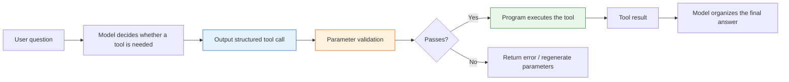

# 8.3.4 Introduction to Function Calling


:::tip Where this section fits
When many beginners first build LLM applications, they treat the model like a “universal text generator.”
But when you move toward real-world systems, you quickly discover:

> **The model not only needs to speak, it also needs to turn tasks into executable actions.**

That is the problem Function Calling is designed to solve.
:::

## Learning objectives

- Understand why natural-language output alone is hard to use reliably for tool calls
- Understand the core concepts of function schema, parameters, and call results
- Understand a minimal function-calling loop
- Know which scenarios are best suited for Function Calling

---

## Beginners first / advanced understanding later

If you are new, focus on one sentence in this section: Function Calling does not make the model actually execute code. Instead, it lets the model first output a structured “call intent,” and then the program checks, executes, and returns the result.

If you have already built LLM applications, you can go further and think about: whether the tool schema is clear enough, whether parameter validation is complete, how to retry or degrade gracefully when a tool fails, and whether call logs are enough for debugging and evaluation.

---

## Why isn’t plain text output enough?

### A common fragile approach

Suppose a user asks:

> “What’s the temperature in Beijing today?”

You ask the model to return a sentence:

> “I suggest calling `get_weather(city='Beijing')`”

This may look usable, but it is actually fragile:

- The format may not be stable
- Parameter names may be wrong
- The city name may be written as “Beijing” or “Beijing”
- It may even output a lot of extra explanation

### What is the real problem?

The problem is not that the model cannot understand the task. The problem is:

> **Natural language is too free-form to serve as a stable program interface.**

Programs prefer:

- Fixed fields
- Clear parameters
- Validatable structure

That is exactly where Function Calling adds value.

---

## What exactly is Function Calling?

### A one-sentence understanding

> **Function Calling = letting the model output a structured tool call instead of arbitrary text.**

It usually includes:

- Which tool to call
- Which parameters to pass

For example:

```json
{
  "name": "get_weather",
  "arguments": {
    "city": "Beijing"
  }
}
```

### Why is this stronger than free text?

Because it is more like a program interface than a chat message.

After the program receives this structure, it can:

- Validate fields
- Execute automatically
- Retry on failure
- Record logs

In other words, Function Calling builds a bridge between the model and the program.

---

## Let’s start with the smallest closed loop

### Define two tools

```python
import ast
import operator

OPS = {
    ast.Add: operator.add,
    ast.Sub: operator.sub,
    ast.Mult: operator.mul,
    ast.Div: operator.truediv,
}


def safe_calculate(expression):
    def visit(node):
        if isinstance(node, ast.Expression):
            return visit(node.body)
        if isinstance(node, ast.Constant) and isinstance(node.value, (int, float)):
            return node.value
        if isinstance(node, ast.BinOp) and type(node.op) in OPS:
            return OPS[type(node.op)](visit(node.left), visit(node.right))
        if isinstance(node, ast.UnaryOp) and isinstance(node.op, ast.USub):
            return -visit(node.operand)
        raise ValueError("unsupported_expression")

    return visit(ast.parse(expression, mode="eval"))


def get_weather(city):
    data = {
        "Beijing": {"temperature": 22, "condition": "sunny"},
        "Shanghai": {"temperature": 25, "condition": "cloudy"}
    }
    return data.get(city, {"error": "city_not_found"})

def calculate(expression):
    return {"result": safe_calculate(expression)}
```

### Define the call structure “output by the model”

```python
tool_call = {
    "name": "get_weather",
    "arguments": {
        "city": "Beijing"
    }
}

print(tool_call)
```

### Actually execute the call

```python
def dispatch(call):
    if call["name"] == "get_weather":
        return get_weather(**call["arguments"])
    if call["name"] == "calculate":
        return calculate(**call["arguments"])
    return {"error": "unknown_tool"}

tool_call = {
    "name": "get_weather",
    "arguments": {"city": "Beijing"}
}

result = dispatch(tool_call)
print(result)
```

This is the smallest version of a function-calling loop:

1. Recognize the task
2. Produce a structured call
3. Let the program execute it
4. Get the result

---

## What is a schema?

### You can think of a schema as a “tool manual”

To call a tool correctly, the model needs to know:

- What the tool is called
- What each parameter is called
- What type each parameter is
- Whether a parameter is required

That is what a schema does.

### A simple schema example

```python
weather_schema = {
    "name": "get_weather",
    "description": "Query the weather for a specified city",
    "parameters": {
        "city": {
            "type": "string",
            "description": "English city name, for example Beijing"
        }
    },
    "required": ["city"]
}

print(weather_schema)
```

A schema is not “decorative text.” It tells the model and the program:

> This is how the tool is allowed to be called.

---

## Why is parameter validation important?

### The model may not always produce the right parameters

Even if the model picks the right tool, it may still:

- Miss fields
- Use the wrong type
- Produce invalid parameter values

For example:

```python
bad_call = {
    "name": "get_weather",
    "arguments": {"city_name": "Beijing"}
}
```

If your program does not validate, it will fail directly during execution.

### A minimal validation example

```python
def validate_weather_call(call):
    if call.get("name") != "get_weather":
        return False, "wrong_tool"

    args = call.get("arguments", {})
    if "city" not in args:
        return False, "missing_city"
    if not isinstance(args["city"], str):
        return False, "city_must_be_string"

    return True, "ok"

good_call = {"name": "get_weather", "arguments": {"city": "Beijing"}}
bad_call = {"name": "get_weather", "arguments": {"city_name": "Beijing"}}

print(validate_weather_call(good_call))
print(validate_weather_call(bad_call))
```

---

## A more complete teaching example: weather and calculator

### First simulate how the model decides which tool to call

Here we do not use a real LLM yet. Instead, we write a rule-based teaching function so you can clearly see the “tool-call structure.”

```python
def mock_llm_tool_selector(user_query):
    if "weather" in user_query:
        city = "Beijing" if "Beijing" in user_query else "Shanghai"
        return {
            "name": "get_weather",
            "arguments": {"city": city}
        }

    if "calculate" in user_query:
        expression = user_query.replace("calculate", "").strip()
        return {
            "name": "calculate",
            "arguments": {"expression": expression}
        }

    return None
```

### Then connect the executor

```python
import ast
import operator

OPS = {
    ast.Add: operator.add,
    ast.Sub: operator.sub,
    ast.Mult: operator.mul,
    ast.Div: operator.truediv,
}


def safe_calculate(expression):
    def visit(node):
        if isinstance(node, ast.Expression):
            return visit(node.body)
        if isinstance(node, ast.Constant) and isinstance(node.value, (int, float)):
            return node.value
        if isinstance(node, ast.BinOp) and type(node.op) in OPS:
            return OPS[type(node.op)](visit(node.left), visit(node.right))
        if isinstance(node, ast.UnaryOp) and isinstance(node.op, ast.USub):
            return -visit(node.operand)
        raise ValueError("unsupported_expression")

    return visit(ast.parse(expression, mode="eval"))


def get_weather(city):
    data = {
        "Beijing": {"temperature": 22, "condition": "sunny"},
        "Shanghai": {"temperature": 25, "condition": "cloudy"}
    }
    return data.get(city, {"error": "city_not_found"})

def calculate(expression):
    return {"result": safe_calculate(expression)}

def dispatch(call):
    if call["name"] == "get_weather":
        return get_weather(**call["arguments"])
    if call["name"] == "calculate":
        return calculate(**call["arguments"])
    return {"error": "unknown_tool"}

queries = [
    "What is the weather like in Beijing today",
    "calculate 3 * (4 + 5)"
]

for q in queries:
    call = mock_llm_tool_selector(q)
    result = dispatch(call)
    print("User query:", q)
    print("Tool call:", call)
    print("Execution result:", result)
    print("-" * 40)
```

This example is already very close to the skeleton of a real system.

---

## What tasks is Function Calling best for?

### Especially suitable for

- Checking weather
- Querying a knowledge base
- Querying a database
- Mathematical calculation
- Calling a search API
- Submitting a support ticket

In other words:

> **The model decides “what to do,” and the program actually performs it.**

### Less suitable for

If the task is essentially just:

- Writing marketing copy
- Open-ended generation
- Pure conversational companionship

Then Function Calling may not be necessary.

---

## If your goal is to build a “knowledge-base-driven courseware generation assistant,” what should the minimal tool set look like?

When building this kind of project for the first time, you do not need dozens of tools right away.
A more stable minimal tool set usually needs only four:

1. `retrieve_internal_docs(topic)`
   Search the internal knowledge base

2. `retrieve_external_docs(topic)`
   Supplement with external materials

3. `build_courseware_schema(materials)`
   Organize materials into a fixed structure

4. `export_word(schema)`
   Fill a template and export Word

You can think of it like this:

- The model does not write Word files directly
- The model decides which step should be called next

A very small tool definition example can be written like this:

```python
tools = [
    {
        "name": "retrieve_internal_docs",
        "description": "Search internal knowledge base materials by topic",
        "parameters": {"topic": {"type": "string"}},
    },
    {
        "name": "export_word",
        "description": "Export structured courseware content to a Word document",
        "parameters": {"title": {"type": "string"}, "sections": {"type": "array"}},
    },
]

print(tools)
```

## The most common engineering problems

### Choosing the wrong tool

For example, the task should have searched the knowledge base, but the model called the calculator instead.

### Unstable parameters

For example:

- `city`
- `city_name`
- `location`

The model may mix these up.

### Tool execution failure

Even if the tool-call structure is correct, the tool may still fail because:

- The API times out
- The parameters are invalid
- The city does not exist

This means:

> Function Calling does not mean “everything is fine once the model can call tools.” You still need engineering safeguards afterward.

---

## Common mistakes beginners make

### Treating Function Calling as “the model directly executes code”

No.
The model only produces a structured call intent. Your program performs the actual execution.

### Writing tool schemas that are too vague

If the tool description is unclear and the parameter definitions are unclear, the model is more likely to call the wrong tool.

### Not validating parameters

Once this goes into production, this is a dangerous habit.

---

## Before the summary, take a look at the engineering loop of Function Calling



This loop matters because it reminds you: the hard part of Function Calling is not “can the model say the function name,” but whether the model, schema, validation, executor, and error handling can form a stable system.


:::tip Reading guide
The model is only responsible for proposing the tool call. The program is responsible for validation, execution, and fallback. When reading the diagram, focus on the gates of schema, arguments validation, dispatcher, and retry/error handling.
:::

## Learning loop for this section

| Layer | What you should be able to do |
|---|---|
| Intuition | Explain why free text is not suitable as a direct program interface |
| Code | Write a minimal tool call, dispatch, and parameter validation function |
| Engineering | Explain what schema, validation, error handling, and logging are each responsible for |
| Future connection | Understand why Function Calling is the prerequisite for Agent tool use |

---

## Summary

The most important thing in this section is not memorizing the two fields `name` and `arguments`, but understanding the essence:

> **Function Calling connects the model’s natural language understanding ability to the program’s structured execution ability.**

Once you understand this, the next topics—Agent, tool strategies, and multi-tool collaboration—will make much more sense.

---

## Exercises

1. Add another tool to the example in this section, such as `search_docs(keyword)`.
2. Write a parameter validation function for `calculate` to prevent dangerous expressions.
3. Think about this: if the model keeps incorrectly routing “Beijing weather” to `calculate`, what would you fix first—prompt, schema, or executor?
4. Explain in your own words: why is Function Calling more stable than “making the model directly return a command string”?
