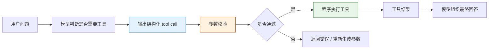

# Function Calling 初识


:::tip 本节定位
很多新人第一次做 LLM 应用时，会把模型当成“万能文本生成器”。  
但真正走向实用系统时，你很快会发现：

> **模型不只要会说，还得会把任务转成可执行动作。**

这就是 Function Calling 要解决的问题。
:::

## 学习目标

- 理解为什么仅靠自然语言输出很难稳定调用工具
- 理解函数 schema、参数、调用结果这几个核心概念
- 看懂一个最小的函数调用闭环
- 知道 Function Calling 最适合什么场景

---

## 新人先掌握 / 进阶再理解

如果你是新人，这一节先抓一句话：Function Calling 不是让模型真的去执行代码，而是让模型先输出一份结构化“调用意图”，再由程序检查、执行和返回结果。

如果你已经做过 LLM 应用，可以进一步关注：工具 schema 是否足够清楚，参数校验是否完整，工具失败后怎么重试或降级，调用日志是否能支撑调试和评估。

---

## 一、为什么纯文本输出不够？

### 1.1 一个常见的脆弱做法

假设用户问：

> “北京今天多少度？”

你让模型返回一句话：

> “我建议调用 `get_weather(city='Beijing')`”

这看起来像能用，但其实很脆：

- 格式可能不稳定
- 参数名可能乱写
- 城市名可能写成“北京”或“Beijing”
- 甚至可能多输出一堆解释

### 1.2 真正的问题是什么？

问题不在于模型不会理解任务，而在于：

> **自然语言太自由，不适合做稳定的程序接口。**

程序更喜欢的是：

- 固定字段
- 明确参数
- 可校验结构

这正是 Function Calling 的价值。

---

## 二、Function Calling 到底是什么？

### 2.1 一句话理解

> **Function Calling = 让模型输出结构化工具调用，而不是随意文本。**

它通常包括：

- 调哪个工具
- 传哪些参数

例如：

```json
{
  "name": "get_weather",
  "arguments": {
    "city": "Beijing"
  }
}
```

### 2.2 这比自由文本强在哪？

因为它更像程序接口，而不是聊天内容。

程序拿到这个结构后，可以：

- 校验字段
- 自动执行
- 失败重试
- 记录日志

也就是说，Function Calling 是在给模型和程序之间搭桥。

---

## 三、先看一个最小闭环

### 3.1 定义两个工具

```python
def get_weather(city):
    data = {
        "Beijing": {"temperature": 22, "condition": "sunny"},
        "Shanghai": {"temperature": 25, "condition": "cloudy"}
    }
    return data.get(city, {"error": "city_not_found"})

def calculate(expression):
    return {"result": eval(expression, {"__builtins__": {}})}
```

### 3.2 定义“模型输出”的调用结构

```python
tool_call = {
    "name": "get_weather",
    "arguments": {
        "city": "Beijing"
    }
}

print(tool_call)
```

### 3.3 真正执行这个调用

```python
def dispatch(call):
    if call["name"] == "get_weather":
        return get_weather(**call["arguments"])
    if call["name"] == "calculate":
        return calculate(**call["arguments"])
    return {"error": "unknown_tool"}

tool_call = {
    "name": "get_weather",
    "arguments": {"city": "Beijing"}
}

result = dispatch(tool_call)
print(result)
```

这就是函数调用闭环的最小版本：

1. 识别任务
2. 产出结构化调用
3. 程序执行
4. 拿到结果

---

## 四、Schema 是什么？

### 4.1 Schema 可以理解成“工具说明书”

模型要正确调用工具，必须知道：

- 工具叫什么
- 每个参数叫什么
- 参数是什么类型
- 参数是不是必须传

这就是 schema 的作用。

### 4.2 一个简单 schema 示例

```python
weather_schema = {
    "name": "get_weather",
    "description": "查询指定城市天气",
    "parameters": {
        "city": {
            "type": "string",
            "description": "城市英文名，例如 Beijing"
        }
    },
    "required": ["city"]
}

print(weather_schema)
```

schema 不是“装饰文案”，而是在告诉模型和程序：

> 这个工具允许怎样被调用。

---

## 五、为什么参数校验很重要？

### 5.1 模型不一定总能给对参数

就算模型选对了工具，也可能：

- 漏字段
- 类型不对
- 参数值无效

例如：

```python
bad_call = {
    "name": "get_weather",
    "arguments": {"city_name": "Beijing"}
}
```

如果你的程序不校验，就会在执行阶段直接炸掉。

### 5.2 一个最小校验示例

```python
def validate_weather_call(call):
    if call.get("name") != "get_weather":
        return False, "wrong_tool"

    args = call.get("arguments", {})
    if "city" not in args:
        return False, "missing_city"
    if not isinstance(args["city"], str):
        return False, "city_must_be_string"

    return True, "ok"

good_call = {"name": "get_weather", "arguments": {"city": "Beijing"}}
bad_call = {"name": "get_weather", "arguments": {"city_name": "Beijing"}}

print(validate_weather_call(good_call))
print(validate_weather_call(bad_call))
```

---

## 六、一个更完整的教学例子：问天气和计算器

### 6.1 先模拟“模型决定调用哪个工具”

这里不用真实大模型，我们先写一个教学版规则函数，重点是让你看清“工具调用结构”。

```python
def mock_llm_tool_selector(user_query):
    if "天气" in user_query:
        city = "Beijing" if "北京" in user_query else "Shanghai"
        return {
            "name": "get_weather",
            "arguments": {"city": city}
        }

    if "计算" in user_query:
        expression = user_query.replace("计算", "").strip()
        return {
            "name": "calculate",
            "arguments": {"expression": expression}
        }

    return None
```

### 6.2 再接上执行器

```python
def get_weather(city):
    data = {
        "Beijing": {"temperature": 22, "condition": "sunny"},
        "Shanghai": {"temperature": 25, "condition": "cloudy"}
    }
    return data.get(city, {"error": "city_not_found"})

def calculate(expression):
    return {"result": eval(expression, {"__builtins__": {}})}

def dispatch(call):
    if call["name"] == "get_weather":
        return get_weather(**call["arguments"])
    if call["name"] == "calculate":
        return calculate(**call["arguments"])
    return {"error": "unknown_tool"}

queries = [
    "北京今天天气怎么样",
    "计算 3 * (4 + 5)"
]

for q in queries:
    call = mock_llm_tool_selector(q)
    result = dispatch(call)
    print("用户问题:", q)
    print("工具调用:", call)
    print("执行结果:", result)
    print("-" * 40)
```

这个例子已经非常接近真实系统的骨架了。

---

## 七、Function Calling 最适合什么任务？

### 7.1 特别适合

- 查天气
- 查知识库
- 查数据库
- 数学计算
- 调搜索接口
- 提交工单

也就是：

> **模型负责决定“做什么”，程序负责真正执行。**

### 7.2 不太适合

如果任务本质上只是：

- 写一段文案
- 做开放生成
- 纯聊天陪伴

那未必一定要用 Function Calling。

---

## 八、如果你的目标是做“知识库驱动的课件生成助手”，最小工具集应该长什么样？

这类项目第一次做时，不需要一上来就几十个工具。  
更稳的最小工具集通常只要 4 个：

1. `retrieve_internal_docs(topic)`  
   查内部知识库

2. `retrieve_external_docs(topic)`  
   补外部资料

3. `build_courseware_schema(materials)`  
   把资料整理成固定结构

4. `export_word(schema)`  
   套模板并导出 Word

你可以先把它想成：

- 模型不是直接写 Word
- 模型是在决定“下一步该调用哪一个环节”

一个很小的工具定义示例可以先写成：

```python
tools = [
    {
        "name": "retrieve_internal_docs",
        "description": "按主题检索内部知识库资料",
        "parameters": {"topic": {"type": "string"}},
    },
    {
        "name": "export_word",
        "description": "把结构化课件内容导出为 Word 文档",
        "parameters": {"title": {"type": "string"}, "sections": {"type": "array"}},
    },
]

print(tools)
```

## 九、最常见的工程问题

### 9.1 选错工具

比如本来该查知识库，结果去调计算器。

### 9.2 参数不稳定

例如：

- `city`
- `city_name`
- `location`

模型可能混着来。

### 9.3 工具执行失败

即使工具调用结构正确，也可能：

- API 超时
- 参数非法
- 城市不存在

这说明：

> Function Calling 不是“模型会调工具了就万事大吉”，后面还必须有工程兜底。

---

## 十、初学者最常踩的坑

### 10.1 把 Function Calling 当成“模型直接执行代码”

不是。  
模型只是产出结构化调用意图，真正执行的是你的程序。

### 10.2 工具 schema 写得太模糊

如果工具说明不清、参数定义不清，模型更容易调错。

### 10.3 不做参数校验

只要进了线上，这是很危险的习惯。

---

## 小结前先看一眼：Function Calling 的工程闭环



这个闭环很重要，因为它提醒你：Function Calling 的难点不是“模型能不能说出函数名”，而是模型、schema、校验、执行器和错误处理能不能组成稳定系统。


:::tip 读图提示
模型只负责提出 tool call，程序才负责校验、执行和兜底。看图时重点盯住 schema、arguments validation、dispatcher 和 retry/error handling 这几道闸门。
:::

## 这一节的学习闭环

| 层次 | 你应该能做到什么 |
|---|---|
| 直觉 | 能解释为什么自由文本不适合直接当程序接口 |
| 代码 | 能写出一个最小 tool call、dispatch 和参数校验函数 |
| 工程 | 能说明 schema、校验、错误处理和日志各自负责什么 |
| 后续连接 | 能理解 Function Calling 为什么是 Agent 工具调用的前置基础 |

---

## 小结

这一节最重要的不是记住 `name` 和 `arguments` 这两个字段，而是抓住这个本质：

> **Function Calling 是把模型的自然语言理解能力，接到程序的结构化执行能力上。**

理解了这一点，后面你再学 Agent、工具策略、多工具协作，就会顺很多。

---

## 练习

1. 给本节示例再加一个工具，比如 `search_docs(keyword)`。
2. 为 `calculate` 写一个参数校验函数，防止危险表达式。
3. 想一想：如果模型老是把“北京天气”错误路由到 `calculate`，你会先改 prompt、schema 还是执行器？
4. 用自己的话解释：Function Calling 为什么比“让模型直接返回一段命令文本”更稳？
