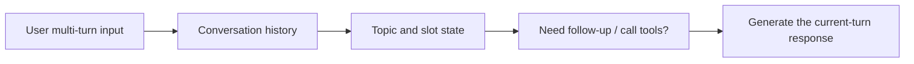

# 8.3.6 Dialog Systems and Multi-turn Management

:::tip Section Focus
When many people build a chat app, their first instinct is:

- keep a `history`
- send the history to the model together

This can make the most basic demo, but it is still far from a truly usable dialog system.

The key goal of this section is to break down what “multi-turn conversation” really means.
:::

## Learning Objectives

- Understand the core difference between single-turn Q&A and multi-turn dialog systems
- Understand basic concepts such as session state, context window, and clarification questions
- Read a minimal multi-turn dialog manager
- Understand why the key to a dialog system is not just remembering history, but managing state

---

## First, Build a Map

For beginners, the best way to understand multi-turn conversation is not “just stuff all the history in,” but to first see clearly:



So what this section really wants to solve is:

- Why multi-turn systems are harder than single-turn Q&A
- Why “having history” does not mean “having state”

### A Better Analogy for Beginners

You can think of a multi-turn dialog system as:

- A customer service agent chatting with a user continuously

The user will not repeat all the background in every turn.
So the agent must remember:

- What topic is being discussed now
- Which key pieces of information are already known
- Which information is still missing

If you only pile the chat logs beside the model without truly organizing the state,
the agent will still easily get confused.

## Why Is Multi-turn Conversation Much Harder Than Single-turn Q&A?

### Single-turn Q&A Is More Like “One Question, One Answer”

For example:

- The user asks one question
- The system gives one reply

Such systems can work even without long-term state.

### What Makes Multi-turn Conversation Truly Hard?

Because later turns often omit information:

1. “What is the refund policy?”
2. “Then can I still get a refund if I’ve already completed 30%?”

The “Then” in the second sentence implicitly inherits the topic from the first turn.
If the system does not remember the previous context, it will not understand fully.

So the real difficulty of multi-turn conversation is not “there are more messages,” but:

> **context dependence and state continuation.**

---

## What Does a Dialog System Usually Need to Manage?

At a minimum, it usually needs to manage:

- conversation history
- current topic
- user clarification information
- whether a follow-up question is needed

In other words, a dialog system does not just “generate answers”; it also manages:

> **What state is this conversation currently in?**

---

## A Minimal Dialog Manager Example

```python
def new_session():
    return {
        "history": [],
        "topic": None
    }

def add_turn(session, role, content):
    session["history"].append({"role": role, "content": content})

session = new_session()
add_turn(session, "user", "What is the refund policy?")
add_turn(session, "assistant", "Do you want the time range, or the eligibility conditions?")

print(session)
```

Expected output:

```text
{'history': [{'role': 'user', 'content': 'What is the refund policy?'}, {'role': 'assistant', 'content': 'Do you want the time range, or the eligibility conditions?'}], 'topic': None}
```

### Although This Code Is Very Small, What Is It Teaching?

It teaches you that:

- dialog systems naturally have state
- state at least includes history and the current topic

This is the first step from “a one-off model call” to “a dialog system.”

### Another Minimal “State Flow” Example

```python
state = {
    "topic": "refund",
    "slots": {"progress": None},
}

user_message = "Can I still get a refund if I’ve already completed 30%?"

if "30%" in user_message:
    state["slots"]["progress"] = "30%"

print(state)
```

Expected output:

```text
{'topic': 'refund', 'slots': {'progress': '30%'}}
```

This example is very suitable for beginners because it helps you see:

- what a dialog system really needs to keep is not just the raw words
- it also includes structured state


:::tip Reading the Diagram
History is the raw material, while state is the system’s current understanding. In the diagram, topic, slots, last_tool_result, and summary are separated to avoid blindly stuffing all context into the prompt.
:::

---

## A Dialog System Must Not Only Answer, but Also Ask Follow-up Questions

### Why Is Follow-up Questioning So Important?

Because user inputs are often incomplete.

For example:

- “Help me check the weather”

At this point, if the system randomly guesses a city, the experience is usually worse.
A more reasonable approach is:

> **First fill in the missing information.**

### A Minimal Follow-up Example

```python
def dialog_step(session, user_message):
    add_turn(session, "user", user_message)

    if "weather" in user_message and "Beijing" not in user_message and "Shanghai" not in user_message:
        reply = "Which city’s weather would you like to check?"
        add_turn(session, "assistant", reply)
        return reply

    reply = f"The system is processing: {user_message}"
    add_turn(session, "assistant", reply)
    return reply

session = new_session()
print(dialog_step(session, "Help me check the weather"))
print(session["history"])
```

Expected output:

```text
Which city’s weather would you like to check?
[{'role': 'user', 'content': 'Help me check the weather'}, {'role': 'assistant', 'content': 'Which city’s weather would you like to check?'}]
```

This already demonstrates a very important capability:

> A dialog system does not just answer; it also manages information gaps.

### Why Is Follow-up Actually a Sign of a More Stable System?

Many beginners mistakenly think:

- the fewer follow-up questions a system asks, the smarter it is

But in real products, it is often the opposite:

- ask follow-up questions first to complete the conditions
- this is often more reliable than guessing blindly

---

## Why Isn’t “Just Put the Entire History into the Model” Enough?

### What Happens When History Becomes Too Long?

- token cost increases
- response becomes slower
- irrelevant information keeps piling up

### So What Do Real Systems Usually Do?

For example:

- keep only the most recent N turns
- store the current topic separately as state
- summarize earlier history

In other words, multi-turn management is not just “having history,” but:

> **deciding which history is useful to keep.**

---

## Hands-on: Keep Recent Turns and Compact Old History

The following small exercise simulates a common production pattern: keep the most recent turns as raw messages, and compress older turns into a short summary.

```python
def compact_history(history, keep_last=2):
    older = history[:-keep_last]
    recent = history[-keep_last:]

    if older:
        summary = " | ".join(f"{turn['role']}: {turn['content']}" for turn in older)
    else:
        summary = None

    return {
        "summary": summary,
        "recent": recent
    }


history = [
    {"role": "user", "content": "What is the refund policy?"},
    {"role": "assistant", "content": "Refunds are available within 7 days if progress is below 20%."},
    {"role": "user", "content": "What if I have completed 30%?"},
    {"role": "assistant", "content": "Then you usually do not qualify."},
]

memory_view = compact_history(history, keep_last=2)
print(memory_view)
```

Expected output:

```text
{'summary': 'user: What is the refund policy? | assistant: Refunds are available within 7 days if progress is below 20%.', 'recent': [{'role': 'user', 'content': 'What if I have completed 30%?'}, {'role': 'assistant', 'content': 'Then you usually do not qualify.'}]}
```


This is still a toy example, but it teaches a serious engineering habit: do not let the prompt grow forever. Keep fresh turns precisely, and summarize older context deliberately.

---

## A Slightly More Complete Multi-turn Example

```python
def dialog_reply(session, user_message):
    add_turn(session, "user", user_message)

    if "refund" in user_message:
        session["topic"] = "refund"
        reply = "The refund policy is: refunds are available within 7 days of purchase and if learning progress is below 20%. Do you want the time limit, or do you want to see whether you qualify?"

    elif "30%" in user_message and session["topic"] == "refund":
        reply = "If your learning progress is 30%, you usually do not meet the refund conditions."

    else:
        reply = "I can continue helping you with the current topic."

    add_turn(session, "assistant", reply)
    return reply

session = new_session()
print(dialog_reply(session, "What is the refund policy?"))
print(dialog_reply(session, "What if I’ve already completed 30%?"))
print(session)
```

Expected output:

```text
The refund policy is: refunds are available within 7 days of purchase and if learning progress is below 20%. Do you want the time limit, or do you want to see whether you qualify?
If your learning progress is 30%, you usually do not meet the refund conditions.
{'history': [{'role': 'user', 'content': 'What is the refund policy?'}, {'role': 'assistant', 'content': 'The refund policy is: refunds are available within 7 days of purchase and if learning progress is below 20%. Do you want the time limit, or do you want to see whether you qualify?'}, {'role': 'user', 'content': 'What if I’ve already completed 30%?'}, {'role': 'assistant', 'content': 'If your learning progress is 30%, you usually do not meet the refund conditions.'}], 'topic': 'refund'}
```

### What Does This Example Really Add Compared with Ordinary Q&A?

The key addition is not a stronger model, but:

- topic tracking
- context inheritance

In other words:

> The core of a dialog system often starts with state design.

### A Useful State Table for Beginners

| State type | What it records |
|---|---|
| history | What has been said before |
| topic | What is being discussed now |
| slot | Which key pieces of information are still missing for the current task |
| tool state | Whether a tool has been called and whether the result has been received |

This table is especially useful for beginners because it breaks the complexity of multi-turn conversation into several clear boxes.

---

## Common Types of State in Dialog Systems

### Topic State

What exactly is being discussed right now.

### Slot State

Which key pieces of information are already known and which are still missing.

For example, in a weather system:

- city known / unknown
- date known / unknown

### Tool State

Which tools have been called and which results have been obtained.

This is especially important in Agent-style dialog.

## If Your Goal Is a “Knowledge-base-driven Lesson Material Generation Assistant,” Which Slots Should You Maintain Most Carefully?

The biggest difference between this kind of project and ordinary chat is:

- users often do not give all requirements at once

For example, the user may first say:

- “Help me make a Word course handout for discount word problems”

Later they add:

- “For upper elementary school”
- “Need 3 practice questions”
- “Style should be more like classroom explanation”

So for a first version, it is very suitable to define the slots like this:

| Slot | What it records |
|---|---|
| `topic` | Course material topic |
| `audience` | Target audience / grade |
| `doc_format` | Word / PPT |
| `style` | Classroom explanation / outline-style / handout-style |
| `exercise_count` | Number of practice questions |

A minimal state object can be written like this:

```python
state = {
    "topic": "discount word problems",
    "audience": None,
    "doc_format": "word",
    "style": None,
    "exercise_count": None,
}

print(state)
```

Expected output:

```text
{'topic': 'discount word problems', 'audience': None, 'doc_format': 'word', 'style': None, 'exercise_count': None}
```

The most important value of this example is:

- to help beginners first understand what multi-turn conversation is actually filling in for a project

## A Minimal Follow-up Example That Feels Closer to a Real Project

```python
def next_question(state):
    if not state["audience"]:
        return "Which grade level or audience is this course material for?"
    if not state["style"]:
        return "Would you like it to be more like classroom explanation or outline-style notes?"
    if not state["exercise_count"]:
        return "How many practice questions would you like at the end?"
    return "The information is fairly complete, and we can start generating the course outline."


state = {
    "topic": "discount word problems",
    "audience": None,
    "doc_format": "word",
    "style": None,
    "exercise_count": None,
}

print(next_question(state))
state["audience"] = "upper elementary school"
print(next_question(state))
```

Expected output:

```text
Which grade level or audience is this course material for?
Would you like it to be more like classroom explanation or outline-style notes?
```

This helps beginners build a very important intuition:

- a dialog system is not designed to “chat a few more lines”
- it is designed to gradually fill in the parameters needed for the generation task

## The Safest Order for Beginners Building a Dialog System for the First Time

A more stable sequence is usually:

1. Build single-turn Q&A first
2. Add topic state next
3. Add follow-up logic next
4. Finally add tool state and more complex memory

If you try to implement all states at once from the start, things usually become messy.

## What Is Most Worth Showing If You Turn It Into a Project?

What is usually most worth showing is not:

- a long chain of chat screenshots

But rather:

1. one turn of conversation with context inheritance
2. how the topic state changes
3. how slots get filled in
4. when the system chooses to ask a follow-up question
5. when the system continues answering

This makes it much easier for others to see:

- that you built a multi-turn system
- not just a history string pasted into the model

---

## Why Does Multi-turn Conversation So Easily Go Off Track?

Because it is easily affected by:

- leftover topic from the previous turn
- overly long history
- incomplete user expressions
- lack of explicit state recording

So you will find that:

> When building a dialog system, “state management” is often more important than “how pretty the reply sounds.”

---

## Common Pitfalls for Beginners

### Only Maintain `history`, but Not Structured State

The system will become harder and harder to control.

### Guess Blindly When Something Is Unclear

In many cases, a follow-up question is better than a random answer.

### Let History Grow Without Limit

Both cost and noise will increase.

---

## Evidence to Keep

Keep this page's proof of learning as a small evidence card:

```text
request: input, state, tools/context, and expected output contract
validated_output: parser/schema or business-rule check result
trace: model call, tool/function call, document parse, or dialogue state
failure_check: invalid format, missing field, stale state, or wrong tool
next_action: prompt, schema, state, API, or parsing improvement
```

## Summary

The most important thing in this section is not building a function that “can chat,” but understanding:

> **The core of a dialog system is managing multi-turn state, not just generating multi-turn text.**

Once you truly understand this difference, it will be much smoother when you later learn intelligent assistants, Agent conversations, and memory systems.

## What You Should Take Away from This Section

- The essence of a dialog system is first and foremost state management
- History, topic, slots, and tool state can all be important
- It is more stable to first build simple state well, and then expand gradually, than to start with a “big memory system”

---

## Exercises

1. Add a new “certificate” topic state to the examples in this section.
2. Design a `slot state` for a weather query task, such as city and date.
3. Think about why “asking a follow-up question” is often a better dialog strategy than “guessing blindly.”
4. Explain in your own words why the core of multi-turn conversation is state management, not history concatenation.
