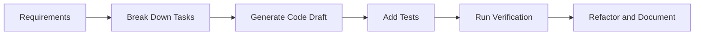

# AI-Assisted Programming with Large Models

:::tip Section Overview
AI-assisted programming does not mean “let the model write all the code for you.” It means putting the model into your development workflow: helping you understand code, generate drafts, add tests, find bugs, and suggest refactoring. What really matters is how you verify it.
:::

## Learning Objectives

- Know which programming tasks large models are good at assisting with
- Be able to write clearer code generation and debugging Prompts
- Understand why tests, diffs, and code review are still essential
- Be able to record the AI coding process in a project README or development log

---

## What AI-Assisted Programming Is Good For



Large models are good at generating boilerplate code, explaining unfamiliar APIs, rewriting functions, generating test cases, summarizing error logs, and suggesting refactoring directions. They are not good at guaranteeing that code is correct, and they may not fully understand your project context, implicit constraints, or production risks.


:::tip Reading Guide
Treat the model as a “draft generator,” not a “final approver.” An AI-generated piece of code should go through requirement checks, diff review, testing, real examples, and human review before it is ready to enter the project.
:::

## 1. Ask the Model to Restate Constraints Before Writing Code

Instead of directly saying “help me write a RAG system,” it is better to provide the input, output, dependencies, boundaries, and acceptance criteria.

```text
Please write a Python function that takes Markdown text as input and returns a list of chunks split by headings.
Requirements:
1. Preserve heading hierarchy;
2. Each chunk must be no more than 800 Chinese characters;
3. Do not use external libraries;
4. Provide 3 test cases.
```

This kind of Prompt is much more stable than a vague request, because the model knows what counts as done.

## 2. You Must Verify Generated Code

After AI generates code, do at least three things: read the diff, run tests, and run a real example. Do not merge code just because it looks correct.

```bash
python -m pytest
python demo.py
```

If the project does not have tests yet, you can first ask the model to add minimal tests. Tests should cover normal inputs, boundary inputs, and error inputs.

## 3. Provide Full Context When Debugging

A good debugging Prompt should include: the error log, related code, the behavior you expect, the actual behavior, and what you have already tried. If you only paste a single error message, the model can usually only guess.

```text
Here are the error message, the function code, and the test input. Please first identify the most likely cause, then give the smallest possible fix. Do not rewrite the whole file.
```

Requiring the “smallest possible fix” is important. It helps prevent the model from changing clear code into a different style entirely.

## 4. AI Code Review Checklist

| Check Item | Question |
|---|---|
| Correctness | Does it cover the requirements and boundary conditions? |
| Security | Does it handle paths, permissions, secrets, and external input properly? |
| Maintainability | Are naming, structure, and duplicated code reasonable? |
| Dependencies | Does it introduce unnecessary new libraries? |
| Testing | Is there runnable test coverage proving the behavior? |

## 5. What Is Worth Recording in Your Portfolio

If you use AI-assisted programming in a project, you can record: the key Prompt you gave the model, the problems in the model’s first output, how you tested and fixed it, and how the final code differs from the first draft. This shows engineering ability much better than simply saying “I used AI.”

## Common Mistakes

The first mistake is treating AI output as an authoritative answer. The second mistake is not providing project context, which leads the model to generate code that is incompatible with the existing architecture. The third mistake is not checking the diff and accepting anything that runs. The fourth mistake is asking the model to change too many files at once, which makes it hard to locate the problem.

## Exercises

1. Ask the model to generate 3 pytest tests for an existing function, then manually check whether they cover boundary cases.
2. Give the model an error log and ask it to make only the smallest possible fix.
3. Compare the code quality difference between a “vague Prompt” and a “Prompt with acceptance criteria.”
4. Write a README section explaining how you used AI to help complete the project while still performing verification.

## Passing Criteria

After studying this section, you should be able to treat AI as a development assistant rather than a replacement for developers, write programming Prompts with constraints and acceptance criteria, verify outputs through testing and code review, and turn the AI collaboration process into engineering notes that can be reviewed later.
