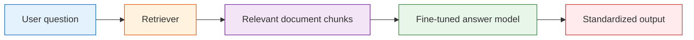

# Project: Integrated RAG + Fine-tuning System

:::tip Section overview
So far, you have learned them separately:

- RAG: let the model look up information before answering
- Fine-tuning: make the model better fit a certain task or style

This section solves this question:

> **If a domain system needs both external knowledge and a specific response style plus task capability, what should we do?**

At this point, RAG and fine-tuning are usually not a replacement relationship, but a combination relationship.
:::

## Learning objectives

- Understand why “only doing RAG” or “only doing fine-tuning” is sometimes not enough
- Learn how to split a domain Q&A system into a RAG layer and a fine-tuning layer
- Design an explainable RAG + fine-tuning project plan
- Run a minimal combined project scaffold

---

## 1. Why combine RAG and fine-tuning?

### 1.1 The strengths and limitations of RAG alone

The advantages of RAG:

- Knowledge can be updated
- Sources can be cited
- No need to retrain the model

But it also has limitations:

- The model may not understand your domain language
- Even if it retrieves the right content, it may not answer in the required business format
- For complex tasks, the model’s “answering habits” may not be stable enough

### 1.2 The strengths and limitations of fine-tuning alone

The advantages of fine-tuning:

- It can make the model better understand specific task formats
- Output style becomes more stable
- Instruction following fits business needs better

But it also has limitations:

- New knowledge is not updated as flexibly
- It is hard to make the model memorize all detailed documents through fine-tuning alone
- The cost is higher

### 1.3 So they are often complementary

You can remember this in one sentence:

> **RAG adds knowledge, fine-tuning adds behavior.**

That is the core logic of a combined system.


:::tip Reading guide
Look at the left side for RAG: knowledge updates, source citations, external documents. Look at the right side for fine-tuning: response style, stable formatting, business wording. When the responsibilities are clearly separated, the system becomes easier to evaluate and maintain.
:::

---

## 2. What is this project actually doing?

We define the goal as a domain Q&A assistant, for example:

- For internal company policy documents
- Answers must reliably cite sources
- Output format must be standardized
- Some questions need to be answered with fixed business wording

In other words, this system needs to:

- Find the knowledge
- And answer like a domain system should

---

## 3. First draw the system structure



### 3.2 What really matters in this diagram

It is not that “there are many components,” but that the responsibilities are clear:

- The retriever is responsible for finding information
- The fine-tuned model is responsible for organizing the answer in a business-friendly way

This makes the system more explainable and easier to iterate on.

---

## 4. A minimal knowledge base and retriever

```python
from sklearn.feature_extraction.text import TfidfVectorizer
from sklearn.metrics.pairwise import cosine_similarity

kb = [
    {"id": "doc1", "text": "Refund policy: Refunds are available within 7 days of purchase if learning progress is below 20%."},
    {"id": "doc2", "text": "Certificate policy: A certificate is issued after completing the project and passing the test."},
    {"id": "doc3", "text": "Customer support rule: When answering, first explain the policy basis, then give the conclusion."}
]

vectorizer = TfidfVectorizer(token_pattern=r"(?u)\\b\\w+\\b")
doc_vectors = vectorizer.fit_transform([item["text"] for item in kb])

def retrieve(query, top_k=2):
    query_vec = vectorizer.transform([query])
    scores = cosine_similarity(query_vec, doc_vectors)[0]
    top_idx = scores.argsort()[::-1][:top_k]
    return [kb[i] for i in top_idx]

print(retrieve("What are the refund conditions"))
```

This retriever is not complicated, but it is already the first half of the combined system.

---

## 5. Simulate a “fine-tuned” answer style

In a real project, this step might come from:

- Instruction tuning
- LoRA / QLoRA
- Supervised dataset training

To make the code runnable directly, here we first simulate a “trained business output style” with rules.

```python
def domain_answer_style(question, retrieved_docs):
    evidence = " ".join(doc["text"] for doc in retrieved_docs)

    if "refund" in question:
        return {
            "answer": "According to the current refund policy, users may request a refund within 7 days of purchase if their learning progress is below 20%.",
            "reasoning_style": "policy first, conclusion second",
            "evidence": evidence
        }

    if "certificate" in question:
        return {
            "answer": "According to the certificate policy, a certificate can be obtained after completing the project and passing the test.",
            "reasoning_style": "policy first, conclusion second",
            "evidence": evidence
        }

    return {
        "answer": "No sufficiently matching business rule was found at the moment.",
        "reasoning_style": "cautious refusal",
        "evidence": evidence
    }
```

### 5.2 Why is this simulation meaningful?

Because it helps you understand:

- RAG solves “what does the system know?”
- Fine-tuning solves “how should it answer?”

---

## 6. Connect the two parts for real

```python
def rag_plus_finetune_system(question):
    docs = retrieve(question, top_k=2)
    result = domain_answer_style(question, docs)
    return {
        "question": question,
        "retrieved_docs": docs,
        **result
    }

result = rag_plus_finetune_system("What are the refund conditions?")
print(result["question"])
print(result["answer"])
print("evidence:", result["evidence"])
```

### 6.2 What does this system already show?

It already shows:

> A combined system is not about forcing two technologies together, but about letting each do the part it is best at.

---

## 7. What does fine-tuning usually optimize in a real project?

### 7.1 It is not for “memorizing all documents”

Many beginners mistakenly think:

> After fine-tuning, the model should memorize the whole knowledge base

But a more common and realistic goal is:

- Learn the style of domain terminology
- Learn the output format
- Learn business answer templates
- Learn the fixed structure of certain tasks

### 7.2 For example

You may want the model to learn:

- “Cite the policy first, then give the conclusion”
- “When uncertain, explicitly refuse to answer”
- “All answers must output standard fields”

These kinds of capabilities are well suited to fine-tuning, or at least to strong supervised training.

---

## 8. A project split that is truly valuable

### 8.1 The RAG layer is responsible for

- Document chunking
- Retrieval
- Source citations
- Knowledge updates

### 8.2 The fine-tuning layer is responsible for

- Response style
- Output format
- Task templates
- Understanding business terminology

Once this responsibility split is clear, the project becomes much easier to maintain.

---

## 9. How do we evaluate this combined system?

### 9.1 You cannot only look at whether the answer sounds smooth

You should check at least two layers:

- Retrieval layer: did it find the right document?
- Answer layer: does the output meet business requirements?

### 9.2 A minimal evaluation approach

```python
eval_data = [
    {"question": "What are the refund conditions", "gold_doc": "doc1", "must_contain": "7 days"},
    {"question": "How to get a certificate", "gold_doc": "doc2", "must_contain": "passing the test"}
]

for item in eval_data:
    result = rag_plus_finetune_system(item["question"])
    hit = result["retrieved_docs"][0]["id"] == item["gold_doc"]
    good_answer = item["must_contain"] in result["answer"]
    print(item["question"], "retrieval_hit=", hit, "answer_ok=", good_answer)
```

This is already much better than just saying “the demo looks good.”

---

## 10. Common pitfalls for beginners

### 10.1 Using fine-tuning to solve knowledge update problems

This is usually inefficient.

### 10.2 Using RAG to force stable output style problems

This is not always appropriate either.

### 10.3 Confusing the responsibilities of the two layers

If you cannot clearly explain “which layer is responsible for what,” the system will be hard to debug later.

---

## Summary

The most important point in this section is not simply putting the two words RAG and fine-tuning together, but understanding:

> **The value of an integrated RAG + fine-tuning system is that knowledge acquisition and answer behavior are handled by the most suitable mechanisms respectively.**

That is the real engineering thinking behind combined LLM systems.

---

## Portfolio-level deliverables checklist

If you want to include this project in your portfolio, do not just show “ask a question, get an answer.” A better approach is to deliver the RAG layer, answer layer, evaluation layer, and postmortem materials together.

| Deliverable | Minimum requirement | Portfolio-level requirement |
|---|---|---|
| Knowledge base sample | At least 3–5 document snippets | Show raw materials, chunking results, metadata fields, and sources |
| Retrieval logs | Can print matched documents | Save query, top-k, score, source, and context length |
| Answer output | Can provide an answer | Answer includes conclusion, evidence, source, and a fallback for “not enough information” |
| Evaluation set | 2–5 test questions | 20–50 questions covering paraphrases, boundary cases, and confusing cases |
| Failure samples | Simple error notes | Separate retrieval failures, generation failures, citation failures, and format failures |
| README | Can explain how to run it | Includes architecture diagram, run commands, sample inputs/outputs, metrics, and next steps |

The key point of this table is to upgrade the project from a “technical demo” to an “explainable project.” People looking at your project will not only check whether it answers correctly, but also whether you know why it answered correctly, why it answered incorrectly, and how to improve it.

## A recommended project directory structure

You can organize the final project like this:

```text
rag-domain-assistant/
├── README.md
├── data/
│   ├── raw_docs/
│   ├── chunks.jsonl
│   └── eval_questions.csv
├── src/
│   ├── ingest.py
│   ├── retrieve.py
│   ├── answer.py
│   └── evaluate.py
├── logs/
│   ├── retrieval_logs.jsonl
│   └── failure_cases.md
└── reports/
    ├── baseline_result.md
    └── improvement_record.md
```

When you build it for the first time, you do not need to fill every file immediately. But at minimum, you should let others see three lines clearly: how the materials enter the system, how questions match documents, and how answers are evaluated.

## What should the README show most?

A portfolio project README should not just say “this project uses RAG and fine-tuning.” It is more valuable to show the full loop.

| README module | Question it should answer |
|---|---|
| Project goal | What domain problem does this system solve, and why are RAG or fine-tuning needed? |
| System architecture | How does the user question flow through retrieval, context, answer, and citation? |
| How to run | How to install dependencies, prepare data, run Q&A, and run evaluation |
| Sample output | Input question, matched documents, final answer, source citations |
| Evaluation results | Baseline performance, improved performance, failure samples |
| Technical trade-offs | Why use RAG, why consider fine-tuning, and where is the boundary between them |
| Next steps | What to improve next: retrieval, answer style, cost, or deployment |

A small but effective sample output can be written like this:

```text
Question: What are the refund conditions?
Matched document: doc1 refund policy score=0.92
Answer: According to the refund policy, users may request a refund within 7 days of purchase if their learning progress is below 20%.
Source: doc1
Evaluation: retrieval_hit=true, answer_ok=true, citation_ok=true
```

## Minimal failure sample record

In a RAG + fine-tuning project, the part that best shows engineering ability is often not the success cases, but the failure cases. It is recommended to record at least 3 types of failures:

| Failure type | Symptom | Possible cause | Next step |
|---|---|---|---|
| Retrieval failure | The correct policy does not appear in the top-k results | Poor chunking, keyword mismatch, unsuitable embeddings | Adjust chunking, use hybrid retrieval, query rewrite |
| Answer failure | The right material was retrieved, but the answer missed key conditions | Weak prompt constraints, unstable answer template | Strengthen output format, add must_contain checks |
| Citation failure | The answer conclusion does not match the cited passage | Citation concatenation error, model improvisation | Add citation checks, require sentence-level grounding |
| Style failure | The facts are correct, but the answer does not fit the business style | Fine-tuning data or examples are insufficient | Add more format examples or supervised data |

Writing down failure samples clearly is more persuasive than only showing one successful screenshot.

## Suggested version roadmap

| Version | Goal | Delivery focus |
|---|---|---|
| Basic version | Run the minimal closed loop | Can input, process, and output, and keep one set of examples |
| Standard version | Form a presentable project | Add configuration, logs, error handling, README, and screenshots |
| Challenge version | Close to portfolio quality | Add evaluation, comparison experiments, failure analysis, and next-step roadmap |

It is recommended to complete the basic version first. Do not try to make it too large at the beginning. With each version upgrade, write down in the README “what capability was added, how it was verified, and what problems remain.”

## Exercises

1. Add two more documents to the knowledge base and observe whether the retrieval results change.
2. Design your own “domain answer style rules” to simulate the behavior of the fine-tuning layer.
3. Think about this: if the system always retrieves the right documents but the answer format is always messy, should you prioritize improving RAG or fine-tuning?
4. Explain in your own words: why do we say “RAG adds knowledge, fine-tuning adds behavior”?
