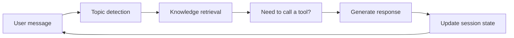

# 8.5.4 Project: Intelligent Q&A Assistant

:::tip Section focus
This section is very similar to “enterprise knowledge base Q&A,” but the goal goes one step further.
An enterprise knowledge base is more about “look up information and answer,” while an intelligent Q&A assistant is more like a real system that collaborates with the user:

- It can hold multi-turn conversations
- It can remember context
- It can call tools when needed

So this section is closer to a **prototype product project** than a single-turn QA demo.
:::

## Learning objectives

- Understand the difference between an intelligent Q&A assistant and a regular Q&A function
- Learn how to put retrieval, state, and tool calling into one workflow
- Learn how to define the most important evaluation dimensions for this project
- Learn how to turn it into a portfolio project that feels more like a product

---

## What does an intelligent Q&A assistant have that a regular Q&A app does not?

### It is not just “you ask once, I answer once”

The real feeling of an assistant usually comes from:

1. It remembers the previous turn
2. It asks follow-up questions when needed
3. It knows when to check the knowledge base and when to use tools

### A clear practice task

For example:

> **Build a course platform assistant that can answer questions about refunds, certificates, and learning progress.**

This is a very good task because it naturally includes:

- A knowledge base
- User state
- Multi-turn context

---

## What does the minimum product-level loop look like?

1. Maintain conversation history
2. Identify the current topic
3. Retrieve relevant knowledge
4. Call tools to check user status when needed
5. Generate a response with context awareness

As long as you make these 5 steps clear, the project already feels very product-like.

### A loop diagram that looks more like a real product



This diagram is important because it reminds you that:

- The assistant does not answer just once
- It keeps updating state and actions across turns


:::tip Reading guide
For a multi-turn assistant trace, you should look at at least four things: what is remembered in the session, what the retrieval returns, whether a tool is called, and how the state changes after the answer. That is what proves it is not just a normal FAQ.
:::

## Recommended build order

For beginners, a safer sequence is usually:

1. Build single-turn knowledge Q&A first
2. Add conversation state next
3. Add tool calling next
4. Finally add multi-turn evaluation and failure case demos

This way, you can clearly see which layer creates the “assistant feel.”

### A simpler analogy for beginners

You can think of an intelligent Q&A assistant as:

- A customer service assistant that can look up documents, ask follow-up questions, and check system status

The biggest difference from an FAQ page is not:

- Longer answers

But rather:

- It continues collaborating based on context

---

## Start by running a more complete minimal assistant

The example below will:

1. Maintain a session
2. Retrieve from a knowledge base
3. Call a user progress tool for refund questions
4. Generate a final answer based on context

```python
kb = [
    {"key": "refund", "text": "Refund policy: You can get a refund within 7 days of purchase if your learning progress is below 20%."},
    {"key": "certificate", "text": "Certificate policy: You can receive a certificate after completing all projects and passing the test."},
]


def retrieve(query):
    if "refund" in query:
        return kb[0], 0.92
    if "certificate" in query:
        return kb[1], 0.88
    return None, 0.0


def get_user_progress(user_id):
    progress_db = {
        1: 0.15,
        2: 0.30,
    }
    return progress_db.get(user_id, None)


def new_session():
    return {
        "history": [],
        "topic": None,
        "user_id": None,
        "last_retrieved_doc": None,
        "last_tool_call": None,
    }


def assistant_reply(session, user_message, user_id=None):
    if user_id is not None:
        session["user_id"] = user_id

    session["history"].append({"role": "user", "content": user_message})
    message = user_message.lower()

    if "still get a refund" in message and session["topic"] == "refund" and session["user_id"] is not None:
        session["last_tool_call"] = {"name": "get_user_progress", "user_id": session["user_id"]}
        progress = get_user_progress(session["user_id"])
        if progress is None:
            answer = "I can't find your learning progress right now. Please confirm your account status."
        else:
            answer = (
                f"The system shows your learning progress is about {int(progress * 100)}%."
                + (" You are still eligible for a refund." if progress < 0.2 else " You do not currently meet the refund conditions.")
            )

    elif "refund" in message:
        session["topic"] = "refund"
        doc, score = retrieve("refund")
        session["last_retrieved_doc"] = doc
        session["last_tool_call"] = None
        answer = f"{doc['text']} If you tell me your learning progress, I can help you check whether you qualify."

    elif "certificate" in message:
        session["topic"] = "certificate"
        doc, score = retrieve("certificate")
        session["last_retrieved_doc"] = doc
        session["last_tool_call"] = None
        answer = doc["text"]

    else:
        session["last_tool_call"] = None
        answer = "I can currently help with refund, certificate, and learning progress questions."

    session["history"].append({"role": "assistant", "content": answer})
    return answer


session = new_session()
print(assistant_reply(session, "What is the refund policy?", user_id=2))
print(assistant_reply(session, "Can I still get a refund?"))
print("last_tool_call:", session["last_tool_call"])
print("topic:", session["topic"])
```

Expected output:

```text
Refund policy: You can get a refund within 7 days of purchase if your learning progress is below 20%. If you tell me your learning progress, I can help you check whether you qualify.
The system shows your learning progress is about 30%. You do not currently meet the refund conditions.
last_tool_call: {'name': 'get_user_progress', 'user_id': 2}
topic: refund
```


### What is the most important value of this example?

It is not just doing “Q&A,” but showing:

- Conversation state
- The division of labor between retrieval and tools
- How multi-turn context drives the answer

This already feels much more like a real assistant product than single-turn FAQ matching.

### Why is `session` more worth looking at than the answer itself?

Because `session` is the key to keeping the system collaborative over time.
Without state, it is very hard to create an assistant-like experience.

### Another tiny “state snapshot” example

```python
snapshot = {
    "topic": session["topic"],
    "user_id": session["user_id"],
    "last_retrieved_doc": session["last_retrieved_doc"],
    "last_tool_call": session["last_tool_call"],
}

print(snapshot)
```

Expected output:

```text
{'topic': 'refund', 'user_id': 2, 'last_retrieved_doc': {'key': 'refund', 'text': 'Refund policy: You can get a refund within 7 days of purchase if your learning progress is below 20%.'}, 'last_tool_call': {'name': 'get_user_progress', 'user_id': 2}}
```

This example is great for beginners because it helps you first see:

- What an assistant system really needs to maintain is not the full raw conversation text
- It is several key pieces of state

---

## How should you evaluate this project?

### Single-turn accuracy is not enough

You should also check at least:

- Whether the multi-turn context stays consistent
- Whether tool calling is reasonable
- Whether the system starts making things up when information is missing

### A minimal evaluation case table

```python
eval_cases = [
    {
        "turns": ["What is the refund policy?", "Can I still get a refund?"],
        "user_id": 1,
        "expected_keywords": ["15%", "eligible for a refund"],
    },
    {
        "turns": ["How do I get a certificate?"],
        "user_id": None,
        "expected_keywords": ["passing the test", "certificate"],
    },
]

for case in eval_cases:
    session = new_session()
    last_answer = ""
    for turn in case["turns"]:
        last_answer = assistant_reply(session, turn, case["user_id"])
    print({
        "turns": case["turns"],
        "last_answer": last_answer,
        "expected_hit": all(keyword in last_answer for keyword in case["expected_keywords"]),
    })
```

Expected output:

```text
{'turns': ['What is the refund policy?', 'Can I still get a refund?'], 'last_answer': 'The system shows your learning progress is about 15%. You are still eligible for a refund.', 'expected_hit': True}
{'turns': ['How do I get a certificate?'], 'last_answer': 'Certificate policy: You can receive a certificate after completing all projects and passing the test.', 'expected_hit': True}
```

### Why is multi-turn evaluation especially important?

Because the highlight of this kind of project is not single-turn performance.
The place where it most easily fails is:

- Forgetting the context starting from the second turn

### An evaluation table that beginners can remember first

| Dimension | What you are really checking |
|---|---|
| Is the single-turn answer correct? | Knowledge answering ability |
| Does the multi-turn context stay on track? | State management ability |
| Is tool calling reasonable? | System decision-making ability |
| Does it ask follow-up questions when information is missing? | Assistant collaboration ability |

This table is especially useful for beginners because it breaks “assistant feel” into several concrete, checkable parts.

---

## How do you turn this into a portfolio-quality page?

### Show one complete dialogue trace

For example:

1. User question
2. Retrieved document
3. Whether a tool was called
4. Final answer

### Failure cases that are especially worth showing

For example:

- When the user does not provide enough information, does the system make random guesses?
- When the tool cannot find the status, does the system honestly stop and wait?

### A very good bonus point

Turn these two chains into flowcharts and show them:

- Knowledge answering
- User state answering

---

## The easiest mistakes to make

### Only building single-turn Q&A

This makes it hard to show the “assistant feel.”

### No tool boundary

If every question depends on model guessing, the system will become less and less stable.

### Not checking context consistency

Many project problems happen exactly on the second and third turns.

## If you turn this into a portfolio, what should you emphasize most?

What is most worth emphasizing is usually not:

- “It can chat”

But instead:

1. One complete multi-turn dialogue trace
2. Which turn triggered retrieval
3. Which turn triggered tool calling
4. How the session state changed
5. When the system chose to ask a follow-up question or stop

That way, others can more easily feel that:

- You built a continuous collaboration system
- Not just a multi-turn chat demo

---

## What to include when delivering the project

- A system flowchart
- One complete multi-turn dialogue trace
- A set of tool-calling success/failure cases
- A set of examples showing when the system knows to ask follow-up questions or stop
- A short explanation of your future extension path

---

## Summary

The most important idea in this section is to build a product-level judgment:

> **What makes an intelligent Q&A assistant feel like a real project is not whether it sounds human, but whether it can organize retrieval, state, and tool calling into a continuous multi-turn collaboration flow.**

As long as you explain that flow clearly, it will feel very much like a real AI product that can keep growing.


## Suggested version roadmap

| Version | Goal | Delivery focus |
|---|---|---|
| Basic version | Get the minimum loop working | Can accept input, process it, and output results, while keeping a few examples |
| Standard version | Become a presentable project | Add configuration, logs, error handling, README, and screenshots |
| Challenge version | Approach portfolio quality | Add evaluation, comparison experiments, failure sample analysis, and next-step planning |

It is recommended to finish the basic version first. Do not try to make it large and complete from the start. Every time you move up a version, write in the README what new capability was added, how it was verified, and what problems remain.

## Exercises

1. Add a `learning path` topic to the example so the assistant can handle three kinds of questions.
2. Think about why an intelligent assistant needs state management more than an FAQ does.
3. If the tool cannot find the user’s status, what is the safest response?
4. If you turn this project into a portfolio piece, which conversation is most worth showing?
