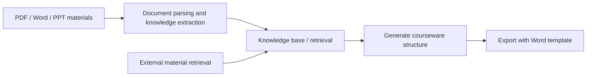
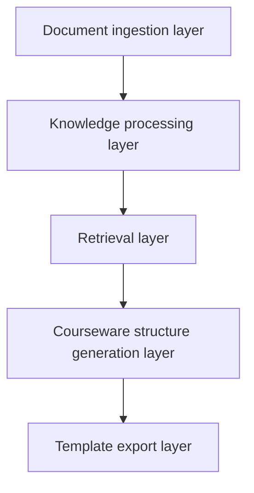

# 8.5.5 Project: Knowledge Base-Driven Courseware Generation Assistant


:::tip Section Positioning
This project goes one step further than a typical knowledge base Q&A system.
It is not just about answering questions — it actually produces:

- A Word courseware document that meets formatting requirements

So it is especially suitable for training these system capabilities to work together:

- Document parsing
- Knowledge retrieval
- Example extraction
- Structured output
- Template-based document generation
:::

## Learning Objectives

- Learn how to organize “topic -> research -> extract examples -> generate courseware” into a complete workflow
- Learn how to define the minimum project boundary for a knowledge base-driven courseware system
- Learn how to design internal knowledge base and external material supplementation separately
- Learn how to turn this project into a portfolio-quality system with a product feel

## Beginner terminology bridge

This project crosses document processing, retrieval, generation, and export. Clarify these terms first:

| Term | Beginner meaning | Role in this project |
|---|---|---|
| `ingestion` | Bringing files into the system and preparing them for processing | PDF / Word / PPT materials enter the pipeline here |
| `example extraction` | Identifying worked examples, exercises, definitions, and formulas from documents | Courseware needs examples, not just paragraphs |
| `schema` | A stable data structure that defines the courseware output | Keeps retrieval, generation, and template export aligned |
| `template rendering` | Filling structured content into a Word or PPT template | Separates content generation from document formatting |
| `source_refs` | Source references kept with each generated section or item | Lets the final Word draft explain where the content came from |
| `internal vs external materials` | Internal materials are trusted course assets; external materials are supplements | Prevents external sources from overriding the main teaching skeleton |

The core judgment is: the model should not directly “write a Word file.” It should help build a structured courseware object that the template layer can render reliably.

---

## First, Build a Map

This project is best understood as “knowledge ingestion -> retrieval -> structured generation -> template export”:



So what this project really wants to solve is:

- When the user only provides a topic, how does the system automatically find materials, extract examples, and then write them out according to a template?

## How Should We Narrow the Project Scope?

A very solid starting point is usually:

> **Build a “knowledge base-driven math courseware assistant” that takes a topic as input and automatically generates a Word draft containing key concepts, examples, and exercises.**

Why is this scope a good fit?

- The topic is clear
- The material format is clear
- Both examples and key concepts can be extracted from documents
- The Word output target is explicit

It is not recommended to start with:

- All subjects
- Automatically generating PPT + Word + lecture notes + voiceover

That will easily distract from the main project line.

## A Better Analogy for Beginners

You can think of this system as:

- A lesson-prep assistant that first reads materials, then organizes an outline, and finally drafts the courseware for you

It does not write blindly out of thin air. Instead, it:

1. First checks internal materials
2. Then supplements with external materials when needed
3. Then selects key concepts and examples from the materials
4. Finally writes them into courseware in a fixed format

This analogy matters, because it helps beginners avoid thinking of the project as:

- “Just ask the model to write a Word document directly”

## What Does the Minimum System Loop Look Like?

1. Ingest documents
2. Parse body text, headings, and examples
3. User enters a topic
4. The system retrieves internal knowledge chunks
5. Supplement with external materials if needed
6. Generate a structured courseware object
7. Export Word via a template

As long as these 7 steps run smoothly, the project already feels very close to a real product.

## Let’s First Run a Minimal Workflow Example

```python
knowledge_base = [
    {"topic": "Discount word problems", "content_type": "concept", "text": "Discount = original price × discount rate"},
    {"topic": "Discount word problems", "content_type": "example", "text": "A product originally costs 100 yuan. What is the price after a 20% discount?"},
    {"topic": "Discount word problems", "content_type": "exercise", "text": "A coat originally costs 80 yuan. What is the price after a 30% discount?"},
]


def retrieve_internal(topic):
    return [item for item in knowledge_base if item["topic"] == topic]


def retrieve_external(topic):
    # Minimal simulation only
    return [{"topic": topic, "content_type": "note", "text": f"External supplement: common teaching pitfalls for {topic}."}]


def build_courseware(topic):
    internal = retrieve_internal(topic)
    external = retrieve_external(topic)
    all_items = internal + external
    return {
        "title": topic,
        "concepts": [x["text"] for x in all_items if x["content_type"] == "concept"],
        "examples": [x["text"] for x in all_items if x["content_type"] == "example"],
        "exercises": [x["text"] for x in all_items if x["content_type"] == "exercise"],
        "notes": [x["text"] for x in all_items if x["content_type"] == "note"],
    }


print(build_courseware("Discount word problems"))
```

Expected output:

```text
{'title': 'Discount word problems', 'concepts': ['Discount = original price × discount rate'], 'examples': ['A product originally costs 100 yuan. What is the price after a 20% discount?'], 'exercises': ['A coat originally costs 80 yuan. What is the price after a 30% discount?'], 'notes': ['External supplement: common teaching pitfalls for Discount word problems.']}
```

### What Is the Most Important Value of This Example?

It shows that the real value of this system is not just that it can:

- Retrieve

But that it can reorganize what it retrieved into:

- The section structure needed by courseware

## Add a Quick Structure Check

Before exporting Word, check whether each required slot has content. This prevents a template renderer from producing a beautiful but empty document.

```python
courseware = build_courseware("Discount word problems")
required_slots = ["concepts", "examples", "exercises", "notes"]

for slot in required_slots:
    count = len(courseware[slot])
    print(f"{slot}: {count} item(s)", "OK" if count else "CHECK")
```

Expected output:

```text
concepts: 1 item(s) OK
examples: 1 item(s) OK
exercises: 1 item(s) OK
notes: 1 item(s) OK
```

## A System Layering Diagram That Looks More Like a Real Project

When beginners build this kind of project, the easiest mistake is mixing “knowledge base, retrieval, generation, and export” together.

A safer approach is to separate the layers first:



You can simply understand it as:

- Ingestion layer: read materials in
- Processing layer: turn materials into knowledge chunks
- Retrieval layer: find relevant materials
- Generation layer: reorganize materials into a courseware structure
- Export layer: turn the structure into Word

## What Capabilities Does This Project Need Most?

Viewed by system layers, the core capabilities are:

### Document Parsing

- PDF / DOCX / PPTX reading
- OCR for scanned documents
- Heading hierarchy and example recognition

Related courses:
- [8.3.8 Document Parsing and Knowledge Extraction](../ch03-app-dev/07-document-parsing.md)
- [8.1.3 Document Processing](../ch01-rag/02-document-processing.md)
- [10.5.4 OCR Text Recognition](../../ch10-computer-vision/ch05-advanced/03-ocr.md)

### Knowledge Base and Retrieval

- Chunking
- Metadata
- Topic retrieval
- Example recall

Related courses:
- [8.1.2 RAG Basics](../ch01-rag/01-rag-basics.md)
- [8.1.4 Vector Databases](../ch01-rag/03-vector-databases.md)
- [8.1.5 Retrieval Strategies](../ch01-rag/04-retrieval-strategies.md)

### Structured Output and Template Generation

- Generate an outline first
- Then generate key concepts / examples / exercises
- Then export Word using a template

Related courses:
- [7.5.2 Prompt Basics](../../ch07-llm-principles/ch05-prompt/01-prompt-basics.md)
- [7.5.4 Structured Output](../../ch07-llm-principles/ch05-prompt/03-structured-output.md)
- [8.3.9 Template-Based Document Generation (Word / PPT)](../ch03-app-dev/08-template-doc-generation.md)

### Tool Calling and Workflows

- Internal knowledge base retrieval
- External material supplementation
- Template rendering
- File export

Related courses:
- [8.3.4 Function Calling Practice](../ch03-app-dev/03-function-calling.md)
- [8.3.6 Dialogue Systems and Multi-Turn Management](../ch03-app-dev/05-dialog-system.md)
- [9.2.5 Plan-and-Execute](../../ch09-agent/ch02-reasoning/04-plan-and-execute.md)

## What Should the Minimal Fixed-Format Courseware Schema Look Like?

For this project, what is most worth defining first is not the model name,
but rather “what the courseware should look like.”

A minimal schema can at least be defined as:

```python
courseware_schema = {
    "title": "Topic Name",
    "audience": "Target Learners",
    "teaching_goal": ["Goal 1", "Goal 2"],
    "sections": [
        {"type": "concept", "heading": "Key Concept Review", "items": []},
        {"type": "example", "heading": "Worked Examples", "items": []},
        {"type": "exercise", "heading": "In-Class Practice", "items": []},
    ],
    "source_refs": [
        {"doc_id": "word_001", "page_or_slide": 3}
    ],
}
```

This schema is especially important because it binds:

- Retrieval
- Generation
- Template export

To the same stable object across all three layers.

## Which Comes First: Internal Materials or External Materials?

Your project has a very important real-world question:

- The internal knowledge base may already contain mature materials
- External materials are only supplements and should not take over the main role

So the default strategy that is more suitable for beginners is usually:

| Scenario | Default Priority |
|---|---|
| Topic key concepts | Internal materials first |
| Classic examples | Internal materials first |
| Latest policies/news/new question types | External materials as a supplement |
| Obvious gaps in internal materials | Use external materials to fill in |

You can remember this rule as one sentence:

> **Internal materials determine the main skeleton, and external materials fill in the blanks.**

## A Workflow Skeleton That Looks More Like a Real Product

```python
def generate_courseware(topic):
    parsed_docs = load_parsed_documents()
    internal_hits = retrieve_internal(parsed_docs, topic)
    external_hits = retrieve_external(topic)
    selected = merge_and_rank(internal_hits, external_hits)
    structured = build_courseware_schema(topic, selected)
    return export_word(structured)
```

The value of this skeleton is not that “the code is fancy,”
but that it helps you keep these 5 actions in mind:

1. Read internal knowledge
2. Look up external supplements
3. Merge and rank
4. Generate a fixed schema
5. Export the document


:::tip Reading Guide
Read this diagram like a production line: materials are ingested, parsed into knowledge chunks, retrieved by topic and content type, converted into a courseware schema, and then rendered into Word. If any layer has no intermediate output, debugging the next layer becomes very difficult.
:::

## How Should This Project Be Evaluated?

What is worth checking first is not “does it look nice when written,” but rather:

1. Is the retrieval correct?
2. Are the examples extracted correctly?
3. Does the structure match the template?
4. Can references and sources be traced back?

You can first break evaluation into:

| Dimension | What It Checks |
|---|---|
| Retrieval quality | Whether the topic materials and examples were found correctly |
| Structural correctness | Whether headings, key concepts, examples, and exercises are placed in the right spots |
| Source traceability | Whether each piece of content can be traced back to its document source |
| Template compliance | Whether the final Word document matches the formatting rules |

## A Beginner-Friendly Progression Order You Can Copy Directly

When building this project for the first time, a safer order is usually:

1. Build the internal knowledge base first
2. Do not add external materials yet
3. Generate structured JSON first
4. Then map the JSON into a Word template
5. Finally add external retrieval, tool orchestration, and more complex Agent logic

This is easier than trying to build a “fully automated lesson-prep Agent” from the start.

## The Most Common Pitfalls on the First Attempt

The most common mistakes when building this kind of project for the first time are:

1. Letting the model freely write the entire document right away
2. Not separating the priority of internal and external materials
3. Not saving sources, which makes tracing impossible later
4. Not using a fixed schema, which makes the template rendering layer fragile
5. When the output is poor, not knowing whether retrieval or the template is the problem

So the more stable development approach is:

- First split the pipeline apart
- Validate each layer independently
- Then connect them together

## If You Turn It Into a Portfolio Project, What Is Most Worth Showing?

What is most worth showing is usually not:

- “I can generate Word”

But rather:

1. What the raw materials look like
2. What the parsed knowledge chunks look like
3. What content was retrieved after the user entered a topic
4. How the final courseware structure was formed
5. What the result looks like after Word template export

This makes it easier for others to see that:

- You built a knowledge-driven content generation system
- You did not just ask the model to write an article


## Suggested Version Roadmap

| Version | Goal | Delivery Focus |
|---|---|---|
| Basic version | Run through the minimum loop | Accept input, process it, output it, and keep a set of examples |
| Standard version | Become a presentable project | Add configuration, logs, error handling, README, and screenshots |
| Challenge version | Approach portfolio quality | Add evaluation, comparison experiments, failure case analysis, and next-step roadmap |

It is recommended to complete the basic version first. Do not pursue a large, all-in-one solution from the beginning. With each version upgrade, be sure to write into the README what new capability was added, how it was verified, and what problems still remain.

## Evidence to Keep

Keep this page's proof of learning as a small evidence card:

```text
project_goal: user task and business boundary
baseline: simplest prompt/RAG/app version first
evaluation: fixed cases, retrieval evidence, answer quality, and citation check
failure_log: at least one failed case with likely cause
deliverable: README, run command, screenshots/logs, next step
```

## Summary

- The core of this project is the complete pipeline of “document knowledge -> structured courseware -> template export”
- The schema and source strategy are often more important than which model you choose at the beginning
- When doing this for the first time, it is more realistic to first make the internal-material workflow stable, and then add external materials and Agent-style orchestration

## What Should You Take Away from This Section?

- The core of this project is not “document output,” but the entire chain of “document knowledge -> structured courseware”
- Document parsing, RAG, structured output, and template rendering are all indispensable; if one piece is missing, the system is not stable
- If you want to build this kind of system, it is more realistic to first make the workflow version stable, and then consider Agent-ifying it
