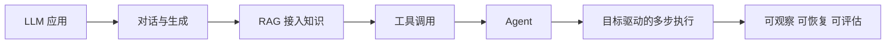
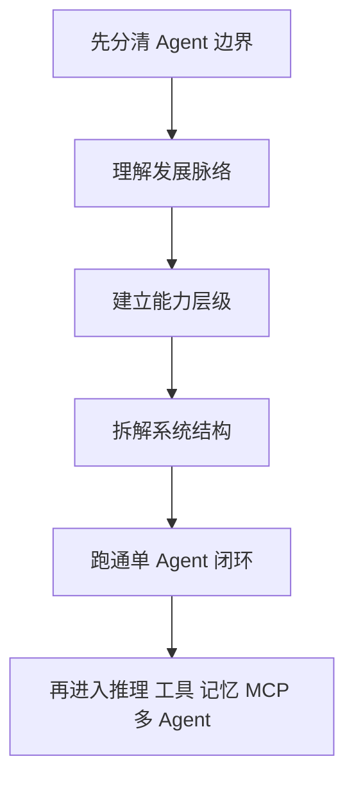
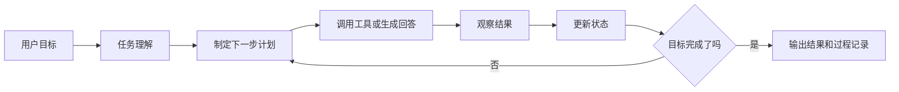

# 学前导读：Agent 基础这一章到底在学什么

这一章解决的是：先把 Agent 的边界、能力和系统结构说清楚。

很多新人第一次学 Agent 时，会把聊天机器人、工作流、RAG、工具调用和多 Agent 全部混在一起。这样学很容易被框架和 Demo 带着跑。Agent 基础章的任务，就是先把最小闭环建立起来：目标、计划、行动、观察、修正，最后输出结果。

## 这一章在整个课程里的位置

你已经在前面学过 LLM 应用开发和 RAG，知道大模型可以接文档、接 API、做对话和生成内容。到 Agent 阶段，课程开始从“模型应用”进入“能围绕目标持续行动的系统”。

这一步的关键变化是：普通 LLM 应用通常是用户问一次、系统答一次；Agent 更强调目标驱动、状态维护、工具调用、结果观察和多步执行。

## 这一章真正要解决的问题

这一章要回答五个问题：Agent 和普通聊天机器人有什么区别；Agent 和固定工作流有什么区别；目标、状态、工具、记忆、规划分别承担什么职责；为什么单 Agent 要先做稳，再考虑多 Agent；一个 Agent 系统怎样记录过程、处理失败和避免无限循环。

新人最容易犯的错误，是一上来就追 LangGraph、CrewAI、AutoGen 或多 Agent 协作，却没有先理解单 Agent 的执行闭环。框架可以提高开发效率，但不能替你理解系统边界。

## 新人推荐学习顺序

建议先看“什么是 Agent”，把 Agent、聊天机器人、RAG 应用、工具调用系统和固定工作流的边界分清。然后看发展脉络，理解 Agent 为什么会在 LLM 之后重新受到关注。接着看能力层级，把“会回答、会检索、会调用工具、会规划、会使用记忆、会协作”放在同一条能力线上。最后看系统结构，理解目标、状态、工具、记忆、规划器和执行器怎样组合。

## 学这一章时要抓住的主线

这一章的主线可以概括为：Agent 不是模型名，而是一种围绕目标组织模型、工具、状态和反馈的系统方式。

这条闭环能帮助你判断一个系统是不是 Agent。如果系统只是固定地调用一次模型，它更像普通 LLM 应用。如果系统能根据目标拆步骤、调用工具、观察结果、修正计划，并在必要时继续执行，它才开始接近 Agent。

## 这一章和后面章节的关系

这一章是 9 AI Agent 与智能体系统的入口。后面的推理与规划会展开 Agent 如何决定下一步，工具调用会讲它怎样连接外部能力，记忆系统会讲它怎样保存上下文和经验，MCP 会讲工具生态和协议，多 Agent 会讲多个角色如何协作，评估安全和部署会讲怎样让 Agent 可靠运行。

如果这一章没学稳，后面常见的问题是：以为多 Agent 一定比单 Agent 强；只演示成功路径，不处理工具失败和循环执行；把记忆当成“越多越智能”，却不知道记忆应该服务任务；框架学了很多，但不知道系统为什么这样设计。

## 新人和进阶学习者怎么读

新人第一次学这一章时，先抓住主线和最小可运行例子。你不需要一次理解所有细节，只要能说清楚这一章解决什么问题、输入输出是什么、最小项目怎么跑起来，就可以继续往后走。

有经验的学习者可以把这一章当成查漏补缺和工程化练习：关注边界条件、失败案例、评估方式、代码可复现性，以及它和前后阶段的连接。读完后最好能把本章内容沉淀到自己的作品 README 或实验记录里。

## 学习时间与难度建议

| 学习方式 | 建议投入 | 目标 |
|---|---|---|
| 快速浏览 | 20～30 分钟 | 看懂本章解决什么问题，知道后面会用到哪里 |
| 最小通关 | 1～2 小时 | 跑通一个最小例子，完成本章小项目出口 |
| 深入练习 | 半天～1 天 | 补充错误分析、对比实验或项目 README 记录 |

## 本章自测问题

| 自测问题 | 通过标准 |
|---|---|
| 这一章解决什么问题？ | 能用一句话说明它在整门课里的位置 |
| 最小输入输出是什么？ | 能说清楚例子需要什么输入，会产生什么结果 |
| 常见失败点在哪里？ | 能列出至少一个报错、效果差或理解偏差的原因 |
| 学完后能沉淀什么？ | 能把本章产出写进项目 README、实验记录或作品集 |

## 本章小项目出口

学完这一章后，建议做一个最小研究助手 Agent。用户输入一个主题，Agent 先拆解问题，再选择是否检索资料或调用工具，然后整理观察结果，最后输出一份带步骤记录的简短摘要。

这个项目的重点不是搜索结果多丰富，而是要把执行过程记录清楚：目标是什么，计划是什么，调用了什么工具，观察到了什么，什么时候决定继续，什么时候决定结束。

## 过关标准

这一章结束时，你应该能解释 Agent 和聊天机器人、RAG 应用、固定工作流之间的区别，能说清楚目标、状态、工具、记忆、规划和观察在 Agent 里的作用，能画出一个单 Agent 的执行闭环。

如果你能做出一个单 Agent Demo，并记录每一步工具调用、观察结果、失败处理和最终输出，就可以继续进入推理、工具、记忆、MCP 和多 Agent 章节。
