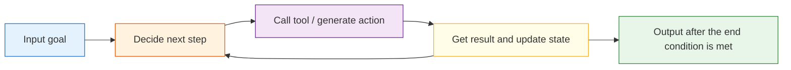

# 9.1.5 Agent System Architecture


## Learning Objectives

After completing this section, you will be able to:

- Explain the core components commonly found in an Agent system
- Understand the basic execution loop of a single-Agent architecture
- Run a mini architecture example with state and tool registration
- Know why real systems cannot do without observability and guardrails

---

## An Agent Is Not Just "a Model"

### The most basic misconception: thinking an Agent is just an LLM + Prompt

A truly usable Agent system usually also needs at least:

- a tool layer
- state management
- an execution loop
- error handling
- safety constraints

The model is important, but it is more like one part of the brain, not the whole system.

### You can think of an Agent as a small operating system

It contains:

- a decision center
- a toolbox
- a notebook
- execution logs
- safety rules

That is also why once an Agent enters the engineering stage, it is no longer just about "writing prompts."

---

## Common Core Components

### Planner / Decision Maker

Responsible for deciding:

- how to break down the current task
- what to do next
- whether to call a tool

In simple systems, this part may be handled directly by the LLM.
In scenarios that require stronger control, it may also be handled by a combination of rules + LLM.

### Tool Layer / Tools Layer

This is the key to letting an Agent take action.

Tools may include:

- search
- database queries
- API calls
- file read/write
- calculators

Without tools, many Agents can only "talk" and cannot actually "do."

---

## State, Memory, and Context

### State: where the current task is now

State usually records:

- user goal
- completed steps
- intermediate results
- number of retry attempts after failures

This is not the same as "long-term memory."
It is more like the workspace for the current task.

### Memory: what is kept across turns

Memory is more about:

- user preferences
- historical projects
- long-term context

Many basic Agents do not necessarily need complex memory at the beginning, but almost all of them need state.

---

## A Standard Execution Loop

### The minimal loop: perceive, decide, act, observe



### Why is this loop so important?

Because the essence of an Agent is not "answer once," but:

> Continuously adjust actions based on intermediate results.

This is one of the fundamental differences between an Agent and a normal chatbot.


:::tip Reading Tip
Think of this diagram as the "anatomy of a production Agent": the Planner decides the next step, the Tool Layer handles actions, Memory and State record context, Guardrails decide what is allowed, and Observability makes every step traceable.
:::

---

## A Mini Runnable Architecture Example

In the example below, we explicitly write out:

- a tool registry
- state
- decision logic
- an execution loop

```python
import ast
import operator

OPS = {
    ast.Add: operator.add,
    ast.Sub: operator.sub,
    ast.Mult: operator.mul,
    ast.Div: operator.truediv,
}


def safe_calculate(expression):
    def visit(node):
        if isinstance(node, ast.Expression):
            return visit(node.body)
        if isinstance(node, ast.Constant) and isinstance(node.value, (int, float)):
            return node.value
        if isinstance(node, ast.BinOp) and type(node.op) in OPS:
            return OPS[type(node.op)](visit(node.left), visit(node.right))
        if isinstance(node, ast.UnaryOp) and isinstance(node.op, ast.USub):
            return -visit(node.operand)
        raise ValueError("unsupported_expression")

    return visit(ast.parse(expression, mode="eval"))


def tool_weather(city):
    data = {"Beijing": "Sunny, 22°C", "Shanghai": "Cloudy, 25°C"}
    return data.get(city, "No weather information available for this city")

def tool_calc(expression):
    return str(safe_calculate(expression))

TOOLS = {
    "weather": tool_weather,
    "calc": tool_calc
}

def decide_next_action(state):
    query = state["query"]
    if state["done"]:
        return None

    if "weather" in query and not state["steps"]:
        city = "Beijing" if "Beijing" in query else "Shanghai"
        return {"tool": "weather", "args": city}

    if "calculate" in query and not state["steps"]:
        expression = query.replace("calculate", "").strip()
        return {"tool": "calc", "args": expression}

    return {"tool": None, "args": None}

def run_agent(query):
    state = {
        "query": query,
        "steps": [],
        "observations": [],
        "done": False
    }

    while not state["done"]:
        action = decide_next_action(state)
        if action is None or action["tool"] is None:
            state["done"] = True
            break

        tool_name = action["tool"]
        args = action["args"]
        result = TOOLS[tool_name](args)

        state["steps"].append(action)
        state["observations"].append(result)
        state["done"] = True

    if state["observations"]:
        return state, state["observations"][-1]
    return state, "No executable action"

state, answer = run_agent("calculate 23 * 8")
print("State:", state)
print("Final answer:", answer)
```

Expected output:

```text
State: {'query': 'calculate 23 * 8', 'steps': [{'tool': 'calc', 'args': '23 * 8'}], 'observations': ['184'], 'done': True}
Final answer: 184
```

This example is small, but it already contains the core feel of an Agent architecture.

---

## Guardrails: Why Are Safety Rails Essential?

### Because Agents take actions

And action means risk.

For example:

- calling the wrong tool
- repeating execution
- unauthorized access
- accidentally deleting data

So common guardrails in real systems include:

- tool whitelists
- parameter validation
- maximum step limits
- human approval checkpoints

### The simplest guardrail example

```python
import ast
import operator

OPS = {
    ast.Add: operator.add,
    ast.Sub: operator.sub,
    ast.Mult: operator.mul,
    ast.Div: operator.truediv,
}


def safe_calculate(expression):
    def visit(node):
        if isinstance(node, ast.Expression):
            return visit(node.body)
        if isinstance(node, ast.Constant) and isinstance(node.value, (int, float)):
            return node.value
        if isinstance(node, ast.BinOp) and type(node.op) in OPS:
            return OPS[type(node.op)](visit(node.left), visit(node.right))
        if isinstance(node, ast.UnaryOp) and isinstance(node.op, ast.USub):
            return -visit(node.operand)
        raise ValueError("unsupported_expression")

    return visit(ast.parse(expression, mode="eval"))


def safe_eval(expression):
    allowed_chars = set("0123456789+-*/(). ")
    if not set(expression) <= allowed_chars:
        return "The expression contains disallowed characters"
    return str(safe_calculate(expression))

print(safe_eval("3 * (4 + 5)"))
print(safe_eval("__import__('os').system('rm -rf /')"))
```

Expected output:

```text
27
The expression contains disallowed characters
```

The core idea of guardrails is not to make the system completely error-free, but to narrow the scope of possible mistakes.

---

## Observability: Why Do We Need to See What the Agent Is Doing?

### Because multi-step systems are hard to debug when they are opaque

At minimum, you want to see:

- what decision was made at each step
- which tool was called
- what the tool returned
- why the process ended

### The minimum observability information usually includes

- input
- action
- observation
- final output
- time cost

Many Agent projects get stuck in the end not because the model is too weak, but because the system itself cannot clearly see where it went wrong.

---

## Single Agent and Multi-Agent

### A single Agent is usually what you should learn first

Most systems should first make a single Agent solid:

- easier to debug
- easier to converge
- clearer architecture

### Multi-Agent is not the default upgrade path

Only when a task is truly suitable for division of labor is Multi-Agent worth considering.

For example:

- Planning Agent
- Execution Agent
- Review Agent

If the task is not complex, Multi-Agent may instead increase coordination costs.

---

## Common Beginner Mistakes

### Starting with Multi-Agent before understanding Single Agent

This usually makes debugging much harder.

### Mixing up state and memory

State is more about the current task, while memory is more about accumulation across tasks.

### Having no logging or replay mechanism

Once the system fails, you can only guess.

---

## Summary

The most important takeaway from this section is:

> The key to an Agent architecture is not just "whether it can call tools," but whether it can organize decision-making, execution, state, guardrails, and observability into a stable closed loop.

That is why real Agent engineering is both a model problem and a system design problem.

---

## Exercises

1. Add a `docs_search` tool to the mini Agent.
2. Add a "maximum step count" limit to `run_agent()`.
3. Think about it: if tools often time out, what mechanisms should be added at the architecture level?
