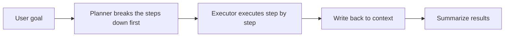

# 9.2.5 Plan-and-Execute

:::tip Section overview
ReAct is great for learning as you go.
But when tasks get longer, it runs into a typical problem:

- deciding everything on the spot at each step can easily drift off track

At that point, many systems switch to a different organizational pattern:

> **First use a planner to break down the plan, then let the executor complete it step by step.**

That is the core idea of Plan-and-Execute.
:::

## Learning objectives

- Understand why Plan-and-Execute is well-suited to long tasks
- Understand the division of responsibilities between planner and executor
- See a runnable example of a minimal “plan first, execute later” system
- Understand how it differs from ReAct and the trade-offs involved

---

## First, build a map

Plan-and-Execute is easier to understand as “high-level route first, low-level steps later”:



So what this section really aims to solve is:

- Why long tasks are not a good fit for fully improvised execution
- Why separating planning and execution makes the system more stable

---

## Why do longer tasks need “planning first” more?

### Thinking while moving can easily lose the big picture

If a task only has one or two steps,
ReAct’s on-the-fly decision-making is usually enough.

But if the task becomes:

- organizing a week of customer support data
- counting frequent issues
- generating a report
- then giving improvement suggestions

then the task has a much stronger global structure.

If every step is decided only at the moment,
common problems are:

- missed steps
- wrong order
- repeated work

### The role of the planner: turn a big task into smaller tasks first

The most important value of the planner is not “being smarter,”
but:

- drawing the roadmap first

It answers questions like:

- How many steps are there?
- What is the order of the steps?
- Which results need to be passed to later steps?

### The role of the executor: focus on doing the current step well

Once the plan is separated out,
the executor can spend less time on “strategy”
and more time on:

- how to complete the current step
- how to call the current tool
- how to write the current result into storage

This makes the system more stable and easier to debug.

### A beginner-friendly overall analogy

You can think of Plan-and-Execute as:

- first make a construction checklist, then have the workers follow it step by step

Without a checklist, workers can of course improvise as they go,
but once the task gets long it is very easy to end up with:

- missed steps
- wrong order
- repeated rework

This analogy is especially good for beginners, because it brings “planner / executor” back to a very everyday coordination problem.

---

## What is the real difference between Plan-and-Execute and ReAct?

### ReAct is more like investigating while moving

It works well when:

- there is a lot of unknown information
- the next step depends on the previous observation

### Plan-and-Execute is more like making a construction checklist first

It works well when:

- the task structure is fairly clear
- steps can be broken down in advance
- you want to reduce improvisational drift

### They are not opposing approaches

Many real systems actually combine them:

- use Plan-and-Execute at the high level first
- then use ReAct inside each execution step

In other words:

- planning handles the global picture
- ReAct handles local exploration

### A selection table that is easy for beginners to remember

| Task characteristics | Safer first choice |
|---|---|
| Clear path, many steps | Plan-and-Execute |
| Lots of unknowns, learn as you go | ReAct |
| Need both global planning and local exploration | Combine both |

This table is useful for beginners because it turns “which reasoning organization should I use?” into something you can actually judge.


:::tip Reading the diagram
When reading the diagram, pay attention to the two layers of responsibility: the Planner handles the global route, the Executor handles the current step; once the Monitor detects missing information, a tool failure, or a goal change, it triggers replan instead of forcing the system to keep following the original plan.
:::

---

## Let’s run a real minimal Plan-and-Execute example first

The example below simulates a “customer support weekly report Agent.”
The user task is to:

- count support issues
- identify frequent intents
- generate a short summary

We will explicitly separate:

- planner
- executor

```python
tickets = [
    {"intent": "refund", "text": "My order has not shipped yet, can I get a refund?"},
    {"intent": "refund", "text": "How long does a refund take?"},
    {"intent": "password", "text": "What should I do if I forgot my password?"},
    {"intent": "address", "text": "Can I still change the address if I entered it wrong?"},
    {"intent": "refund", "text": "Why has my refund not arrived yet?"},
]


def planner(goal):
    return [
        {"step": "load_tickets", "description": "Load this week’s support tickets"},
        {"step": "count_intents", "description": "Count the number of issues in each category"},
        {"step": "find_top_intent", "description": "Find the most frequent issue"},
        {"step": "draft_report", "description": "Generate a short weekly report"},
    ]


def executor(task, context):
    name = task["step"]

    if name == "load_tickets":
        context["tickets"] = tickets
        return "Loaded 5 tickets"

    if name == "count_intents":
        counts = {}
        for item in context["tickets"]:
            counts[item["intent"]] = counts.get(item["intent"], 0) + 1
        context["intent_counts"] = counts
        return counts

    if name == "find_top_intent":
        counts = context["intent_counts"]
        top_intent = max(counts, key=counts.get)
        context["top_intent"] = top_intent
        return top_intent

    if name == "draft_report":
        counts = context["intent_counts"]
        top_intent = context["top_intent"]
        report = (
            f"This week, a total of {len(context['tickets'])} support tickets were handled. "
            f"The most frequent issue was {top_intent}, appearing {counts[top_intent]} times. "
            f"It is recommended to prioritize improving the {top_intent} workflow and FAQ copy."
        )
        context["report"] = report
        return report

    raise ValueError(f"Unknown step: {name}")


goal = "Generate this week's customer support report"
plan = planner(goal)
context = {}
trace = []

for task in plan:
    output = executor(task, context)
    trace.append({"task": task["step"], "output": output})

print("plan:")
for item in plan:
    print("-", item)

print("\ntrace:")
for item in trace:
    print(item)

print("\nfinal report:")
print(context["report"])
```

Expected output:

```text
plan:
- {'step': 'load_tickets', 'description': 'Load this week’s support tickets'}
- {'step': 'count_intents', 'description': 'Count the number of issues in each category'}
- {'step': 'find_top_intent', 'description': 'Find the most frequent issue'}
- {'step': 'draft_report', 'description': 'Generate a short weekly report'}

trace:
{'task': 'load_tickets', 'output': 'Loaded 5 tickets'}
{'task': 'count_intents', 'output': {'refund': 3, 'password': 1, 'address': 1}}
{'task': 'find_top_intent', 'output': 'refund'}
{'task': 'draft_report', 'output': 'This week, a total of 5 support tickets were handled. The most frequent issue was refund, appearing 3 times. It is recommended to prioritize improving the refund workflow and FAQ copy.'}

final report:
This week, a total of 5 support tickets were handled. The most frequent issue was refund, appearing 3 times. It is recommended to prioritize improving the refund workflow and FAQ copy.
```


### What is the most important value of this code?

It clearly separates two things:

1. Planning
   Decide which steps need to be done
2. Execution
   Actually run the steps and place the results into `context`

That is the most essential structure of Plan-and-Execute.

### What role does `context` play here?

It is the shared state during execution.

The outputs from earlier steps:

- `tickets`
- `intent_counts`
- `top_intent`

will all be used by later steps.

So the key idea in Plan-and-Execute is not just “having a plan,”
but also:

- how intermediate results are safely passed along

### Why is this more worth learning than just `for step in plan`?

Because this is not just demonstrating a loop,
but demonstrating:

- how long tasks are decomposed
- how dependencies are passed
- how the final result is aggregated step by step

### Let’s look at one more minimal “plan checklist” example

```python
plan_quality = {
    "steps_clear": True,
    "order_defined": True,
    "handoff_defined": False,
}


def next_fix(plan_quality):
    if not plan_quality["steps_clear"]:
        return "First make the step descriptions clear."
    if not plan_quality["order_defined"]:
        return "First define the execution order."
    if not plan_quality["handoff_defined"]:
        return "First clarify how each step’s output is passed to the next step."
    return "The plan is now basically executable."


print(next_fix(plan_quality))
```

Expected output:

```text
First clarify how each step’s output is passed to the next step.
```

This example is especially good for beginners, because it reminds you:

- a good plan is not just “listing a few steps”
- you also need to consider the handoff relationship between steps

---

## When is Plan-and-Execute especially valuable?

### Long tasks

For example:

- writing reports
- doing research summaries
- organizing a knowledge base
- building multi-step business workflows

### Processes that need stable repeatability

If you want similar tasks to be executed with a similar structure every time,
then an explicit plan is more stable than pure improvisation.

### Scenarios where a human should review the plan

In some tasks,
you may even show the plan to a person first and then decide whether to execute it.

For example:

- high-risk operations
- complex data processing
- changes to automation workflows

---

## What problems does it most easily run into?

### The plan is wrong from the start

If the planner misunderstands the task,
then even a careful executor cannot fix it.

### The plan is too rigid and does not adapt to new observations

This is the classic weakness of Plan-and-Execute.

If the external world changes quickly,
a plan that is too fixed may feel rigid.

### The executor is disconnected from the plan description

Common situations:

- the planner writes a vague step
- the executor does not know how to implement it

So plan steps are best when they are:

- clearly scoped
- executable
- explicit about inputs and outputs

---

## How do we make Plan-and-Execute more stable in engineering practice?

### Make the plan structured

Do not generate only a string of natural language.
A better format is usually:

- step id
- description
- input
- output

### Write back to `context` after each step

This is more helpful for:

- debugging
- replay
- retrying

### Allow replanning when necessary

The most stable version of Plan-and-Execute is often not:

- plan once, never change it

but:

- plan the big direction first
- allow replanning when major deviations occur

## If you turn this into a project or system design, what is most worth showing?

What is most worth showing is usually not:

- “the system first generated a plan”

but:

1. The user goal
2. The steps broken down by the Planner
3. How `context` changes after each step
4. Where replan is needed

That way, others can more easily see:

- you understand long-task orchestration
- you did not just add another layer of prompt

---

## Common misconceptions

### Misconception 1: having a plan always makes the system smarter

A plan can improve stability,
but only if the plan itself is good enough.

### Misconception 2: every task should use planner first and executor second

Not necessarily.
For short tasks or highly interactive tasks, ReAct is often more natural.

### Misconception 3: it is enough to just list step names in the plan

A truly executable plan also needs:

- step granularity
- state dependencies
- output definitions

---

## Evidence to Keep

Keep this page's proof of learning as a small evidence card:

```text
task_goal: what the agent is trying to solve
plan_or_trace: reasoning steps, plan, ReAct trace, or execution graph
observation: what changed after each action
failure_check: hallucinated step, stale observation, loop, or unverified conclusion
eval_action: compare against expected result and revise the plan
```

## Summary

The most important thing in this section is not to treat `Plan-and-Execute` as just another trendy name,
but to understand its core engineering value:

> **When tasks are long enough, complex enough, and need stable repeatability, planning first and executing later can significantly reduce improvisational drift, making the system easier to debug, review, and maintain.**

Once this layer is in place,
you will find DAG planning, multi-Agent division of labor, and task graph scheduling much easier to understand.

---

## Exercises

1. Replace the “customer support weekly report” in the example with “organize knowledge base answers” or “do competitor research,” and rewrite the plan.
2. Why do long tasks need a planner more than short tasks?
3. If the goal changes halfway through execution, how would you design a replanning mechanism?
4. Think about it: which tasks are better suited to ReAct, and which are better suited to Plan-and-Execute?

<details>
<summary>Reference answers and explanation</summary>

1. A good plan has ordered subtasks, expected evidence for each step, and a final synthesis step.
2. Long tasks need planners because dependencies, progress tracking, and recovery points matter more as task length grows.
3. Replanning should detect goal changes, pause execution, compare completed and remaining steps, update the plan, and keep a trace of why it changed.
4. ReAct suits short exploratory tasks where observations drive the next action; Plan-and-Execute suits longer tasks with known subgoals and dependencies.

</details>
