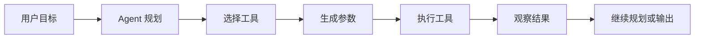
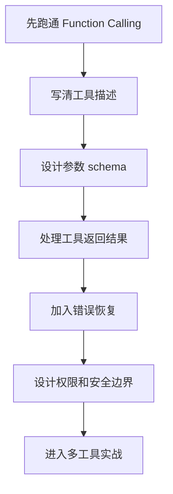
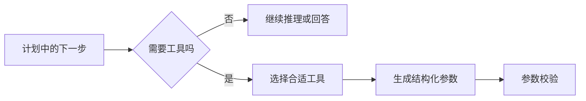
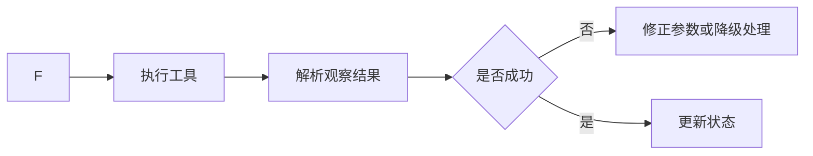

# 学前导读：工具这一章到底在学什么

这一章解决的是：Agent 不只是会说，还要会做。

如果一个系统只能生成文字，它更像一个回答器；如果它能根据目标选择工具、传入参数、观察结果并继续决策，它才开始具备行动能力。工具使用章就是 Agent 从“语言能力”走向“执行能力”的关键章节。

## 这一章在整个课程里的位置

你已经学过 Agent 基础和推理规划，知道 Agent 需要围绕目标不断决定下一步。到工具这一章，课程开始回答：下一步如果不是继续生成文本，而是要查资料、读文件、调用 API、运行代码、发起搜索或操作数据库，系统应该怎样安全可靠地完成。

工具是 Agent 连接外部世界的接口。没有工具，Agent 只能停留在语言层；有了工具，Agent 才能进入真实工作流。



## 这一章真正要解决的问题

这一章要回答五个问题：Function Calling 为什么能把模型输出变成可执行动作；工具描述和参数 schema 为什么决定模型能不能正确调用；多个工具之间如何选择和调度；工具失败、参数错误、权限不足时怎样恢复；工具使用为什么必须设计安全边界。

新人最容易误解的是：给 Agent 多接几个工具就会更强。真实情况是，工具越多，选择错误、参数错误、权限风险、循环调用和成本失控的概率也越高。工具能力要和任务目标、调用规则、错误处理和安全策略一起设计。

## 新人推荐学习顺序

建议先学 Function Calling 的最小流程，理解模型如何输出函数名和参数。然后学工具描述，知道如何写清楚工具用途、输入字段、限制和示例。接着学调度策略，理解什么时候该调用哪个工具，以及如何避免无意义循环。最后学工具安全和多工具实战，把权限、校验、超时、审计和失败恢复补上。



## 学这一章时要抓住的主线

这一章的主线可以概括为：工具调用不是“模型想调就调”，而是“在受控边界内把计划转成动作”。



前半段先定义工具能做什么、参数是什么、边界在哪里，后半段再处理调用结果、错误恢复、权限控制和执行日志。



看懂这条线后，你会知道 Agent 的可靠性不只取决于模型聪不聪明，还取决于工具接口是否清晰、参数是否可校验、失败是否可恢复、权限是否受控。

## 这一章和后面章节的关系

工具使用是记忆、MCP、多 Agent 和部署的基础。记忆可能需要读写外部存储，MCP 本质上提供更标准化的工具生态，多 Agent 协作会放大工具调度复杂度，部署阶段则必须考虑工具权限、日志、审计和安全。

如果这一章没学稳，后面常见的问题是：Agent 看起来会规划，但真正执行时频繁传错参数；工具结果没有被正确观察和总结；工具失败后模型硬编结果；工具权限过大导致安全风险；多工具系统难以调试。

## 新人和进阶学习者怎么读

新人第一次学这一章时，先抓住主线和最小可运行例子。你不需要一次理解所有细节，只要能说清楚这一章解决什么问题、输入输出是什么、最小项目怎么跑起来，就可以继续往后走。

有经验的学习者可以把这一章当成查漏补缺和工程化练习：关注边界条件、失败案例、评估方式、代码可复现性，以及它和前后阶段的连接。读完后最好能把本章内容沉淀到自己的作品 README 或实验记录里。

## 学习时间与难度建议

| 学习方式 | 建议投入 | 目标 |
|---|---|---|
| 快速浏览 | 20～30 分钟 | 看懂本章解决什么问题，知道后面会用到哪里 |
| 最小通关 | 1～2 小时 | 跑通一个最小例子，完成本章小项目出口 |
| 深入练习 | 半天～1 天 | 补充错误分析、对比实验或项目 README 记录 |

## 本章自测问题

| 自测问题 | 通过标准 |
|---|---|
| 这一章解决什么问题？ | 能用一句话说明它在整门课里的位置 |
| 最小输入输出是什么？ | 能说清楚例子需要什么输入，会产生什么结果 |
| 常见失败点在哪里？ | 能列出至少一个报错、效果差或理解偏差的原因 |
| 学完后能沉淀什么？ | 能把本章产出写进项目 README、实验记录或作品集 |

## 本章小项目出口

学完这一章后，建议做一个“带工具的学习助手”。用户输入一个学习任务，Agent 可以调用课程检索工具查资料，调用计划生成工具拆任务，调用文件生成工具输出学习计划。每次工具调用都要记录函数名、参数、返回结果和下一步决策。

最小交付物建议包含：3 个工具 schema，1 个工具白名单，至少 5 条工具调用测试用例，1 份失败调用记录，以及一段可打印的 trace。重点不是工具数量，而是能看出每次调用是否符合参数约束和权限边界。

```python
trace.append({
    "tool": "search_course_docs",
    "args": {"query": "RAGOps 评估"},
    "observation": "命中 2 篇文档",
    "next": "生成复习计划",
})
```

项目重点不是工具数量，而是工具调用过程是否透明、参数是否结构化、失败时是否有降级策略。

## 过关标准

这一章结束时，你应该能解释 Function Calling 的基本流程，能设计一个清晰的工具 schema，能说明工具描述、参数校验、错误处理和安全边界为什么重要，能实现一个最小多工具 Agent 流程。

如果你能读懂 Agent 的工具调用日志，并判断失败发生在计划、参数、工具执行还是结果观察阶段，就说明你已经掌握了 Agent 行动层的核心思维。
