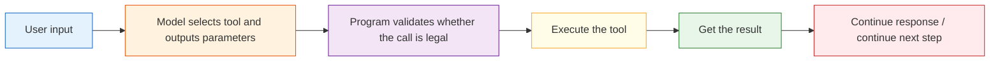

# Function Calling Explained

:::tip Section focus
In the previous section, you learned that Function Calling means “the model outputs structured tool calls.”
In this section, we will not stop at “being able to call tools,” but move into the really important questions:

> **How do we make function calling stable, controllable, and extensible?**

That is its real engineering value in an Agent system.
:::

## Learning goals

- Understand the full engineering pipeline of Function Calling
- Learn how to design more robust tool schemas
- Understand parameter validation, failure handling, and error recovery
- Read a small closed loop of multi-step tool calls
- Distinguish what “the model decides” and what “the program executes”

---

## 1. Why dig deeper into Function Calling separately?

### 1.1 The beginner version only solves “can it call?”

The simplest function calling system only requires:

- The model chooses the right tool
- The parameters are roughly correct

That is usually enough in the demo stage.

### 1.2 Once it goes live, harder problems appear immediately

For example:

- There are many tools, and the model often chooses the wrong one
- Parameters are often missing fields
- Some calls must be protected by permission checks
- How do you recover after a tool failure?
- How do you avoid infinite loops in multi-step calls?

So real Function Calling is not just a JSON structure, but an engineering mechanism.

---

## 2. First, understand the complete pipeline

### 2.1 The standard closed loop of Function Calling



### 2.2 Which parts are handled by whom?

| Step | Responsible party |
|---|---|
| Decide whether to call a tool | Model |
| Output the call structure | Model |
| Validate whether the parameters are legal | Program |
| Execute the tool | Program |
| Continue to the next step based on the result | Model / workflow / Agent scheduler |

This is a very important boundary:

> **The model is responsible for “decision-making,” and the program is responsible for ensuring safe and stable execution.**


:::tip Reading guide
Read this diagram as “model output is not the same as program execution”: the model only proposes a tool call, and the program must first perform schema validation, permission checks, parameter cleaning, and error normalization before the real tool is executed.
:::

---

## 3. Why does schema design directly affect results?

### 3.1 What does a bad schema look like?

```python
bad_schema = {
    "name": "search",
    "description": "Do some queries",
    "parameters": {
        "q": {"type": "string"}
    }
}

print(bad_schema)
```

The problems with this schema are:

- The tool name is too vague
- The description is too empty
- The parameter semantics are unclear

When the model sees a schema like this, it can easily get confused.

### 3.2 A better schema

```python
good_schema = {
    "name": "search_course_policy",
    "description": "Query policy-related course documents, such as refunds, certificates, and learning order",
    "parameters": {
        "keyword": {
            "type": "string",
            "description": "The topic keyword to search for, such as refund or certificate"
        }
    },
    "required": ["keyword"]
}

print(good_schema)
```

A better schema usually has:

- Clear tool names
- Specific descriptions
- Semantic parameter names
- Explicit required fields

---

## 4. Parameter validation: you cannot treat the model as a perfectly reliable caller

### 4.1 A typical error

```python
tool_call = {
    "name": "search_course_policy",
    "arguments": {}
}
```

If you execute it directly:

```python
search_course_policy(**tool_call["arguments"])
```

the program will likely fail.

### 4.2 A minimal validator

```python
def validate_tool_call(call):
    if "name" not in call:
        return False, "missing_name"
    if "arguments" not in call:
        return False, "missing_arguments"

    if call["name"] == "search_course_policy":
        args = call["arguments"]
        if "keyword" not in args:
            return False, "missing_keyword"
        if not isinstance(args["keyword"], str):
            return False, "keyword_must_be_string"

    return True, "ok"

print(validate_tool_call({"name": "search_course_policy", "arguments": {"keyword": "refund"}}))
print(validate_tool_call({"name": "search_course_policy", "arguments": {}}))
```

This step is not a “nice-to-have”; it is a basic line of defense for any production system.

---

## 5. A more complete runnable version

### 5.1 Define the tools first

```python
def search_course_policy(keyword):
    docs = {
        "refund": "You can apply for a refund within 7 days after purchase and if your learning progress is below 20%.",
        "certificate": "You can obtain a certificate after completing all required items and passing the final assessment."
    }
    return docs.get(keyword, "No related policy found")

def calculate(expression):
    return str(eval(expression, {"__builtins__": {}}))
```

### 5.2 Define the dispatcher and validation

```python
def validate_tool_call(call):
    if "name" not in call or "arguments" not in call:
        return False, "invalid_call_structure"

    if call["name"] == "search_course_policy":
        args = call["arguments"]
        if "keyword" not in args or not isinstance(args["keyword"], str):
            return False, "invalid_policy_arguments"

    if call["name"] == "calculate":
        args = call["arguments"]
        if "expression" not in args or not isinstance(args["expression"], str):
            return False, "invalid_calculate_arguments"

    return True, "ok"

def dispatch(call):
    if call["name"] == "search_course_policy":
        return search_course_policy(**call["arguments"])
    if call["name"] == "calculate":
        return calculate(**call["arguments"])
    return "unknown_tool"
```

### 5.3 Simulate “the model decides the tool call”

```python
def mock_model(user_query):
    if "refund" in user_query:
        return {
            "name": "search_course_policy",
            "arguments": {"keyword": "refund"}
        }
    if "certificate" in user_query:
        return {
            "name": "search_course_policy",
            "arguments": {"keyword": "certificate"}
        }
    if "calculate" in user_query:
        return {
            "name": "calculate",
            "arguments": {"expression": user_query.replace("calculate", "").strip()}
        }
    return None
```

### 5.4 Chain it into a complete closed loop

```python
queries = [
    "What is the refund policy?",
    "How do I get a certificate?",
    "calculate 12 * (3 + 2)"
]

for q in queries:
    print("User question:", q)
    call = mock_model(q)
    print("Model output:", call)

    valid, msg = validate_tool_call(call)
    print("Validation result:", valid, msg)

    if valid:
        result = dispatch(call)
        print("Tool execution result:", result)
    else:
        print("Call rejected")

    print("-" * 50)
```

This example is already much closer to a real system than simply printing `tool_call`.

---

## 6. Where is the real challenge in multi-step calls?

### 6.1 The challenge is not calling once more, but managing state

For example, a user asks:

> “First check the refund policy, then help me calculate how much 3000 yuan is after a 30% discount.”

At this point, the system may need to:

1. Call `search_course_policy`
2. Then call `calculate`
3. Finally merge the answer

The problem is:

- How do you store intermediate results?
- When should the next step stop?
- How do you handle errors?

### 6.2 A minimal multi-step example

```python
def multi_step_agent(query):
    steps = []

    if "refund" in query:
        call_1 = {"name": "search_course_policy", "arguments": {"keyword": "refund"}}
        steps.append(("tool_call", call_1))
        result_1 = dispatch(call_1)
        steps.append(("tool_result", result_1))

    if "30% discount" in query:
        call_2 = {"name": "calculate", "arguments": {"expression": "3000 * 0.7"}}
        steps.append(("tool_call", call_2))
        result_2 = dispatch(call_2)
        steps.append(("tool_result", result_2))

    return steps

for step in multi_step_agent("First check the refund policy, then calculate a 30% discount on 3000 yuan"):
    print(step)
```

This is why, once Function Calling goes deeper, it will eventually be combined with Agents.

---

## 7. Why are failure handling and recovery important?

### 7.1 Tool failure is the norm, not the exception

In real systems, tool failures are very common:

- Wrong parameters
- API timeouts
- Network issues
- Empty data

### 7.2 A simple fallback for failures

```python
def safe_dispatch(call):
    try:
        valid, msg = validate_tool_call(call)
        if not valid:
            return {"error": msg}
        return {"result": dispatch(call)}
    except Exception as e:
        return {"error": str(e)}

print(safe_dispatch({"name": "calculate", "arguments": {"expression": "2 + 3"}}))
print(safe_dispatch({"name": "calculate", "arguments": {"wrong": "2 + 3"}}))
```

A mature system usually does not crash just because one tool call fails.

---

## 8. What should you really pay attention to in the deeper end of Function Calling?

### 8.1 It is not about “can it call,” but “can it call reliably”

The truly important questions include:

- Is the schema clear enough?
- Is parameter validation strict enough?
- Are tool permissions layered properly?
- How do multi-step calls converge?
- Can errors be replayed and diagnosed?

### 8.2 The tool layer is the reliability foundation of Agent engineering

If the tool layer is unstable, everything above it will wobble:

- Reasoning chains
- Multi-step execution
- Memory systems
- Multi-Agent collaboration

So although Function Calling looks like “structured output,” in essence it is a key piece of infrastructure in Agent engineering.

---

## 9. Common mistakes beginners make

### 9.1 Treating schema like copywriting

A schema is not decorative documentation; it is the call boundary itself.

### 9.2 Executing directly without validation

This is very dangerous.

### 9.3 Having no logs in the tool layer

Once something is called incorrectly, a parameter is wrong, or execution blows up, you will not know where the problem came from.

---

## Tool design review checklist

When designing tools for real, you can first review the schema with the table below. It helps reduce problems such as “the model chose the wrong tool, the parameters were wrong, or the program executed something dangerous.”

| Check item | What good looks like | Common problems |
|---|---|---|
| Tool name | Clear verb + object, such as `search_course_policy` | Names like `search` or `process` are too vague |
| Description | Clearly states when to use it and when not to | Only says “query information” |
| Parameters | Every field has semantics, type, and constraints | `q`, `data`, `input` are too vague |
| Required fields | `required` is explicit | The model omits critical parameters |
| Return value | The program can distinguish success, failure, and empty results | Only returns a string, making status hard to judge |
| Permissions | Distinguish read-only, write, and high-risk tools | All tool permissions are mixed together |

The clearer the tool schema, the more likely the model is to make the right choice; the stricter the program validation, the less likely the system is to be dragged down by bad parameters.

## Tool return values also need design

Many people only design input parameters and ignore return values. But what the Agent does next depends heavily on whether it can understand the tool result.

A more robust return structure can look like this:

```python
def tool_result(ok, data=None, error=None, retryable=False):
    return {
        "ok": ok,
        "data": data,
        "error": error,
        "retryable": retryable,
    }

print(tool_result(True, data={"text": "You can apply for a refund within 7 days after purchase"}))
print(tool_result(False, error="timeout", retryable=True))
```

This structure is more suitable for Agents than simply returning a string, because the system can decide whether to continue, retry, switch tools, or stop and explain to the user based on `ok`, `error`, and `retryable`.

## Safety boundaries for multi-step tool calls

The easiest problem to run into with multi-step calls is not “failing to continue,” but “not being able to stop” or “doing something it should not do.” So at minimum, you need these boundaries:

| Boundary | Purpose |
|---|---|
| Max steps | Prevent infinite loops |
| Tool allowlist | Prevent unauthorized capabilities from being called |
| Parameter validation | Prevent bad or dangerous parameters from reaching the execution layer |
| Human confirmation | High-risk write operations must be confirmed first |
| Error classification | Distinguish retryable from non-retryable errors |
| Trace logging | Enable replay of every step after an error |

You can remember it with one sentence:

> **The model may suggest actions, but the program must control the boundaries.**

This is also the key dividing line between Function Calling demos and real Agent engineering.

---

## Summary

The most important thing in this section is not learning to write `{"name": ..., "arguments": ...}`, but understanding that:

> **The real value of Function Calling lies in safely connecting the model’s decision-making ability to the execution ability of an engineering system.**

Once you start paying attention to schema design, parameter validation, failure recovery, and multi-step state, you are truly entering tool-layer engineering.

---

## Exercises

1. Add another tool `get_weather(city)` to the tool system in this section, and include the corresponding schema and validation.
2. Deliberately construct a tool call with incorrect parameters and see whether the validator can block it.
3. Extend `multi_step_agent()` so that it executes at most 3 steps to avoid infinite loops.
4. Think about this: why is Function Calling more critical in an Agent system than in a normal chatbot?
