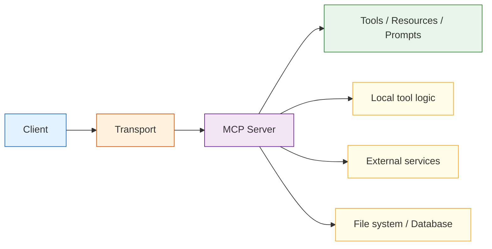

# 9.5.3 MCP Architecture and Core Concepts


:::tip Section overview
In the previous section, we learned that MCP is "a unified protocol for the tool access layer."
In this section, we’ll take one more step inward and answer:

> **What does an MCP system look like structurally?**

You’ll see that the focus of this chapter is not abstract slogans, but:

- How messages flow
- Who is responsible for what
- How the system goes from "discovering tools" to "actually executing tools"
:::

## Learning Objectives

- Understand the core role split in an MCP system
- Read a complete tool discovery and invocation flow
- Understand where transport fits in the architecture
- Build an understanding of the "protocol flow" rather than a "single interface"

---

## First, Get a Clear View of the Whole Architecture



What is most worth remembering in this diagram is not the node names, but this:

> **The Client does not directly operate the underlying world; it gets capabilities through the MCP Server as a unified entry point.**

---

## What Exactly Does the Client Do?

The Client’s responsibilities usually include:

- Establishing a connection
- Discovering which capabilities the server exposes
- Deciding whether to call something based on the current task
- Sending requests and receiving results

You can think of the client as the “user.”

In a real system, it might be:

- An IDE plugin
- A chat assistant
- A desktop Agent
- A workflow engine

Its core value is not that it “does everything itself,” but that it:

> **Knows when to ask the server for which capability.**

---

## What Exactly Does the Server Do?

The Server’s responsibilities usually include:

- Describing and exposing capabilities
- Receiving client requests
- Calling local or external tools
- Returning structured results

In other words, the server is more like the “capability provider.”

It is essentially saying to the outside world:

- What tools I have
- How each tool should be called
- What kinds of context objects I support

So the server is the core carrier of the protocol in practice.

---

## Why Can’t We Ignore Transport?

Many beginners focus only on:

- the client
- the server

But what actually enables communication between them is transport.

### What problem does it solve?

Simply put, it determines:

> What channel these protocol messages use to move back and forth.

For example:

- Local inter-process communication
- Standard input/output
- Network connections

### Why is transport important?

Because it affects:

- Latency
- Reliability
- Deployment form
- Debugging approach

So transport is not a minor detail you choose casually; it is part of the architecture.

---

## The Three Most Common Types of Capabilities in MCP

Although people often say “tools,” if we look more completely, the commonly exposed content can be understood as three types:

### Tools

Capabilities that can be called and executed.

For example:

- Search
- Read files
- Check the weather

### Resources

These are more like “readable information sources.”

For example:

- Document content
- Configuration data
- Database table snapshots

### Prompts

These are more like “reusable prompt templates.”

These three things are not exactly the same, but they all belong to the category of “exposed capabilities.”

---

## What Does a Complete Message Flow Look Like?

### First, Discover the Tools

```python
list_request = {
    "jsonrpc": "2.0",
    "id": 1,
    "method": "tools/list",
    "params": {}
}

list_response = {
    "jsonrpc": "2.0",
    "id": 1,
    "result": {
        "tools": [
            {"name": "search_docs", "description": "Search course documents"},
            {"name": "get_weather", "description": "Query the weather"}
        ]
    }
}

print(list_request)
print(list_response)
```

### Then, Call the Tool

```python
call_request = {
    "jsonrpc": "2.0",
    "id": 2,
    "method": "tools/call",
    "params": {
        "name": "search_docs",
        "arguments": {"query": "refund policy"}
    }
}

call_response = {
    "jsonrpc": "2.0",
    "id": 2,
    "result": {
        "content": [{"type": "text", "text": "A purchase can be refunded within 7 days if learning progress is below 20%."}]
    }
}

print(call_request)
print(call_response)
```

### What Do These Two Steps Really Show?

They show that MCP is not just “calling a function.” Instead, it has:

1. Capability discovery
2. Capability invocation

This way, the client does not need to hard-code all tool details.


:::tip Reading guide
Read this diagram in message order: the Client in the Host first requests `tools/list` from the Server, then sends `tools/call` after getting the capability list. The value of MCP is that “discovering capabilities” and “calling capabilities” share one unified protocol.
:::

---

## Why Is MCP Called a “Decoupling Layer”?

### Without MCP

The client usually has to know directly:

- How tools are named
- How parameters are written
- What the return result looks like

This creates tight coupling between the client and the tool provider.

### With MCP

The client relies more on:

- A unified protocol
- A unified discovery method
- A unified invocation method

This gives the system a clearer layering:

- The upper layer handles task orchestration
- The lower layer provides capabilities

So you can think of MCP as:

> **An adaptation layer and a decoupling layer in the tool ecosystem.**

---

## A Minimal Architecture Simulation

Below is a very simple MCP interaction simulated in pure Python.

```python
class MockMCPServer:
    def __init__(self):
        self.tools = {
            "search_docs": lambda query: f"Search result: {query}"
        }

    def list_tools(self):
        return [{"name": name} for name in self.tools]

    def call_tool(self, name, arguments):
        if name not in self.tools:
            return {"error": "unknown_tool"}
        return {"result": self.tools[name](**arguments)}

class MockMCPClient:
    def __init__(self, server):
        self.server = server

    def discover(self):
        return self.server.list_tools()

    def call(self, name, arguments):
        return self.server.call_tool(name, arguments)

server = MockMCPServer()
client = MockMCPClient(server)

print(client.discover())
print(client.call("search_docs", {"query": "refund policy"}))
```

### This example is small, but very valuable for learning

Because it already shows the three-layer division of labor:

- The client handles requests
- The server exposes capabilities
- The tool performs the actual work

As long as you understand this three-part division clearly, it will be much easier to study more realistic MCP systems later.

---

## The Most Common Architectural Misunderstandings

### Treating the server as the tool itself

The server is not the tool. It is:

> The protocol-facing gateway for tools.

### Thinking transport is optional

Transport directly affects deployment and stability.

### Assuming MCP automatically solves permissions and policy issues

It does not.
It solves “unified access,” not “automatic governance.”

---

## Summary

The most important thing in this section is not memorizing the words client/server, but understanding this:

> **The core of MCP architecture is to let capability providers and capability consumers relate to each other through a unified message flow and a unified boundary.**

Once this flow logic is clear, you’ll feel much more grounded when later learning server development, client integration, and ecosystem practices.

---

## Exercises

1. Explain in your own words: why must the responsibilities of the client and server be separated?
2. Think about this: if transport changes, why is it best for the upper-layer calling logic to stay as unchanged as possible?
3. Add a `get_weather` tool to `MockMCPServer`.
4. Explain in your own words: why is MCP called a “decoupling layer,” rather than the “tool itself”?
