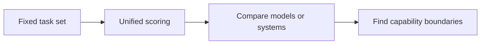

# 9.8.3 Agent Benchmarking


:::tip Section Overview
Benchmarks can help you understand the capability boundaries of a model or Agent, but they cannot replace your own project evaluation set. When it comes to production, the most important thing is whether your users’ tasks can be completed reliably.
:::

## Learning Objectives

- Understand the value and limitations of general benchmarks
- Know why business Agents must have custom evaluation sets
- Be able to design a small project benchmark
- Avoid ignoring real tasks just to chase leaderboard scores

---

## What Problem Do Benchmarks Solve

The purpose of a benchmark is to provide a fixed set of tasks so different models or systems can be compared. For example, a coding Agent can be evaluated on bug-fixing ability, a web Agent can be evaluated on browser operation ability, and a tool Agent can be evaluated on multi-step tool use.



Its value lies in being repeatable, comparable, and useful for observing trends. But it does not necessarily represent your real business use case.

## Common Types of Agent Benchmarks

| Type | Evaluation Focus | Typical Tasks |
|---|---|---|
| Code-based | Modify code, fix tests, understand repositories | Fix issues, pass unit tests |
| Web-based | Browse webpages, fill forms, find information | Multi-step browser tasks |
| Tool-calling | Choose tools, generate parameters, handle results | API calls, function composition |
| Long-horizon tasks | Plan, execute, recover, summarize | Research, analysis, report generation |

When learning these benchmarks, the key is not to memorize the names, but to understand how they define tasks, inputs, scoring, and failures.

## Why You Still Need a Custom Project Evaluation Set

General benchmarks cannot cover your course docs, your tool permissions, your user goals, and your business constraints. For example, your “AI learning assistant” needs to answer course questions, generate study plans, cite chapter sources, and avoid inventing course content. All of these must be tested with your own evaluation set.

A custom evaluation set should include at least 20 samples: 10 normal tasks, 5 boundary cases, 3 tool failure cases, and 2 safety or permission cases. Each sample should have clear success criteria.

You can organize the 20 samples like this:

| Group | Count | Example |
|---|---:|---|
| Normal tasks | 10 | Generate a study plan, answer a chapter question, summarize a concept |
| Boundary tasks | 5 | User asks vaguely, mixes multiple stages, or uses an incorrect chapter name |
| Tool failure tasks | 3 | Search returns empty, API timeout, document parser fails |
| Safety / permission tasks | 2 | User asks the Agent to delete files or send content without confirmation |

This distribution prevents a common beginner mistake: testing only the happy path.

## An Example Benchmark for a Course Agent

```json
{
  "id": "course_agent_008",
  "task": "Help me create a one-week RAG study plan and cite the course entry point",
  "expected_capabilities": ["retrieve course docs", "generate a plan", "provide sources"],
  "must_include": ["RAG basics", "retrieval strategy", "RAG evaluation"],
  "must_not_do": ["invent non-existent chapters", "call the write-file tool"],
  "scoring": {
    "coverage": 2,
    "source_accuracy": 2,
    "plan_quality": 1
  }
}
```

This example is more actionable than simply asking whether the answer is satisfactory, because it clearly defines what must be included, what must not be done, and how to score it.

## A minimal benchmark runner

A benchmark becomes useful only when you can run the same cases again after changing a Prompt, model, tool schema, or retrieval strategy.

Here is a very small scoring example:

```python
sample = {
    "id": "course_agent_008",
    "must_include": ["RAG basics", "retrieval strategy", "RAG evaluation"],
    "must_not_do": ["invent non-existent chapters", "call the write-file tool"],
}

answer = """
This one-week plan covers RAG basics, retrieval strategy, and RAG evaluation.
It cites the course RAG entry chapter and returns the plan as text only.
"""

def score_answer(sample, answer):
    answer_lower = answer.lower()
    include_hits = sum(item.lower() in answer_lower for item in sample["must_include"])
    forbidden_hits = sum(item.lower() in answer_lower for item in sample["must_not_do"])

    return {
        "coverage": include_hits / len(sample["must_include"]),
        "forbidden_violations": forbidden_hits,
        "pass": include_hits == len(sample["must_include"]) and forbidden_hits == 0,
    }

print(score_answer(sample, answer))
```

Expected output:

```text
{'coverage': 1.0, 'forbidden_violations': 0, 'pass': True}
```

This is deliberately simple. In a real Agent benchmark, you would also inspect:

- Whether cited chapters actually exist
- Whether the Agent used allowed tools only
- Whether it recovered from empty retrieval results
- Whether it asked for confirmation before risky actions
- Whether latency and cost stayed within acceptable limits

## Limitations of Benchmarks

Benchmarks are easy to overfit. A system may perform very well on fixed tasks, but become unstable when given real user input. Benchmarks may also ignore cost, latency, safety, and maintainability. For Agents, whether the execution trace is explainable is sometimes more important than the final score.

## Recommended Way to Use Benchmarks

Start with general benchmarks to build intuition about capability, then use a custom evaluation set to validate project quality. Every time you change the Prompt, switch models, modify the tool schema, or add a retrieval strategy, run the same evaluation set again. That way, you can tell whether the change improved performance, made it worse, or only changed the output style.

## Common Mistakes

The first mistake is treating benchmark scores as production quality. The second is only testing normal tasks and not testing failures or boundary cases. The third is having too few evaluation samples and judging the system based on a few demos. The fourth is not saving historical results, which makes version comparison impossible.

## Exercises

1. Design 20 benchmark samples for your course Q&A assistant.
2. Write must_include, must_not_do, and scoring rules for each sample.
3. Design 3 tool failure scenarios, such as empty retrieval results, API timeout, or insufficient permissions.
4. Explain why benchmarks cannot replace production monitoring.

## Passing Criteria

After completing this section, you should be able to explain the difference between general benchmarks and custom evaluation sets, design a small benchmark for your own Agent project, and use a fixed evaluation set to compare the effectiveness of different models, Prompts, and tool designs.
