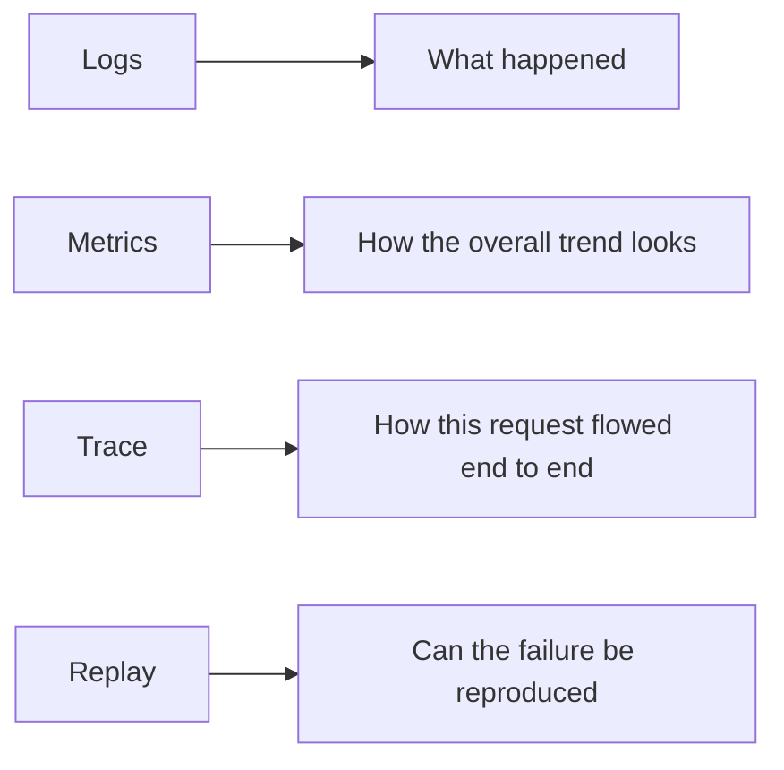
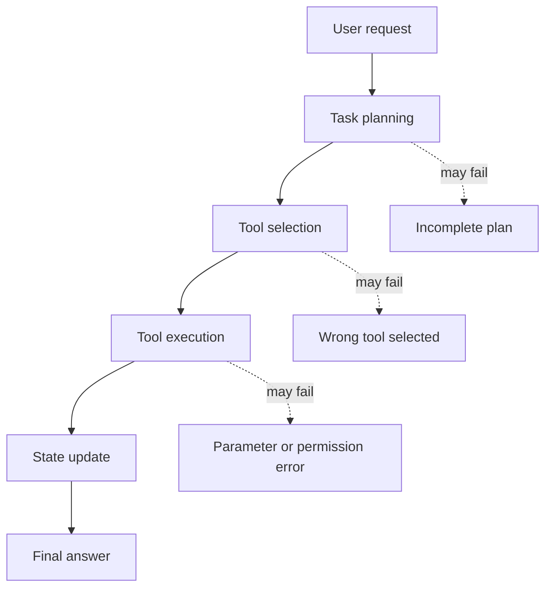

# 9.8.6 Agent Observability

:::tip Section Positioning
If an Agent system has no observability, many problems become “something looks weird, but we don’t know which step is weird.” The core of this section is to make the system’s internal process visible, traceable, and replayable.
:::

## Learning Objectives

- Understand what problems logs, metrics, traces, and replay each solve
- Know why Agents need trace-level observability more than normal APIs
- Be able to design a minimal Agent trace schema
- Be able to use observability data to locate tool-calling, retrieval, planning, and cost issues

---

## First, build a map



A normal API usually only needs to know whether a request succeeded or failed, how long it took, and what the error code was. Agents are different: one request may involve multiple rounds of reasoning, multiple retrievals, multiple tools, state changes, and human confirmation. If you only save the final answer, it is almost impossible to explain why it answered incorrectly, why it called the wrong tool, or why the cost suddenly increased.

## Why Agents especially need observability

Agent failures are often not single-point failures, but chain failures. For example, if a user asks, “Help me organize RAG review materials,” the system may first split the task, then look up course docs, then generate a plan, and then call a file tool. If the final result is bad, the reason might be that the task was split incorrectly, retrieval was wrong, the tool parameters were wrong, context was lost, or the model ignored the sources during final generation.



So the goal of Agent observability is not “print a few more lines of logs,” but to reconstruct the execution trace of a task.

## The four most important observability targets

Logs answer “what happened,” such as starting retrieval, calling a tool, or a tool error. Metrics answer “what the overall trend looks like,” such as average latency, success rate, token cost, and tool failure rate. Traces answer “how this request flowed end to end,” such as each step’s input, output, and state changes. Replay answers “whether the failure can be reproduced,” meaning enough context is preserved so you can rerun it or analyze it manually.

| Type | Focus | Typical fields |
|---|---|---|
| Logs | Single event | timestamp, level, event, message |
| Metrics | Aggregated trends | success_rate, latency_ms, cost, tool_error_rate |
| Trace | Request path | request_id, step_id, node, input, output, status |
| Replay | Failure reproduction | raw input, retrieval results, tool outputs, model parameters, final output |

## A minimal trace schema

When you first build Agent observability, you do not need a complex platform right away. First, make sure every request leaves a structured trace.

```python
from dataclasses import dataclass, asdict
from time import time
from uuid import uuid4


@dataclass
class TraceStep:
    request_id: str
    step_id: int
    node: str
    input_summary: str
    output_summary: str
    status: str
    latency_ms: int
    cost_tokens: int = 0


def run_agent(query):
    request_id = str(uuid4())
    trace = []

    start = time()
    plan = "First retrieve course docs, then generate a review plan"
    trace.append(TraceStep(request_id, 1, "planner", query, plan, "ok", int((time() - start) * 1000)))

    start = time()
    docs = ["RAG includes chunking, vectorization, retrieval, generation, and citation checks"]
    trace.append(TraceStep(request_id, 2, "retriever", "RAG review", str(docs), "ok", int((time() - start) * 1000)))

    start = time()
    answer = "I suggest reviewing in this order: fundamentals -> retrieval optimization -> evaluation set -> project retrospective."
    trace.append(TraceStep(request_id, 3, "generator", str(docs), answer, "ok", int((time() - start) * 1000), cost_tokens=120))

    return answer, [asdict(step) for step in trace]


answer, trace = run_agent("Help me prepare for the RAG phase review")
print(answer)
for step in trace:
    print(step)
```

The most important thing in this example is not the code complexity, but that it turns every step into an inspectable object. Later, whether you use LangGraph, LlamaIndex, CrewAI, or write functions yourself, the underlying system should preserve a similar trace.

## How to inspect traces when debugging problems

When Agent output quality is poor, do not start by changing the Prompt. A more stable debugging order is: first check whether planning is correct, then whether retrieval or tool results are correct, then whether the model used those results correctly, and only then look at the final wording.

| Symptom | First thing to check | Possible cause |
|---|---|---|
| Off-topic answer | planner / retriever | Wrong task understanding, wrong retrieval query |
| Hallucinated source | retriever / generator | No relevant docs found, or generation did not cite retrieved results |
| Tool not executed | tool_select / tool_call | Tool description unclear, insufficient permission, wrong parameter schema |
| Cost suddenly increased | metrics / trace | Looping calls, overly long context, too many retries |
| Intermittent failure | replay samples | Input edge cases, external service instability, state not persisted |

## The fields most worth recording first

If you can only build the minimum version first, it is recommended to keep at least: request_id, user_query, plan, selected_tools, tool_inputs, tool_outputs, retrieved_docs, final_answer, latency_ms, token_usage, status, error_message. These fields cover most debugging needs.

For high-risk Agents, you should also record human_approval, permission_scope, rollback_action, and audit_log. Any action involving sending messages, modifying files, deleting data, making payments, or sending emails cannot rely only on the final result.

## Relationship with existing tools

In real projects, you can use LangSmith, OpenTelemetry, Arize Phoenix, Helicone, or cloud logging systems to host observability data. The course does not require you to bind to a specific tool, but you should understand that these tools are all solving the same problem: linking model calls, retrieval, tools, state, and cost into a queryable execution trace.

More importantly, do not treat the tool as the whole of observability. Even if you use a platform, if your event naming is messy, fields are missing, or request_id does not run through the whole chain, troubleshooting will still be difficult.

## Common misconceptions

The first misconception is recording only the final answer. The final answer only shows the result, not the process. The second misconception is writing only natural-language logs and not keeping structured fields; later, it becomes hard to aggregate and filter. The third misconception is recording only when errors happen; successful samples are equally important because you need to compare the differences between successful and failed paths. The fourth misconception is having no cost metrics, which makes the system runnable but not sustainable.

## Unified observability fields for AI applications

Although this section focuses on Agents, the earlier LLM APIs, Prompts, RAG, and tool calls also need observability. A better approach is to have all AI applications share one request_id and then record data in layers.

| Layer | Required fields | What it helps debug |
|---|---|---|
| LLM call layer | model, prompt_version, input_preview, output_preview, tokens, latency, error | Model output, cost, latency, format drift |
| Prompt layer | prompt_version, schema_version, parse_status, validation_error | Whether structured output is stable |
| RAG layer | query, rewritten_query, top_k, scores, source_ids, context_length | Whether the right materials were found, whether context is reasonable |
| Agent layer | goal, step, action, arguments, observation, next_decision | Why this action was chosen, why it continued or stopped |
| Tool layer | tool_name, permission_scope, arguments, result_status, retry_count | Whether the right tool was chosen, whether parameters were correct, whether it failed |
| Safety layer | risk_level, human_approval, blocked_reason, rollback_action | Whether high-risk actions were confirmed and audited |

This table can serve as the starting point for logging design in all AI projects. Do not wait until the system breaks before thinking about adding logs; without request_id and structured fields, it will be very hard to connect a failure end to end later.


:::tip Reading Guide
When reading this diagram, focus on the request_id thread: one user request passes through multiple spans such as planner, retriever, tool, LLM, and safety. Only when the chain can be connected can troubleshooting stop relying on guesswork.
:::

## An example of cross-layer trace for one request

Below is a cross-layer trace for a “course learning assistant.” It goes through RAG, LLM, and the Agent tool layer.

```json
{
  "request_id": "req_001",
  "user_query": "Help me create a 3-day RAG review plan",
  "rag": {
    "query": "RAG 3-day review plan",
    "top_k": 3,
    "source_ids": ["rag-basics", "retrieval-strategies", "rag-evaluation"],
    "context_length": 820
  },
  "llm": {
    "model": "demo-chat-model",
    "prompt_version": "study_plan_v2",
    "prompt_tokens": 520,
    "completion_tokens": 180,
    "latency_ms": 1200,
    "parse_status": "ok"
  },
  "agent": {
    "steps": [
      {"step": 1, "action": "retrieve_course_docs", "status": "ok"},
      {"step": 2, "action": "build_study_plan", "status": "ok"}
    ],
    "final_status": "ok"
  }
}
```

The most important thing in this example is that it does not mix all logs into a single block of text, but records them in layers. In this way, when the answer is poor, you can first determine whether RAG failed to find the right information, whether the Prompt did not constrain the output well enough, whether the LLM output was unstable, or whether the Agent tool step had a problem.

## How observability data enters a portfolio

A portfolio does not need to show all raw logs, but it should show how you used logs to improve the system.

| README module | What you can show |
|---|---|
| Debug log samples | Trace summaries for one successful request and one failed request |
| Metrics dashboard | Average latency, failure rate, token cost, retrieval hit rate |
| Failure attribution | Failed samples mapped to the LLM, RAG, Agent, tools, or safety layer |
| Improvement record | Metric changes and trade-offs before and after the change |
| Safety audit | How high-risk actions are confirmed, rejected, and recorded |

This makes the project feel more mature: you can not only build the functionality, but also observe it, evaluate it, explain it, and keep improving it.

## Minimal log file design

If you have not yet connected a professional observability platform, you can start by logging with JSONL files. Each line is one event or one trace.

```text
logs/
├── llm_calls.jsonl
├── retrieval_logs.jsonl
├── agent_traces.jsonl
├── tool_calls.jsonl
└── safety_audit.jsonl
```

Each file should include request_id. In this way, you can use the same request_id to connect one user request all the way from model calls, retrieval, tool execution, and safety confirmation.

---

## Exercises

1. Add `error_message` and `retry_count` fields to the trace example above.
2. Design a trace schema for a RAG Agent, including at least retrieval query, matched documents, and citation check results.
3. Take an LLM example you wrote before and add request_id and latency_ms.
4. Think: if an Agent can delete files, what additional safety fields must be recorded in the trace?

## Passing criteria

After finishing this section, you should be able to explain the differences between logs, metrics, traces, and replay; write a minimal Agent trace schema; determine from a trace whether an error happened during planning, retrieval, tool use, or generation; and include observability in your own Agent project README.
