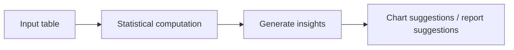

# 9.10.3 Project: Data Analysis Agent

:::tip Section focus
The real value of a Data Analysis Agent is not:

- helping you calculate the average

But rather:

> **Can it connect “read data -> analyze -> explain conclusions” into a reproducible chain?**

That is why this kind of project is especially good for showing multi-step tool coordination and intermediate states.
:::

## Learning objectives

- Learn how to define the minimum project scope for a Data Analysis Agent
- Learn how to connect data input, statistical computation, and explanatory output into a closed loop
- Learn how to use a minimal example to demonstrate “reproducibility”
- Learn how to package this topic into a strong one-page portfolio project

---

## First, build a map

A Data Analysis Agent is easier to understand as “read data -> compute statistics -> form interpretation -> provide visualization suggestions”:



So what this section really wants to solve is:

- Why a Data Analysis Agent is not just “good at calling pandas”
- Why a reproducible intermediate process is more important than a final one-line conclusion

---

## How should we narrow the project topic?

It is recommended to start with:

- reading a small table
- calculating a few core statistics
- generating an insight summary based on those statistics

Rather than starting with:

- an automatic BI platform
- a fully automated report factory

### A more beginner-friendly overall analogy

You can think of a Data Analysis Agent as:

- an analysis assistant that first computes, then explains, and can also suggest how to visualize the data

Its difference from a regular calculator is not:

- calculating faster

But rather:

- organizing numbers into conclusions with explanatory power

---

## First run a minimal data analysis loop

This example will:

1. Read a small sales table
2. Compute total sales and category averages
3. Give a simple analytical conclusion

```python
sales = [
    {"category": "course", "amount": 299},
    {"category": "course", "amount": 199},
    {"category": "book", "amount": 59},
    {"category": "book", "amount": 79},
    {"category": "service", "amount": 499},
]


def summarize_sales(rows):
    total = sum(row["amount"] for row in rows)

    grouped = {}
    for row in rows:
        grouped.setdefault(row["category"], []).append(row["amount"])

    per_category_avg = {
        category: round(sum(values) / len(values), 2)
        for category, values in grouped.items()
    }

    top_category = max(per_category_avg, key=per_category_avg.get)

    return {
        "total_amount": total,
        "per_category_avg": per_category_avg,
        "insight": f"{top_category} has the highest average order value.",
    }


result = summarize_sales(sales)
print(result)
```

Expected output:

```text
{'total_amount': 1135, 'per_category_avg': {'course': 249.0, 'book': 69.0, 'service': 499.0}, 'insight': 'service has the highest average order value.'}
```


:::tip Reading the result
Use the image to read the printed dictionary as evidence: raw rows feed grouped averages, the highest average becomes the insight, and the chart rule turns the same fields into a presentation suggestion.
:::

### Why is this already very project-like?

Because it does not only do “computation”,
it also does:

- input data
- intermediate statistics
- output conclusions

This is already the smallest data analysis workflow.

### Why is `insight` especially important?

Because users are usually not trying to look at raw numbers,
but want:

- conclusions with explanatory power

This is exactly the difference between a Data Analysis Agent and a regular calculator.

### A beginner-friendly project checklist to remember first

| Step | What should you confirm first |
|---|---|
| Input data | Are the field meanings clear |
| Intermediate statistics | Are the calculation rules consistent |
| insight | Do the conclusion and the numbers match |
| Chart suggestions | Does the chart type fit the data shape |

This table is especially useful for beginners because it compresses “Data Analysis Agent” back into a workflow that can be checked step by step.


:::tip Reading guide
Read this diagram using a notebook mindset: load data, profile schema, compute statistics, generate insight, suggest chart, write report. Every conclusion should be traceable back to the intermediate computation results.
:::

---

## What should a portfolio-level Data Analysis Agent show?

### What does the input data look like?

It is best to make clear:

- fields
- sample size
- missing value status

### Intermediate computation results

For example:

- summary statistics
- grouped results
- trend judgments

### Final explanation

For example:

- which product category performed best
- which time period fluctuated the most

### Chart suggestions

Even if you do not generate charts directly, you can still output:

- whether a bar chart or a line chart should be used

This makes the project feel closer to a real analysis assistant.

---

## Add a minimal “chart recommender”

```python
def suggest_chart(columns):
    if "date" in columns and "amount" in columns:
        return "line_chart"
    if "category" in columns and "amount" in columns:
        return "bar_chart"
    return "table"


print(suggest_chart(["category", "amount"]))
print(suggest_chart(["date", "amount"]))
```

Expected output:

```text
bar_chart
line_chart
```

### What value does this small module provide?

It shows that the project is not just “doing arithmetic”,
but is gradually moving toward:

- analysis
- explanation
- visualization suggestions

### Let’s look at a minimal “analysis trace” example

Continue in the same file or Python session, because this block reuses `sales` and `result`.

```python
trace = {
    "input_rows": len(sales),
    "total_amount": result["total_amount"],
    "per_category_avg": result["per_category_avg"],
    "insight": result["insight"],
}

print(trace)
```

Expected output:

```text
{'input_rows': 5, 'total_amount': 1135, 'per_category_avg': {'course': 249.0, 'book': 69.0, 'service': 499.0}, 'insight': 'service has the highest average order value.'}
```

This example is especially suitable for beginners because it helps you see:

- where the real value of a Data Analysis Agent project lies
- often in whether the process can be verified

---

## Evidence to Keep

Keep this page's proof of learning as a small evidence card:

```text
project_goal: what the agent should accomplish and what it must not do
baseline: single-agent loop before adding advanced features
trace_pack: goal, plan, tool calls, observations, memory, evaluation
failure_log: one failed or unsafe run with root cause
deliverable: README, run command, trace screenshot/log, next step
```

## The most common pitfalls

### Misunderstanding the fields

This is a typical fatal problem for Data Analysis Agents.
If the field meanings are misunderstood, the entire workflow may be led astray.

### Only showing the conclusion, not the intermediate process

This makes the project feel like a black box and makes it hard to build trust.

### Only handling the happy path

If you do not show:

- missing values
- outliers
- inconsistent calculation rules

the project will feel unrealistic.

---

## How do you polish it into a portfolio-level page?

### Suggested structure

1. Raw data example
2. Intermediate statistics table
3. Insight summary
4. Chart suggestions
5. Error cases

### One highlight worth adding

Show:

- raw data
- intermediate computations
- final conclusions

as a single trace.
This will be much stronger than pasting only a result.

### A beginner-friendly evaluation table to remember first

| Dimension | What is the most important first question |
|---|---|
| Correctness | Are the numbers calculated correctly |
| Reproducibility | Can the intermediate process be traced back |
| Interpretability | Do the conclusions match the statistics |
| Presentation | Do the chart suggestions naturally fit the conclusions |

This table is especially useful for beginners because it breaks “Is the Agent project good?” into a few more concrete judgments.

---

## Summary

The most important thing in this section is to build a portfolio-level judgment:

> **The real highlight of a Data Analysis Agent is not whether it can call pandas, but whether it can organize input data, intermediate computations, and final insights into a reproducible analysis loop.**

As long as that loop is clear, this project is very well suited to showing your understanding of multi-tool Agents.

## If you turn this into a portfolio project, what is most worth showing?

What is usually most worth showing is not:

- a single analytical conclusion

But rather:

1. A raw data example
2. Intermediate statistical results
3. How the insight was generated
4. Why the chart suggestion was made that way

This makes it easier for others to see:

- that you understand the analysis loop
- not just that the Agent said something

---

## Suggested version roadmap

| Version | Goal | Delivery focus |
|---|---|---|
| Basic version | Run the minimal loop | Can input, process, and output, with one set of examples preserved |
| Standard version | Form a presentable project | Add configuration, logs, error handling, README, and screenshots |
| Challenge version | Approach portfolio quality | Add evaluation, comparison experiments, failure sample analysis, and next-step roadmap |

It is recommended to finish the basic version first; do not chase a large, all-in-one solution from the start. For each version upgrade, write into the README what new capability was added, how it was verified, and what problems still remain.

## Exercises

1. Add a `date` field to the example data and expand the project into a simple time-trend analysis.
2. Think about why “reproducibility” is especially important for a Data Analysis Agent.
3. If the conclusions do not match the numbers, which layer is most likely to be the problem?
4. If you were presenting this as a portfolio project, which part would you design to be the most eye-catching?

<details>
<summary>Reference answers and explanation</summary>

1. Add `date` to each row, group by week or month, and ask the Agent to compute a trend such as total sales, average order value, or churn rate over time. The output should include both code and a chart/table.
2. Reproducibility matters because analysis conclusions must be rerunnable. Keep the data version, cleaning steps, code, parameters, generated chart, and final narrative linked together.
3. If conclusions do not match numbers, inspect the analysis layer first: aggregation logic, filters, date handling, and chart interpretation. Then check whether the generation layer overstated the result.
4. For a portfolio, make the most eye-catching part the evidence loop: user question -> generated code -> computed table/chart -> checked conclusion -> trace. That proves the Agent can reason over data, not just talk about it.

</details>
