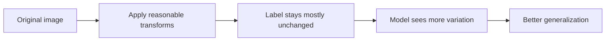

# 10.2.2 Data Augmentation Strategies


:::tip Section focus
One of the most common and easiest-to-underestimate techniques in image classification is data augmentation.

It does not solve “the model can’t learn”; instead, it addresses this problem:

> **The model is too easy to fool into treating accidental details in the training set as real patterns.**

With proper augmentation, we let the model see more “reasonable variations of the same image,” so it learns more robustly.
:::

## Learning Objectives

- Understand why data augmentation can improve generalization
- Distinguish what kinds of problems different common augmentation methods are suited for
- Understand the augmentation assumption that “the label stays the same”
- Build intuition for the augmentation pipeline through runnable examples

---

## First, Build a Map

If you are coming from Station 6, you can think of this section as:

- You already know that convolutional networks learn features from images
- This section starts solving the problem of “how to keep them from only memorizing the surface appearance of the training set”

So data augmentation is not a small trick in vision; it helps with:

- How the model handles changes in viewpoint, brightness, cropping, and occlusion in the real world

For beginners, the best way to understand this section is not to “memorize how many transform names there are,” but first to see clearly:



So what this section really wants to answer is:

- Why image classification especially needs augmentation
- When augmentation helps, and when it starts hurting semantics

## Why Do Vision Tasks Need Data Augmentation So Much?

### The Real World Is Always Changing

The same cat can appear in different images with:

- changes in angle
- changes in lighting
- changes in background
- partial occlusion

If the training set does not cover enough of this, the model can easily mistake incidental background details for real features.

### Augmentation Is Not “Creating More Data,” but “Simulating Reasonable Variation”

After a proper transform,
the meaning of the image usually stays the same.

For example:

- A cat after a horizontal flip is still a cat
- A dog after a slight crop is still a dog

That is why augmentation helps the model learn more robustly.

### When You First Learn Data Augmentation, What Should You Focus on Most?

The most important thing is not a list of APIs, but this sentence:

> **Augmentation simulates the fact that the same object can appear in different reasonable forms.**

Once that idea is clear, when you later see:

- flipping
- cropping
- color jitter
- Mixup / CutMix

it becomes much easier to judge whether they are helping or whether they are already hurting semantics.

### An Analogy

Data augmentation is like practicing variation questions before an exam.
You are not changing the subject; you are preventing yourself from memorizing only the surface form of one problem.

---

## The Most Common Types of Augmentation

### Geometric Augmentation

For example:

- flipping
- translation
- cropping
- rotation

It mainly helps the model handle:

- viewpoint and position changes

### Color Augmentation

For example:

- brightness
- contrast
- saturation

It mainly helps the model handle:

- lighting and shooting-condition changes

### Combined and Mixed Augmentation

For example:

- Cutout
- Mixup
- CutMix

They are more aggressive, but often more effective too.

### When You First Do Image Classification, Which Type of Augmentation Should You Start With?

A more stable order is usually:

1. Start with geometric augmentation
   Because it is the most intuitive and easiest to connect with “real viewpoint changes.”

2. Then add light color augmentation
   To handle lighting and capture-condition changes.

3. Finally try more aggressive mixed augmentation
   Because by then you already have a baseline, so it is easier to tell whether there is real benefit.

---

## First Run a Minimal Augmentation Pipeline Example

The example below does not rely on an image library.
Instead, it uses a 2D list to simulate a grayscale image, helping you grasp the core idea of augmentation.

```python
image = [
    [1, 2, 3],
    [4, 5, 6],
    [7, 8, 9],
]


def horizontal_flip(img):
    return [list(reversed(row)) for row in img]


def center_crop(img, size=2):
    return [row[:size] for row in img[:size]]


def brightness_shift(img, delta=1):
    return [[pixel + delta for pixel in row] for row in img]


print("original:")
for row in image:
    print(row)

print("\nflip:")
for row in horizontal_flip(image):
    print(row)

print("\ncrop:")
for row in center_crop(image):
    print(row)

print("\nbrightness:")
for row in brightness_shift(image):
    print(row)
```

Expected output:

```text
original:
[1, 2, 3]
[4, 5, 6]
[7, 8, 9]

flip:
[3, 2, 1]
[6, 5, 4]
[9, 8, 7]

crop:
[1, 2]
[4, 5]

brightness:
[2, 3, 4]
[5, 6, 7]
[8, 9, 10]
```

### What Should You Focus on Most in This Example?

The essence of augmentation is not the image-library API,
but:

- applying reasonable transforms to the input
- while trying not to change the label semantics

### Why Is “Reasonable” So Important?

If you randomly rotate digit images like “6” and “9,”
the label may really change.

So augmentation is not about blindly making it stronger and stronger.
It must also respect the task semantics.

### Why Is This Especially Important for Vision Tasks?

Because in vision, many labels actually depend on geometry and orientation.

For example:

- For ordinary natural images, horizontal flipping may be fine
- For digit recognition, arbitrary rotation may change the class meaning
- In detection and segmentation, augmentation must also update boxes and masks together

So augmentation is not “the more you add, the more advanced it is,” but rather:

- whether you are still respecting the semantic boundaries of the task itself


:::tip Reading hint
When reading this diagram, focus on one sentence: augmentation trains the model to ignore “reasonable changes,” but it must not break label semantics. For classification, detection, and segmentation, labels, boxes, and masks must be handled together.
:::

---

## Why Is Mixup Worth Remembering Separately?

### It Does Not Just Modify the Image — It Mixes the Labels Too

The core idea of Mixup is:

- mix two images by a ratio
- mix the labels by the same ratio

### A Purely Numeric Intuition Example

```python
img_a = [1.0, 2.0, 3.0]
img_b = [7.0, 8.0, 9.0]
label_a = [1.0, 0.0]
label_b = [0.0, 1.0]
alpha = 0.7

mixed_img = [round(alpha * a + (1 - alpha) * b, 2) for a, b in zip(img_a, img_b)]
mixed_label = [round(alpha * a + (1 - alpha) * b, 2) for a, b in zip(label_a, label_b)]

print("mixed_img:", mixed_img)
print("mixed_label:", mixed_label)
```

Expected output:

```text
mixed_img: [2.8, 3.8, 4.8]
mixed_label: [0.7, 0.3]
```

### Why Can This Work Well?

It encourages the model to learn fewer extreme boundaries
and to form a smoother decision surface.

---

## Evidence to Keep

Keep this page's proof of learning as a small evidence card:

```text
dataset_split: train/test images, class names, and class balance
prediction: label, confidence, and at least one misclassified image
metric: accuracy, F1, confusion matrix, and class-level errors
failure_check: augmentation changes label meaning, class imbalance, leakage, or overfitting
Expected_output: model result table and saved error examples
```

## Common Pitfalls in Augmentation

### Mistake 1: More Augmentation Is Always Better

Too much augmentation can damage useful features.

### Mistake 2: Use the Same Augmentation Set for All Tasks

Classification, detection, and segmentation are not equally sensitive to the same augmentations.

### Mistake 3: Add Augmentation Without Validation

Augmentation is a means, not the goal.
In the end, you still need to check whether the validation set really benefits.

## The Safest Augmentation Order for Beginners Doing Image Classification for the First Time

If you are just starting with vision classification, it is recommended to follow this order:

1. Start with horizontal flipping
2. Then add light cropping
3. Then add light color jitter
4. After confirming that the baseline is stable, try Mixup / CutMix

This makes it easier to tell which type of augmentation is actually helping.

### What Should You Look At First to Verify Whether Augmentation Is Really Effective?

Do not only look at training loss.
A more stable judgment is:

- Did the validation metrics improve?
- Did the types of mistakes become more reasonable?
- Is the model no longer overly dependent on background or shooting pose?

In other words, the real value of augmentation is not just “a slightly higher score,” but helping the model learn more stable visual features.

---

## Summary

The most important thing in this section is to build one judgment:

> **The core of data augmentation is to simulate reasonable variation so the model learns to capture more stable visual features, instead of memorizing accidental details from the training set.**

Once you have this intuition, you will not get lost when you see more complex augmentation strategies later.

## What You Should Take Away from This Section

- Augmentation is not better just because it is stronger; it must match the task semantics
- When you start a project, begin with the most stable types of augmentation first
- Whether the validation set gets better is the real standard for deciding if an augmentation should be kept

If we compress it into one sentence, it is:

> **The essence of data augmentation is not to “mess up the image,” but to let the model see more reasonable variations without changing the semantics.**

---

## Exercises

1. Write a `vertical_flip` function for the example.
2. Think about this: why can rotation augmentation be harmful in some tasks?
3. Explain in your own words: what is the biggest difference between Mixup and ordinary augmentation?
4. If the validation performance drops, would you first suspect that the augmentation is too weak or too strong?

<details>
<summary>Reference answers and explanation</summary>

1. A simple `vertical_flip` can use `image[::-1]` or `np.flipud(image)`. If labels include masks or boxes, those labels must be flipped with the image too.
2. Rotation is harmful when orientation carries meaning, such as digits, traffic signs, medical images, or any task where upside-down examples are unrealistic.
3. Mixup blends both images and labels. Ordinary augmentation usually changes one image while keeping the same label.
4. If validation performance drops, first visualize augmented samples. The common cause is augmentation that is too strong or semantically wrong, though weak augmentation can still leave overfitting.

</details>
