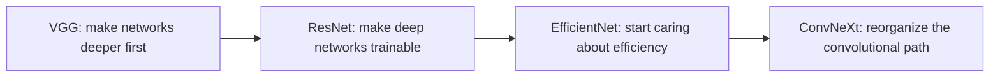

# Modern Classification Architectures

:::tip Section focus
When doing image classification, model architecture is not simply “the newer, the better.”
Instead, it keeps evolving around a few core questions:

- How can we make networks deeper?
- How can we make training more stable?
- How can we use compute more efficiently?

This section is not about memorizing model names. It is about helping you understand the motivations behind their evolution.
:::

## Learning Objectives

- Understand what problems several generations of mainstream image classification architectures are trying to solve
- Understand why residual connections changed deep network training
- Understand why efficiency-focused architectures matter
- Build basic judgment for architecture selection

---

## First, Build a Map

If you just finished data augmentation, the most natural next step is:

- The previous section focused on “how to feed the same image to the model in a more stable way”
- This section starts to solve “how the model backbone itself should be designed to be stronger, more stable, and more efficient”

So this section is not about memorizing architecture names by themselves. It fills in the other half of image classification:

- How data is prepared
- How the network is built in a reasonable way

For beginners, the best way to understand modern classification architectures is not to “look at a list of names,” but to first see what problems the evolution of architectures is answering:



So what this section really wants to address is:

- Why image classification networks keep evolving
- What kinds of bottlenecks different architectures are trying to fix

### A Better Analogy for Beginners

You can understand the evolution of classification architectures as:

- A factory assembly line being upgraded again and again

Each upgrade is not about making the machine look fancier,
but about answering very practical questions:

- Can the line be made longer?
- Will the machines become unstable as they run?
- Can we produce more with the same electricity bill?

## 1. Why Do Image Classification Architectures Keep Evolving?

### 1.1 Because “deeper” does not automatically mean “better”

In early networks, once they became deeper, they often ran into:

- Hard-to-propagate gradients
- Optimization difficulties
- Unstable training

### 1.2 So later evolution is essentially answering two questions

1. How can deep networks be trained better?
2. How can performance and efficiency be balanced?

### 1.3 An Analogy

Architecture evolution is like continually upgrading an assembly line:

- Not to make the machine more ornate
- But to keep it working reliably at larger production scales

### 1.4 When Learning This Section for the First Time, What Should You Focus On?

What matters most is not the model year or leaderboard, but this sentence:

> **The essence of architecture evolution is solving “how to train deeper models, how to make them stronger with less cost, and how to keep them stable in a modern way.”**

Once that idea is clear, whenever you see a new architecture, you’ll naturally ask:

- What bottleneck is it mainly addressing?
- Is it solving depth, stability, or efficiency?

---

## 2. What Did Different Generations of Architectures Focus On?

### 2.1 VGG: First Make “Going Deeper” Work

Features:

- Regular structure
- All small convolutions
- Deeper networks

Its significance is:

- It proved that deeper networks can significantly improve capability

### 2.2 ResNet: Make Very Deep Networks Actually Trainable

The core intuition of residual connections is:

- Each layer does not need to learn a completely new transformation
- Instead, it learns an increment on top of the existing representation

This greatly improves training stability in deep networks.

### 2.2.1 Why Did ResNet Become One of the Most Important Turning Points in Image Classification?

Because it was the first architecture to systematically solve a very important problem:

- Networks want to become deeper
- But deeper networks are hard to train

The significance of ResNet is not just “the score got better.” It connected:

- Deeper networks
- Trainability

These two things were finally brought together.

### 2.3 EfficientNet: Start Taking Compute Efficiency Seriously

It does not only ask, “Can it be stronger?”
It also asks:

- How can we get better value with the same budget?

### 2.4 ConvNeXt: Re-examining the Convolutional Family

After Transformer became dominant,
the convolutional path also began to be reorganized and modernized.

This shows:

- Architecture evolution is not a one-way replacement

### 2.5 A More Beginner-Friendly Architecture Comparison Table

| Architecture | The most important thing to remember first | What intuition it helps you build |
|---|---|---|
| VGG | Deep, regular, easy to understand | Why deeper networks can be stronger |
| ResNet | Residual connections | How deep networks train more stably |
| EfficientNet | Performance and efficiency together | Why accuracy is not the only thing that matters |
| ConvNeXt | Convolutions can still be modernized | Architecture is not a simple new-vs-old binary |

### 2.7 Where Do Beginners Most Easily Go Wrong When Learning Architecture Evolution?

It is easiest to turn it into:

- A bunch of model names
- A bunch of layer counts
- A bunch of leaderboard conclusions

But a more valuable way to learn is:

- First ask about the motivation
- Then ask about the structural changes
- Finally ask whether it is worth using as a baseline in a project

### 2.6 If You Put Them Into “Project Selection,” How Should You Understand Them?

A more practical way to remember them is:

- `VGG`: more like a classic teaching starting point, good for building a sense of “depth and structure”
- `ResNet`: the most reliable engineering baseline; in many projects, people still reach for it first
- `EfficientNet`: especially valuable when you start caring about “more value for the same resources”
- `ConvNeXt`: more suitable when you want to understand how “the convolutional family can still be modernized”

### 2.8 A Practical Architecture Selection Table for Beginners

| Your goal | Safer first choice |
|---|---|
| Your first image classification project | ResNet |
| You want to understand why deep networks can be trained stably | ResNet |
| You want both performance and efficiency | EfficientNet |
| You want to study the evolution of visual architectures | VGG -> ResNet -> ConvNeXt |

This table is useful for beginners because it turns “model names” back into “when should I think of this first?”


:::tip Reading tip
Do not read this diagram as a model leaderboard. Read it as a “problem evolution map”: VGG first proved that depth works, ResNet solved trainability for deep networks, EfficientNet focused on efficiency, and ConvNeXt represents a modernized organization of the convolutional path.
:::

---

## 3. Build Intuition with a Minimal Residual Example First

```python
def block_without_residual(x):
    transformed = x * 0.6 + 0.2
    return transformed


def block_with_residual(x):
    transformed = x * 0.6 + 0.2
    return x + transformed


x = 1.0
print("without residual:", block_without_residual(x))
print("with residual   :", block_with_residual(x))
```

### 3.1 What Is This Example Trying to Show?

You can first understand residual connections as:

- Not completely replacing old information
- But adding a new correction on top of the old information

This is very important for training deep networks.

### 3.2 Why Does This Relate to “Deeper but More Stable”?

Because when the network is very deep,
fully rewriting representations is harder to learn than “gradually refining” them layer by layer.

### 3.4 When Seeing Residual Connections for the First Time, the Most Important Thing to Remember Is Not the Formula, but “Keeping the Original Path”

You can first think of a residual block as:

- The new branch learning corrections
- The original path preserving existing information

This makes it easier to understand why it helps deep networks:

- Information does not need to be forcibly rewritten at every layer
- Gradients can also flow back more easily

### 3.3 What Should Beginners Remember First When Learning This Section?

The most important things to remember are:

1. Architecture evolution is not “new models endlessly replacing old ones”
2. Many improvements are about training stability and efficiency
3. ResNet matters not only because it is strong, but because it made “deeper networks can still be trained” a reality

---

## 4. How Should You Choose Modern Classification Architectures?

### 4.1 If You Are a Beginner Building a Baseline

Prioritize:

- Classic strong baselines such as ResNet

### 4.2 If You Are Very Sensitive to Resources

You should pay more attention to:

- EfficientNet
- Lighter-weight convolutional architectures

### 4.3 If You Are Doing Research or Strong Performance Comparisons

Only then is it worth systematically comparing different families.

### 4.4 When Doing Your First Image Classification Project, How Can You Make a Safer Choice?

A stable sequence is usually:

1. Use ResNet first to establish a strong baseline
2. If resources are truly limited, then look at efficiency-focused approaches such as EfficientNet
3. If you really want a deeper comparison, then study more families

This is usually better than chasing the trendiest architecture from the start.

### 4.5 A Practical Selection Table for Beginners

| Your scenario | Safer first choice |
|---|---|
| Your first image classification project | ResNet |
| Device resources are limited | EfficientNet or a lightweight convolutional network |
| You want to understand the evolution of convolutional systems | VGG -> ResNet -> ConvNeXt |
| You want to do a more serious architecture comparison | Systematically compare different families |

### 4.6 The Safest Default Sequence When Putting Architectures into a Project for the First Time

A safer sequence is usually:

1. Use ResNet to establish a strong baseline
2. Check whether the data and training pipeline are already stable
3. If resources are truly limited, switch to an efficiency-focused architecture
4. Finally, do comparisons across architecture families

This makes it easier to see where the gains actually come from than chasing the “most advanced backbone” right away.

---

## 5. The Most Common Misconceptions

### 5.1 Misconception 1: Memorizing names without remembering the problem

What matters more is knowing:

- What bottleneck is it actually solving?

### 5.2 Misconception 2: The newest architecture is definitely the best fit for the current project

In reality, a mature strong baseline is often more reliable.

### 5.3 Misconception 3: A deeper network is always stronger

Without a good optimization structure, depth easily becomes a burden.

---

## 7. A Very Useful Reflection Question

After learning any architecture, ask yourself:

1. What problem is it mainly trying to solve?
2. Is it changing “representational power,” or “training stability / efficiency”?
3. If I put it into a real project, why would I choose it?

If you can answer these three questions clearly, then this lesson is no longer just a list of model names.

## If You Turn This Into a Project or Notes, What Is Most Worth Showing?

What is usually most worth showing is not:

- A string of model leaderboards

But rather:

1. Why you chose ResNet first as a baseline
2. Why you considered switching to a more efficiency-focused architecture
3. Whether each architecture is solving depth, stability, or efficiency

That way, others can more easily see:

- You understand the logic of architecture selection
- Not just the model names

---

## Summary

The most important thing in this section is to build an architecture evolution perspective:

> **The development of image classification architectures is essentially a continuous effort to solve “how to train deeper models, how to make them stronger with less cost, and how to keep them stable in a modern way.”**

As long as you keep this perspective, when you see a new model later, you will not be left with only its name.

## What Should You Take Away from This Section?

- Behind architecture names are bottlenecks and design motivations
- ResNet is the line you most need to truly understand when first learning visual classification architectures
- In projects, a stable baseline is often more important than blindly chasing the newest model

If we compress it into one sentence, it would be:

> **The most important thing about modern classification architectures is not “who is newer,” but who more clearly solves the two real-world problems of training deep networks and improving efficiency.**

## Exercises

1. Explain in your own words: why do residual connections make deep networks easier to train?
2. Why is EfficientNet more like a “budget optimization” idea?
3. If you were building a resource-constrained mobile classifier, which type of architecture would you prioritize?
4. Think about it: why should architecture selection not rely only on leaderboards?
