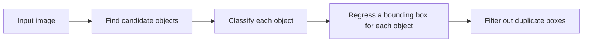

# 10.3.2 Object Detection Overview


:::tip Where this section fits
Image classification can only answer:

- What is this image roughly about?

But many real-world tasks need a more specific question:

> **What is in the image, and where is it?**

That is the core of object detection.
:::

## Learning Objectives

- Understand the difference between object detection and image classification
- Understand the three key elements: bounding boxes, classes, and confidence scores
- Build intuition for core metrics like IoU through a runnable example
- Connect the detection task with later YOLO / hands-on detection practice

---

## First, build a mental map

If you just finished image classification, you can think of this section as:

- Classification solves “what is the main thing in the whole image?”
- Detection starts solving “what is each object in the image, and where is it?”

So detection is not “just adding a box” — it changes:

- What the model outputs
- What we evaluate
- The types of errors we care about

For beginners, the best way to understand object detection is not to memorize models first, but to clearly see the task structure:



So the detection task is naturally more complex than classification, because it does all of the following at the same time:

- Classification
- Localization
- Multi-object filtering

## What exactly does object detection do?

A detection task usually outputs:

- Class
- Bounding box location
- Confidence score

For example:

- In a street scene, there may be two cars and one pedestrian
- The model needs to mark the location of each object

That is much more complex than classifying the whole image.

### What should you remember first when learning this section?

The most important things to remember first are:

1. Detection is not judging the whole image; it is judging multiple objects
2. Each object needs at least three things: class, location, and confidence
3. Many later model differences are really variations around these three things

### Why is the “three-element” view the most important one here?

Because almost all detection models are ultimately organized around these three things:

- Class
- Box
- Confidence

You can think of detection output in a very simple way:

> “I think there is some object here, it is probably around here, and this is how confident I am.”

---

## Why isn’t an image classification model enough?

Because the same image may contain:

- Multiple objects
- Objects of different sizes
- Objects at different locations

Image classification gives only one label for the whole image,
so it cannot express this information.

### A more beginner-friendly way to judge a vision problem

When you see a vision problem in the future, ask:

- Does the whole image need only one answer?
- Or does each object in the image need to be found separately?

If it is the latter, then it is already beyond the scope of a standard classification task.

---

## Let’s look at a minimal IoU example

IoU is a very core concept in detection,
because it answers:

- How well do the predicted box and the ground-truth box overlap?

```python
def iou(box_a, box_b):
    ax1, ay1, ax2, ay2 = box_a
    bx1, by1, bx2, by2 = box_b

    inter_x1 = max(ax1, bx1)
    inter_y1 = max(ay1, by1)
    inter_x2 = min(ax2, bx2)
    inter_y2 = min(ay2, by2)

    inter_w = max(0, inter_x2 - inter_x1)
    inter_h = max(0, inter_y2 - inter_y1)
    inter_area = inter_w * inter_h

    area_a = (ax2 - ax1) * (ay2 - ay1)
    area_b = (bx2 - bx1) * (by2 - by1)
    union = area_a + area_b - inter_area

    return inter_area / union if union > 0 else 0.0


gt_box = (10, 10, 30, 30)
pred_box = (15, 15, 32, 32)

print("IoU =", round(iou(gt_box, pred_box), 4))
```

Expected output:

```text
IoU = 0.4849
```

This means the two boxes overlap by less than half of their combined area. In a real detector, whether this counts as a correct match depends on the IoU threshold you choose, such as `0.5` or `0.75`.

### Why is this metric so important?

Because detection is not only about “did we find the object?”
It also asks:

- Is the box accurate?

### The most important thing to remember about IoU is not the formula, but “overlap quality”

When you first learn detection, don’t start by memorizing the coordinate formula for intersection over union.
Instead, remember this:

- IoU is essentially measuring how well the predicted box overlaps with the ground-truth box

This will help you understand many later concepts:

- Positive/negative sample matching
- NMS
- mAP

### When you first learn detection, which three concepts should you remember first?

When you first encounter object detection, the most important concepts to remember are:

1. Bounding boxes
   The model does not just answer “there is a car,” but also “where is the car?”

2. IoU
   Used to measure how well the predicted box overlaps with the ground-truth box.

3. Multi-object scenes
   A single image usually contains more than one object, so duplicate boxes, occlusion, and overlap all become issues.

### Why is detection naturally more like a “system problem”?

Because in the end, you often need to handle not just one box,
but a set of boxes:

- Which boxes should be kept?
- Which boxes are duplicates?
- Which boxes have scores that are too low and should be filtered out?

That is also why detection has a clear post-processing stage from very early on.

### What do beginners usually underestimate when doing detection for the first time?

Usually not the classifier itself, but:

- How bounding boxes are defined
- Threshold selection
- Duplicate-box handling
- The balance between false positives and false negatives

So detection projects are more like complete systems than a single model output.


:::tip Reading guide
This diagram breaks detection output into three parts — class, box, and score — and then uses IoU to judge whether the box is accurate enough. Detection errors are usually not “just one mistake,” but a combination of missed detections, false detections, localization errors, and duplicate boxes.
:::

---

## The most common pitfalls

### Mistake 1: Thinking detection is just classification plus a box

The box itself is already a difficult regression problem.

### Mistake 2: Only looking at the classification score

Location error is just as important.

### Mistake 3: Thinking about multi-object scenes as if they were single-object scenes

Multi-object scenes bring:

- Overlap
- Occlusion
- Duplicate predictions

## The right expectations for this section

The most important goal of this section is not to learn a complete detector today,
but to clearly distinguish:

- Classification tasks answer “what is it?”
- Detection tasks also answer “where is it?”
- Later YOLO and Faster R-CNN models are essentially solving a combination of these two problems

## What mindset should you build first when doing your first detection project?

The most important mindset to build is:

- A detection project is first a labeling project
- Only then is it a model project

Because if the box definition is not consistent, both the model and evaluation will become messy.

---

## Evidence to Keep

Keep this page's proof of learning as a small evidence card:

```text
input_image: detection sample with ground-truth or expected objects
prediction: boxes, labels, confidence scores, IoU, and threshold settings
metric: precision/recall, mAP, false positives, and false negatives
failure_check: small object, overlap, NMS, poor labels, or confidence threshold
Expected_output: annotated image plus detection metrics or error buckets
```

## Summary

The key idea in this section is to build a detection-level judgment:

> **Object detection solves “what is it” and “where is it” at the same time, so it is naturally more complex than classification and much closer to real-world visual applications.**

## What should you take away from this section?

- Detection is not as simple as classification plus a box
- IoU is the first key to understanding detection quality
- The real difficulty comes from multiple objects, occlusion, and localization error

If we compress it into one sentence, it would be:

> **Object detection upgrades “seeing an object” into “seeing every object and locating them one by one.”**

---

## Exercises

1. Change two sets of box coordinates yourself and see how IoU changes.
2. Why is detection said to be closer to real-world vision tasks than classification?
3. If a detection box gets the class right but is far off in location, can this prediction be considered good? Why?
4. Think about it: why is a multi-object scene much harder than a single-object scene?

<details>
<summary>Reference answers and explanation</summary>

1. IoU increases when the two boxes overlap more and drops when one box shifts away. If there is no overlap, IoU is `0`.
2. Detection is closer to real-world vision because it asks both “what is it?” and “where is it?”, often for many objects in one image.
3. A prediction with the correct class but a badly located box is not good. It may fail the IoU threshold and can mislead downstream actions.
4. Multi-object scenes add scale differences, occlusion, overlapping boxes, duplicate predictions, and class confusion, so they are much harder than single-object scenes.

</details>
