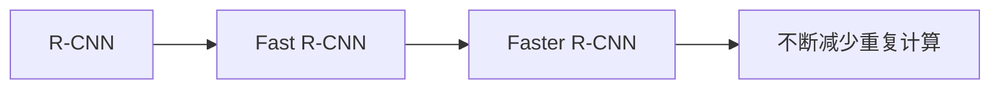

# 经典检测架构

:::tip 本节定位
经典检测架构最值得学的不是“模型名”，而是它们一路在解决同一个问题：

> **怎么在保证检测质量的同时，把检测速度提上来。**

R-CNN 家族的发展史，本质上就是“把重复计算越来越多地省掉”的历史。
:::

## 学习目标

- 理解 R-CNN 家族为什么重要
- 理解 region proposal 在检测早期路线中的作用
- 理解 Fast / Faster R-CNN 分别优化了哪一层瓶颈
- 建立两阶段检测器的核心直觉

---

## 先建立一张地图

经典检测架构这节最适合新人的理解顺序不是“背一串模型名”，而是先看清它们在解决同一条问题链：



所以这节真正想解决的是：

- 早期检测系统为什么会慢
- 后续架构到底是在优化哪一层

### 一个更适合新人的总类比

你可以把经典检测架构想成逛一个超大商场找目标商品：

- R-CNN 像是把每个可疑区域都单独拿出来认真检查一遍
- Fast R-CNN 像是先把整个商场快速扫一遍，再对重点区域放大看
- Faster R-CNN 则像是连“哪些区域值得看”这件事也交给系统自动学会

这样理解后，这三代模型的区别就不会只剩名字。

## 一、R-CNN 系列在做什么？

### 1.1 基本套路

两阶段检测的典型思路是：

1. 先提出候选区域
2. 再对候选区域做分类和框回归

### 1.2 为什么会这样设计？

因为直接在整张图上同时找所有目标并不容易。  
先缩小到“可能有目标的区域”，会更自然。

### 1.3 一个类比

就像先在地图上圈出“可能有店铺的街区”，  
再逐个街区判断是哪种店。

---

## 二、三代经典架构各自补了什么？

### 2.1 R-CNN

优点：

- 思路清楚

缺点：

- 每个候选框都要单独跑一次特征提取
- 非常慢

### 2.2 Fast R-CNN

优化点：

- 整张图只提一次卷积特征
- 候选框在共享特征图上裁切

收益：

- 速度明显提升

### 2.3 Faster R-CNN

优化点：

- 连候选区域提议也交给网络自己学

收益：

- 把 region proposal 也纳入端到端学习

### 2.4 一张更适合新人的对比表

| 架构 | 候选区域怎么来 | 特征提取怎么做 | 你最该记住的进步 |
|---|---|---|---|
| R-CNN | 外部候选框 | 每个框单独提特征 | 思路最清楚，但计算最重 |
| Fast R-CNN | 外部候选框 | 整图共享特征 | 解决了大量重复卷积 |
| Faster R-CNN | 网络自己提 proposal | 整图共享特征 | 把 proposal 也纳入可学习流程 |

### 2.5 为什么这条路线当年会这么重要？

因为在 YOLO 这类单阶段方法流行之前，检测任务最大的难点之一就是：

- 既要找目标
- 又要分类
- 还要把速度控制在能接受的范围内

R-CNN 家族正是在一点点回答这个问题：

- 先能做出来
- 再减少重复计算
- 再让 proposal 本身也变成可学习模块

---

## 三、先看一个“共享特征 vs 重复计算”的小示例

```python
proposals = ["box1", "box2", "box3", "box4"]


def rcNN_style_cost(num_proposals):
    # 每个 proposal 都单独提特征
    return num_proposals * 10


def fast_rcnn_style_cost(num_proposals):
    # 整图提一次特征 + proposal 裁切
    return 10 + num_proposals * 2


for n in [1, 4, 16]:
    print(
        {
            "proposals": n,
            "rcnn_cost": rcNN_style_cost(n),
            "fast_rcnn_cost": fast_rcnn_style_cost(n),
        }
    )
```

### 3.1 这个例子最想表达什么？

Fast R-CNN 这类改进的核心并不是“更神奇”，  
而是：

- 共享计算

### 3.2 为什么这条主线今天仍然值得学？

因为它非常适合帮新人理解：

- 检测系统到底被拆成了哪些阶段
- 速度和质量通常是怎么互相交换的
- 为什么后来单阶段路线会显得更有吸引力

这正是检测模型效率演进的主线之一。

### 3.3 再看一个最小“proposal -> 分类”示例

```python
proposals = [
    {"id": "p1", "score": 0.91},
    {"id": "p2", "score": 0.36},
    {"id": "p3", "score": 0.77},
]


def keep_proposals(proposals, threshold=0.5):
    return [proposal for proposal in proposals if proposal["score"] >= threshold]


print(keep_proposals(proposals))
```

这个例子当然比真实检测器简单得多，但它能帮助新人先抓住一个关键动作：

- 两阶段检测器会先筛一轮“哪些区域值得认真看”
- 后面才继续做更细的分类和框回归

---

## 四、两阶段检测器今天还有价值吗？

当然有。  
它们通常在：

- 精细检测
- 高质量框定位
- 小目标和复杂场景

里仍然很有竞争力。

只不过在很多实时场景里，  
YOLO 一类单阶段方法更常见。

### 4.1 那为什么这节不直接跳到 YOLO？

因为经典两阶段路线特别适合建立“检测系统是怎样一步步被拆开和优化”的直觉。  
如果这条线没看懂，后面学 YOLO 时也很容易只剩“它更快”。

---

## 五、最常见误区

### 5.1 误区一：经典检测架构已经没必要学

不对。  
它们很适合理解检测问题是怎样被系统拆开的。

### 5.2 误区二：两阶段就一定更慢且毫无价值

很多时候它仍然在质量上有优势。

### 5.3 误区三：Faster R-CNN 只是更快一点

它更重要的是把候选区域生成纳入了可学习体系。

## 第一次学经典检测架构时，最稳的默认顺序

更稳的顺序通常是：

1. 先搞清楚两阶段检测器在分哪两步
2. 再理解 R-CNN 为什么慢
3. 再看 Fast R-CNN 怎样减少重复卷积
4. 最后看 Faster R-CNN 怎样把 proposal 学进去

这样会比直接背三个模型名更容易形成主线。

## 如果把它做成笔记或作品，最值得展示什么

最值得展示的通常不是：

- 一张架构图贴完就结束

而是：

1. 三代模型的对比表
2. 每一代到底优化了哪一步
3. 为什么共享特征图会更快
4. 为什么 proposal 学习是重要转折

这样别人一眼就能看出：

- 你理解的是演进逻辑
- 不只是会背名词

## 小结

这节最重要的是建立一个演进判断：

> **R-CNN 家族的发展，本质上是在不断减少重复计算，把检测从“能做”推进到“更高效地做”。**

只要这点看清楚，后面你再学 YOLO，就会更容易比较两条路线的取舍。

---

## 这节最该带走什么

- R-CNN 家族不是三种零散模型，而是一条清晰的效率演进路线
- 核心改进点始终围绕“减少重复计算、让 proposal 更可学习”
- 经典架构最大的教学价值，是帮你看懂检测系统如何被工程化拆分

---

## 练习

1. 想一想：为什么共享特征图会显著降低检测成本？
2. 用自己的话解释：Faster R-CNN 比 Fast R-CNN 多解决了哪一步问题？
3. 什么时候你会更偏向两阶段检测器？
4. 为什么经典架构对理解检测任务仍然有价值？
