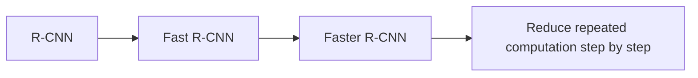

# 10.3.3 Classic Detection Architectures

:::tip What this section is about
What is most worth learning about classic detection architectures is not the model names themselves, but the fact that they all solve the same problem step by step:

> **How can we improve detection speed while still keeping detection quality high?**

The history of the R-CNN family is essentially the history of “eliminating repeated computation” more and more.
:::

## Learning Goals

- Understand why the R-CNN family matters
- Understand the role of region proposal in early detection pipelines
- Understand which bottleneck Fast / Faster R-CNN respectively optimized
- Build the core intuition behind two-stage detectors

---

## First, build a mental map

For beginners, the best way to understand this section is not to memorize a list of model names, but to first see the shared problem chain they solve:



So what this section really wants to answer is:

- Why early detection systems were slow
- Which layer each later architecture actually optimized

### A better overall analogy for beginners

You can think of classic detection architectures as shopping in a huge mall for a target product:

- R-CNN is like taking each suspicious area out separately and checking it carefully
- Fast R-CNN is like scanning the whole mall quickly first, then zooming in on key areas
- Faster R-CNN is like letting the system learn automatically which areas are worth looking at

Once you understand it this way, the differences between these three generations of models are no longer just names.

## What is the R-CNN family doing?

### The basic workflow

The typical idea behind two-stage detection is:

1. First propose candidate regions
2. Then perform classification and box regression on those candidate regions

### Why was it designed this way?

Because directly finding all objects in the entire image at once is not easy.
It feels more natural to first narrow things down to “regions that may contain objects.”

### An analogy

It is like first marking the blocks on a map where shops are likely to be,
then judging one block at a time to see what kind of shop it is.

---

## What did each of the three classic architectures improve?

### R-CNN

Pros:

- Clear idea

Cons:

- Each candidate box must run feature extraction separately
- Very slow

### Fast R-CNN

Improvement:

- Extract convolutional features for the whole image only once
- Crop candidate boxes on the shared feature map

Benefit:

- Speed improves significantly

### Faster R-CNN

Improvement:

- Even candidate region proposal is learned by the network itself

Benefit:

- Region proposal is also brought into end-to-end learning

### A comparison table that is easier for beginners

| Architecture | Where candidate regions come from | How feature extraction is done | The most important improvement to remember |
|---|---|---|---|
| R-CNN | External candidate boxes | Extract features for each box separately | The idea is clear, but computation is heavy |
| Fast R-CNN | External candidate boxes | Shared features for the whole image | Removes a lot of repeated convolution |
| Faster R-CNN | Network learns proposals itself | Shared features for the whole image | Brings proposal into a learnable pipeline |

### Why was this path so important back then?

Because before single-stage methods like YOLO became popular, one of the biggest challenges in detection was:

- finding objects
- classifying them
- keeping speed within an acceptable range

The R-CNN family was answering this question step by step:

- First, make it work
- Then reduce repeated computation
- Then make proposal itself a learnable module


:::tip Reading guide
What is most worth looking at in the R-CNN family is not the names, but how repeated computation is gradually removed: from extracting features for each proposal separately, to sharing features across the whole image, and finally to letting the network learn proposals as well.
:::

---

## First look at a small example of “shared features vs repeated computation”

```python
proposals = ["box1", "box2", "box3", "box4"]


def rcNN_style_cost(num_proposals):
    # Extract features for each proposal separately
    return num_proposals * 10


def fast_rcnn_style_cost(num_proposals):
    # Extract features once for the whole image + crop proposals
    return 10 + num_proposals * 2


for n in [1, 4, 16]:
    print(
        {
            "proposals": n,
            "rcnn_cost": rcNN_style_cost(n),
            "fast_rcnn_cost": fast_rcnn_style_cost(n),
        }
    )
```

Expected output:

```text
{'proposals': 1, 'rcnn_cost': 10, 'fast_rcnn_cost': 12}
{'proposals': 4, 'rcnn_cost': 40, 'fast_rcnn_cost': 18}
{'proposals': 16, 'rcnn_cost': 160, 'fast_rcnn_cost': 42}
```

Notice how the R-CNN-style cost grows quickly as proposal count increases, while the Fast R-CNN-style cost grows much more slowly because the expensive feature extraction step is shared.

### What is this example trying to show?

The core of improvements like Fast R-CNN is not that they are “more magical,”
but that they:

- share computation

### Why is this main idea still worth learning today?

Because it is very helpful for beginners to understand:

- which stages a detection system is broken into
- how speed and quality usually trade off against each other
- why single-stage approaches later became more attractive

This is one of the main threads in the evolution of detection efficiency.

### Look at a minimal “proposal -> classification” example again

```python
proposals = [
    {"id": "p1", "score": 0.91},
    {"id": "p2", "score": 0.36},
    {"id": "p3", "score": 0.77},
]


def keep_proposals(proposals, threshold=0.5):
    return [proposal for proposal in proposals if proposal["score"] >= threshold]


print(keep_proposals(proposals))
```

Expected output:

```text
[{'id': 'p1', 'score': 0.91}, {'id': 'p3', 'score': 0.77}]
```

Here, `p2` is filtered out because its score is below `0.5`. This is the same kind of practical filtering you will use later when reading detection outputs.

Of course, this example is much simpler than a real detector, but it can help beginners grasp one key action first:

- Two-stage detectors first screen for “which regions are worth looking at carefully”
- Only then do they continue with more detailed classification and box regression

---

## Do two-stage detectors still have value today?

Absolutely.
They are still often very competitive in:

- fine-grained detection
- high-quality box localization
- small objects and complex scenes

But in many real-time scenarios,
single-stage methods like YOLO are more common.

### So why not skip straight to YOLO in this section?

Because the classic two-stage path is especially good for building intuition about how a detection system is gradually decomposed and optimized.
If you do not understand this path, then when you later study YOLO, it is easy to remember only that “it is faster.”

---

## Most common misconceptions

### Misconception 1: Classic detection architectures are no longer worth learning

That is not true.
They are great for understanding how detection problems are systematically decomposed.

### Misconception 2: Two-stage methods are always slower and have no value

In many cases, they still have an advantage in quality.

### Misconception 3: Faster R-CNN is just a little faster

What is more important is that it brought candidate region generation into a learnable system.

## The safest default order when learning classic detection architectures for the first time

A more reliable order is usually:

1. First understand the two steps in a two-stage detector
2. Then understand why R-CNN is slow
3. Then see how Fast R-CNN reduces repeated convolution
4. Finally see how Faster R-CNN learns proposals

This makes it easier to form the main thread than memorizing the three model names directly.

## If you turn this into notes or a project, what is most worth showing?

What is most worth showing is usually not:

- One architecture diagram pasted and done

But rather:

1. A comparison table of the three generations
2. Which step each generation optimized
3. Why a shared feature map is faster
4. Why proposal learning is an important turning point

This lets others see at a glance that:

- You understand the evolution logic
- You are not just memorizing terminology

## Summary

The most important thing in this section is to build an evolutionary judgment:

> **The development of the R-CNN family is essentially about continuously reducing repeated computation, moving detection from “can be done” to “done more efficiently.”**

Once you see this clearly, it will be easier to compare the trade-offs between the two routes when you later study YOLO.

---

## What you should take away from this section

- The R-CNN family is not three unrelated models, but a clear path of efficiency evolution
- The core improvements always revolve around “reducing repeated computation and making proposals more learnable”
- The greatest teaching value of classic architectures is helping you understand how detection systems are engineered and decomposed

---

## Exercises

1. Think about it: why can sharing a feature map significantly reduce detection cost?
2. Explain in your own words: what extra problem does Faster R-CNN solve compared with Fast R-CNN?
3. In what situations would you prefer a two-stage detector?
4. Why do classic architectures still matter for understanding detection tasks?
