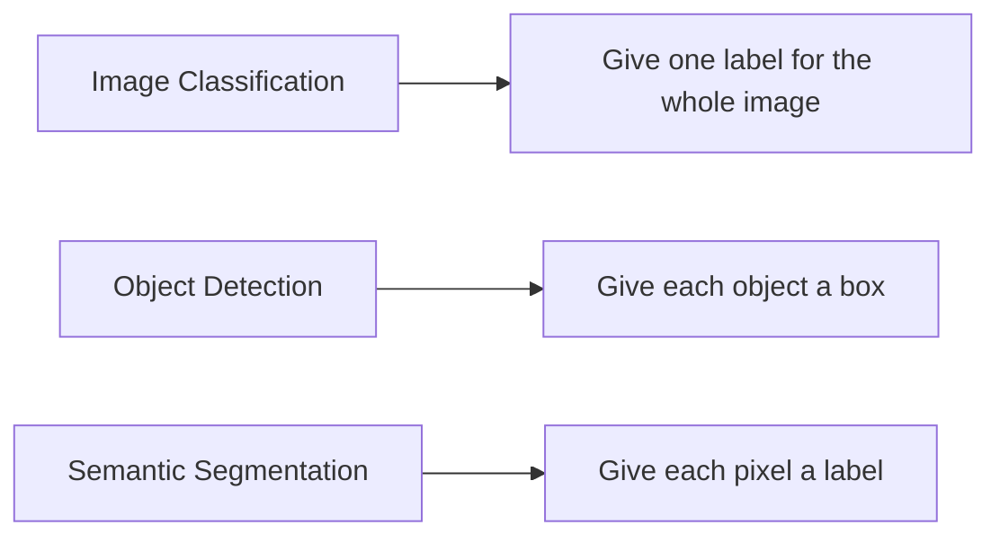

# 10.4.2 Semantic Segmentation


:::tip Section Focus
Classification answers:

- What is in this image?

Detection answers:

- What objects are there, and where are they?

Semantic segmentation goes one step further and answers:

> **What category does each pixel in the image belong to?**

This pushes visual understanding to a more fine-grained level.
:::

## Learning Objectives

- Understand the difference between semantic segmentation and classification/detection
- Understand why segmentation masks are more fine-grained
- Use a runnable example to understand pixel-level labels and IoU
- Build a basic intuition for the semantic segmentation task

---

## First, Build a Map

If you have just finished learning classification and detection, you can think of this section as:

- Classification gives one answer for the whole image
- Detection gives one box for each object
- Segmentation starts giving a category to each pixel

So the real new core ideas in this section are:

- The output granularity becomes the finest
- Evaluation also becomes more fine-grained
- Whether the model “understands boundaries” becomes very important

The most beginner-friendly order for understanding semantic segmentation is:



The most important thing in this section is not to memorize network names first, but to understand:

- Why segmentation is more fine-grained than detection
- Why the mask is the key representation

### A Better Overall Analogy for Beginners

If we compare classification, detection, and segmentation together, it can be understood like this:

- Classification is like answering: “What is this photo mainly about?”
- Detection is like answering: “What objects are in the image, and roughly where are they?”
- Segmentation is like answering: “If we color the whole image, every pixel must decide who it belongs to.”

This makes it much easier to see why segmentation is harder:

- It does not give just one answer
- It does not just draw a few boxes
- It is responsible for every region in the entire image

## What Exactly Does Semantic Segmentation Do?

Its goal is:

- Assign a class to every pixel in an image

For example:

- sky
- road
- person
- car

### What Should You Remember First When Learning This Section?

The most important thing to remember first is:

1. Classification gives a whole-image label
2. Detection gives boxes
3. Segmentation gives regions

And this “region” is not just a rough hint — every pixel belongs to a class.

### Why Is It More Fine-Grained Than Detection?

Because detection only gives boxes,
while segmentation gives the region boundaries much more precisely.

### Why Is the “Pixel-Level” Idea the Most Important Part to Grasp First?

Because starting from this section, vision tasks are no longer just about:

- finding objects
- drawing boxes

They start answering:

- What does this region actually belong to?
- Is this boundary drawn accurately?

So you can think of semantic segmentation simply as:

> **Turning the whole image into a “map where every pixel has a semantic label.”**

---

## First, Run a Minimal Segmentation Mask Example

```python
pred_mask = [
    [0, 0, 1],
    [0, 1, 1],
    [0, 0, 1],
]

gt_mask = [
    [0, 0, 1],
    [0, 1, 1],
    [0, 1, 1],
]


def iou_for_class(pred, gt, target_class):
    inter = 0
    union = 0
    for pred_row, gt_row in zip(pred, gt):
        for p, g in zip(pred_row, gt_row):
            if p == target_class and g == target_class:
                inter += 1
            if p == target_class or g == target_class:
                union += 1
    return inter / union if union else 0.0


print("IoU for class 1:", round(iou_for_class(pred_mask, gt_mask, 1), 4))
```

Expected output:

```text
IoU for class 1: 0.8
```

Here, class `1` is the foreground region. One foreground pixel is missed, so the predicted mask still looks close, but the IoU already drops to `0.8`.

### What Is the Most Important Intuition in This Example?

Segmentation evaluation is not about whether the whole image is correct,
but about:

- how well the regions overlap

### Why Does IoU Matter So Much in Segmentation?

Because in segmentation tasks:

- Getting the class right is not enough
- The regions must overlap reasonably well to count as truly correct

That is why you often see:

- per-class IoU
- mIoU

instead of only a single overall accuracy value.

This is why IoU is also very important in segmentation.

### When a Beginner Learns Segmentation for the First Time, What Three Things Should They Remember Most?

1. A mask is a pixel-level label map
2. Segmentation evaluation cares more about region overlap than classification does
3. Small classes and boundary regions are often the hardest

### Why Do Segmentation Projects So Often Have the Problem of “Looks Almost the Same, But the Metrics Are Very Different”?

Because as long as the boundary region is slightly wrong, or a small class is missed,
the IoU can drop very noticeably.

This is also why segmentation tasks are especially good for helping beginners build this awareness:

> **In visual results, “looks similar” is not enough; the region boundary itself is part of the result.**

### What Is Most Likely to Be Underestimated When Learning Segmentation for the First Time?

The most commonly underestimated parts are:

- boundaries
- small classes
- class imbalance

Because these areas often take up only a tiny portion in visualizations,
but they can have a huge impact on IoU and real-world performance.

### Look at Another Minimal “Class Imbalance” Example

```python
mask = [
    [0, 0, 0, 0],
    [0, 1, 1, 0],
    [0, 0, 0, 0],
    [0, 0, 0, 0],
]


def class_counts(mask):
    counts = {}
    for row in mask:
        for value in row:
            counts[value] = counts.get(value, 0) + 1
    return counts


print(class_counts(mask))
```

Expected output:

```text
{0: 14, 1: 2}
```

There are only 2 foreground pixels but 14 background pixels. This is why a model can get high overall pixel accuracy while still failing the small class that you actually care about.

Although this example is very small, it can help beginners immediately understand a real-world issue:

- Background pixels are often in the majority
- The truly important small classes may take up only a tiny part

So in segmentation projects, if you only focus on overall pixel accuracy, it is easy to be misled by the fact that “the background was all predicted correctly.”


:::tip Reading Tip
Segmentation is not just “painting colors on top and calling it done.” This image places the original image, GT mask, predicted mask, IoU, and boundary error together to help you understand why small classes and edge regions affect mIoU.
:::

---

## The Most Common Pitfalls

### Inaccurate Boundaries

Segmentation models can easily make mistakes at object edges.

### Extremely Imbalanced Classes

Backgrounds are often too dominant,
and small object classes can easily be ignored.

### Only Looking at Overall Pixel Accuracy

High pixel accuracy does not mean small classes are actually segmented well.

### Only Looking at Color Visualizations, Without Failure Analysis

Many beginners make a few nice-looking mask images and stop there when they first do segmentation.
But what really drives project progress is usually dividing failure cases into:

- boundary errors
- missed small classes
- class confusion
- ambiguous annotations

Only then can you know what to improve next:

- the data
- the loss function
- the sampling strategy
- or the model architecture

## The Right Expectations When Studying This Section

The most important thing in this section is not to master complex segmentation models today,
but to truly understand:

- Segmentation is more fine-grained than detection
- Segmentation results usually depend more on region-level metrics
- Small classes and boundary errors can greatly affect real performance

## The Best Order When Doing a Semantic Segmentation Project for the First Time

A better approach is:

1. Narrow down the class definitions first
2. Then unify the mask annotation standard
3. Start with a minimal baseline
4. Then look at per-class IoU and failure cases

This will make it much easier to understand the project clearly than chasing a complex network from the start.

---

## If You Turn This into a Project, What Is Most Worth Showing?

- Original image
- Predicted mask
- GT mask
- per-class IoU
- Boundary comparisons in failure cases

This will look much more like a real project than just pasting a single “colorful mask” image.

---

## Summary

The most important thing in this section is to build this judgment:

> **Semantic segmentation is pixel-level classification, so it is more fine-grained than classification and detection, and it depends more on region-level evaluation.**

## What Should You Take Away from This Section?

- The core object of segmentation is the mask, not the whole-image label or the box
- IoU is not a side metric in segmentation; it is a core evaluation perspective
- Boundaries and class imbalance are common challenges in segmentation tasks

If we compress it into one sentence, it is:

> **Semantic segmentation builds a pixel-level semantic map, so what it really cares about is not only “whether it was recognized,” but also “whether the region boundaries were drawn correctly.”**

## Exercises

1. Modify a set of `pred_mask` values yourself and observe how IoU changes.
2. Why does high pixel accuracy not necessarily mean the segmentation model is truly good?
3. What is the biggest difference between semantic segmentation and object detection?
4. If the classes are very imbalanced, what problem would you worry about most?
