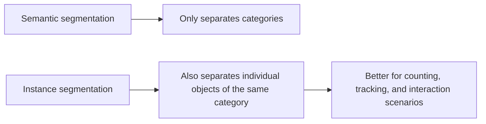

# 10.4.3 Instance Segmentation

:::tip Section focus
Semantic segmentation can already answer:

- Which pixels belong to "person"

But if there are three people in the image, that is still not enough.
Instance segmentation goes one step further:

> **It not only knows which category a pixel belongs to, but also which specific instance it belongs to.**
:::

## Learning objectives

- Understand the difference between instance segmentation and semantic segmentation
- Understand why "category" and "instance" are two different levels
- Build intuition for instance masks through runnable examples
- Understand why instance segmentation is closer to real-world visual scenes

---

## First, build a map

For beginners, the best way to understand instance segmentation is not "it's just one more segmentation task," but to first see clearly:



So what this section really wants to solve is:

- Why "the category is correct" is still not enough
- Why "separating same-category individuals" significantly increases the difficulty

## What does instance segmentation add beyond semantic segmentation?

Semantic segmentation:

- Only separates categories

Instance segmentation:

- Category + individual distinction

In other words, two "person" objects in the image should not be merged into one whole.

### Three things beginners should distinguish first

When learning instance segmentation for the first time, the most important things to remember are:

1. Semantic segmentation answers "what category is this"
2. Instance segmentation also answers "which individual is this"
3. So the latter is naturally closer to real multi-object scenarios

### A comparison table that is easier for beginners

When many beginners first learn this topic, it is easy to mix up classification, detection, semantic segmentation, and instance segmentation.
The safest way is to place them in the same table and compare them:

| Task | What it outputs | Core question |
|---|---|---|
| Classification | One category for the whole image | What is this image overall |
| Detection | Category + box | Where is the object |
| Semantic segmentation | Category mask | Which pixels belong to which category |
| Instance segmentation | Category mask + individual distinction | How do we separate same-category objects one by one |

This table is especially valuable because it helps you immediately see:

- Instance segmentation is not just "more detailed semantic segmentation"
- It actually handles pixel-level understanding and instance-level distinction at the same time

---

## Start with a minimal instance mask example

```python
instance_map = [
    [0, 1, 1, 0],
    [0, 1, 1, 2],
    [0, 0, 0, 2],
]


def pixels_of_instance(instance_map, target_id):
    pixels = []
    for r, row in enumerate(instance_map):
        for c, value in enumerate(row):
            if value == target_id:
                pixels.append((r, c))
    return pixels


print("instance 1:", pixels_of_instance(instance_map, 1))
print("instance 2:", pixels_of_instance(instance_map, 2))
```

Expected output:

```text
instance 1: [(0, 1), (0, 2), (1, 1), (1, 2)]
instance 2: [(1, 3), (2, 3)]
```

The two instance IDs are not class labels; they are individual object IDs. Both could belong to the same class, but the system still needs to keep them separate.

### What is the most important thing in this example?

It shows that instance segmentation does not just output a category ID,
it also distinguishes:

- the 1st instance
- the 2nd instance

This is very important in counting, tracking, and interaction scenarios.

### Why is instance segmentation especially suitable for security and autonomous driving?

Because in these scenarios, the system often does not only care about:

- whether there is a person in the scene

It cares more about:

- how many people there are
- which targets are very close to each other
- whether these individuals can be tracked afterward

In other words, instance segmentation is naturally closer to a visual representation for downstream decision-making.

### Look at another minimal "count + area" example

One reason instance segmentation is so valuable in real systems is that
it can not only tell you "how many targets there are,"
but also make it easy to compute:

- how large each target is
- which target is closer to the boundary
- which targets overlap with each other

The example below gives you a minimal way to feel this "instance-level statistics":

```python
instance_map = [
    [0, 1, 1, 0, 2],
    [0, 1, 1, 0, 2],
    [0, 0, 0, 0, 2],
]


def instance_area(instance_map, target_id):
    area = 0
    for row in instance_map:
        for value in row:
            if value == target_id:
                area += 1
    return area


for target_id in [1, 2]:
    print(target_id, "area =", instance_area(instance_map, target_id))
```

Expected output:

```text
1 area = 4
2 area = 3
```

Once each object has its own mask, you can count objects and compute area. That is one reason instance segmentation is valuable in inspection, tracking, and planning systems.

The most important thing to grasp here is not the code itself,
but that:

- once individuals are separated
- many statistics and decisions naturally become available afterward


:::tip Reading hint
Semantic segmentation only cares about "which pixels are people," while instance segmentation also needs to distinguish "person 1" and "person 2." When reading the figure, focus on why neighboring same-category objects easily stick together, and how separating instances enables counting and area statistics afterward.
:::

---

## The most common pitfalls

### Adjacent same-category instances easily stick together

This is a very common error in instance segmentation.

### Small instances are harder

The smaller and denser the objects are, the harder they are to separate.

### Evaluation is more complex than semantic segmentation

Because now you not only need to check mask quality,
you also need to check whether the instances are correctly separated.

## The safest default workflow for your first instance segmentation project

When you first bring instance segmentation into a project,
it is better to move forward in this order:

1. First confirm that the task really needs same-category objects to be separated
2. First inspect a small number of samples manually to see whether instance boundaries are clear
3. First build a visualization baseline to see whether instances are being merged
4. Then check whether mask quality and instance separation both hold
5. Finally consider more complex models and finer-grained evaluation

This is safer than chasing a complex network from the start,
because the biggest problems in instance segmentation are often not:

- the model is not complex enough

but rather:

- the annotation boundaries themselves are unclear
- the task requirements are not defined clearly

## The right expectation when learning this section for the first time

The most important thing in this section is not to master a complex instance segmentation network today,
but to clearly understand:

- Why semantic segmentation and instance segmentation are not the same thing
- Why neighboring same-category objects become the real difficulty
- Why, once this task is done well, it becomes especially valuable for counting, interaction, and tracking

---

## Summary

The most important idea in this section is to build one judgment:

> **Instance segmentation solves one more layer of the problem than semantic segmentation: how to distinguish among objects of the same category, so it is closer to real multi-object visual scenarios.**

## What you should take away from this section

- Instance segmentation adds "individual separation" on top of semantic segmentation
- The difficulty is often not the category, but the boundary between neighboring same-category objects
- If downstream tasks need counting, tracking, or interaction, instance segmentation is often especially valuable

---

## Exercises

1. Create a larger `instance_map` by yourself and mark 3 instances.
2. Why is instance segmentation harder than semantic segmentation?
3. If two adjacent objects are always merged into one instance, what would you suspect first?
4. Think about it: why is instance segmentation especially valuable in autonomous driving or security scenarios?
