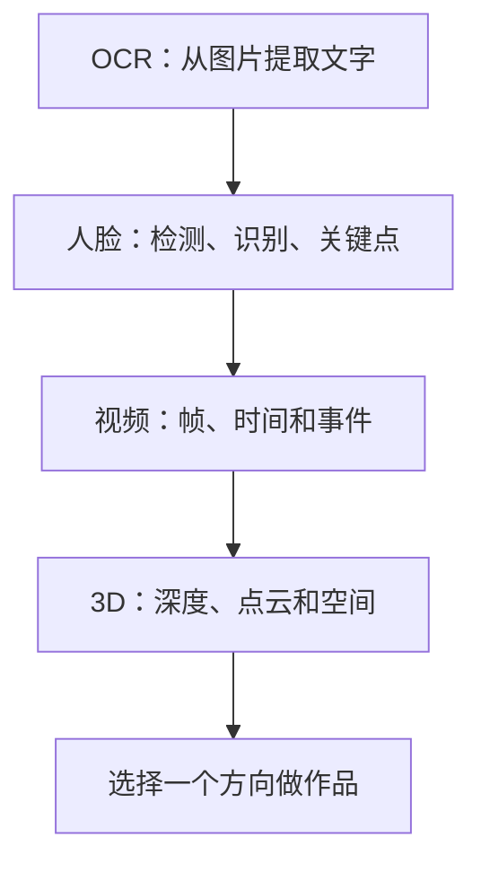

# 学前导读：高级视觉这一章到底在学什么

## 本章定位

这一章不是新的必修主干，而是把计算机视觉从“图像分类、检测、分割”扩展到更贴近真实应用的几个方向：人脸、视频、OCR 和 3D 视觉。它们看起来差异很大，但背后都在回答同一个问题：当输入不再只是一张干净图片时，视觉系统怎样理解更复杂的场景。

如果你是第一次学 CV，不需要把这一章所有方向都深入做完。更合理的方式是先建立地图，知道每个方向解决什么问题、输入输出是什么、最小项目怎么跑；然后根据自己的作品集方向选择一个深入。

## 这一章在 CV 路线中的位置

前面几章更像视觉模型的基础能力：识别图片类别、找出物体位置、分出像素区域。本章更像应用方向选择：OCR 面向文档和票据，人脸面向身份和交互，视频面向时间序列，3D 视觉面向空间结构。

## 四个方向分别解决什么问题

| 方向 | 输入 | 输出 | 适合做成什么项目 |
|---|---|---|---|
| 人脸检测与识别 | 图片、摄像头帧 | 人脸框、身份、关键点 | 门禁演示、人脸打卡、表情分析原型 |
| 视频分析 | 视频流、连续帧 | 动作、事件、轨迹 | 安防检测、运动分析、课堂行为分析 |
| OCR | 图片、截图、扫描件 | 文本、版面结构、字段 | 票据识别、课件文字提取、文档数字化 |
| 3D 视觉 | 双目、点云、深度图 | 空间结构、位置、形状 | 机器人感知、AR、三维重建入门 |

这张表的重点不是让你一次学完四个方向，而是帮你判断：你的项目更像图像理解、文档理解、视频理解，还是空间理解。

## 学习顺序建议

第一遍建议按“最容易跑通到最难工程化”的顺序看：先 OCR，再人脸，再视频，最后 3D 视觉。OCR 很适合和后面的 RAG、多模态课件助手连接；人脸和视频更容易涉及隐私、实时性和场景边界；3D 视觉概念跨度较大，适合有明确兴趣时深入。

## 和后续多模态课程的连接

这一章会为后面的多模态应用打基础。比如 OCR 可以帮助多模态助手理解截图和课件；视频分析会连接视频生成、视频理解和数字人；人脸方向会引出隐私、合规和偏见问题；3D 视觉会连接机器人、AR 和空间智能。

所以学习这一章时，不要只问“模型叫什么”，更要问：这个方向的数据从哪里来，输出怎么验证，错误会造成什么影响，能不能接入一个完整工作流。

## 本章小项目出口

建议选择一个最小作品，而不是四个方向都浅尝辄止。基础版可以做“课件截图 OCR 提取器”：输入一张课程截图，输出识别文字和清洗后的 Markdown。标准版可以加入版面区域、置信度和错误样本记录。挑战版可以把 OCR 结果接入 RAG，让学习助手基于截图内容回答问题。

如果你更偏视觉项目，也可以选择“视频事件检测小实验”或“人脸关键点可视化”。无论选哪个，README 至少写清楚输入、输出、模型或工具、失败案例、隐私和使用边界。

## 常见误区

第一个误区是把高级视觉当成“模型名合集”。真实项目里更重要的是数据质量、场景约束、评估方式和错误代价。第二个误区是忽略隐私和合规，尤其是人脸、监控、身份识别类项目。第三个误区是只展示成功截图，不记录失败样本；但视觉系统最有价值的经验往往来自光照、遮挡、模糊、角度和版面复杂时的失败。

## 过关标准

学完这一章后，你应该能解释 OCR、人脸、视频、3D 视觉分别解决什么问题，能判断一个视觉需求属于哪个方向，能完成一个最小方向项目，并能在 README 中写清楚输入输出、评估方法、失败案例和使用边界。
