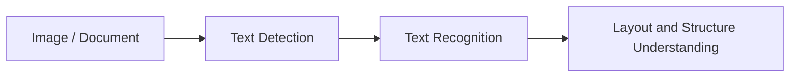

# 10.5.4 OCR Text Recognition [Optional]


:::tip Section Overview
OCR is often explained in one sentence:

- Recognize the text in an image

But in real projects, the problem is more detailed:

- Where is the text?
- What is the reading order?
- How do we handle multi-column layouts?
- What about tilt and blur?

So OCR is more like a pipeline than a single model.
:::

## Learning Objectives

- Understand the difference between “detection” and “recognition” in OCR
- Understand why document layout further increases complexity
- Build intuition for an OCR pipeline through a runnable example
- Understand the special challenges of OCR in forms, receipts, and document scenarios

---

## First, Build a Mental Map

The best way for beginners to understand this OCR section is not to “look at the recognition result first,” but to first see the pipeline clearly:



So what this section really wants to solve is:

- Why OCR is not a single model
- Why detection, recognition, and layout understanding should be separated

## What Are the Usual Steps in OCR?

### Text Detection

First, find where the text regions are.

### Text Recognition

Then, convert each text region into a character sequence.

### Layout and Structure Understanding

In complex document scenarios, you also need to answer:

- Which part should be read first?
- Which part is a title?
- Which part belongs to a table or the main text?

### A More Beginner-Friendly Overall Analogy

You can think of OCR as a three-person team handling an invoice:

1. The first person circles all the text with a pen
2. The second person reads out each circled text region
3. The third person decides which text is the title, which is the amount, and which is the date

With this understanding, OCR no longer feels like:

- a mysterious black-box model

but more like:

- a pipeline with clear responsibilities

---

## Let’s Look at a Minimal OCR Pipeline Example

```python
image_blocks = [
    {"box": (0, 0, 50, 20), "pixels": "INV-001"},
    {"box": (0, 30, 80, 50), "pixels": "TOTAL 299"},
]


def detect_text_regions(image_blocks):
    return [block["box"] for block in image_blocks]


def recognize_text(image_blocks):
    return [{"box": block["box"], "text": block["pixels"]} for block in image_blocks]


regions = detect_text_regions(image_blocks)
texts = recognize_text(image_blocks)

print("regions:", regions)
print("texts:", texts)
```

Expected output:

```text
regions: [(0, 0, 50, 20), (0, 30, 80, 50)]
texts: [{'box': (0, 0, 50, 20), 'text': 'INV-001'}, {'box': (0, 30, 80, 50), 'text': 'TOTAL 299'}]
```

The first line is the detection result: where text regions are. The second line is the recognition result: what each detected region says.

### What Is the Most Important Part of This Example?

It clearly separates:

- where the text is
- what the text says

This is the most basic two-stage structure of OCR.

### Why Do Many OCR Errors Not Come from the Recognition Model Itself?

Because if the detection stage cuts the text regions incorrectly:

- some text may be missed
- the order may get mixed up

Even a strong recognition model cannot fully recover from that.

### What Should Beginners Remember First When Learning OCR?

The most important things to remember are:

1. Detection answers “where is the text?”
2. Recognition answers “what is the text?”
3. In document scenarios, you often also need to answer “what should be read first, and which block does it belong to?”

---

## Why Is OCR Often Harder Than It Seems?

### Text Is Not Always in a Regular Layout

You may encounter:

- tilt
- perspective distortion
- blur
- occlusion

### Documents Are Not Always Single-Column or Single-Line

For example:

- tables
- invoices
- medical forms

At this point, “recognizing text” is only the first step.
The real challenge is structure understanding.

### Character-Level Errors Can Affect Downstream Business Logic

Fields like numbers, amounts, and dates
can directly impact business results if even one character is wrong.

### Look at Another Minimal Example for “Reading Order Restoration”

```python
lines = [
    {"y": 80, "text": "TOTAL 299"},
    {"y": 20, "text": "INVOICE"},
    {"y": 50, "text": "INV-001"},
]


def restore_reading_order(lines):
    return [item["text"] for item in sorted(lines, key=lambda x: x["y"])]


print(restore_reading_order(lines))
```

Expected output:

```text
['INVOICE', 'INV-001', 'TOTAL 299']
```

The list was originally out of order, but sorting by the vertical coordinate restores the natural top-to-bottom reading order for this simple document.

This example is very small, but it helps beginners build an important intuition:

- OCR is not finished just because recognition is done
- Restoring text order and structure is often equally important


:::tip Reading Tip
OCR projects should be debugged in three layers: whether text detection boxes are correct, whether text recognition is correct, and whether the layout structure and order are restored correctly. Receipts, tables, and two-column documents often fail at the third layer.
:::

## A Project Progression Order Beginners Can Copy Directly

A more stable order is usually:

1. Start with clean, single-column sample data
2. Then look at tilted and blurry samples
3. Then add layout order and structure understanding
4. Finally move on to more complex documents such as receipts and tables

This is usually easier than starting with a complex receipt system right away.

### If You Want to Turn OCR into a Project, What Kind of Task Should You Choose First?

A more stable starting point is usually:

- extracting fields from clear receipts
- recognizing simple single-column documents
- handling a small number of fixed-template forms

The advantages of these tasks are:

- text regions are clearer
- business fields are easier to evaluate
- failure cases are easier to analyze

### If You Turn OCR into a Project, What Should You Show First?

A presentation order that feels closer to a real project is usually:

1. Original image
2. Text detection boxes
3. Recognized text blocks
4. Restored fields or reading order
5. Failure case analysis

In this way, readers can immediately see:

- which step went wrong
- which part of the pipeline your system is mainly optimizing

---

## The Most Common Pitfalls

### Only Looking at Recognition Accuracy and Ignoring Detection Quality

OCR is a multi-stage pipeline, and mistakes from one stage are passed to the next.

### Only Doing Character Recognition and Not Restoring Structure

What many document projects really need is:

- fields
- table structure
- reading order

### Ignoring Image Preprocessing

For example:

- binarization
- denoising
- skew correction

These are very important in many scenarios.

### A Minimal Error Bucketing Table That Feels More Like a Real Project

```python
errors = [
    {"type": "detection_miss", "count": 4},
    {"type": "wrong_character", "count": 7},
    {"type": "reading_order", "count": 3},
]

for item in errors:
    print(f"{item['type']}: {item['count']}")
```

Expected output:

```text
detection_miss: 4
wrong_character: 7
reading_order: 3
```

This tiny table tells you where to look next: missed text boxes, wrong characters, or wrong document order. Each bucket usually needs a different fix.

Although this table is simple, it is very similar to the first step in a real OCR project:

- first distinguish whether the main error comes from detection, recognition, or structure restoration

If you do not separate them like this, it is easy to:

- keep replacing the recognition model over and over
- only to find that the real problem was actually detection or reading order

---

## If You Turn This into a Portfolio Project, What Is Most Worth Showing?

- Original image
- Detection box results
- Recognized text results
- Restored field results
- A set of typical failure cases

This will feel much more like a real document AI project than simply showing “which words were recognized.”

---

## Summary

The most important thing in this section is to build a pipeline-based understanding:

> **OCR is not a single “text recognition model,” but a multi-stage system that includes text detection, text recognition, and layout understanding.**

Once this pipeline is clear, you will not only focus on the recognition model itself when building receipt, form, or document understanding projects.

## What Should You Take Away from This Section?

- The core of OCR is a pipeline, not a single model
- Many problems are already determined by the detection and structure stages
- Document OCR projects are especially worth analyzing separately for layout and field restoration

## Exercises

1. Add one more text block to the example and think about how the reading order should be restored.
2. Why do detection-stage errors directly hurt the final OCR result?
3. Think about this: for table receipts and ordinary street-view text recognition, which layer has the biggest difference in difficulty?
4. If an amount field is always off by one character, would you first check detection, recognition, or post-processing? Why?
