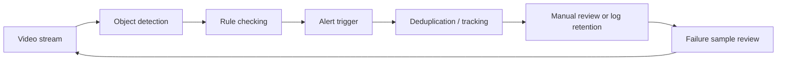

# Project: Intelligent Security System

:::tip Section focus
Security projects are very easy to turn into a demo that just “draws a box when a person is detected.”
But a real deployable security system usually cares less about the box itself and more about:

- Whether alerts are accurate
- Whether repeated alarms happen
- Whether latency is low enough
- Whether false alarms will annoy people to death

So the focus of this lesson is to turn it into a **portfolio-level system project**, not just a one-off detection demo.
:::

## Learning objectives

- Learn how to define the boundary of a deployable security detection task
- Learn how to connect detection, rules, alerts, and deduplication into a closed loop
- Learn how to design the most basic evaluation and failure analysis
- Learn how to turn this project into a convincing portfolio presentation

---

## 1. First, define the project topic clearly

A good practice topic that also feels very close to real business use cases is:

> **Build a “restricted-area intrusion alert system” that takes a sequence of surveillance frames and outputs “whether an alert is triggered + which frame the alert occurs in.”**

This topic is good because:

- The goal is simple
- The business meaning is clear
- It is easy to explain false positives and false negatives

### Why not start with something too big?

For example:

- Detecting smoke/fire, falling down, safety helmets, and vehicles all at once

That scope is too large, and the project can easily become a pile of features without a clear main line.

---

## 2. What does the minimum closed loop of a portfolio-level security project look like?

1. Define the surveillance target and restricted area
2. Run detection
3. Map detection boxes to alert logic
4. Do deduplication / tracking
5. Evaluate alert quality
6. Show success and failure cases

If you only do the first two steps, it looks more like a model demo;
once you get to the later steps, it starts to look like a real system project.

### 2.1 A flowchart that looks more like a real system



This diagram is important because it reminds you:

- What a security system really delivers is the alert experience
- Not the box on a single image


:::tip Reading guide
The output of a security project is not “drawing boxes,” but reliable alerts. When reading the diagram, focus on how detection results enter rule checking, how `track_id` avoids repeated alarms, and how the results finally flow into manual review, logs, and failure review.
:::

---

## 3. Start with a minimal “detection -> alert -> deduplication” closed loop

The example below does three very important things:

1. Reads frame-by-frame detection results
2. Checks whether the object enters the dangerous area
3. Deduplicates alerts for continuous hits of the same target across multiple frames

```python
detections = [
    {"frame": 1, "track_id": 101, "label": "person", "box": (40, 40, 80, 120)},
    {"frame": 2, "track_id": 101, "label": "person", "box": (42, 42, 82, 122)},
    {"frame": 3, "track_id": 101, "label": "person", "box": (44, 45, 84, 125)},
    {"frame": 4, "track_id": 202, "label": "person", "box": (150, 150, 180, 210)},
]

danger_zone = (30, 30, 100, 140)


def is_inside(box, zone):
    bx1, by1, bx2, by2 = box
    zx1, zy1, zx2, zy2 = zone
    return bx1 >= zx1 and by1 >= zy1 and bx2 <= zx2 and by2 <= zy2


def build_alerts(detections, zone):
    active_tracks = set()
    alerts = []

    for det in detections:
        inside = det["label"] == "person" and is_inside(det["box"], zone)
        if inside and det["track_id"] not in active_tracks:
            alerts.append(
                {
                    "frame": det["frame"],
                    "track_id": det["track_id"],
                    "alert": "intrusion",
                }
            )
            active_tracks.add(det["track_id"])
        elif not inside and det["track_id"] in active_tracks:
            active_tracks.remove(det["track_id"])

    return alerts


alerts = build_alerts(detections, danger_zone)
print(alerts)
```

### 3.1 Why is this example much stronger than “alert when a person is detected”?

Because it already reflects one of the most important engineering judgments in security systems:

- If the same person is inside the restricted area for 3 consecutive frames
- You should not alert 3 times

### 3.2 Why is `track_id` so important?

Without tracking information, it is hard to tell:

- Whether this is the same person
- Or three different people

So in security projects, the jump from “detection” to “system”
often gets stuck at this layer.

---

## 4. How should a portfolio-level project be evaluated?

### 4.1 Don’t look only at detection accuracy

Security projects should be evaluated in at least two layers:

1. Detection layer
   Did we find the object?
2. Alert layer
   Was the alert triggered reasonably?

### 4.2 A minimal alert evaluation example

```python
pred_alerts = [
    {"frame": 1, "track_id": 101, "alert": "intrusion"},
]

gold_alerts = [
    {"frame": 1, "track_id": 101, "alert": "intrusion"},
    {"frame": 8, "track_id": 303, "alert": "intrusion"},
]


def alert_recall(pred_alerts, gold_alerts):
    gold_set = {(x["frame"], x["track_id"], x["alert"]) for x in gold_alerts}
    pred_set = {(x["frame"], x["track_id"], x["alert"]) for x in pred_alerts}
    hit = len(gold_set & pred_set)
    return hit / len(gold_set) if gold_set else 1.0


print("alert_recall:", round(alert_recall(pred_alerts, gold_alerts), 4))
```

### 4.3 Why are “alert-layer metrics” more like project value than mAP?

Because what users actually receive is not boxes, but:

- Alerts

If detection is very accurate but the alert strategy is terrible,
the real user experience will still be poor.

### 4.4 Another minimal example: “alert fatigue”

```python
alerts_per_hour = [1, 2, 18, 3, 21]


def alert_fatigue(hours):
    too_many = sum(1 for x in hours if x >= 10)
    return "Alerts are too frequent; users will probably start ignoring the system" if too_many >= 2 else "Alert density is initially acceptable"


print(alert_fatigue(alerts_per_hour))
```

What this example wants to emphasize is not an exact formula, but a very real system problem:

- More alerts are not always better
- Too many false alarms will gradually make users stop trusting the system

---

## 5. The failure cases most worth showing in a security project

### 5.1 False positives

For example:

- A person poster in the background is detected as a real person

### 5.2 Missed detections

For example:

- An intruder is missed under low-light conditions

### 5.3 Repeated alerts

For example:

- The same target triggers an alert in every frame

### 5.4 Why show these separately?

Because these failures are exactly what best reveals:

- Whether the system design is mature

---

## 6. How do you turn this project into a portfolio-level presentation?

Your page should ideally show:

1. Task definition
2. A diagram of the dangerous area
3. A comparison between detection results and alert results
4. The alert track in a continuous video segment
5. Analysis of false positives / false negatives / repeated alerts

Then it will no longer feel like a “detection demo,” but more like a complete security system.

### 6.1 The safest default sequence when building this kind of project for the first time

A more stable order is usually:

1. Narrow the goal down to one type of alert
2. Start with a single-camera, single-scenario baseline
3. Draw the restricted area and rules clearly
4. Add deduplication and simple tracking
5. Finally, analyze alert quality

This is much easier than starting with:

- Multiple cameras
- Multiple alert types
- Multiple linked rules

### 6.2 If you turn it into a portfolio piece, what should you emphasize most?

What is usually most worth emphasizing is not:

- How fancy the model is

But rather:

1. Why you designed the alert rules that way
2. How you handled repeated alerts
3. Where false positives and false negatives mainly came from
4. What the boundary of your system is

This makes the project feel like a real business system, not just a vision demo.

---

## 7. Most common mistakes

### 7.1 Only looking at model accuracy, not alert experience

### 7.2 No deduplication logic

### 7.3 Only showing successful videos

---

## Summary

The most important thing in this lesson is to build a portfolio-level judgment:

> **The value of a security system is not how many boxes it can draw, but whether it can reliably convert detection results into trustworthy alerts with low false positives.**

Once this layer is solid, the project will feel very close to a real business system.

## What you should take away from this lesson

- What a security project truly delivers is alerts, not detection boxes
- Deduplication, tracking, and rule checking are often just as important as the model itself
- A credible portfolio-level security project must show false positives, false negatives, and alert experience

---


## Suggested version roadmap

| Version | Goal | Delivery focus |
|---|---|---|
| Basic | Get the minimal loop working | Can input, process, output, and keep one set of examples |
| Standard | Become a presentable project | Add configuration, logging, error handling, README, and screenshots |
| Challenge | Close to portfolio quality | Add evaluation, comparison experiments, failure sample analysis, and next-step roadmap |

It is recommended to finish the Basic version first; don’t chase an all-in-one solution from the start. Each time you move up a version, write in the README what new capability was added, how it was verified, and what problems still remain.

## Exercises

1. Add a `helmet` category to the example and design an “no helmet” alert.
2. Think about it: Why do security projects need tracking and deduplication more than ordinary detection projects?
3. If there are many false positives, would you check the data, the model, or the alert logic first? Why?
4. If you turn this project into a portfolio piece, which complete video trace would you most want to highlight?
