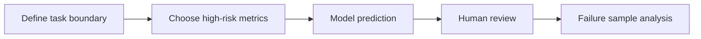
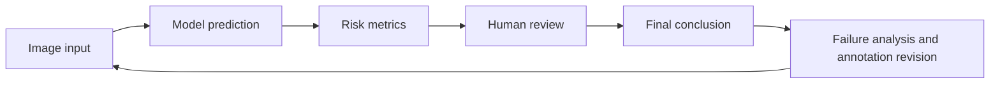

# 10.6.3 Project: Medical Imaging Analysis [Elective]

:::tip Section Positioning
The biggest difference between a medical imaging project and a regular computer vision project is not that the model has a different name, but that:

- The cost of mistakes is higher
- Data is more expensive
- Annotation is harder
- Deployment boundaries are more sensitive

So it is especially suitable for training your judgment on “high-risk AI projects.”
:::

## Learning Objectives

- Learn how to define the scope of a medical imaging project clearly enough
- Learn how to write annotation, metrics, and clinical risk into the project definition together
- Learn how to design an evaluation display that feels more like a clinical-assistance system
- Learn how to turn this kind of project into a portfolio-level page instead of a flashy demo

---

## First, Build a Map

Medical imaging projects are better understood in the order of “task boundary -> risk metrics -> human review -> failure analysis”:



So what this section really wants to solve is:

- Why medical imaging projects cannot simply reuse the thinking of regular computer vision projects
- Why this kind of project especially emphasizes boundaries, risk, and review

---

## Why Must the Project Title Be Narrowed Down?

A portfolio-friendly project title could be:

> **Build a “lung lesion region segmentation assistance system” that takes CT slices as input and outputs a lesion mask and a risk explanation.**

### Why is this title good?

- Clear input and output
- Metrics are explainable
- Risk boundaries are clear

### Why is it not recommended to start too big?

For example:

- Covering multiple organs, multiple diseases, and multiple modalities

This will cause the project to lose verifiability from the start.

---

## The Minimum Closed Loop for a Portfolio-Level Medical Imaging Project

1. Define the task and clinical boundaries
2. Explain the annotation protocol
3. Choose a baseline
4. Define high-risk metrics
5. Show success and failure examples
6. Clarify human review and applicability boundaries

If these are not clearly explained, the project will be hard to trust.

### A Loop Diagram That Feels More Like a Real Clinical Assistance System



This loop is important because medical imaging projects are usually not:

- “The model finishes, and that’s the end”

Instead, they are:

- The model first gives an assistive judgment
- A human then confirms it
- Failure cases are fed back to revise data and rules

---

## First Look at a Planning Object That Feels More Like a Real Project

```python
from dataclasses import dataclass, field


@dataclass
class MedicalProject:
    task: str
    input_type: str
    labels: list
    metrics: list
    clinical_constraints: list
    risks: list = field(default_factory=list)


project = MedicalProject(
    task="Lung lesion region segmentation",
    input_type="CT slice",
    labels=["background", "lesion"],
    metrics=["dice", "iou", "sensitivity", "false_negative_rate"],
    clinical_constraints=[
        "High-risk samples must be reviewed by humans",
        "Results are for assistance only and do not directly replace clinical judgment",
    ],
    risks=["annotation inconsistency", "extreme class imbalance", "high cost of false negatives"],
)

print(project)
```

Expected output:

```text
MedicalProject(task='Lung lesion region segmentation', input_type='CT slice', labels=['background', 'lesion'], metrics=['dice', 'iou', 'sensitivity', 'false_negative_rate'], clinical_constraints=['High-risk samples must be reviewed by humans', 'Results are for assistance only and do not directly replace clinical judgment'], risks=['annotation inconsistency', 'extreme class imbalance', 'high cost of false negatives'])
```

This output is intentionally more than a metric list. It records the task, inputs, labels, metrics, clinical boundaries, and risks in one project object.

### Why Is `clinical_constraints` Listed Separately Here?

Because one of the biggest differences between this kind of project and a regular vision project is:

- It is not only about model performance
- It is also about the boundary of clinical use

This is also what makes it feel more like a real high-risk project.

---

## Why Are False Negatives the Most Dangerous in This Kind of Project?

If the model misses a lesion,
the risk is usually greater than flagging one extra suspicious region.

So in a portfolio-level project,
it is very worthwhile to show separately:

- sensitivity / recall
- false negative rate

rather than only a single overall accuracy number.

### A More Beginner-Friendly Analogy

You can think of a medical imaging system like:

- An airport security scanner

It may flag a few extra suspicious bags and let security staff recheck them;
but if a truly dangerous bag is completely missed, the problem is much more serious.

That is why in many medical projects:

- False positives are annoying
- False negatives are more dangerous

### Another Minimal Example of “Case Review Priority”

```python
cases = [
    {"id": "case-001", "lesion_score": 0.91, "size_mm": 18},
    {"id": "case-002", "lesion_score": 0.44, "size_mm": 5},
    {"id": "case-003", "lesion_score": 0.78, "size_mm": 22},
]


def review_priority(case):
    if case["lesion_score"] >= 0.85:
        return "high"
    if case["lesion_score"] >= 0.6 or case["size_mm"] >= 20:
        return "medium"
    return "low"


for case in cases:
    print(case["id"], review_priority(case))
```

Expected output:

```text
case-001 high
case-002 low
case-003 medium
```

`case-001` is high priority because its score is high. `case-003` is medium priority because its lesion is large even though the score is not above `0.85`.

Although this example is small, it already reflects a real project idea:

- Not all samples are treated equally
- High-risk samples should be reviewed first by humans

---

## A Minimal Example of “High-Risk Metric Priority”

```python
metrics = {
    "dice": 0.81,
    "iou": 0.69,
    "sensitivity": 0.92,
    "false_negative_rate": 0.08,
}


def risk_summary(metrics):
    if metrics["false_negative_rate"] > 0.1:
        return "False negatives are currently too high, so it is not suitable as a high-risk assistance system yet."
    if metrics["sensitivity"] < 0.9:
        return "Recall is still too low; continue improving lesion detection first."
    return "The metrics are preliminarily usable, but human review and clinical validation are still required."


print(risk_summary(metrics))
```

Expected output:

```text
The metrics are preliminarily usable, but human review and clinical validation are still required.
```

The metrics pass the simple risk gate, but the message still keeps the clinical boundary clear: this is assistance, not automatic diagnosis.

### Why Is This More Valuable Than Printing a Bunch of Scores?

Because it translates metrics into:

- Language that can actually be used for project judgment

This is especially important in medical projects.

### An Evaluation Table That Beginners Can Remember First

| Metric | What question does it answer? |
|---|---|
| Dice / IoU | How accurate is the region segmentation? |
| Sensitivity / Recall | Are we trying to find as many true lesions as possible? |
| False Negative Rate | How high is the proportion of missed high-risk samples? |
| Human review pass rate | Can the result enter a real assistance workflow? |

This table is very suitable for beginners, because it turns medical imaging evaluation from “yet another list of metric names” into “who are these metrics really serving?”


:::tip Reading Tip
A medical imaging project should not only show pretty masks. When reading this diagram, judge whether it is trustworthy based on the task boundary, annotation protocol, sensitivity, false negative rate, human review, and failure-case feedback.
:::

---

## What Is Most Worth Showing in a Medical Imaging Project?

At minimum, it is recommended to show:

1. Raw image
2. Expert annotation mask
3. Model prediction mask
4. Failure cases
5. Risk boundary explanation

### Why Are These More Important Than “A Few Nice Success Images”?

Because the most important things in a high-risk project are:

- Trustworthiness
- Explainability
- Clear boundaries

### If You Are Doing This Kind of Project for the First Time, the Safest Default Order

A more stable order is usually:

1. Narrow the task down to one disease or one organ
2. Start with a binary classification or single-class segmentation baseline
3. Clearly write the annotation protocol and risk boundaries first
4. Then add high-risk metrics such as sensitivity and false negative rate
5. Finally show success cases, failure cases, and the human review flow

This will be easier to make into a trustworthy project than starting with:

- Multiple diseases
- Multiple modalities
- Multiple tasks

### If You Turn It into a Portfolio Piece, What Is Most Worth Showing?

What is most worth showing is not just model scores, but:

1. Why the task was narrowed down so much
2. Why false negatives are the key risk
3. How model results enter the human review process
4. What failure cases look like
5. Where your project boundaries are

This makes it easier for recruiters or readers to feel that:

- You understand the system problem
- You are not just someone who can run a segmentation model

### An Error Analysis Order That Beginners Can Copy Directly

When doing this kind of project for the first time, a safer error analysis order is usually:

1. First separate missed detections from false alarms
2. Then check whether high-risk samples are especially error-prone
3. Then see whether boundary issues or annotation issues are more prominent
4. Finally decide whether to add data, add rules, or change the model

This makes it easier to identify the real problem than immediately replacing the network.

The goal is risk-grounded evidence, not visual polish.

---

## Most Common Mistakes

### Only Looking at Overall Accuracy

### Not Writing Down Annotation Consistency Issues

### Not Explaining the Human Review Boundary

### Only Showing Pretty Success Images, Not High-Risk Failure Cases

Medical imaging projects are easiest to make “look strong,”
because success cases are often very intuitive.
But the truly valuable parts are usually:

- Which cases are most likely to be missed
- Which boundaries are most likely to be misclassified
- Whether these errors will affect human-assisted decision-making

---

## Evidence to Keep

Keep this page's proof of learning as a small evidence card:

```text
task_output: classification label, detection box, segmentation mask, OCR text, or video event
artifacts: original image, processed image, prediction overlay, metrics file, and failure samples
metric: accuracy/F1, mAP, IoU, Dice, latency, or scenario-specific review score
failure_check: data quality, label error, preprocessing mismatch, threshold, or deployment constraint
Expected_output: a reproducible run folder with visual outputs and a short failure report
```

## Summary

The most important thing in this section is to build a portfolio-level judgment:

> **What truly makes a medical imaging project feel like a real project is not how complex the model is, but whether you can clearly explain the task boundary, annotation protocol, sensitive metrics, and risk statement together.**

As long as you do this well, this kind of project will be very convincing.

## What You Should Take Away from This Section

- Medical imaging projects emphasize risk boundaries more than regular vision projects
- In many cases, sensitivity and false negative rate are more important than overall accuracy
- A trustworthy medical project must explain human review and applicability boundaries together

---

## Version Roadmap Suggestions

| Version | Goal | Delivery Focus |
|---|---|---|
| Basic version | Get the minimum loop running | Can input, process, and output, while keeping a set of examples |
| Standard version | Form a presentable project | Add configuration, logging, error handling, README, and screenshots |
| Challenge version | Approach portfolio quality | Add evaluation, comparison experiments, failure-case analysis, and next-step roadmap |

It is recommended to finish the basic version first; do not pursue something huge and complete from the beginning. Each time you improve a version, write “what capabilities were added, how they were validated, and what problems remain” into the README.

## Exercises

1. Modify the project into a smaller binary screening task and rewrite `clinical_constraints`.
2. Why is `false_negative_rate` in medical imaging projects often more worth showing separately than overall accuracy?
3. Think about it: when annotation consistency is not high, how should model results be interpreted?
4. If you put this project into a portfolio, which risk explanation is most worth emphasizing separately?

<details>
<summary>Reference answers and explanation</summary>

1. A safer binary screening version could be “high-risk finding present vs absent.” `clinical_constraints` should state that the output is only a screening aid, sensitivity is prioritized, and a human review boundary is required.
2. `false_negative_rate` matters because a missed positive case can be more dangerous than many ordinary mistakes. Overall accuracy can hide this risk when positives are rare.
3. When annotation consistency is low, model results should be interpreted cautiously. Report label disagreement, review rules, and uncertainty instead of claiming diagnostic reliability.
4. For a portfolio, emphasize risk boundaries: not a diagnosis, human-in-the-loop review, false-negative handling, dataset limits, and which cases require escalation.

</details>
