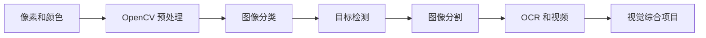
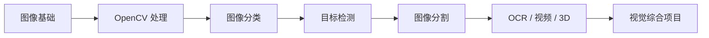

# 10 计算机视觉（方向选修）


这一阶段解决的是“怎样让模型理解图像”。它是方向选修：如果你的主线目标是 LLM 应用和 Agent，可以后补；如果你想做视觉、多模态、工业检测、OCR 或医学影像，就建议系统学习。

## 故事化导入：教模型看见世界

人类看到一张图片，会自然识别物体、位置、边界和动作；模型看到的却只是像素矩阵。计算机视觉要做的事，就是让模型从像素中逐步学会“这是什么”“在哪里”“边界到哪里”。从分类到检测再到分割，每一步都让模型看得更细。

## 学习闯关地图



## 互动练习：同一张图问三个层级的问题

拿一张包含多个物体的图片，先问“这张图主要是什么类别”，再问“每个物体在哪里”，最后问“每个物体的边界在哪里”。这三个问题分别对应分类、检测和分割。你会发现视觉任务的难度不是突然增加，而是输出越来越精细。

## 项目彩蛋

本阶段的彩蛋作品可以是一个“视觉检测小工具”：上传图片后，系统完成预处理、识别目标、标出位置，并输出置信度和结果说明。它可以继续升级成 OCR 文档助手、工业缺陷检测或多模态问答项目。

## 阶段定位

| 信息 | 说明 |
|---|---|
| 适合对象 | 已完成深度学习基础，希望进入视觉或多模态方向的学习者 |
| 预估学时 | 120～180 小时 |
| 前置要求 | 完成深度学习与 Transformer 基础 |
| 阶段产出 | 图像分类、目标检测、图像分割或视觉综合项目 |

## 新手最小通关路线

新手先理解图像像素、颜色空间、OpenCV 预处理、分类、检测和分割的区别，不需要一开始追最新模型。只要能训练或调用一个图像分类模型，并说清楚检测和分割比分类多输出了什么，就算完成最小通关。

## 进阶深入路线

有经验的学习者可以深入数据标注、增强策略、YOLO、分割模型、mAP、部署场景和失败案例分析。进一步尝试把视觉模型接入一个小应用，输出带标注框、置信度和错误样例说明的结果。

## 视觉任务如何由浅入深

计算机视觉不是一个单一任务。它通常按输出粒度逐步变复杂：先判断整张图是什么，再找出目标在哪里，再判断每个像素属于什么区域。



## 新人先做什么，进阶再做什么

新人第一次学这一阶段时，先抓住图像任务的主线：图片如何变成张量，卷积如何提取局部特征，分类、检测、分割分别解决什么问题。

有经验的学习者可以把重点放在数据和评估上：标注质量、类别不平衡、IoU、mAP、失败样本和部署速度。你的目标是把视觉 Demo 做成能解释、能评估、能迭代的作品。

## 本阶段学习路径

第一章学习 CV 基础与 OpenCV，理解图像像素、颜色空间、滤波、边缘、形态学和基础图像处理。

第二章学习图像分类进阶，包括数据增强、现代分类架构和训练技巧。

第三章学习目标检测，理解候选框、类别、置信度、IoU、mAP 和 YOLO 系列。

第四章学习图像分割，理解语义分割、实例分割和像素级输出。

第五章学习进阶专题，包括人脸检测、视频分析、OCR 和 3D 视觉。

第六章完成综合项目，把数据、模型、指标和应用场景连起来。

## 学完后你应该能做到

- 能解释分类、检测、分割三类视觉任务的区别
- 能用 OpenCV 完成基础图像处理
- 能训练或微调一个图像分类模型
- 能理解目标检测和分割任务的输入输出及评价指标
- 能为一个视觉项目准备数据、训练模型并分析结果

## 常见误区

不要只追最新视觉模型。视觉项目真正困难的地方往往是数据采集、标注质量、类别不平衡、指标选择和部署场景。

也不要把 OpenCV 和深度学习割裂。OpenCV 适合传统图像处理和工程预处理，深度学习适合复杂识别任务，两者经常会一起出现。

## 视觉错误剧场：模型看错通常不是一个原因

如果分类结果不稳定，先看训练图片是否清晰、类别是否平衡、增强是否过度；如果检测漏掉小目标，检查标注质量、图片分辨率和评估阈值；如果 Demo 图片表现好但真实图片差，优先怀疑数据分布不一致。

## 最小可运行实验：读取图片并输出可检查结果

本阶段最小实验可以从 OpenCV 或 PIL 开始：读取一张图片，完成尺寸、通道、裁剪或灰度处理，并保存处理后的结果。然后再替换成分类、检测或 OCR 模型。

```python
from PIL import Image

img = Image.open("sample.jpg")
print(img.size, img.mode)
small = img.resize((224, 224))
small.save("sample_224.jpg")
```

视觉项目一定要保留输入图、处理结果和预测可视化。否则模型错了时，很难判断问题来自数据、标注、预处理还是模型。

## 视觉失败案例库：先查输入质量和标注边界

| 现象 | 常见原因 | 定位方法 | 修复方向 |
|---|---|---|---|
| 分类不稳定 | 图片模糊、类别不平衡、增强过度 | 查看误判图片和类别分布 | 清洗数据，调整增强策略 |
| 检测漏掉小目标 | 分辨率低、标注不一致、阈值过高 | 可视化框和置信度 | 提高分辨率，检查标注，调阈值 |
| 分割边界粗糙 | 标注边缘不准或模型输出尺度低 | 对比 mask 和原图 | 改标注规范，使用更合适指标 |
| Demo 图好真实图差 | 训练数据和真实场景分布不同 | 比较光照、角度、背景 | 补充真实样本和场景说明 |

## 阶段验收 Rubric

| 等级 | 验收标准 | 作品集证据 |
|---|---|---|
| 最低通关 | 能说明分类、检测、分割和 OCR 的输入输出 | 输入图、预测结果 |
| 推荐通关 | 能训练或调用视觉模型并计算指标 | 数据说明、指标、可视化结果 |
| 作品集通关 | 能分析误报、漏报和场景风险 | 错误样本集、标注说明、项目报告 |

## 阶段项目

基础版是完成一个图像分类项目，包含数据准备、训练和基础评估。标准版需要加入数据增强、错误样例分析和可视化预测结果。挑战版可以做目标检测或分割项目，加入标注格式、mAP/IoU 指标、推理展示和场景化应用说明。

如果你想看更细的学习节奏，可以阅读 [学习指南：计算机视觉怎么学最不容易学乱](./study-guide.md)。


## 本阶段趣味任务卡

| 玩法 | 本阶段任务 |
|---|---|
| 剧情任务 | 让助手看懂图片或截图：读取图像、输出可检查结果，并记录识别失败样本。 |
| Boss 战 | **视觉线索猎人** |
| 可解锁徽章 | 图像观察员、视觉失败记录员 |
| 新手轻松版 | 只完成一个最小输入到输出闭环，先留下运行截图或命令输出 |
| 作品集证据 | 输入图片、输出结果和失败图片 |

如果你觉得本阶段内容很多，先把这张任务卡当作最低目标。能完成新手轻松版，就可以继续往后学；以后准备作品集时，再回来升级标准版和挑战版。

## 阶段交付物

| 交付物 | 最小版 | 作品集版 |
|---|---|---|
| 图像分类实验 | 能训练或调用模型完成分类 | 有数据划分、增强策略、指标和预测可视化 |
| 图像处理脚本 | 完成读取、裁剪、灰度、边缘等处理 | 说明预处理如何影响模型输入和结果 |
| 错误样本集 | 保存若干误判图片 | 分析清晰度、类别混淆、标注质量和数据分布 |
| 视觉项目报告 | 写清任务、数据和指标 | 展示 mAP/IoU/accuracy、可视化结果和限制 |
| 应用 Demo | 能对单张图片推理 | 有输入输出示例、运行命令和场景边界 |

## 和 AI 学习助手贯穿项目的关系

本阶段可以为 AI 学习助手补充视觉能力：识别课件截图、OCR 提取文字，或分析学习图片资料。 如果你正在按贯穿项目路线学习，建议本阶段结束时至少提交一次版本记录：本阶段新增了什么能力、如何运行、示例输入输出是什么、遇到了什么问题、下一步准备怎么改。


## 阶段通关标准

| 通关层级 | 你需要做到什么 |
|---|---|
| 最低通关 | 能理解图像分类、检测、分割和 OCR 等视觉任务的输入输出。 |
| 推荐通关 | 完成本阶段至少一个可运行小项目，并在 README 中记录运行方式、示例输入输出和遇到的问题。 |
| 作品集通关 | 把本阶段产出接入“AI 学习助手”贯穿项目，留下截图、日志、评估样例和下一步计划。 |

学完本阶段后，不需要把所有细节都背下来。更重要的是能说清楚：本阶段解决什么问题，它和上一阶段的关系是什么，以及它会怎样支撑后续学习。多模态阶段会继续使用视觉理解和生成能力。
