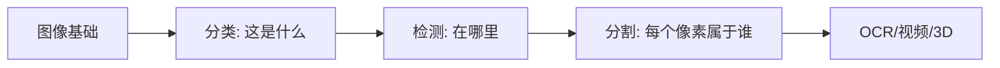

# 学习指南：计算机视觉怎么学最不容易学乱

如果你来到 `09 计算机视觉（方向选修）` 后觉得模型很多、任务很多，先把视觉任务按输出粒度分清楚。分类、检测、分割不是并列名词堆叠，而是从粗到细的理解图像方式。

## 本阶段总原则

计算机视觉第一遍要抓住一条任务粒度线：先理解图像本身，再判断整图类别，再定位目标位置，最后理解像素级区域。

## 推荐学习顺序

第一轮先学图像基础与 OpenCV。你要理解像素、颜色空间、滤波、边缘和基础图像处理。

第二轮学图像分类。分类是视觉深度学习最直观的入口，适合练习数据增强、迁移学习和训练技巧。

第三轮学目标检测。重点理解边界框、类别、置信度、IoU、mAP 和 YOLO 系列。

第四轮学图像分割。重点理解语义分割、实例分割和像素级输出。

第五轮再选 OCR、视频、人脸、3D 或医学影像等方向项目。

## 建议学习节奏

| 内容类型 | 建议时间 | 学习目标 |
|---|---|---|
| 图像基础 | 4～8 小时 | 理解图像数据和 OpenCV 操作 |
| 图像分类 | 8～16 小时 | 完成一个分类训练闭环 |
| 检测 / 分割 | 12～24 小时 | 理解输入输出和评价指标 |
| 综合项目 | 16～32 小时 | 完成一个视觉方向作品 |

## 阶段项目路线

第一个项目建议做图像分类，例如垃圾分类、花卉分类、食品分类或手写数字识别。

第二个项目建议做目标检测，例如安全帽检测、车辆检测、缺陷检测或商品识别。

第三个项目可以做图像分割或 OCR，根据你的方向选择医学影像、文档识别或工业质检。

## 常见卡点

最常见的卡点是分类、检测、分割混在一起。你可以先问输出是什么：一个类别、多个框，还是每个像素的类别。

第二个卡点是只追模型结构，不看数据标注。视觉项目里，数据质量、类别平衡、标注规范和增强策略往往比换模型更重要。

第三个卡点是指标不清。分类看 accuracy/F1，检测常看 mAP，分割常看 IoU/Dice。

## 过关标准

学完本阶段后，你应该能解释分类、检测、分割三类任务的区别，并能完成一个视觉项目的数据准备、训练、评估和结果展示。

如果你能把一个视觉项目整理成可复现 Notebook 或脚本，并说明模型失败案例，就达到了方向入门标准。