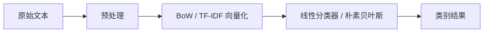

# 传统文本分类

:::tip 本节定位
做文本分类时，很多人会本能地想：

- 直接上大模型

但在大量真实业务里，传统方法仍然有非常高的实用价值，尤其是：

- 数据量不大
- 标签较清楚
- 需要快速、便宜、可解释基线

所以这节课的重点不是怀旧，而是建立一个很实用的判断：

> **什么时候传统文本分类已经够好，甚至是更好的第一步。**
:::

## 学习目标

- 理解词袋与 TF-IDF 的基本直觉
- 理解线性分类器在文本任务里为什么经常表现不错
- 通过可运行示例掌握传统文本分类最小流程
- 建立“传统方法是强基线而不是过时方案”的判断

---

## 先建立一张地图

传统文本分类更适合按“文本怎么变成特征，再怎么进入分类器”来理解：



所以这节真正想解决的是：

- 为什么这条路线在很多真实任务里已经够强
- 为什么它很适合作为第一版 baseline

---

## 一、传统文本分类在做什么？

### 1.1 先把文本变成特征，再把特征喂给分类器

典型流程是：

1. 文本预处理
2. 词袋 / TF-IDF 向量化
3. 线性模型或朴素贝叶斯分类

也就是说，它不是端到端深度模型，  
而是显式的“特征工程 + 分类器”。

### 1.2 为什么这条路能工作？

因为在很多文本任务里，  
单词和短语本身就已经有很强区分度。

例如：

- “退款”
- “证书”
- “密码”

这些词本来就能强烈暗示类别。

### 1.3 一个类比

传统文本分类很像人工整理线索卡片。  
你先把关键词线索提出来，再让分类器根据这些线索判断。

### 1.4 一个更适合新人的总类比

你也可以把它理解成：

- 先给每条文本做一张“关键词清单”，再让分类器按清单打分

这就是为什么它在这些任务里会特别顺手：

- 类别边界清楚
- 关键词本身就很有区分度

---

## 二、词袋和 TF-IDF 分别在做什么？

### 2.1 词袋模型

最简单的想法是：

- 统计每个词出现了多少次

它不太关心词序，  
更关心：

- 这个词有没有出现
- 出现得多不多

### 2.2 TF-IDF

它在词袋基础上更进一步：

- 在当前文本里常出现的词更重要
- 但如果某词在所有文本里都很常见，它的重要性会下降

这有助于减少：

- “的”“是”这类高频但区分度弱的词

### 2.3 为什么它在文本分类里常常有效？

因为很多类别区分，本来就依赖：

- 哪些词更有代表性

### 2.4 一个很适合初学者先记的选择表

| 现象 | 更稳的第一反应 |
|---|---|
| 文本短、关键词很明显 | 先试传统方法 |
| 数据不大 | 先试传统方法 |
| 很在意可解释性和成本 | 先试传统方法 |
| 很依赖上下文和否定关系 | 再考虑深度模型 |

这个表很适合新人，因为它会把“什么时候传统方法够好”直接变成可判断的问题。

---

## 三、先跑一个传统文本分类最小示例

下面这个例子会用：

- `CountVectorizer`
- `LogisticRegression`

做一个客服意图分类最小系统。

```python
from sklearn.feature_extraction.text import CountVectorizer
from sklearn.linear_model import LogisticRegression
from sklearn.pipeline import make_pipeline

texts = [
    "退款多久到账",
    "怎么申请退款",
    "发票什么时候可以开",
    "电子发票发到哪里",
    "忘记密码怎么办",
    "密码重置入口在哪",
]

labels = [
    "refund",
    "refund",
    "invoice",
    "invoice",
    "password",
    "password",
]

clf = make_pipeline(
    CountVectorizer(token_pattern=r"(?u)\\b\\w+\\b"),
    LogisticRegression(max_iter=200),
)

clf.fit(texts, labels)
pred = clf.predict(["退款怎么处理", "电子发票什么时候开"])
print(pred.tolist())
```

### 3.1 这段代码最关键的地方在哪？

有两处：

1. `CountVectorizer`  
   文本先变成可计算特征
2. `LogisticRegression`  
   再根据这些特征做分类

### 3.2 为什么这已经是很像真实系统的最小骨架？

因为很多线上轻量分类器本质上就是：

- 一个向量化器
- 一个轻量分类器

它们的部署和维护成本都相对很低。

### 3.3 再看一个最小“换 TF-IDF”示例

```python
from sklearn.feature_extraction.text import TfidfVectorizer
from sklearn.pipeline import make_pipeline
from sklearn.linear_model import LogisticRegression

clf_tfidf = make_pipeline(
    TfidfVectorizer(token_pattern=r"(?u)\\b\\w+\\b"),
    LogisticRegression(max_iter=200),
)

clf_tfidf.fit(texts, labels)
print(clf_tfidf.predict(["密码找回入口在哪"]).tolist())
```

这个例子很适合初学者，因为它会提醒你：

- 传统方法里也有不同特征表示
- baseline 不是只能有一种写法

---

## 四、为什么传统方法常常是好基线？

### 4.1 训练快

你可以很快得到第一版结果。

### 4.2 调试容易

如果分类错了，你更容易追：

- 是哪些词触发了判断
- 特征是不是提错了

### 4.3 小数据时常常并不差

特别在标签定义清楚、文本较短的任务里，  
传统方法经常比大家预想得更强。

### 4.4 第一次做文本分类项目时，最稳的默认顺序

更稳的顺序通常是：

1. 先做词袋或 TF-IDF baseline
2. 先看最容易错的类别
3. 再决定是否真的需要上深度模型

这样会比一开始就直接上更重的模型更容易看清问题。

---

## 五、什么时候传统方法开始不够？

### 5.1 需要更复杂语义理解时

例如：

- 否定关系
- 长距离依赖
- 语境细微差异

### 5.2 词序特别重要时

因为词袋类方法对顺序不敏感。

### 5.3 多义表达和隐含语义较多时

这时通常更需要：

- 上下文化表示
- 深度模型

---

## 六、最常见误区

### 6.1 误区一：传统文本分类已经没必要学

不对。  
它在很多业务里仍然是非常实用的起点。

### 6.2 误区二：准确率不如最强模型就没价值

真实工程里还要看：

- 成本
- 延迟
- 可解释性

### 6.3 误区三：词袋方法什么都不懂

虽然它不懂深语义，  
但很多任务本来就不需要那么复杂。

## 如果把它做成项目或笔记，最值得展示什么

最值得展示的通常不是：

- “我用了 CountVectorizer”

而是：

1. baseline 是什么
2. 为什么这个任务适合先用传统方法
3. 错误主要集中在哪类文本
4. 什么时候你判断该升级到更复杂模型

这样别人会更容易看出：

- 你理解的是 baseline 选择逻辑
- 不只是会调用 sklearn

---

## 小结

这节最重要的是建立一个工程判断：

> **传统文本分类并不是“老办法”，而是很多中小数据任务里训练快、成本低、可解释性强的强基线。**

只要这层判断在，你以后做文本分类项目时就不会一上来只剩“大模型”这一条路。

---

## 练习

1. 把示例里的 `CountVectorizer` 换成 `TfidfVectorizer`，看看效果有什么可能变化。
2. 自己加一个新类别，例如 `shipping`，扩展训练集再试。
3. 为什么说传统文本分类在一些任务里是“更好的第一步”？
4. 如果任务里大量依赖词序和上下文，你还会优先用词袋方法吗？为什么？
