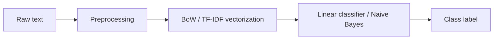

# 11.3.2 Traditional Text Classification


:::tip Reading guide
Traditional text classification is easiest to understand as: “text cleaning -> feature representation -> linear classifier -> error analysis.” It is not outdated content; in many text projects, it is still the most stable, fastest, and easiest-to-explain first baseline.
:::

:::tip Section overview
When doing text classification, many people instinctively think:

- Just use a large model directly

But in many real-world business scenarios, traditional methods still have very high practical value, especially when:

- the dataset is not large
- the labels are clear
- you need a fast, cheap, and interpretable baseline

So the focus of this lesson is not nostalgia, but building a very practical judgment:

> **When traditional text classification is already good enough, and even the better first step.**
:::

## Learning objectives

- Understand the basic intuition behind bag-of-words and TF-IDF
- Understand why linear classifiers often perform well in text tasks
- Use a runnable example to master the minimal workflow of traditional text classification
- Develop the judgment that “traditional methods are strong baselines, not outdated solutions”

---

## First, build a map

Traditional text classification is easier to understand as: “how text becomes features, and then how those features enter the classifier”:



So what this section really wants to solve is:

- Why this approach is already strong enough for many real tasks
- Why it is a very suitable first baseline

---

## What does traditional text classification do?

### First convert text into features, then feed the features into a classifier

A typical workflow is:

1. Text preprocessing
2. Bag-of-words / TF-IDF vectorization
3. Linear model or Naive Bayes classification

In other words, it is not an end-to-end deep learning model,
but an explicit “feature engineering + classifier” approach.

### Why can this work?

Because in many text tasks,
individual words and short phrases already carry strong discriminative power.

For example:

- “refund”
- “certificate”
- “password”

These words can strongly hint at the category.

### An analogy

Traditional text classification is like manually organizing clue cards.
You first extract keyword clues, then let the classifier make a judgment based on those clues.

### A more beginner-friendly overall analogy

You can also think of it as:

- First make a “keyword checklist” for each piece of text, then let the classifier score it based on the checklist

That is why it works especially well in these tasks:

- The category boundaries are clear
- The keywords themselves are highly discriminative

---

## What do bag-of-words and TF-IDF do?

### Bag-of-words

The simplest idea is:

- Count how many times each word appears

It does not care much about word order,
and cares more about:

- whether the word appears
- how often it appears

### TF-IDF

It goes one step further on top of bag-of-words:

- Words that appear frequently in the current text are more important
- But if a word is very common across all texts, its importance decreases

This helps reduce the influence of:

- high-frequency but low-discriminative words such as “the” or “is”

### Why is it often effective in text classification?

Because many category distinctions depend on:

- which words are more representative

### A selection table that beginners should remember first

| Phenomenon | Safer first reaction |
|---|---|
| Short text, very obvious keywords | Try traditional methods first |
| Small dataset | Try traditional methods first |
| You care a lot about interpretability and cost | Try traditional methods first |
| Heavy dependence on context and negation | Then consider deep learning models |

This table is especially useful for beginners because it turns “when traditional methods are good enough” into something you can actually judge.

---

## Run a minimal traditional text classification example first

The example below uses:

- `CountVectorizer`
- `LogisticRegression`

to build a minimal customer service intent classification system.

```python
from sklearn.feature_extraction.text import CountVectorizer
from sklearn.linear_model import LogisticRegression
from sklearn.pipeline import make_pipeline

texts = [
    "When will I get my refund?",
    "How do I apply for a refund?",
    "When can I issue an invoice?",
    "Where do I send the e-invoice?",
    "What should I do if I forgot my password?",
    "Where is the password reset entry?",
]

labels = [
    "refund",
    "refund",
    "invoice",
    "invoice",
    "password",
    "password",
]

clf = make_pipeline(
    CountVectorizer(token_pattern=r"(?u)\b\w+\b"),
    LogisticRegression(max_iter=200),
)

clf.fit(texts, labels)
pred = clf.predict(["How do I handle a refund?", "When will the e-invoice be issued?"])
print(pred.tolist())
```

Expected output:

```text
['refund', 'invoice']
```

The first sentence contains `refund`, so the baseline predicts `refund`. The second sentence contains `e-invoice` and `issued`, so it lands in `invoice`. This is simple, but it gives you a runnable reference point before trying a deeper model.

### What is the most important part of this code?

There are two key pieces:

1. `CountVectorizer`
   First convert text into computable features
2. `LogisticRegression`
   Then classify based on those features

### Why is this already very similar to a real system skeleton?

Because many lightweight online classifiers are essentially:

- a vectorizer
- a lightweight classifier

Their deployment and maintenance costs are relatively low.

### Another minimal example: switching to TF-IDF

```python
from sklearn.feature_extraction.text import TfidfVectorizer
from sklearn.pipeline import make_pipeline
from sklearn.linear_model import LogisticRegression

texts = [
    "When will I get my refund?",
    "How do I apply for a refund?",
    "When can I issue an invoice?",
    "Where do I send the e-invoice?",
    "What should I do if I forgot my password?",
    "Where is the password reset entry?",
]

labels = [
    "refund",
    "refund",
    "invoice",
    "invoice",
    "password",
    "password",
]

clf_tfidf = make_pipeline(
    TfidfVectorizer(token_pattern=r"(?u)\b\w+\b"),
    LogisticRegression(max_iter=200),
)

clf_tfidf.fit(texts, labels)
print(clf_tfidf.predict(["Where is the password reset entry?"]).tolist())
```

Expected output:

```text
['password']
```

TF-IDF lowers the impact of very common words and keeps discriminative words like `password`, `reset`, and `entry` more visible.

This example is great for beginners because it reminds you:

- Traditional methods also have different feature representations
- A baseline does not have to be written in only one way

---

## Why are traditional methods often good baselines?

### Fast training

You can get the first version very quickly.

### Easy to debug

If the classifier makes mistakes, it is easier to trace:

- which words triggered the decision
- whether the features were extracted correctly

### Often not bad at all on small data

Especially for tasks with clear label definitions and short texts,
traditional methods often perform better than people expect.

### The safest default order when doing a text classification project for the first time

A more reliable order is usually:

1. First build a bag-of-words or TF-IDF baseline
2. Inspect the categories that are easiest to get wrong
3. Then decide whether you really need a deep learning model

This makes it easier to see the problem than starting with a heavier model right away.

---

## When do traditional methods start to fall short?

### When more complex semantic understanding is needed

For example:

- negation
- long-range dependencies
- subtle contextual differences

### When word order matters a lot

Because bag-of-words methods are not sensitive to order.

### When there are many ambiguous expressions and implicit meanings

At that point, you usually need more:

- contextual representations
- deep learning models

---

## Common misconceptions

### Misconception 1: Traditional text classification is no longer worth learning

Not true.
It is still a very practical starting point in many business scenarios.

### Misconception 2: If accuracy is worse than the strongest model, it has no value

In real engineering, you also need to consider:

- cost
- latency
- interpretability

### Misconception 3: Bag-of-words methods understand nothing

Although they do not understand deep semantics,
many tasks simply do not require that much complexity.

## If you turn this into a project or note, what is most worth showing?

What is most worth showing is usually not:

- “I used CountVectorizer”

but:

1. what the baseline is
2. why this task is suitable for traditional methods first
3. which kinds of text contain most of the errors
4. when you judge that it is time to upgrade to a more complex model

That way, others can more easily see:

- that you understand the logic behind baseline selection
- not just how to call sklearn

---

## Summary

The most important thing in this lesson is to build an engineering judgment:

> **Traditional text classification is not an “old method”; it is a strong baseline for many medium- and small-data tasks, with fast training, low cost, and strong interpretability.**

Once you have that judgment, you will no longer be limited to “just use a large model” when doing text classification projects.

---

## Exercises

1. Replace `CountVectorizer` in the example with `TfidfVectorizer` and see what changes in performance might happen.
2. Add a new class yourself, such as `shipping`, expand the training set, and try again.
3. Why can traditional text classification be “the better first step” in some tasks?
4. If a task heavily depends on word order and context, would you still prioritize bag-of-words methods? Why?
