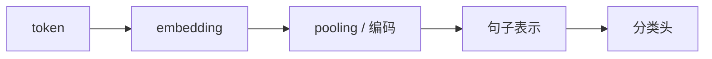

# 深度学习文本分类

:::tip 本节定位
传统文本分类已经能解决很多问题，  
但一旦任务开始依赖：

- 语义相近表达
- 多义词
- 上下文信息

传统特征方法就容易显得吃力。

这时深度学习文本分类的价值就会开始显现：

> **它不只看显式词频，还能学习更连续、更抽象的文本表示。**
:::

## 学习目标

- 理解深度学习文本分类和传统方法的核心差别
- 理解 embedding、pooling、分类头这条最小深度分类链路
- 通过可运行示例建立“神经文本分类器”第一层直觉
- 理解为什么表示学习会改变分类效果上限

---

## 先建立一张地图

深度学习文本分类更适合按“输入怎么流动”来理解：



所以这节真正想解决的是：

- 神经文本分类器到底比传统方法多了哪一层能力
- 为什么“先学表示，再做分类”会改变效果上限

---

## 一、深度学习文本分类到底比传统方法多了什么？

### 1.1 它不再完全依赖手工特征

传统方法更像：

- 先手工定义文本特征
- 再训练分类器

深度方法更像：

- 一边学表示
- 一边学分类

### 1.2 最基础链路其实并不复杂

最小深度文本分类器通常可以拆成：

1. token -> embedding
2. 对一串 token 表示做聚合
3. 接线性分类头

### 1.3 一个类比

传统方法像先把句子拆成关键词表格，再做判断。  
深度方法更像先把句子编码成一个连续语义表示，再做判断。

### 1.4 一个更适合新人的总类比

你也可以把两类方法理解成：

- 传统方法像填勾选表
- 深度方法像先把一句话听懂个大概，再给结论

前者更依赖：

- 你事先设计好要看哪些特征

后者更强调：

- 模型能不能自己学到哪些表达彼此接近

---

## 二、最常见的最小神经文本分类器长什么样？

### 2.1 Embedding 层

把 token id 变成向量。

### 2.2 Pooling

把一串 token 表示合成一个句子表示。  
最简单的是：

- 平均池化

### 2.3 分类头

用一个线性层把句子表示映射到类别分数。

这个结构虽然简单，  
但已经比纯词袋更能利用连续表示。

---

## 三、先跑一个纯 Python 神经文本分类器前向示例

这段代码不会训练参数，  
但它会完整演示：

- token id -> embedding
- pooling
- 线性打分

这样你能真正看懂“神经文本分类器”的最小骨架。

```python
vocab = {
    "退款": 0,
    "发票": 1,
    "密码": 2,
    "申请": 3,
    "开具": 4,
    "重置": 5,
}

embedding_table = {
    0: [0.9, 0.8, 0.1],
    1: [0.2, 0.9, 0.1],
    2: [0.1, 0.2, 0.95],
    3: [0.8, 0.7, 0.2],
    4: [0.2, 0.85, 0.15],
    5: [0.1, 0.25, 0.9],
}

classifier_weights = {
    "refund": [1.0, 0.6, 0.1],
    "invoice": [0.2, 1.0, 0.1],
    "password": [0.1, 0.1, 1.0],
}


def encode(tokens):
    return [vocab[token] for token in tokens if token in vocab]


def mean_pool(vectors):
    dim = len(vectors[0])
    return [sum(vec[i] for vec in vectors) / len(vectors) for i in range(dim)]


def dot(a, b):
    return sum(x * y for x, y in zip(a, b))


tokens = ["退款", "申请"]
token_ids = encode(tokens)
token_vectors = [embedding_table[token_id] for token_id in token_ids]
sentence_vector = mean_pool(token_vectors)

scores = {
    label: round(dot(sentence_vector, weight), 4)
    for label, weight in classifier_weights.items()
}

prediction = max(scores, key=scores.get)

print("token_ids:", token_ids)
print("sentence_vector:", [round(x, 4) for x in sentence_vector])
print("scores:", scores)
print("prediction:", prediction)
```

### 3.1 这个例子为什么比直接 `nn.Sequential` 更有用？

因为它把三个关键步骤拆开了：

1. embedding
2. pooling
3. classification

这能帮你先理解结构，再去看更复杂框架实现。

### 3.2 为什么 pooling 这么关键？

因为分类最终通常需要一个句级表示。  
如果没有 pooling，你只有一串 token 向量，还很难直接接分类头。

### 3.3 再看一个最小“同类表达更容易靠近”示例

```python
sentences = {
    "退款申请": [0.85, 0.75, 0.15],
    "退货处理": [0.82, 0.72, 0.18],
    "密码重置": [0.12, 0.15, 0.92],
}


def l1_distance(a, b):
    return round(sum(abs(x - y) for x, y in zip(a, b)), 4)


print("退款申请 vs 退货处理:", l1_distance(sentences["退款申请"], sentences["退货处理"]))
print("退款申请 vs 密码重置:", l1_distance(sentences["退款申请"], sentences["密码重置"]))
```

这个例子很适合新人，因为它能让你更直观地感受到：

- 如果句子表示学得合理
- 同类表达应该更容易靠近

---

## 四、深度方法为什么常常能比传统方法更强？

### 4.1 能利用连续语义关系

如果“退款申请”和“退款处理”词面不同但语义接近，  
embedding 更可能把它们拉近。

### 4.2 能更自然处理上下文

即使是简单模型，也已经比纯词袋更接近“表示学习”路线。

### 4.3 还能继续叠更强结构

后面你可以继续往上接：

- CNN
- RNN
- Transformer

这就是深度分类和传统分类的扩展性差别。

---

## 五、什么时候深度文本分类特别值得用？

### 5.1 表达方式比较多样

同一意图会有很多说法时，  
深度方法往往更有优势。

### 5.2 语义比显式关键词更重要

如果仅靠关键词很难分，  
深度表示通常更值得尝试。

### 5.3 你愿意承担更高训练成本

相比传统方法，  
深度方法通常意味着：

- 更多训练资源
- 更复杂调试

### 5.4 第一次做文本分类项目时，最稳的默认顺序

更稳的顺序通常是：

1. 先做传统 baseline
2. 再上最小 embedding + pooling 模型
3. 先看错例是不是开始更稳
4. 最后再考虑更强结构或预训练模型

这样会比一开始就追很复杂的网络更容易看清收益从哪里来。

---

## 六、最常见误区

### 6.1 误区一：深度方法一定全面优于传统方法

不一定。  
小数据、短文本、规则感强的任务里，传统方法可能已经很好。

### 6.2 误区二：有 embedding 就自动理解上下文了

最小 embedding + pooling 结构已经比词袋强，  
但并不等于最强上下文理解。

### 6.3 误区三：只看模型结构，不看数据

数据质量和标签定义仍然非常关键。

## 如果把它做成项目，最值得展示什么

最值得展示的通常不是：

- 只是写一句“用了深度学习模型”

而是：

1. 传统 baseline 和深度 baseline 的对比
2. 文本如何变成句子向量
3. 哪类表达在深度模型下更容易判对
4. 失败样本里还有哪些问题没解决

这样别人会更容易看出：

- 你理解的是“表示学习为什么有用”
- 不只是换了个模型名

---

## 小结

这节最重要的是把深度学习文本分类理解成：

> **先学习文本的连续表示，再在其上做分类，因此它比传统词袋方法更适合处理语义相近、表达多样、上下文更复杂的任务。**

只要这个直觉建立起来，后面你再学 BERT 分类和更大预训练模型，就会顺很多。

---

## 练习

1. 把示例里的 `tokens` 改成 `["发票", "开具"]`，看看分类结果如何变化。
2. 为什么说 pooling 是从 token 表示走向句子分类的关键一步？
3. 用自己的话解释：深度分类方法相比传统词袋方法，多出来的核心能力是什么？
4. 想一想：在什么任务里你仍然会优先试传统基线，而不是直接上深度模型？
