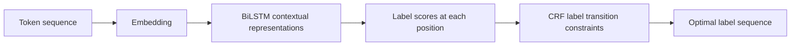
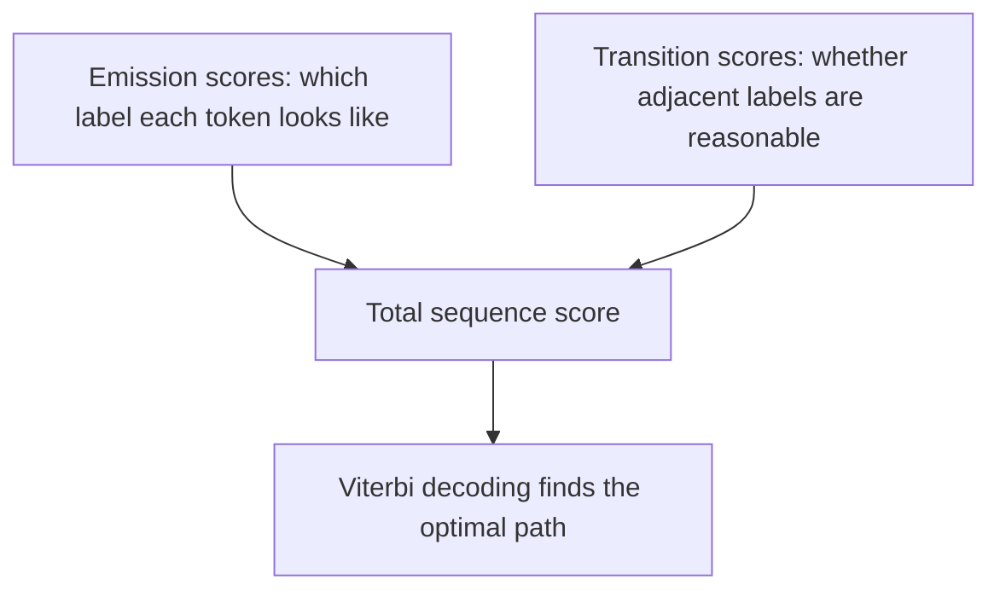

# BiLSTM + CRF


:::tip Reading guide
BiLSTM is responsible for building contextual representations for each token, while CRF is responsible for choosing the most reasonable path among all possible label paths. When reading the diagram, focus on how “local scores” and “label transition constraints” work together to determine the final BIO sequence.
:::

:::tip Where this section fits
NER is not as simple as classifying each token independently. There are constraints between labels—for example, `I-PER` usually should not appear at the beginning of a sentence out of nowhere. The value of BiLSTM + CRF is that it considers both the context and whether the label sequence is valid.
:::

## Learning objectives

- Understand what BiLSTM does in sequence labeling
- Understand why CRF can model label transition constraints
- Know which predictions are unreasonable under the BIO labeling scheme
- Explain the difference between BiLSTM + CRF and ordinary token classification

---

## First, look at the overall structure



BiLSTM is responsible for understanding context, and CRF is responsible for selecting the most reasonable overall label path. Combined, the model does not just ask, “Does this token look like an entity?” It also asks, “Is this entire sequence of labels reasonable when connected together?”

## 1. Why ordinary token classification is not enough

Suppose we use the BIO labeling scheme: `B-PER` means the beginning of a person name, `I-PER` means the inside of a person name, and `O` means non-entity. If the model predicts each token independently, it may output labels like this:

```text
I   love   Beijing
O   I-LOC  B-LOC
```

Here, `I-LOC` appears at the beginning of an entity, which is usually unreasonable. An ordinary classifier has difficulty explicitly constraining this kind of label transition, while CRF can learn transition scores between labels.

## 2. BiLSTM is responsible for contextual representations

An LSTM reads text sequentially, while a BiLSTM reads it from left to right and from right to left at the same time. In this way, the representation of each token includes information from both the left and right context.

For example, “apple” may refer to a fruit in one sentence and a company in another. The role of BiLSTM is to let the current token see the surrounding words, thereby reducing ambiguity.

## 3. CRF is responsible for global decoding

CRF considers two kinds of scores at the same time: the emission score for how likely each position is to have a certain label, and the transition score between labels. During final prediction, it does not greedily choose labels one position at a time, but instead searches for the label path with the highest total score for the whole sequence.



This is why CRF is especially suitable for tasks with structural constraints between labels, such as NER, part-of-speech tagging, and word segmentation.

## 4. A minimal intuition example

```python
labels = ["B-PER", "I-PER", "O", "B-LOC", "I-LOC"]

# Simplified: manually define some invalid transitions
invalid_transitions = {
    ("O", "I-PER"),
    ("O", "I-LOC"),
    ("B-PER", "I-LOC"),
    ("B-LOC", "I-PER"),
}

path = ["O", "I-LOC", "B-LOC"]

for a, b in zip(path, path[1:]):
    if (a, b) in invalid_transitions:
        print("Invalid transition:", a, "->", b)
```

In a real CRF, these are not hand-written rules. Instead, it learns from training data which label transitions are more reasonable. This example is only meant to help you build the intuition that labels are related to each other.

## 5. Relationship with BERT token classification

Modern NER often uses BERT with a linear classification layer, and CRF can also be added after BERT. BERT’s contextual representation ability is usually stronger than BiLSTM’s, but CRF is still valuable for label constraints, especially in tasks with small amounts of data, strict label formats, and entity boundary errors.

## Common misconceptions

The first misconception is that CRF is an outdated model. It is not necessarily the strongest solution, but the idea of label constraints is still important. The second misconception is looking only at token-level accuracy and ignoring entity-level F1. What NER ultimately cares about is whether the entity boundaries and types are both completely correct. The third misconception is ignoring BIO labeling consistency, which makes the training data itself contain invalid label sequences.

## Exercises

1. Write the BIO labels for a Chinese sentence and check whether there is any invalid `I-*` at the beginning.
2. Compare the difference between “token-by-token classification” and “global sequence decoding.”
3. Think about why entity-level F1 is more suitable than token accuracy for NER.
4. If you use BERT for NER, do you still need CRF? List reasons for and against it.

## Passing criteria

After learning this section, you should be able to explain what BiLSTM and CRF are each responsible for, identify invalid transitions in BIO labels, explain why sequence labeling needs to consider dependencies between labels, and transfer this idea to later structured information extraction tasks.
