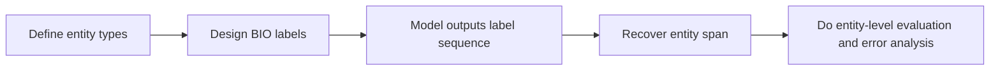

# NER Practice


:::tip Reading guide
For NER projects, do not focus only on token accuracy. First look at how the label scheme, annotation examples, entity recovery, entity-level Precision/Recall/F1, and error buckets form a closed loop. This is much closer to a real project than simply swapping models.
:::

:::tip Where this section fits
In the previous two sections, we already explained:

- sequence labeling tasks
- the core idea of BiLSTM + CRF

Now we will put it back into a project and do a more realistic exercise:

> **Extract names, schools, and skills from resume text.**

This kind of task is very suitable for practicing NER because it includes both:

- clear spans
- clear types
- many boundary details
:::

## Learning goals

- Learn how to define the boundary of a minimal NER project
- Learn how to recover entities from token labels
- Learn how to do entity-level error analysis
- Build a project skeleton for information extraction through a runnable example

---

## First, build a map

NER practice is easier to understand in the order of “labels -> entities -> evaluation -> iteration”:



So the real questions this section wants to solve are:

- Why is an NER project not just “label prediction”?
- Why do entity recovery and error analysis feel more like a real project?

---

## 1. First, define the project problem clearly

### 1.1 Scenario

Input:

- A resume or candidate profile text

Output:

- Name
- School
- Skill

### 1.2 Why is this more suitable for practice than “just extracting some entities”?

Because the boundaries are clear:

- Not too many categories
- Entity types are explicit
- The results are easy to explain from a business perspective

### 1.3 The first key point is not the model, but the label scheme

For example:

- `Zhang San` -> `B-NAME`
- `Tsinghua University` -> `B-SCHOOL I-SCHOOL ...`
- `Python` -> `B-SKILL`

If this step is vague, the model and evaluation will both become messy later.

### 1.4 A better analogy for beginners

You can think of NER as:

- using a highlighter to mark important information in a piece of text

The hard part is not only “marking it,” but also:

- where to start marking
- where to stop
- what category this span belongs to

Once you understand it this way, it becomes much more natural why NER often gets stuck on boundary issues.

---

## 2. First build a runnable annotation and decoding loop

The example below does three things:

1. Prepare a small sample
2. Decode BIO labels into entities
3. Do a simple prediction comparison and error analysis

```python
samples = [
    {
        "tokens": ["Zhang San", "graduated from", "Tsinghua University", ",", "familiar with", "Python", "and", "PyTorch"],
        "gold_tags": ["B-NAME", "O", "B-SCHOOL", "O", "O", "B-SKILL", "O", "B-SKILL"],
        "pred_tags": ["B-NAME", "O", "B-SCHOOL", "O", "O", "B-SKILL", "O", "B-SKILL"],
    },
    {
        "tokens": ["Li Si", "is from", "Peking University", ",", "knows", "Java"],
        "gold_tags": ["B-NAME", "O", "B-SCHOOL", "O", "O", "B-SKILL"],
        "pred_tags": ["B-NAME", "O", "O", "O", "O", "B-SKILL"],
    },
]


def decode_entities(tokens, tags):
    entities = []
    current_tokens = []
    current_type = None

    for token, tag in zip(tokens, tags):
        if tag == "O":
            if current_tokens:
                entities.append(("".join(current_tokens), current_type))
                current_tokens = []
                current_type = None
            continue

        prefix, entity_type = tag.split("-", 1)

        if prefix == "B":
            if current_tokens:
                entities.append(("".join(current_tokens), current_type))
            current_tokens = [token]
            current_type = entity_type
        elif prefix == "I" and current_type == entity_type:
            current_tokens.append(token)
        else:
            if current_tokens:
                entities.append(("".join(current_tokens), current_type))
            current_tokens = [token]
            current_type = entity_type

    if current_tokens:
        entities.append(("".join(current_tokens), current_type))

    return entities


for sample in samples:
    gold_entities = decode_entities(sample["tokens"], sample["gold_tags"])
    pred_entities = decode_entities(sample["tokens"], sample["pred_tags"])

    print("tokens:", sample["tokens"])
    print("gold :", gold_entities)
    print("pred :", pred_entities)
    print("miss :", [x for x in gold_entities if x not in pred_entities])
    print()
```

### 2.1 Why is this code the “minimal project loop”?

Because it already includes:

- data representation
- prediction results
- entity recovery
- error analysis

This is much closer to the shape of a real project than printing a string of labels.

### 2.2 Why compare by entity here instead of only by token?

Because what the business usually cares about is:

- whether the entity was extracted
- whether the type is correct

Not whether a single token was labeled correctly.

### 2.3 Another minimal “entity log” example

```python
sample = samples[1]
gold_entities = decode_entities(sample["tokens"], sample["gold_tags"])
pred_entities = decode_entities(sample["tokens"], sample["pred_tags"])

print(
    {
        "text": "".join(sample["tokens"]),
        "gold_entities": gold_entities,
        "pred_entities": pred_entities,
    }
)
```

This kind of log is especially good for beginners because it turns an abstract labeling task into a more realistic project output:

- What is the original text?
- What are the correct entities?
- What exactly did the system miss?

---

## 3. What metrics should an NER project look at first?

### 3.1 Entity-level Precision / Recall / F1

This is the most common and most meaningful set of metrics.

### 3.2 Why is token accuracy not enough?

Because most positions in a sequence are often:

- `O`

If you only look at token accuracy, it can easily seem “very high,”
but the actual entity extraction performance may still be poor.

### 3.3 A minimal entity recall example

```python
def entity_recall(gold_entities, pred_entities):
    if not gold_entities:
        return 1.0
    hit = sum(entity in pred_entities for entity in gold_entities)
    return hit / len(gold_entities)


for sample in samples:
    gold_entities = decode_entities(sample["tokens"], sample["gold_tags"])
    pred_entities = decode_entities(sample["tokens"], sample["pred_tags"])
    print(entity_recall(gold_entities, pred_entities))
```

### 3.4 The safest default order when doing an NER project for the first time

A more stable order is usually:

1. Narrow down the entity types first
2. Write the labeling standard clearly first
3. Do entity recovery and entity-level evaluation first
4. Then switch to a stronger model

This is easier to keep the project stable than rushing to BERT from the start.

---

## 4. The most common failure points in NER projects

### 4.1 Wrong entity boundary

For example, only half of a school name is extracted.

### 4.2 Wrong type

For example, a skill is recognized as a school.

### 4.3 Missing entity

For example, in sample 2, `Peking University` is missed.

### 4.4 Why is this so suitable for error analysis?

Because NER errors are usually very concrete,
which makes them easy to inspect one by one and fix category by category.

### 4.5 A very useful error-bucketing method for beginners

When doing error analysis for the first time, the most valuable buckets are usually:

1. Boundary error
2. Type error
3. Missing entity

These three are already enough to help you judge:

- Is it a data annotation problem?
- Is it a model representation problem?
- Or are the post-processing rules not strong enough?

---

## 5. What should the next step be in a real project?

### 5.1 Expand the data

Especially:

- long entities
- rare entities
- easily confused types

### 5.2 Upgrade from rules / classic models to stronger models

For example:

- BiLSTM + CRF
- BERT token classification

### 5.3 Add post-processing rules

In many business projects,
reasonable post-processing rules can significantly improve entity quality.

## If you turn this into a project, what is most worth showing?

What is usually most worth showing is not:

- a string of label prediction results

but:

1. Original text
2. Gold entities
3. Predicted entities
4. Missed and false extraction cases
5. Which type of error you plan to fix first

This makes it much easier for others to feel that:

- you built an information extraction project
- not just trained a sequence labeling model

---

## 6. The most common misconceptions

### 6.1 Misconception 1: Only look at token-level metrics

NER should pay more attention to entity-level performance.

### 6.2 Misconception 2: Try to cover all entity types from the start

A more stable approach is usually:

- first choose 2~4 core entity types and make them solid

### 6.3 Misconception 3: Do not define the label scheme clearly at the beginning

If the label boundaries are unclear, both the data and the evaluation will drift.

---

## Summary

The most important thing in this section is to build a practical habit:

> **When doing an NER project, first make the entity types, label scheme, entity recovery, and entity-level error analysis solid, and only then pursue more complex models.**

In that way, what you leave behind is a truly explainable and improvable information extraction project, not just a half-finished script that can run training.

---

## Exercises

1. Add an `ORG` or `TITLE` entity type to the example and expand the samples.
2. Think about why NER projects are more suitable for entity-level metrics than token accuracy.
3. If the system often extracts only half of a long school name, would you prioritize changing the data, changing the model, or adding post-processing? Why?
4. How would you further expand this resume extraction project into a portfolio presentation?
