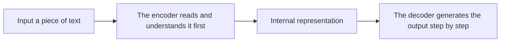

# 11.5.2 Seq2Seq Models


:::tip Reading Guide
The core challenge of Seq2Seq is “compress the input sequence into a representation, then generate the output sequence step by step.” When reading the diagram, focus on why the context vector creates an information bottleneck and why Attention appears later.
:::

:::tip Section Focus
In the earlier classification and sequence labeling tasks, the output is usually still a “label.”
But starting from this chapter, we move into another kind of problem:

> **The input is a piece of text, and the output is also a piece of text.**

For example:

- Translation
- Summarization
- Paraphrasing
- Question-answer generation

The most classic starting point for these tasks is the encoder-decoder structure.
:::

## Learning Objectives

- Understand the fundamental difference between Seq2Seq and classification tasks
- Understand what the encoder and decoder each do
- Build an intuition for “encode first, then generate” through a runnable example
- Understand why Seq2Seq became the basic structure for many generation tasks

---

## First, Build a Map

For beginners, the best way to understand this section is not to “start with model details,” but to first see how the task shape changes:



So what this section really wants to solve is:

- Why are “text-to-text” tasks fundamentally different from classification tasks?
- Why do we split the system into encoder and decoder?

## What Problem Does Seq2Seq Solve?

### It is not “assigning a label to the whole sentence”

It is more like:

- Input a sequence of tokens
- Output another sequence of tokens

For example:

- “I love studying” -> “I enjoy learning”

### Why are ordinary classifiers not suitable for this kind of task?

Because classifier outputs are usually one label from a fixed set.
But the output of a Seq2Seq task:

- Has variable length
- Has variable content
- Has sequential dependencies during generation

### An Analogy

Classification is like giving an essay a score.
Seq2Seq is more like rewriting a Chinese essay into an English one.

---

## What Do the Encoder and Decoder Do?

### Encoder

It is responsible for:

- Reading the input sequence
- Compressing the input into an internal representation

### Decoder

It is responsible for:

- Using the encoded result
- Generating the output sequence step by step

### Why split it into two parts?

Because these tasks naturally work in this order:

- First understand the input
- Then construct the output

This is different from plain classification.

---

## Run a Minimal “Encode Then Generate” Example

```python
translation_memory = {
    "I": "I",
    "love": "love",
    "study": "study",
}


def encode(source_tokens):
    return {"source_tokens": source_tokens, "length": len(source_tokens)}


def decode(encoded):
    output = []
    for token in encoded["source_tokens"]:
        output.append(translation_memory.get(token, "<unk>"))
    return output


source = ["I", "love", "study"]
encoded = encode(source)
target = decode(encoded)

print("encoded:", encoded)
print("decoded:", target)
```

### What is the most important insight from this example?

It shows that the core flow of Seq2Seq is:

1. The input does not directly become the final answer
2. There is first an intermediate encoded representation
3. Then the decoder generates the output

### What should beginners remember first when learning Seq2Seq?

The most important things to remember first are:

1. The encoder is more like “reading and understanding the input first”
2. The decoder is more like “writing the output step by step based on the understanding”
3. The output is not a fixed label, but a sequential generation process

---

## What Is the Most Common Difficulty in Seq2Seq?

### The input is compressed too crudely

A classic problem in early encoder-decoder models is:

- The entire input is compressed into a single fixed-length vector

When the input is long, information is easily lost.

### The output is generated step by step

This means:

- If the previous step is wrong
- The later steps are also likely to go wrong

### This is also why Attention was introduced later

One of the core goals of Attention is to let the decoder, when generating, not rely only on one fixed vector,
but dynamically look at different positions in the input.

### How is this section related to the Attention mechanism later?

What this section should first establish is:

- The main “encode -> decode” flow of Seq2Seq

And the next section on Attention is meant to solve the core bottleneck here:

- Fixed-length representations lose information too easily

---

## What Tasks Is Seq2Seq Suitable For?

### Translation

A classic input-output mapping task.

### Summarization

Input a long article, output a short one.

### Paraphrasing and Question-Answer Generation

The input and output are not the same text, but there is a clear correspondence between them.

---

## The Easiest Pitfalls to Fall Into

### Misconception 1: Seq2Seq is just a “translation model”

Translation is only the most classic example.
In essence, it applies to a broader set of “text-to-text” tasks.

### Misconception 2: Having an encoder and decoder is already enough

Without Attention and stronger representations, long-input problems become very obvious.

### Misconception 3: For generation tasks, being able to produce output is all that matters

What is really hard in Seq2Seq tasks is:

- Staying faithful to the input
- Generating reasonable content
- Preserving structure

## Summary

The most important thing in this section is to understand Seq2Seq as:

> **A structure that first encodes the input and then generates the output step by step. It is the basic paradigm behind translation, summarization, and many text generation tasks.**

As long as this main structure is clear, learning Attention and T5 later will feel very natural.

---

## What You Should Take Away

- Seq2Seq is the basic structure for “input sequence -> output sequence”
- The encoder / decoder design exists to solve “understand first, then generate”
- The emergence of Attention was precisely to address the core information bottleneck in Seq2Seq

---

## Exercises

1. Expand the dictionary in the example to 5–10 words, then try a few more sentences.
2. Why is the output of Seq2Seq not fixed-length, and not from a fixed label set?
3. Think about this: if the input is very long, why is “compressing it into only one vector” difficult?
4. Explain in your own words: what does the encoder do, and what does the decoder do?
