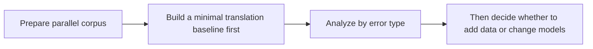

# 11.5.4 Machine Translation Practice [Optional]


:::tip Reading guide
A translation project is not just about whether one output sentence sounds smooth. When reading the diagram, connect parallel corpus, baseline, omission, mistranslation, word order issues, terminology consistency, and human evaluation together so you can really see where the system is improving.
:::

:::tip Section focus
Translation is the most classic task for Seq2Seq.
It is very suitable for practicing a complete project loop of “input text -> output text.”

This lesson will not jump straight into training a large model.
Instead, we will first make the most important project structure clear:

- What the data pairs look like
- How the minimal translation system runs
- How to analyze errors
:::

## Learning objectives

- Understand the minimal components of a translation project
- Learn how to organize data from parallel corpus pairs
- Build a minimal translation baseline with a runnable example
- Learn simple translation error analysis

---

## First, build a map

For beginners, the best way to understand this hands-on machine translation lesson is not “start by switching to a stronger model,” but to first see the full project loop clearly:



So what this section really wants to solve is:

- How a translation project should move forward
- Why error analysis is more important than blindly using a large model

### A more beginner-friendly overall analogy

You can think of a machine translation project like:

- Two people taking bilingual side-by-side notes

One side writes the source language, and the other writes the target language.
The real difficulty is not only “finding the matching word,” but also:

- How the sentence should be reorganized
- Which words cannot be translated literally
- Which expressions must be understood in context

Once you think about it this way, it becomes much more intuitive why translation tasks are naturally suited to Seq2Seq.

## What are the most essential input and output of machine translation?

### Input

- A sentence in the source language

### Output

- A sentence in the target language

### Why is this kind of task especially suitable for Seq2Seq?

Because:

- Both input and output are not fixed-length
- There is a sequence and semantic mapping relationship between the two sides

This is exactly the typical Seq2Seq scenario.

---

## First, look at a minimal parallel corpus

```python
parallel_data = [
    ("hello", "hola"),
    ("world", "mundo"),
    ("i love ai", "me encanta la IA"),
    ("study hard", "estudia mucho"),
]

for src, tgt in parallel_data:
    print(src, "->", tgt)
```

Expected output:

```text
hello -> hola
world -> mundo
i love ai -> me encanta la IA
study hard -> estudia mucho
```

Read each row as one aligned training example. The source sentence and target sentence must describe the same meaning, or the model will learn noise.

### Why is parallel corpus the foundation of a translation project?

Because the model ultimately needs to learn:

- Source language -> target language

Without this kind of aligned data, the translation task cannot even begin.

### For a beginner’s first translation project, how should you choose data more safely?

A safer starting point is usually:

- Start with short sentences
- Start with a corpus in a narrower domain
- Start with high-quality small data to establish the loop

This makes it easier to see the problems than starting with a large and messy corpus.

### A data checklist that beginners can copy directly

When doing a translation project for the first time, the most important things to check first are:

1. Do the source and target sentences really correspond one-to-one?
2. Is the sentence length very different?
3. Is the domain too mixed?
4. Does the same word or phrase have many conflicting translations?

Because if you do not check these issues at the beginning,
later you may easily mistake data problems for model problems.

---

## First, run a minimal translation baseline

```python
parallel_data = [
    ("hello", "hola"),
    ("world", "mundo"),
    ("i", "yo"),
    ("love", "amo"),
    ("study", "estudiar"),
]

phrase_table = {src: tgt for src, tgt in parallel_data}


def translate(sentence):
    tokens = sentence.split()
    output = [phrase_table.get(tok, "<unk>") for tok in tokens]
    return " ".join(output)


tests = [
    "hello world",
    "i love study",
    "love ai",
]

for sent in tests:
    print(sent, "->", translate(sent))
```

Expected output:

```text
hello world -> hola mundo
i love study -> yo amo estudiar
love ai -> amo <unk>
```

The `<unk>` token is the important clue here: the baseline has no entry for `ai`, so it cannot translate that word. This is a vocabulary coverage problem, not a decoder bug.

### Why is this example still worth doing?

Because it helps you first grasp the most basic form of a translation project:

- Data pairs
- Mapping rules
- Output quality

### Its limitations are also very obvious

- It cannot handle word order changes
- It cannot handle polysemy
- It outputs `<unk>` for unknown words

And precisely because these limitations are so obvious,
it becomes easier to understand why stronger models are needed later.

### Why is the minimal baseline especially valuable for teaching?

Because it forces you to really notice:

- Word order problems
- Unknown word problems
- Contextual ambiguity problems

These are all issues that attention and Transformer will continue to address later.

### For a first translation project, why should you not complain that the baseline is too weak?

Because the simpler the baseline, the easier it is to explain the source of errors.

For example:

- Too many `<unk>` tokens means vocabulary coverage is insufficient
- Word order is messy means the model did not truly learn sequence mapping
- Translation feels too word-for-word means contextual ability is lacking

This helps you build project judgment much better than starting with a complex model.

### Another example of a minimal “translation project checklist”

```python
project_status = {
    "parallel_data_ready": True,
    "baseline_ready": True,
    "error_buckets_defined": False,
    "evaluation_examples_selected": False,
}


def next_step(status):
    if not status["parallel_data_ready"]:
        return "First clean up the parallel corpus."
    if not status["baseline_ready"]:
        return "First build a minimal baseline."
    if not status["error_buckets_defined"]:
        return "First divide error types into omission, mistranslation, and word order issues."
    if not status["evaluation_examples_selected"]:
        return "First pick a set of showcase examples."
    return "You can continue upgrading the model."


print(next_step(project_status))
```

Expected output:

```text
First divide error types into omission, mistranslation, and word order issues.
```

This keeps the project loop practical: before changing the model, define how you will name and inspect translation errors.

This example is very small, but it is very suitable for beginners because it reminds you that:

- Project progress is not just “changing the model”
- It also includes data, error analysis, and the presentation structure

---

## How should translation project error analysis be done?

### Common error type 1: Omission

For example, a certain word is simply not translated.

### Common error type 2: Mistranslation

For example, a word is translated into the wrong sense.

### Common error type 3: Unnatural word order

This is a problem that the minimal dictionary baseline is especially likely to produce.

### A very simple error check

```python
parallel_data = [
    ("hello", "hola"),
    ("world", "mundo"),
    ("i", "yo"),
    ("love", "amo"),
    ("study", "estudiar"),
]

phrase_table = {src: tgt for src, tgt in parallel_data}


def translate(sentence):
    tokens = sentence.split()
    output = [phrase_table.get(tok, "<unk>") for tok in tokens]
    return " ".join(output)


gold = {
    "hello world": "hola mundo",
    "i love study": "me encanta estudiar",
}

for src, expected in gold.items():
    pred = translate(src)
    print({
        "src": src,
        "pred": pred,
        "gold": expected,
        "match": pred == expected,
    })
```

Expected output:

```text
{'src': 'hello world', 'pred': 'hola mundo', 'gold': 'hola mundo', 'match': True}
{'src': 'i love study', 'pred': 'yo amo estudiar', 'gold': 'me encanta estudiar', 'match': False}
```

The second example shows a common baseline limitation: word-by-word translation may be understandable, but it can still be unnatural or semantically weaker than the reference.

### An error analysis framework that is more beginner-friendly

When analyzing translation errors, you can start by dividing them into these three categories:

1. Omission
2. Mistranslation
3. Unnatural word order or expression

This makes it easier to tell whether:

- It is a data problem
- Or a model capability problem

### A comparison format that is great for showing in a portfolio

It is highly recommended to present them side by side directly:

- Original sentence
- Baseline output
- Target output
- Error type label

This makes the project very clear and avoids the impression that you merely “ran a model.”

### If this is your first translation project, the safest error bucketing method

The safest approach is usually to start with only three categories:

1. Omission
2. Mistranslation
3. Unnatural word order or expression

Because for beginners, these three categories are already enough to help you judge:

- Whether to add data
- Whether to improve representation
- Or whether to switch to a stronger model

---

## How can you upgrade this minimal project later?

### Add more parallel corpus

### Introduce attention and neural Seq2Seq

### Then move further toward Transformer

So the value of this small project is not that it is strong by itself,
but that it helps you see clearly:

- The basic skeleton of a translation project

### When upgrading the project for the first time, what should you usually improve first?

Usually, it is better to improve:

1. Data coverage
2. Error analysis
3. Attention or a stronger model

This is more stable than blindly switching to a larger model at the very beginning.

### When is it more appropriate to add data instead of changing the model?

If you find that the main issues come from:

- Poor vocabulary coverage
- Too few training samples
- Expressions that were almost never seen

Then you should usually add data first, instead of changing the model first.

## If you turn this into a project, what is most worth showing?

What is most worth showing is usually not:

- “I used a certain model”

But rather:

1. Parallel corpus examples
2. Baseline outputs
3. Gold outputs
4. Error type labels
5. How you plan to upgrade next

This makes it much easier for others to see:

- That you are building a complete translation project
- Not just running a translation demo

---

## The most common misunderstandings

### Misunderstanding 1: Translation is just dictionary lookup

Real translation is far more complex than word-for-word replacement.

### Misunderstanding 2: Only looking at one or two nice examples

In a real project, systematic error analysis matters much more.

### Misunderstanding 3: Wanting to train a very large model right away

A safer approach is usually to first make the data and baseline structure clear.

## Evidence to Keep

Keep this page's proof of learning as a small evidence card:

```text
source_target: source text, target text, and task type
decoded_output: generated summary, translation, transcript, or sequence result
alignment_note: attention, CTC path, coverage, or copied source evidence
failure_check: omission, repetition, hallucination, wrong alignment, or weak evaluation
Expected_output: generated text with factual or alignment review notes
```

## Summary

The most important thing in this lesson is to view a translation project as:

> **A typical Seq2Seq project centered on parallel corpus, mapping learning, and error analysis.**

First make this loop run smoothly, and later when you upgrade the model, you will not be left with only one idea: “switch to a bigger model.”

---

## What you should take away from this lesson

- A machine translation project is first and foremost a data-pair and error-analysis project
- A minimal dictionary baseline is weak, but it is especially useful for building project judgment
- First make the error types clear, then decide the upgrade path; that is closer to a real project

---

## Exercises

1. Add 5 more word pairs yourself to extend this small dictionary baseline.
2. Why is the minimal translation baseline especially prone to word order problems?
3. Think about it: what kind of error is very hard for a dictionary baseline to solve no matter what?
4. If you want to upgrade this project, would you first add data or first change the model? Why?

<details>
<summary>Reference answers and explanation</summary>

1. Adding word pairs improves coverage, but a dictionary baseline still cannot reliably solve grammar, agreement, or context-dependent translation.
2. The baseline has word-order problems because it translates tokens independently instead of modeling the target sentence structure.
3. Idioms, ambiguity, morphology, and long-distance context are hard for a dictionary baseline no matter how many isolated entries you add.
4. Add data and evaluation examples first so you can see failure types clearly; then choose whether model changes are necessary.

</details>
