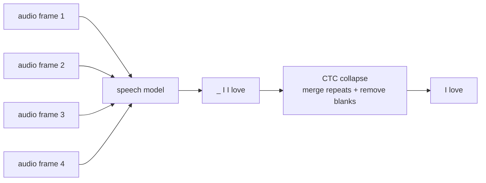

# 11.5.5 CTC and Deep Speech: Sequence Alignment in Speech Recognition


:::tip Where this section fits
This section is an extension of Seq2Seq: it helps you understand why speech recognition cannot be trained by simply using “one audio frame corresponds to one character.”

The key idea is:

> **CTC solves the problem of training a model when the input is very long, the output is shorter, and the two are not precisely aligned in the labels.**
:::

## Why is speech recognition more troublesome than text classification?

Text classification is usually:

```text
one sentence -> one label
```

Machine translation is usually:

```text
one sequence of tokens -> another sequence of tokens
```

But speech recognition is:

```text
a long sequence of audio frames -> a sequence of text
```

The problem is:

- There are many audio frames, but only a few text tokens
- One character may span multiple audio frames
- Training data usually tells you only the full transcription, not which character corresponds to each frame

This is the sequence alignment problem.

You can picture the difficulty like this:



The model sees many small time slices. The label only says the final sentence. CTC is the bridge between these two worlds.

## The core intuition of CTC: let the model first output paths with blanks and repeats

CTC introduces a special symbol, blank.
The model can first output a longer path, and then get the final text by “removing repeats and blanks.”

For example:

```text
Model path: _ I I _ love love _ AI _
Collapsed result: I love AI
```

This means the model does not need to know in advance:

- Which frame “I” starts on
- How long “love” lasts
- Which frames are just pauses or transitions

It only needs to learn this: among all paths that collapse to the correct text, the overall probability should become larger.

## Why is Deep Speech an important milestone?

Deep Speech represents an important route into end-to-end speech recognition in the deep learning era.

Traditional ASR systems often consist of many modules:

- Acoustic model
- Pronunciation lexicon
- Language model
- Decoder

Work like Deep Speech pushed a more end-to-end approach:

> **Learn text output directly from audio features, and compress a complex pipeline into a trainable model.**

For beginners, you do not need to reproduce a full ASR system at the start.
It is enough to understand why it matters:

- It makes speech recognition look more like one unified training problem
- CTC allows unaligned sequences to be trained
- Later models like Whisper continue pushing speech recognition toward more general pretraining approaches

## A minimal collapse example

```python
def ctc_collapse(path, blank="_"):
    result = []
    prev = None

    for token in path:
        if token != blank and token != prev:
            result.append(token)
        prev = token

    return result

path = ["_", "I", "I", "_", "love", "love", "_", "AI", "_"]
print(ctc_collapse(path))
```

The output will be close to:

```text
['I', 'love', 'AI']
```

This example cannot replace the CTC formula, but it can help you build intuition first:

> **The model can first produce a long frame-level path, and then collapse it into the final short text.**

## A tiny alignment search you can run

The key idea is not that there is only one correct frame-level path. Instead, many paths can collapse into the same text. CTC training sums the probability of all valid paths.

The following toy program enumerates short paths that can become `["I", "love"]`:

```python
from itertools import product

def ctc_collapse(path, blank="_"):
    result = []
    prev = None

    for token in path:
        if token != blank and token != prev:
            result.append(token)
        prev = token

    return result

vocab = ["_", "I", "love"]
target = ["I", "love"]
valid_paths = []

for path in product(vocab, repeat=4):
    if ctc_collapse(path) == target:
        valid_paths.append(path)

print("number of valid paths:", len(valid_paths))
for path in valid_paths[:8]:
    print(path, "->", ctc_collapse(path))
```

Expected output begins like this:

```text
number of valid paths: 15
('_', '_', 'I', 'love') -> ['I', 'love']
('_', 'I', '_', 'love') -> ['I', 'love']
('_', 'I', 'I', 'love') -> ['I', 'love']
```

The key result is not the exact list order, but the count and the idea: many frame-level paths can collapse into the same transcript.

When beginners first see CTC, the most important realization is:

- The model is allowed to be uncertain about exact frame boundaries
- Repeated tokens can represent a sound lasting longer
- Blank tokens can represent pauses and transitions
- Training rewards all paths that collapse to the correct transcript

So CTC is not asking humans to label every frame. It is asking the model to distribute probability over many possible alignments.

## The relationship between CTC, Seq2Seq, and Transformer ASR

| Method | How to understand it first |
|---|---|
| CTC | Train with all possible paths when the input and output are not precisely aligned |
| Seq2Seq Attention | The decoder dynamically attends to input positions while generating |
| Transformer ASR | Model long audio context with a stronger attention structure |
| Whisper | Large-scale weakly supervised speech data + Transformer, making ASR more general |

This shows that speech recognition is not an isolated topic; it is connected to Seq2Seq, attention, and Transformer in this chapter.

## Assigning historical milestones to course sections

| Historical milestone | Problem it solves | Corresponding course section |
|---|---|---|
| CTC | How to train sequence models when input and output are not aligned | Section 5.5, Section 5.2 Seq2Seq |
| Deep Speech | End-to-end deep learning approach for speech recognition | Section 5.5, Section 12.3 Speech and multimodality |
| Seq2Seq Attention | Dynamically align input positions at each output step | Section 5.3 NLP attention mechanisms |
| Transformer ASR / Whisper | Large-scale pretrained speech recognition | Section 12 AIGC and multimodal extensions |

## The intuition you should have after this section

The hardest part of speech recognition is not just “turning sound into text,” but:

- The input and output lengths are different
- There are no frame-level alignment labels
- Speech contains pauses, stretching, repetition, and noise

The beauty of CTC is:
It does not force humans to label every frame. Instead, it lets the model learn from all possible alignment paths on its own.
