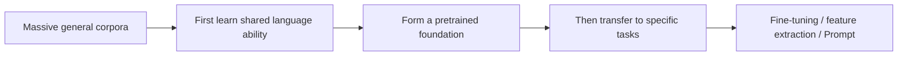

# 11.6.2 Pretraining Paradigm


:::tip Reading Guide
The most important thing about the pretraining paradigm is not any specific model name, but the flow of “general corpus → downstream tasks → fine-tuning or prompt adaptation.” Once you understand this flow, BERT, GPT, and T5 will no longer feel like a pile of isolated terms.
:::

:::tip Section Overview
The main thread of this chapter is actually just one sentence:

> **First learn general capabilities on large corpora, then transfer those capabilities to specific tasks.**

This is the pretraining paradigm of modern NLP.

If you only think of it as “train first, then fine-tune,” it is easy to end up with only terminology.
So in this section, we will explain why it matters and why it changed the whole field of NLP.
:::

## Learning Objectives

- Understand the difference between the pretraining paradigm and “training each task from scratch”
- Understand the main flow of pretraining -> transfer -> fine-tuning
- Build intuition for a “shared foundation” through a runnable example
- Understand why modern NLP is almost entirely organized around this paradigm

---

## First, Build a Map

If you have already studied word embeddings, contextual representations, and language models, the most natural continuation for this section is:

- You have already seen text representations become stronger
- Now we ask: “Why did the entire field of NLP later start organizing itself around a shared foundation?”

So the pretraining paradigm is not “just one more training step,” but rather:

- The way tasks are organized has changed

The best order for beginners to understand this section is not “memorize model names first,” but to first see clearly:



So what this section really wants to explain is:

- Why “training each task from scratch” is wasteful
- Why “learn the foundation first, then transfer” changed the main direction of NLP

## Why Does Pretraining Change NLP So Much?

### Because many tasks share basic language abilities

Whether it is:

- classification
- NER
- question answering
- translation

they all require some common underlying abilities, such as:

- understanding word meaning
- modeling syntactic structure
- modeling context

### Training each task from scratch is wasteful

It is like:

- learning the language itself from zero every time you do a new problem

Obviously, the cost is high.

### The core idea of the pretraining paradigm

So a more reasonable approach becomes:

1. First learn basic capabilities on massive general text
2. Then transfer those capabilities to specific tasks

This is the main thread of modern NLP.

### When you first learn the pretraining paradigm, what should you focus on?

What you should focus on first is not model names, but this sentence:

> **The core value of pretraining is to learn the language abilities shared by many tasks all at once.**

Once this idea is stable, when you later look at:

- BERT
- GPT
- T5

you will naturally ask:

- What role does it play in this shared-foundation main thread?

---

## What Is the Relationship Between Pretraining, Transfer, and Fine-Tuning?

### Pretraining

The goal is:

- learn general language representations and patterns

### Transfer

The goal is:

- bring existing capabilities to a new task

### Fine-tuning

The goal is:

- further adapt to a specific task

### An Analogy

Pretraining is like reading a general education textbook first.
Transfer is like moving that foundation to a new subject.
Fine-tuning is like doing targeted practice for a specific exam format.

### Why Is This Analogy Worth Remembering First?

Because many beginners, when they first encounter pretraining, think:

- pretraining = just train a little longer

But this analogy helps you see more clearly:

- Pretraining learns general capabilities
- Transfer reuses those capabilities
- Fine-tuning adapts them to the task

---

## Let’s Run a “Shared Foundation” Example First

```python
shared_representation = {
    "refund": [1.0, 0.2, 0.1],
    "invoice": [0.3, 1.0, 0.1],
    "password": [0.1, 0.2, 1.0],
}


def sentence_vector(tokens):
    vectors = [shared_representation[token] for token in tokens if token in shared_representation]
    dim = len(vectors[0])
    return [sum(vec[i] for vec in vectors) / len(vectors) for i in range(dim)]


def classify_intent(tokens):
    vec = sentence_vector(tokens)
    scores = {
        "refund": vec[0],
        "invoice": vec[1],
        "password": vec[2],
    }
    return max(scores, key=scores.get), scores


for tokens in [["refund"], ["invoice"], ["password"]]:
    print(tokens, "->", classify_intent(tokens))
```

Expected output:

```text
['refund'] -> ('refund', {'refund': 1.0, 'invoice': 0.2, 'password': 0.1})
['invoice'] -> ('invoice', {'refund': 0.3, 'invoice': 1.0, 'password': 0.1})
['password'] -> ('password', {'refund': 0.1, 'invoice': 0.2, 'password': 1.0})
```

Read the output from left to right: each input token reuses the same shared representation table, then a small task-specific classifier reads the three score dimensions. This is the miniature version of “shared foundation first, task adaptation second.”

### What Is This Example Trying to Show?

It is not meant to be a real strong model,
but to express the most important paradigm:

- first there is a shared representation foundation
- then specific tasks are completed on top of it

### Why Is This Similar to the pretraining era?

Because you are no longer:

- learning all representations separately from scratch for every task

Instead:

- you reuse an existing set of language representations

### When Beginners First Learn the Pretraining Paradigm, What Should They Remember Most?

What is most worth remembering is actually:

1. Pretraining is not “just training a bit more,” but a change in task organization
2. Shared foundation capabilities are the core asset of modern NLP
3. This greatly lowers the barrier for downstream tasks

### Why Is the “Shared Foundation” Perspective So Important?

Because it will directly change how you think later.

You will no longer only ask:

- Does this task need its own separate model?

You will more naturally ask:

- Can this task be built on an existing foundation?
- Do I need fine-tuning, feature extraction, or Prompt?

---

## Why Does This Path Eventually Lead to BERT / GPT / T5?

### Because It Scales

Once pretraining is established,
more data and more compute usually continue to improve the foundation’s capability.

### Because It Is More General

The same foundation can be transferred to many tasks.

### Because It Lowers the Barrier for Downstream Tasks

Many tasks no longer need to train a large model from scratch,
but instead:

- directly adapt a pretrained model

---

## Common Pitfalls

### Mistake 1: Thinking the pretraining paradigm is just “train first for a while”

That is not right.
It changes the whole way tasks are organized.

### Mistake 2: Thinking every task must be fine-tuned

Some tasks only need:

- feature extraction
- Prompt
- retrieval

That may be enough.

### Mistake 3: Memorizing model names without understanding the paradigm

What really matters is:

- Why does learning general capabilities first and then transferring them work?

## Summary

The most important thing in this section is to establish a sense of the era:

> **The core change in modern NLP is not just that models became larger, but that the training paradigm shifted from “each task handled separately” to “learn a shared foundation first, then transfer and adapt.”**

Once this idea is in place, learning BERT, GPT, and T5 will no longer feel like learning only buzzwords.

---

## What You Should Take Away from This Section

- The key change in modern NLP is not only larger models, but a changed paradigm
- Pretraining, transfer, and fine-tuning must be understood as one main thread
- When learning BERT / GPT / T5 later, first think about the role each one plays in this main thread

If we compress it into one sentence, it would be:

> **What the pretraining paradigm truly changed was not just the training order, but the entire field of NLP, shifting it from “each task done separately” to “sharing a stronger language foundation.”**

---

## Exercises

1. Explain in your own words: Why does the pretraining paradigm significantly lower the barrier for many NLP tasks?
2. Think about it: Which tasks might only need pretrained features and not full fine-tuning?
3. What does this “shared foundation” example correspond to in a real system?
4. Why do we say that the pretraining paradigm changes not just the model, but the entire way tasks are organized?
